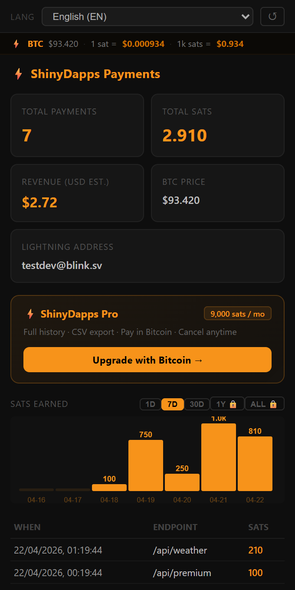

# l402-kit

🇺🇸 **Charge for your API in Bitcoin Lightning. 3 lines of code.**
🇧🇷 Monetize sua API com Bitcoin Lightning. 3 linhas de código.
🇪🇸 Monetiza tu API con Bitcoin Lightning. 3 líneas de código.
🇨🇳 用 3 行代码，通过比特币闪电网络收费。
🇮🇳 अपने API को Bitcoin Lightning से 3 लाइनों में मोनेटाइज़ करें।
🇸🇦 اكسب من API الخاص بك عبر Bitcoin Lightning. 3 أسطر فقط.
🇫🇷 Monétisez votre API en Bitcoin Lightning. 3 lignes de code.
🇩🇪 Monetarisiere deine API mit Bitcoin Lightning. 3 Zeilen Code.
🇷🇺 Монетизируй свой API через Bitcoin Lightning. 3 строки кода.
🇯🇵 Bitcoin LightningでAPIを3行で収益化。
🇮🇹 Monetizza la tua API con Bitcoin Lightning. 3 righe di codice.

[](https://npmjs.com/package/l402-kit)
[](https://pypi.org/project/l402kit)
[](LICENSE)
[](#)
[](https://github.com/ShinyDapps/l402-kit)


<p align="center">
  
</p>

> **AI Agents / LLMs:** See [`llms.txt`](./llms.txt) for machine-readable instructions on how to use and monetize with l402-kit.

---

## Install

```bash
npm install l402-kit                                             # TypeScript / Node.js / Express
pip install l402kit                                              # Python / FastAPI / Flask
go get github.com/shinydapps/l402-kit/go                        # Go / net/http / Chi / Gin
# Rust — add to Cargo.toml:
# l402kit = { git = "https://github.com/shinydapps/l402-kit" }  # Rust / axum
```

📖 **Official docs in 11 languages:**

[🇺🇸 English](https://l402kit.com/docs) · [🇧🇷 Português](https://l402kit.com/docs/pt/introduction) · [🇪🇸 Español](https://l402kit.com/docs/es/introduction) · [🇨🇳 中文](https://l402kit.com/docs/zh/introduction) · [🇮🇳 हिंदी](https://l402kit.com/docs/hi/introduction) · [🇸🇦 العربية](https://l402kit.com/docs/ar/introduction) · [🇫🇷 Français](https://l402kit.com/docs/fr/introduction) · [🇩🇪 Deutsch](https://l402kit.com/docs/de/introduction) · [🇷🇺 Русский](https://l402kit.com/docs/ru/introduction) · [🇯🇵 日本語](https://l402kit.com/docs/ja/introduction) · [🇮🇹 Italiano](https://l402kit.com/docs/it/introduction)

---

## How it works

```
Client calls your API
  → Your API returns 402 + Lightning invoice (BOLT11)
  → Client pays (< 1 second, any Lightning wallet)
  → Client sends cryptographic proof: Authorization: L402 <macaroon>:<preimage>
  → SHA256(preimage) == paymentHash ✓
  → Your API responds 200 + data

Money flow (managed mode):
  Payment → ShinyDapps backend → 99.7% to your Lightning Address
                               → 0.3% fee to ShinyDapps
```

---

## Quickstart — TypeScript

```typescript
import express from "express";
import { l402 } from "l402-kit";

const app = express();

app.get("/premium", l402({
  priceSats: 100,                           // ~$0.10 per call
  ownerLightningAddress: "you@blink.sv",    // your Lightning Address
}), (_req, res) => {
  res.json({ data: "Payment confirmed. Here is your data." });
});

app.listen(3000);
```

## Quickstart — Python

```python
from fastapi import FastAPI, Request
from l402kit import l402_required

app = FastAPI()

@app.get("/premium")
@l402_required(price_sats=100, owner_lightning_address="you@blink.sv")
async def premium(request: Request):
    return {"data": "Payment confirmed."}
```

## Quickstart — Go

```go
package main

import (
    "fmt"
    "net/http"
    l402kit "github.com/shinydapps/l402-kit/go"
)

func main() {
    http.Handle("/premium", l402kit.Middleware(l402kit.Options{
        PriceSats:             100,
        OwnerLightningAddress: "you@blink.sv",
    }, http.HandlerFunc(func(w http.ResponseWriter, r *http.Request) {
        fmt.Fprintln(w, `{"data": "Payment confirmed."}`)
    })))
    http.ListenAndServe(":8080", nil)
}
```

## Quickstart — Rust (axum)

```rust
use axum::{middleware, routing::get, Router};
use l402kit::{l402_middleware, Options};
use std::sync::Arc;

#[tokio::main]
async fn main() {
    let opts = Arc::new(Options::new(100).with_address("you@blink.sv"));

    let app = Router::new()
        .route("/premium", get(|| async { "Payment confirmed." }))
        .route_layer(middleware::from_fn_with_state(opts, l402_middleware));

    let listener = tokio::net::TcpListener::bind("0.0.0.0:8080").await.unwrap();
    axum::serve(listener, app).await.unwrap();
}
```

---

## Test it

```bash
# First call — returns payment challenge
curl http://localhost:3000/premium
# → { "error": "Payment Required", "invoice": "lnbc1u...", "macaroon": "eyJ..." }

# Pay the invoice with any Lightning wallet, then:
curl http://localhost:3000/premium \
  -H "Authorization: L402 <macaroon>:<preimage>"
# → { "data": "Payment confirmed. Here is your data." }
```

---

## Why not Stripe?

| | Stripe | l402-kit |
|---|---|---|
| Minimum fee | $0.30 | **< 1 sat (~$0.001)** |
| Settlement | 2–7 days | **< 1 second** |
| Chargebacks | Yes | **Impossible** |
| Requires account | Yes | **No** |
| AI agent support | No | **Yes — native (4 SDKs)** |
| Countries blocked | ~50 | **0 — global** |
| Open source | No | **Yes — MIT** |

---

## Advanced — bring your own Lightning wallet

```typescript
import { l402, BlinkProvider } from "l402-kit";

const lightning = new BlinkProvider(
  process.env.BLINK_API_KEY!,
  process.env.BLINK_WALLET_ID!,
);

app.get("/premium", l402({ priceSats: 100, lightning }), handler);
```

Available providers: `BlinkProvider`, `OpenNodeProvider`, `LNbitsProvider`

Or implement `LightningProvider` to plug in any backend:

```typescript
import type { LightningProvider } from "l402-kit";

class MyProvider implements LightningProvider {
  async createInvoice(amountSats: number) { /* ... */ }
  async checkPayment(paymentHash: string) { /* ... */ }
}
```

---

## Security

```
1. API creates invoice: paymentHash = SHA256(preimage)
2. Client pays — Lightning Network releases preimage
3. API verifies: SHA256(preimage) == paymentHash ✓
4. Preimage marked used — impossible to replay
```

- SHA256 — unforgeable mathematical proof
- Anti-replay — each preimage works exactly once
- Expiry — tokens expire after 1 hour
- 50 automated tests across 4 languages
- Open source — audit everything at [github.com/ShinyDapps/l402-kit](https://github.com/ShinyDapps/l402-kit)

---

## Get a free Lightning Address

Sign up at [dashboard.blink.sv](https://dashboard.blink.sv) — free, no credit card.
Your address: `yourname@blink.sv`

Other options: Wallet of Satoshi, Phoenix, Zeus, Alby.

---

## Links

| | |
|---|---|
| Docs (11 languages) | [l402kit.com/docs](https://l402kit.com/docs) |
| npm | [npmjs.com/package/l402-kit](https://npmjs.com/package/l402-kit) |
| PyPI | [pypi.org/project/l402kit](https://pypi.org/project/l402kit) |
| Go | [pkg.go.dev/github.com/shinydapps/l402-kit/go](https://pkg.go.dev/github.com/shinydapps/l402-kit/go) |
| GitHub | [github.com/ShinyDapps/l402-kit](https://github.com/ShinyDapps/l402-kit) |
| VS Code Extension | [marketplace.visualstudio.com](https://marketplace.visualstudio.com/items?itemName=ShinyDapps.shinydapps-l402) |
| Creator | [github.com/ThiagoDataEngineer](https://github.com/ThiagoDataEngineer) |
| Lightning | shinydapps@blink.sv |

---

## License

MIT — use freely, build freely. Bitcoin has no borders.

---

<p align="center">
  Built with ⚡ by <a href="https://github.com/ShinyDapps">ShinyDapps</a> · <a href="https://github.com/ThiagoDataEngineer">Thiago Yoshiaki</a>
</p>