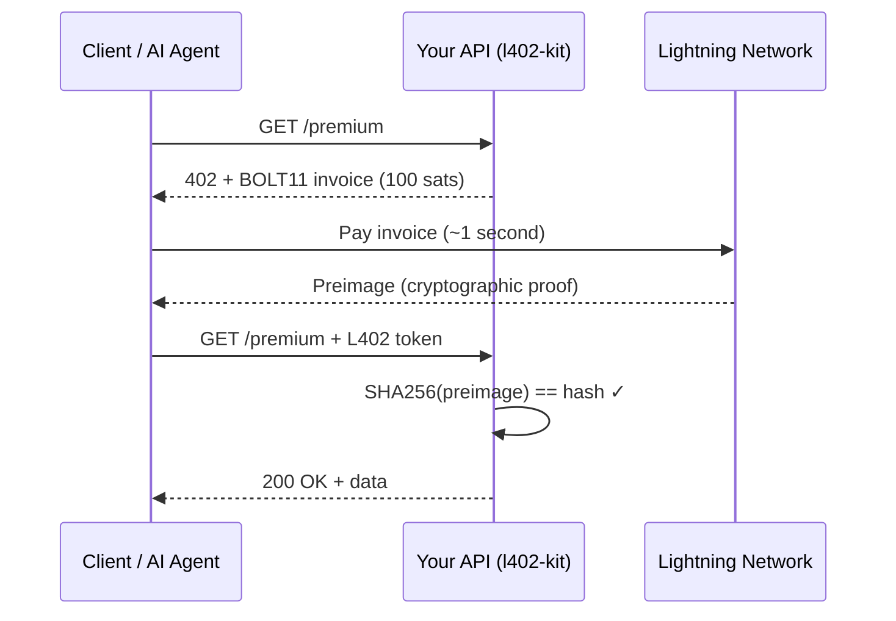

# l402-kit

**The simplest way to charge for your API in Bitcoin sats.**

[](https://npmjs.com/package/l402-kit)
[](https://pypi.org/project/l402kit)
[](LICENSE)
[](https://github.com/ShinyDapps/l402-kit)

```bash
npm install l402-kit    # TypeScript / Express
pip install l402kit     # Python / FastAPI / Flask
```

---

## What is l402-kit?

l402-kit is an open-source middleware that adds **Bitcoin Lightning micropayments** to any API in 3 lines of code.

- No credit card. No account. No chargeback.
- Payments settle in **< 1 second**, globally.
- Works natively with **AI agents** — machines paying machines.
- Works in **every country** — Bitcoin has no borders.

---

## Quickstart — TypeScript

### 1. Install

```bash
npm install l402-kit
```

### 2. Get a free Lightning wallet

Sign up at [dashboard.blink.sv](https://dashboard.blink.sv) — free, no credit card.
Copy your **API Key** and **BTC Wallet ID**.

### 3. Add to your Express API

```typescript
import express from "express";
import { l402, BlinkProvider } from "l402-kit";
import "dotenv/config";

const app = express();

const lightning = new BlinkProvider(
  process.env.BLINK_API_KEY!,
  process.env.BLINK_WALLET_ID!,
);

// Free endpoint
app.get("/", (_req, res) => {
  res.json({ message: "Welcome! Try GET /premium" });
});

// Costs 100 sats (~$0.10) per call
app.get("/premium", l402({ priceSats: 100, lightning }), (_req, res) => {
  res.json({ data: "You paid 100 sats. Here is your exclusive data." });
});

app.listen(3000, () => console.log("Running on http://localhost:3000"));
```

### 4. Test it

```bash
# First call — gets a payment challenge
curl http://localhost:3000/premium
```

```json
{
  "error": "Payment Required",
  "priceSats": 100,
  "invoice": "lnbc1u1p...",
  "macaroon": "eyJoYXNo..."
}
```

```bash
# Pay the invoice with any Lightning wallet, then retry with proof
curl http://localhost:3000/premium \
  -H "Authorization: L402 <macaroon>:<preimage>"
```

```json
{ "data": "You paid 100 sats. Here is your exclusive data." }
```

---

## Quickstart — Python

### 1. Install

```bash
pip install l402kit
```

### 2. Add to your FastAPI app

```python
import os
from fastapi import FastAPI, Request
from l402kit import l402_required, BlinkProvider
from dotenv import load_dotenv

load_dotenv()
app = FastAPI()

lightning = BlinkProvider(
    api_key=os.environ["BLINK_API_KEY"],
    wallet_id=os.environ["BLINK_WALLET_ID"],
)

@app.get("/")
async def root():
    return {"message": "Welcome! Try GET /premium"}

# Costs 100 sats per call
@app.get("/premium")
@l402_required(price_sats=100, lightning=lightning)
async def premium(request: Request):
    return {"data": "You paid 100 sats. Here is your exclusive data."}
```

### 3. Run

```bash
uvicorn main:app --reload
curl http://localhost:8000/premium
```

---

## How it works



---

## Why not Stripe?

|  | Stripe | l402-kit |
|---|---|---|
| Minimum fee | **$0.30** | 1 sat (~$0.001) |
| Settlement time | 2–3 days | **< 1 second** |
| Chargebacks | Yes | **Impossible** |
| Requires account | Yes | **No** |
| AI agent support | No | **Yes — native** |
| Countries blocked | ~50 | **0** |

---

## Lightning Providers

Choose the provider that fits your stack:

| Provider | Cost | Node required | Get started |
|---|---|---|---|
| [Blink](https://blink.sv) | **Free** | No | [dashboard.blink.sv](https://dashboard.blink.sv) |
| [OpenNode](https://opennode.com) | 1% fee | No | [app.opennode.com](https://app.opennode.com) |
| [LNbits](https://lnbits.com) | **Free** | Self-hosted | [lnbits.com](https://lnbits.com) |

**Provider-agnostic** — implement the `LightningProvider` interface to plug in any backend.

---

## Environment variables

```bash
# .env
BLINK_API_KEY=blink_your_key_here
BLINK_WALLET_ID=your-wallet-uuid-here

# Optional — Supabase payment logging
SUPABASE_URL=https://your-project.supabase.co
SUPABASE_ANON_KEY=your_anon_key_here
```

Copy `.env.example` to get started:
```bash
cp .env.example .env
```

---

## Run the example locally

```bash
git clone https://github.com/ShinyDapps/l402-kit
cd l402-kit
npm install
cp .env.example .env   # fill in your Blink keys
npx ts-node test-server.ts
```

---

## Security

- **SHA256 verification** — `SHA256(preimage) == paymentHash` — cryptographic proof, impossible to forge
- **Expiry check** — tokens expire after 1 hour
- **Anti-replay** — each preimage can only be used once

---

## Contributing

See [CONTRIBUTING.md](CONTRIBUTING.md) — setup in 3 minutes. PRs welcome.

---

## License

MIT — use freely, build freely.

---

<p align="center">Built with ⚡ by <a href="https://github.com/ShinyDapps">ShinyDapps</a></p>
