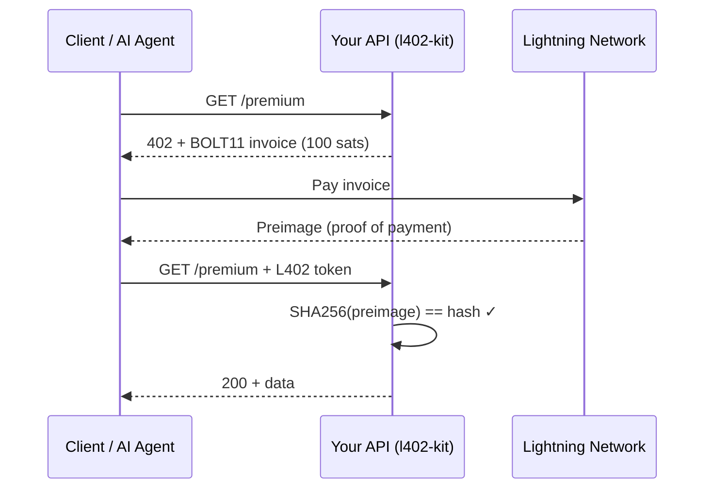

# l402-kit

**The simplest way to charge for your API in Bitcoin sats.**

```bash
npm install l402-kit    # TypeScript / Express
pip install l402kit     # Python / FastAPI / Flask
```

---

## 3 lines of code. Real Lightning payments.

```typescript
import { l402, BlinkProvider } from "l402-kit";

const lightning = new BlinkProvider(process.env.BLINK_API_KEY!, process.env.BLINK_WALLET_ID!);

app.use("/premium", l402({ priceSats: 100, lightning }));
```

```python
from l402kit import l402_required, BlinkProvider

lightning = BlinkProvider(api_key=os.environ["BLINK_API_KEY"], wallet_id=os.environ["BLINK_WALLET_ID"])

@app.get("/premium")
@l402_required(price_sats=100, lightning=lightning)
async def premium(request: Request): ...
```

---

## How it works



---

## Why not Stripe?

| | Stripe | l402-kit |
|---|---|---|
| Minimum fee | $0.30 | 1 sat (~$0.001) |
| Settlement | 2-3 days | < 1 second |
| Chargebacks | Yes | Impossible |
| Requires account | Yes | No |
| Works for AI agents | No | **Yes — native** |
| Countries blocked | ~50 | **0** |

---

## Lightning Providers

| Provider | Cost | Setup |
|---|---|---|
| [Blink](https://blink.sv) | Free | dashboard.blink.sv |
| [OpenNode](https://opennode.com) | 1% | app.opennode.com |
| [LNbits](https://lnbits.com) | Free (self-hosted) | your server |

---

## Quick start

```bash
git clone https://github.com/shinydapps/l402-kit
cd l402-kit
npm install
cp .env.example .env
# add your BLINK_API_KEY and BLINK_WALLET_ID
npx ts-node test-server.ts
```

Test it:
```bash
curl http://localhost:3000/premium
# → 402 Payment Required + Lightning invoice
```

---

## Contributing

See [CONTRIBUTING.md](CONTRIBUTING.md) — setup takes 3 minutes.

---

## License

MIT — use freely, build freely.
