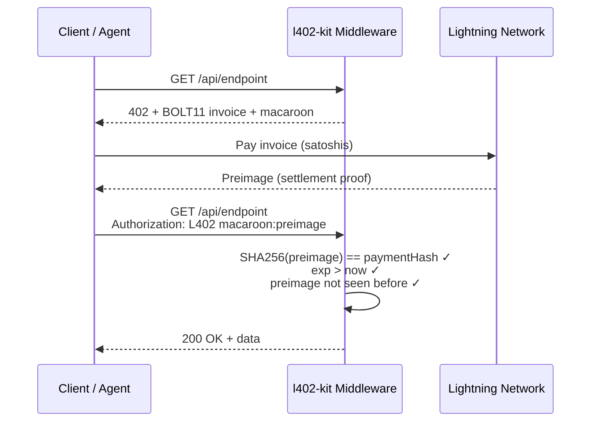
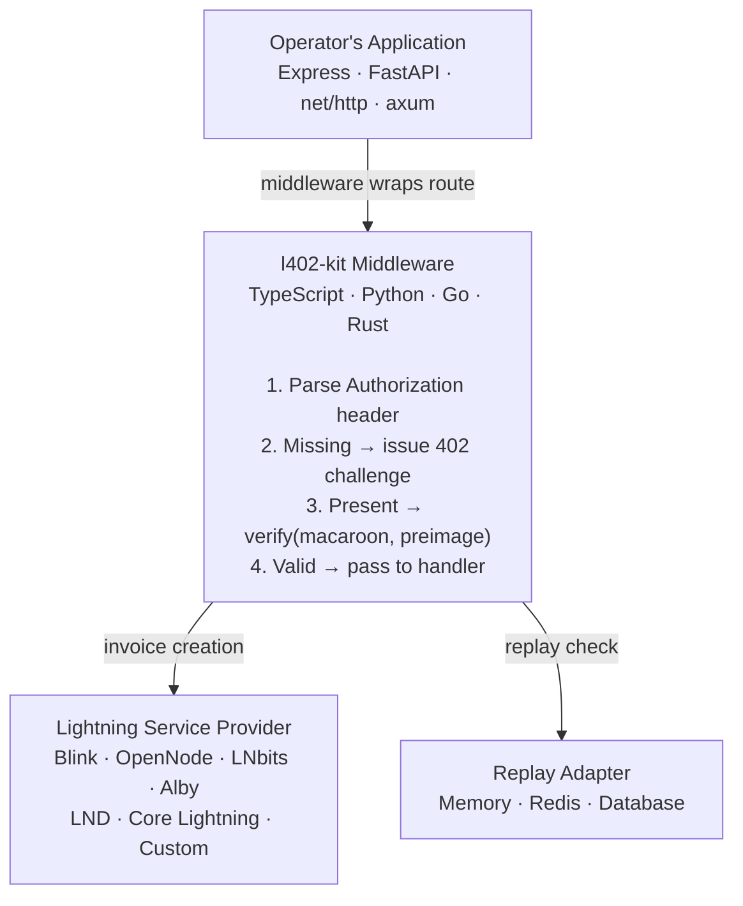

# l402-kit White Paper — Extended Edition

**Version 1.1 — May 2026**
*ShinyDapps · l402kit.com · github.com/ShinyDapps/l402-kit*

---

> This document is the complete technical specification of l402-kit. The public summary is available at l402kit.com/docs/whitepaper. This edition is served by l402-kit itself at l402kit.com/whitepaper-extended (100 sats).

---

## Preface

I built l402-kit because I kept running into the same wall. I had data worth selling — per query, not per month — and no infrastructure that could handle a transaction worth a fraction of a cent without collapsing under its own overhead. Stripe's minimum charge is $0.50 after fees. PayPal requires accounts on both sides. Subscriptions bundle demand that isn't bundled. None of these are bugs in those systems. They are consequences of being built for a specific kind of commerce — human, high-latency, high-trust — that is not the commerce I was trying to do.

What I was trying to do was closer to what electricity meters do: measure consumption precisely, charge exactly for what was used, settle immediately, require no relationship between the meter and the appliance. The Lightning Network is the closest thing that exists to this model in software. The L402 protocol wraps it in HTTP. The gap between the protocol and a usable middleware library was the thing worth building.

The bet this project makes is not a bet on Bitcoin's price. It is a bet on a simpler and longer-lived claim: that programmatic commerce between machines will grow, that the tools for that commerce will need to be as programmable as the machines themselves, and that a payment mechanism requiring human intervention at the authentication step is not a payment mechanism suited for autonomous systems. Agents that cannot pay cannot be fully autonomous. APIs that cannot charge cannot sustain themselves on something other than advertising or venture capital. The missing primitive is not exotic — it is just HTTP 402, finally implemented.

I am not certain the Lightning Network will be the permanent rail for this. I am not certain l402-kit will be the permanent library. What I am certain of is that the problem is real, that the mechanism is sound, and that the infrastructure to prove it exists today. The short term will surprise everyone. The direction does not change.

*ShinyDapps · May 2026*

---

## Abstract

The HTTP 402 status code was reserved in 1996 for a payment mechanism that was never implemented. For twenty-five years it sat dormant while developers built workarounds: account creation flows, credit card processors, subscription billing systems, API key provisioning pipelines. Each workaround solved the immediate problem for humans. None of them work for machines.

l402-kit implements the L402 protocol — HTTP 402 Payment Required over the Bitcoin Lightning Network — as a drop-in middleware for web APIs. A developer adds three lines of code. An API caller, human or machine, pays a Lightning invoice and receives cryptographic proof of payment. The server verifies the proof with a single hash comparison. No account. No API key. No human in the loop.

The system is production-ready, tested across 462+ automated cases in five runtimes, and ships in TypeScript, Python, Go, and Rust. The managed mode charges 0.3% flat. The sovereign mode charges nothing — the operator runs their own Lightning node and keeps every satoshi.

**l402-kit is a family of L402 protocol implementations in TypeScript, Python, Go, and Rust. Open-source, custody-free, account-free. Each implementation does exactly what the protocol asks of it, and nothing more.**

---

## 1. Founding Principles

These seven principles govern every architectural decision in l402-kit. They are not aspirations — they are constraints. A feature that violates them does not ship.

### 1.1 Minimal Essence

The middleware does the protocol, and nothing else. Custody belongs to the Lightning Service Provider. Billing belongs to the operator. Fiat conversion, when it exists, belongs to the operator's bank. The middleware's nature is defined by the L402 protocol: receive a request, check for payment proof, issue a challenge or pass to the handler. Each component of the system has its own nature; mixing natures produces software that is worse in every dimension — harder to audit, harder to maintain, harder to trust. Smallness is not a phase of the project. It is a direct consequence of the product's definition, and it will be defended against every reasonable-sounding reason to grow.

### 1.2 Auditability as a Precondition for Trust

Closed-source financial middleware is a contradiction in terms. Anyone who cannot read the code cannot rationally trust the code with their payment flows. The code is open under the MIT license, written in four languages that are widely read by working developers, and kept small enough that any senior engineer can review an entire implementation end to end in a single session. The test suite covers 462+ cases across five runtimes and is public. The cryptographic verification logic — the single most security-critical function — is fewer than thirty lines in every language. Auditability is not a marketing claim. It is a structural property of the codebase.

### 1.3 Operator Sovereignty

The operator holds the keys. The operator chooses the Lightning provider — Blink, OpenNode, LNbits, Alby, LND, Core Lightning, or any implementation of the two-method interface. The operator keeps their own ledger. The operator decides the price, the expiry window, and the replay protection strategy. l402-kit asks for no trust it cannot honor: it does not hold funds, does not store payment credentials, and does not route traffic through a proprietary network. There is no single point of capture — neither in the middleware nor in the maintainer relationship. A developer who decides to fork and self-maintain the library loses nothing except the upstream maintenance.

### 1.4 Truth as Correspondence

What the documentation states and what the code does are the same. Comparisons with alternative tools — Stripe, x402, Aperture, Fewsats — are honest, including where alternatives are better. The managed mode fee is 0.3%; that number appears in the code, not only in the marketing. The threat model in this document names attacks that l402-kit does not fully mitigate and explains why. The marketing claims and the runtime behavior do not diverge. When they would diverge, the marketing changes.

### 1.5 Stability at the Foundation, Evolution at the Leaves

HTTP will last decades. The Lightning Network is being built to last decades. The macaroon credential format has been stable since its 2014 academic specification. The middleware that connects these foundations must be treated with the seriousness they deserve. Breaking changes in the verification logic, the token format, or the provider interface require a major version increment and a migration guide. Convenience features, new language bindings, and provider implementations live at the leaves and evolve freely. The foundation does not move without reason, and never moves silently.

### 1.6 Composition, Not Construction

l402-kit does not reinvent Lightning, HTTP, or macaroons. It composes well-defined parts that already exist, are independently specified, and are independently maintained. The BOLT11 invoice format is a Lightning Labs specification. The SHA256 hash function is a NIST standard. The HTTP 402 status code is an IETF assignment. The macaroon structure derives from a 2014 academic paper. Each part keeps its own function and its own maintenance burden; the kit's role is to connect them correctly and expose the connection as a simple interface. Building from well-defined primitives means each primitive can be replaced without rewriting the others.

### 1.7 Adequacy to the Nature of the Problem

Programmatic payments between machines are technically distinct from payments between people, and must be treated as such. A human can create an account, enter a card number, and wait for a subscription to activate. An AI agent calling an API at three in the morning cannot. The protocol must be stateless, the credential must be self-contained, and the verification must complete in constant time without a network call. Implementing l402-kit in four languages — TypeScript, Python, Go, Rust — is the recognition that developers in each ecosystem encounter the same problem and deserve a solution in the language where they already work. A Python solution that requires FFI into a TypeScript runtime is not a Python solution.

---

## 2. The Problem: HTTP Was Built for Humans

### 2.1 Twenty-Five Years of Dormancy

In 1996, the authors of HTTP/1.1 reserved status code 402 for "Payment Required" and noted it was "reserved for future use." The future they imagined — a web where servers could demand payment in a machine-readable way before serving a response — did not arrive. What arrived instead was a web built entirely around human interaction: browser forms, credit card flows, account registration pages, monthly subscription dialogs. These mechanisms work for people. They do not work for programs.

The gap was not a failure of imagination. It was a failure of infrastructure. In 1996, there was no payment system that could settle a transaction in under a second, for under a cent, without requiring the payer to have a pre-existing account with the payee. The HTTP 402 code had nowhere to go.

### 2.2 The Workarounds That Replaced It

In the absence of a native payment primitive, developers built workarounds. The most common is the API key: the developer registers an account with a payment method attached, receives a credential, and includes it in every request. The credential proves identity, not payment — the actual billing happens asynchronously, in monthly cycles, billed to a card that may decline or expire. The system requires human setup, human maintenance, and human intervention when something goes wrong. It cannot be automated end to end.

Subscription models improved the developer experience by consolidating billing, but made the payment model worse: the consumer pays for capacity, not for consumption. A developer who needs ten API calls a month pays the same as a developer who needs ten thousand. The pricing does not correspond to value delivered.

Per-call billing exists in some systems (AWS Lambda, OpenAI API) but requires pre-provisioned credits, account creation, and billing infrastructure that is expensive to build and operate. The minimum practical transaction on Stripe is $0.50 after fees. A call worth $0.001 cannot be monetized through existing rails at all.

### 2.3 The Agent Problem

The gap became acute with the emergence of autonomous AI agents. An agent that discovers a new API at runtime cannot create an account, enter a card number, or navigate an OAuth flow. It can only make HTTP requests. If the API requires a pre-provisioned credential, the agent is stopped. The human who deployed the agent must intervene, provision the credential, and redeploy. The loop that was supposed to be autonomous is not.

The requirement is clear: a payment mechanism that works at the HTTP layer, requires no pre-existing relationship between client and server, settles in under a second, and produces a self-contained, cryptographically verifiable proof that the server can check without a network call. HTTP 402 was reserved for exactly this. The Lightning Network makes it implementable.

### 2.4 Two Responses to the Gap

Two protocol proposals address this gap. L402, specified by Lightning Labs, uses Bitcoin's Lightning Network as the payment rail: invoices denominated in satoshis, settled in milliseconds, with the cryptographic preimage as the payment proof. x402, proposed by Coinbase in 2025, uses USDC on the Base L2 blockchain: stablecoin transfers, settled in seconds, with an on-chain transaction as proof. Both protocols use HTTP 402 as the signaling mechanism. Section 9 of this document compares them honestly.

l402-kit implements L402.

---

## 3. The L402 Protocol in Five Minutes

### 3.1 The Four-Step Sequence

The protocol is a standard HTTP exchange with one additional round trip:

**Step 1 — Request without proof.** The client sends a normal HTTP request to a protected endpoint. No special headers required.

**Step 2 — 402 Challenge.** The server responds with HTTP 402 and a `WWW-Authenticate: L402` header containing two values: a BOLT11 Lightning invoice and a macaroon. The invoice encodes the amount and a `paymentHash`. The macaroon encodes the same `paymentHash` and an expiry timestamp.

**Step 3 — Payment.** The client pays the Lightning invoice using any Lightning wallet. The Lightning Network delivers the cryptographic preimage to the payer as settlement proof. This step takes under one second on the mainnet in 2026.

**Step 4 — Authenticated request.** The client resends the original request with an `Authorization: L402 <macaroon>:<preimage>` header. The server verifies that `SHA256(preimage) == paymentHash` — a single, constant-time hash comparison. If it matches and the token has not expired and has not been used before, the request passes to the handler.



### 3.2 Three Properties

**Statelessness.** The server does not need to maintain session state. The macaroon carries the payment hash and expiry inline. Verification is a pure function: given a macaroon and a preimage, return true or false. No database read is required on the hot path (replay protection, described in Section 4, is the one exception).

**Self-contained credentials.** The token format — base64(JSON{hash, exp}):hex(preimage) — carries everything needed for verification. Unlike JWT, there is no signing key that could be compromised. Unlike API keys, there is no credential database that could be breached. The credential is valid because the preimage is cryptographically bound to the Lightning invoice that was paid.

**Privacy by structure.** The server learns that someone paid the invoice. It does not learn who. The Lightning Network does not require identity at the payment layer. A client that has paid once can use the token for its full validity window without re-identifying itself.

### 3.3 Token Format

l402-kit uses a pragmatic simplification of the RFC macaroon format:

```
Authorization: L402 <macaroon>:<preimage>

where:
  macaroon = base64url( JSON{ hash: string, exp: number } )
  preimage  = 64-character hex string (32 bytes)
```

The `hash` field is the `paymentHash` from the Lightning invoice. The `exp` field is a Unix timestamp in milliseconds. The `preimage` is the 32-byte value whose SHA256 equals `hash`. This format is compatible with all known L402 and x402 client implementations.

---

## 4. Architecture

### 4.1 Overview

l402-kit operates across three tiers:



The operator's application sees a standard middleware function. The Lightning provider is pluggable — any implementation of the two-method interface works. The replay adapter is optional and composable.

### 4.2 The Integration Surface

#### TypeScript (Express / Node.js)

```typescript
import { l402, ManagedProvider } from "l402-kit";

const lightning = ManagedProvider.fromAddress("you@blink.sv");

app.use("/api/data", l402({ priceSats: 10, lightning }));
```

#### Python (FastAPI / Flask / ASGI)

```python
from l402kit import l402_required, ManagedProvider

lightning = ManagedProvider.from_address("you@blink.sv")

@app.get("/api/data")
@l402_required(price_sats=10, lightning=lightning)
async def data(): ...
```

#### Go (net/http)

```go
provider := l402kit.NewManagedProvider("you@blink.sv")
http.Handle("/api/data", l402kit.Middleware(l402kit.Options{
    PriceSats: 10,
    Lightning: provider,
}, handler))
```

#### Rust (axum)

```rust
let provider = ManagedProvider::from_address("you@blink.sv");
let app = Router::new()
    .route("/api/data", get(data_handler))
    .layer(L402Layer::new(provider, 10));
```

### 4.3 Two Operating Modes

**Managed mode** uses the ShinyDapps-hosted Lightning infrastructure. The operator provides only a Lightning Address (e.g. `you@blink.sv`). Invoice creation, webhook handling, and payment settlement are managed by the backend. The fee is 0.3% of each payment, split automatically on settlement. The operator receives 99.7% of every payment, directly to their Lightning Address, within seconds. No Lightning node is required. No server to manage.

**Sovereign mode** uses a Lightning provider the operator controls entirely. Built-in providers: `BlinkProvider`, `OpenNodeProvider`, `LNbitsProvider`. The operator passes their API key and wallet ID; the middleware calls their provider directly. The fee is 0%: every satoshi reaches the operator. For full self-custody, operators implement the `LightningProvider` interface (two methods: `createInvoice`, optionally `getInvoiceStatus`) pointing at their LND or Core Lightning node via gRPC or REST.

```typescript
// Sovereign mode — Blink, 0% fee
import { BlinkProvider } from "l402-kit";
const lightning = new BlinkProvider(
  process.env.BLINK_API_KEY!,
  process.env.BLINK_WALLET_ID!
);
app.use("/api/data", l402({ priceSats: 10, lightning }));
```

### 4.4 Replay Protection — Three Independent Layers

Double-spend prevention is the core security requirement. A paid token must be usable exactly once. l402-kit implements three independent layers:

| Layer | Mechanism | Scope | Latency |
|---|---|---|---|
| L1 | `MemoryReplayAdapter` — Set in RAM | Single process | < 1 ms |
| L2 | DB unique constraint on `preimage` | Durable, cross-restart | < 10 ms |
| L3 | `RedisReplayAdapter` — atomic `SET NX` | Multi-instance | < 5 ms |

All three are optional and composable. A solo developer on a single process uses L1. A multi-instance deployment uses L1 + L3. A compliance-sensitive deployment uses all three. The default configuration uses L1 (zero dependencies) and is sufficient for the majority of use cases.

### 4.5 Agent Discovery

APIs protected by l402-kit expose machine-readable discovery signals:

- **`/.well-known/l402.json`** — declares the L402-protected endpoints, their prices, and the Lightning Address for payment routing.
- **`/.well-known/agent.json`** — broader agent capability declaration for AI systems discovering available tools.
- **`/llms.txt`** — plain-text integration instructions for language models.
- **MCP server** — `npx l402-kit-mcp` exposes l402-kit's capabilities as a Model Context Protocol tool server, enabling Claude, Cursor, and compatible clients to call L402-protected APIs directly from the IDE context.

---

## 5. Design Decisions

### 5.1 Why Four Languages

Principle 7 (Adequacy to the nature of the problem) drives this decision. TypeScript is the dominant language for Node.js API development. Python is the dominant language for AI/ML applications and FastAPI services — no other L402 implementation has a Python SDK. Go is the standard for high-throughput infrastructure services. Rust is the choice for systems where memory safety and performance are non-negotiable. A developer who works in Go and encounters l402-kit should not need to run a sidecar process in another language. The implementation in their language is the implementation — not a binding, not a wrapper.

The tradeoff: maintaining four codebases is expensive. The mitigation: a shared test corpus defines the expected behavior, and each language implementation is tested against it. Behavioral parity is verified, not assumed.

### 5.2 Why Blink as the Default Managed Provider

Principle 1 (Minimal essence) drives this decision. The managed mode must have a default Lightning provider, and that provider must be one the kit does not try to become. Blink is a regulated, custodial Lightning service with a public GraphQL API and a reliable webhook system. It handles custody, channel management, and liquidity — none of which are l402-kit's business. The relationship is explicit: Blink is a provider, not a dependency. Swapping to OpenNode or LNbits requires changing one line.

The tradeoff: managed mode users inherit Blink's custody risk and terms. Sovereign mode exists precisely for operators who find this unacceptable.

### 5.3 Why Stateless Verification

The verification function — `SHA256(preimage) == paymentHash` — requires no state. No database read. No network call. No session lookup. This is a consequence of the cryptographic structure of the Lightning Network, not a design choice of l402-kit. The design choice is to preserve this property: nothing in the verification path introduces statefulness. Replay protection (Section 4.4) is the one necessary exception, and it is architecturally isolated from the verification logic.

The benefit: the verification function scales horizontally without coordination. Ten instances of the middleware can verify the same class of tokens without communicating with each other (replay protection requires shared state, handled by the Redis adapter).

### 5.4 Why MIT License

Principle 2 (Auditability as a precondition for trust) makes the license choice straightforward. MIT is maximally permissive: it imposes no requirements on how the code is used, modified, or redistributed. A developer who embeds l402-kit in a commercial product owes nothing except the attribution notice. A developer who forks and builds a competing product is welcome to do so. The license reflects the belief that financial infrastructure should be freely usable — not as a marketing position, but as a structural commitment to the ecosystem.

### 5.5 What l402-kit Deliberately Does Not Do

By Principle 1, the following are explicitly out of scope and will not be added to the core library:

- **Custody.** l402-kit never holds funds. The Lightning Address on the managed mode receives payments directly, not through an escrow.
- **Channel management.** Lightning channel liquidity is the provider's responsibility.
- **Fiat conversion.** Converting satoshis to dollars is an exchange function, not a middleware function.
- **KYC / AML.** Lightning is permissionless by design. Adding identity requirements would contradict the protocol's properties.
- **Billing dashboards.** The VS Code extension and the API analytics endpoint exist as companion tools. They are not part of the middleware.
- **Rate limiting.** Rate limiting is an application-layer concern. l402-kit handles payment authentication; the application handles access policy.

---

## 6. Threat Model

l402-kit takes responsibility for the threats its code can affect. It delegates the rest explicitly, by Principle 3 (Operator sovereignty).

| Threat | Mitigation | Responsibility |
|---|---|---|
| Replay of a redeemed token | Three-layer replay adapter (Memory, Redis, DB unique constraint). First use marks the preimage as spent. | l402-kit |
| Token expiry bypass | `exp` field verified against `Date.now()` with millisecond precision. Maximum expiry cap (2 hours) prevents long-lived forged tokens. | l402-kit |
| Token forgery (crafting a valid macaroon without paying) | SHA256(preimage) == paymentHash is cryptographically unforgeable without the Lightning Network's cooperation. The preimage is delivered only upon payment. | Lightning Network protocol |
| Macaroon theft in transit | HTTPS is the transport layer's responsibility. l402-kit tokens must be sent over TLS. | Operator |
| Macaroon theft after issuance (token leakage from logs, clients) | Tokens expire (max 2 hours). Replay protection makes a stolen token usable only once. Leaked tokens from logs are mitigated by the expiry window. | Shared (l402-kit expiry + operator log hygiene) |
| Timing attack on token comparison | `crypto.timingSafeEqual` with `Uint8Array` (not `Buffer`) prevents side-channel leakage on the hash comparison. | l402-kit |
| Lightning provider compromise | Provider-agnostic interface. Operator can swap providers in one line. No payment credentials are stored in l402-kit. | Operator |
| Application logic bypassing the middleware | Middleware must wrap the route handler. If the operator accidentally exposes the handler without the middleware, l402-kit cannot protect it. | Operator |
| Excessive invoice issuance under DoS | Rate limiting is an application-layer concern. l402-kit issues invoices on every unauthenticated request. The operator must apply rate limiting upstream. | Operator |
| SSRF via Lightning Address in managed mode | Domain validation in `fetchInvoiceFromAddress()` blocks private IP ranges and malformed domains. | l402-kit |
| SQL injection via preimage storage | Parameterized queries throughout. No raw SQL in the hot path. | l402-kit |
| Webhook spoofing (Blink callback) | HMAC-SHA256 with timestamp verification, 5-minute window, `timingSafeEqual` comparison. | l402-kit |

**What l402-kit does not and cannot protect against:** KYC/AML (Lightning is permissionless by design), fraud detection (proof of payment is cryptographic, not probabilistic), chargebacks (Lightning settlement is final), or attacks on the operator's Lightning provider infrastructure.

---

## 7. Architectural Properties

These properties follow from the code structure. They are not performance benchmarks — they are invariants that hold because of how the system is built.

**Constant-time verification per request.** The verification function performs one SHA256 hash, one integer comparison, and one replay check. The cost is bounded and does not grow with the number of users, requests, or tokens in circulation. This property holds in all four language implementations.

**Horizontal scalability without coordination.** The verification path requires no shared state. Multiple instances of the middleware can run in parallel and verify the same class of tokens independently. The one exception — replay protection — is handled by a pluggable adapter (Redis or database) that is the operator's responsibility to provision. The middleware itself introduces no coordination requirement.

**Deterministic memory footprint.** The middleware does not accumulate state across requests. The in-memory replay adapter holds a fixed-size set of preimage hashes; the set is bounded by the operator's configuration and does not grow without bound. No caches, no connection pools, no background workers are introduced by the middleware layer.

**Behavioral parity across four languages.** The shared test corpus defines 462+ cases that all four implementations must pass. A token minted by the TypeScript implementation is verifiable by the Go implementation. The wire format — base64url-encoded JSON macaroon, hex preimage, colon-separated — is identical across all languages.

**Stable upgrade path within a major version.** Tokens minted by l402-kit 1.x are verifiable by all subsequent 1.x releases. The macaroon format, the verification algorithm, and the provider interface do not change within a major version. Operators upgrade without migrating existing tokens.

These properties exist because the kit is small enough to enforce them. They would be harder to defend in a system with more incidental functionality.

---

## 8. Use Cases

### 8.1 Pay-Per-Call API Monetization

The canonical use case: a developer exposes an endpoint that provides real value — data, computation, inference, transformation — and charges per access. The price is set in satoshis. A caller who has paid can access the endpoint for the token's validity window. A caller who has not paid receives a 402 with an invoice.

```typescript
// TypeScript — 10 sats per weather query
app.get("/weather/:city", l402({ priceSats: 10, lightning }), async (req, res) => {
  const data = await fetchWeather(req.params.city);
  res.json(data);
});
```

The economic model is exact: the caller pays for exactly what they use. There is no minimum spend, no monthly commitment, no registration. A caller who makes one request pays for one request. A caller who makes a million requests pays for a million requests, at the same per-unit price, without negotiating a contract.

### 8.2 AI Agent Autonomous Payments

An autonomous agent discovers an L402-protected API at runtime — from a `/.well-known/l402.json` file, from the MCP server registry, or from a 402 response it receives while exploring. The agent has a Lightning wallet with a budget. It pays the invoice, receives the preimage, and continues execution without human intervention.

```typescript
// Agent SDK — automatic payment handling
import { L402Client } from "l402-kit/agent";

const client = new L402Client({
  wallet: new BlinkWallet(process.env.BLINK_API_KEY!),
  budget: { maxSats: 1000 },  // hard cap per session
});

const data = await client.fetch("https://api.example.com/data");
// Client handles 402 automatically: pays invoice, retries with proof
```

The budget cap is the governance primitive. An agent with a 1000-sat budget for a session cannot spend more, regardless of how many APIs it discovers or how many times it calls them. The monetary risk is bounded by the operator who deployed the agent.

The MCP integration extends this to IDE-level usage: Claude or Cursor, configured with the l402-kit MCP server, can call L402-protected APIs directly from within a coding session, paying from a configured wallet without leaving the editor context.

### 8.3 Content Gating

l402-kit gates content as naturally as it gates APIs. A document, a report, a dataset, a PDF — anything served over HTTP can be placed behind an L402 paywall. This document is an example: the Extended Edition is served by l402-kit itself at `l402kit.com/whitepaper-extended` for 100 sats.

The decision to gate this document with the same middleware it describes is Principle 4 (Truth as correspondence) applied to the kit's own documentation. The developer who pays 100 sats and downloads this PDF has performed an end-to-end test of the middleware in production. The curl command is on the landing page.

---

## 9. L402 vs x402: An Honest Comparison

x402 is a protocol proposal backed by Coinbase (2025) for HTTP 402 payments using USDC on the Base L2 blockchain. It is the closest alternative to L402 in the protocol space.

| Property | L402 (l402-kit) | x402 (Coinbase proposal) |
|---|---|---|
| Settlement asset | Bitcoin (satoshis) | USDC (stablecoin) |
| Settlement time | < 1 second (Lightning) | < 1 second (Base L2) |
| Minimum economical payment | ~1 sat (~$0.001) | ~$0.01 (gas cost floor) |
| Custody requirement | None (sovereign) or managed | Requires Base wallet |
| Identity requirement | None | On-chain address (pseudonymous) |
| Governance | IETF draft, Lightning Labs spec | Coinbase-led proposal |
| Credential format | Macaroon + preimage | USDC transfer + on-chain proof |
| Discovery | `.well-known/l402.json`, `llms.txt` | x402 response headers |
| Production SDK | l402-kit (TS/Python/Go/Rust) | No production SDK as of May 2026 |
| Managed mode | Yes (0.3%, no node required) | No |
| Volatility exposure | Satoshi price fluctuates | USDC pegged to USD |

**L402 is the better choice when:**
- Payments are small (under $0.10 per call) — gas costs make Base transactions uneconomical at this scale
- The operator wants zero KYC or identity requirements from callers
- Sub-second settlement and instant finality are required
- The operator is comfortable with Bitcoin denomination
- No production SDK in the required language exists for x402

**x402 is the better choice when:**
- Callers need stablecoin denomination (no volatility exposure)
- The operator already operates in the Coinbase/Base ecosystem
- Regulatory requirements prefer USDC over Bitcoin
- Larger per-transaction amounts justify the gas cost overhead

**On protocol compatibility:** L402 and x402 share the HTTP 402 signaling mechanism and differ only in the payment rail and credential format. l402-kit's provider interface is designed to accommodate x402 as an additional mode. When a production x402 SDK emerges, compatibility is the direction — not competition.

---

## 10. Economic Model

### 10.1 Structural Alignment

The 0.3% fee on managed mode is structurally aligned with developer success. When a developer earns nothing, the fee is zero. When a developer earns more, the fee scales proportionally — it never becomes a barrier to entry and it never front-loads the cost before value is delivered. There is no base cost, no minimum revenue threshold, no credit card required to start.

| Tier | Cost | What You Get |
|---|---|---|
| **Free** | 0.3% of payments received | Unlimited calls, full SDK, 7-day history, charts |
| **Pro** | ~9,000 sats/month (~$9) | Full history, 30D/1Y/ALL charts, CSV export, priority support |
| **Founder** | ~1,000,000 sats one-time (~$999) | Lifetime Pro, founder badge, direct maintainer access |

### 10.2 Fee Examples

```
$1,000/month in API revenue  →  $3/month fee   →  $997 net
$10,000/month                →  $30/month fee  →  $9,970 net
$100,000/month               →  $300/month fee →  $99,700 net
```

Sovereign mode: 0% fee. Every satoshi reaches the operator's wallet directly. The operator bears the cost of running or subscribing to their own Lightning provider.

### 10.3 Split Mechanics

In managed mode, the 0.3% split is implemented server-side, not in client code. When a payment is confirmed by the Blink webhook, the backend:
1. Writes to `pending_splits` — a durable record of the split obligation, independent of the payments table
2. Fetches a Lightning invoice from the operator's Lightning Address via LNURL
3. Pays the invoice (99.7%) via the Blink API
4. Retries up to 3 times with exponential backoff
5. Sends an alert email on permanent failure and records the failure for manual reconciliation

The split is verifiable: every pending_splits entry has a `payment_hash`, `owner_address`, `amount_sats`, `owner_sats`, `status`, `attempts`, and `completed_at`. The operator can audit every split independently.

---

## 11. Versioning Commitments

l402-kit uses semantic versioning across all four language bindings. The following commitments apply within and across versions.

**Patch releases (1.x.y → 1.x.z):** No behavioral change. Bug fixes, performance improvements, and documentation updates only. A patch release never changes the wire format, the verification algorithm, or the provider interface.

**Minor releases (1.x → 1.y):** Additive only. New providers, new language features, new optional configuration fields. Existing code that works on 1.x continues to work on 1.y without modification.

**Major releases (1.x → 2.x):** Breaking changes are permitted and documented. A migration guide ships with every major release. Tokens minted by 1.x are not guaranteed to be verifiable by 2.x — the migration guide addresses this.

**Wire format stability within 1.x:** The macaroon format (base64url JSON with `hash` and `exp` fields) and the token wire format (`macaroon:preimage`) are stable for all 1.x releases. A token minted by l402-kit 1.0 is verifiable by l402-kit 1.8 and all subsequent 1.x releases.

**Version path (descriptive, not dated):**
- **v1.x** — Current series. Managed mode, four language SDKs, MCP server, VS Code extension, 462+ tests.
- **v1.5** — Sovereign mode expansion: first-class BTCPay Server, LND, and Core Lightning providers with full documentation.
- **v2.x** — Direct Lightning: SDK creates and verifies invoices directly against LND/CLN without a managed intermediary.
- **v3.x** — Multi-provider: payment routing across multiple Lightning nodes, optimized for fees and reliability.

---

## 12. Adoption

### Installation

```bash
# TypeScript / Node.js
npm install l402-kit

# Python
pip install l402kit

# Go
go get github.com/shinydapps/l402-kit/go@v1.8.2

# Rust
cargo add l402kit
```

### Registry Links

| Language | Registry | URL |
|---|---|---|
| TypeScript | npm | npmjs.com/package/l402-kit |
| Python | PyPI | pypi.org/project/l402kit |
| Go | pkg.go.dev | pkg.go.dev/github.com/shinydapps/l402-kit/go |
| Rust | crates.io | crates.io/crates/l402kit |

### Contact

- GitHub: github.com/ShinyDapps/l402-kit
- Lightning: shinydapps@blink.sv
- Email: thiagoyoshiaki@gmail.com
- Docs: docs.l402kit.com
- MCP: glama.ai/mcp/servers/@ShinyDapps/l402-kit

*l402-kit is released under the MIT License. Contributions are reviewed within 48 hours.*

---

## Appendix A — Glossary

**Bearer credential.** A credential that grants access to whoever holds it, without proof of identity. l402-kit tokens are bearer credentials — the server does not verify who is presenting the token, only that the token is cryptographically valid.

**bLIP.** Bitcoin Lightning Improvement Proposal. The specification process for Lightning Network protocol extensions.

**Caveat.** In the macaroon model, a condition attached to a credential that restricts its use. l402-kit's `exp` field is a caveat: the token is only valid before the expiry time.

**Lightning Address.** A human-readable identifier in the format `user@domain` that resolves to a Lightning payment endpoint via the LNURL protocol. l402-kit uses Lightning Addresses for managed mode payment routing.

**LSP.** Lightning Service Provider. An entity that provides Lightning Network infrastructure — channels, liquidity, invoice creation — as a service. Blink, OpenNode, and LNbits are LSPs.

**Macaroon.** A cryptographic credential format that supports delegation and attenuation via a chain of HMACs. l402-kit uses a simplified macaroon format: a base64-encoded JSON object containing the payment hash and expiry timestamp.

**Preimage.** The 32-byte value whose SHA256 hash equals the Lightning invoice's `paymentHash`. The Lightning Network delivers the preimage to the payer as proof of settlement. In L402, the preimage is the payment credential.

**Replay protection.** A mechanism that prevents a previously used credential from being used again. l402-kit marks preimages as spent on first use; subsequent presentations of the same preimage are rejected.

---

## Appendix B — References

1. **L402 Protocol Specification.** Lightning Labs. docs.lightning.engineering/the-lightning-network/l402
2. **BOLT11: Invoice Protocol for Lightning Payments.** Rusty Russell et al. github.com/lightning/bolts/blob/master/11-payment-encoding.md
3. **Macaroons: Cookies with Contextual Caveats for Decentralized Authorization.** Birgisson et al., 2014. research.google/pubs/macaroons-cookies-with-contextual-caveats-for-decentralized-authorization-in-the-cloud/
4. **x402 Protocol Proposal.** Coinbase, 2025. x402.org
5. **Aperture: A Lightning-Native Reverse Proxy.** Lightning Labs. github.com/lightninglabs/aperture
6. **HTTP/1.1 Status Code Definitions.** RFC 7231, Section 6.5.2. tools.ietf.org/html/rfc7231

---

## Appendix D — Design Notes

Four decisions in l402-kit that almost went another way, with the reasoning that settled them.

### D.1 Macaroons over JWT

The first instinct when designing a bearer credential for an HTTP API is to reach for JWT. It is universally known, has libraries in every language, and covers 95% of authentication use cases. The reason l402-kit uses macaroons instead is the other 5%: attenuation.

A macaroon can be restricted — *attenuated* — by adding caveats that tighten its scope without invalidating the cryptographic chain. A token minted for 100 sats of access can be delegated to a sub-agent with an additional caveat that restricts it to a specific endpoint, or a lower spend limit, or a shorter validity window. The sub-agent cannot remove or loosen those restrictions; it can only add more. This is the property that makes macaroons the correct credential format for a system where orchestrator agents mint tokens for sub-agents.

JWT does not support attenuation natively. A JWT is signed at issuance and its claims are fixed. Delegating a JWT to a sub-agent means issuing a new JWT — which requires a signing key the orchestrator may not have, and a trip to the issuer. The attenuation in macaroons is local: the holder adds a caveat with a hash, and the verifier checks the chain. No network call, no signing key exposure.

The cost: macaroons are not universally known. Developers who encounter them for the first time need to understand the caveat chain before they can use delegation. For operators who do not use delegation, the macaroon is functionally equivalent to a signed JWT — they pay the unfamiliarity cost without gaining the attenuation benefit. This is a genuine tradeoff, not a solved problem.

### D.2 Blink as Default Managed Provider

Three Lightning providers were evaluated for the managed mode default: Blink, OpenNode, and Phoenix Server. All three create BOLT11 invoices. The differences are in the webhook system, the custody model, and the API design.

Blink won on two criteria. First, it has a reliable Svix-based webhook with HMAC-SHA256 signature verification — the same webhook infrastructure that serious production systems use. OpenNode's webhook at the time of evaluation had reliability issues under high load. Phoenix Server does not expose a hosted service; it requires the operator to run their own node. Second, Blink's GraphQL API is clean, versioned, and documented. Integrating it took one file; the interface is narrow enough that swapping providers is realistic.

The tradeoff is that Blink is custodial. An operator using managed mode is trusting Blink with payment routing, in the same way they trust Stripe with card processing. Sovereign mode exists precisely for operators who find this unacceptable. The managed mode default is a pragmatic choice for zero-config onboarding — not an architectural commitment to custody.

### D.3 0.3% Fee, Not 1%

The fee number was not arbitrary. The reasoning: l402-kit is infrastructure for the long tail of API monetization — developers charging fractions of a cent per call, building on top of it before they have significant revenue. A 1% fee on a $0.001 API call is $0.00001, which rounds to nothing and is unperceivable. A 1% fee on a $10,000/month developer is $100/month — a material cost that makes the managed mode uncompetitive against running a $5/month VPS with a self-hosted Lightning node.

0.3% scales correctly at both ends. At micro-scale it is negligible and never a barrier to starting. At scale it remains small enough that the operator's incentive to switch to sovereign mode (0% fee) is not strong until the operational overhead of running a Lightning node is genuinely worth it. The fee is designed to stay out of the operator's decision-making until it becomes rational for them to graduate to sovereign mode — at which point the graduation is easy, by design.

The structural alignment matters more than the percentage: when a developer earns nothing, the fee is zero. The service costs money only when it delivers value. This removes the risk of paying before proving.

### D.4 Stateless Validation, Not Redis-First

The early design considered making Redis a soft dependency — present by default, optional to remove. The argument: Redis gives you replay protection, rate limiting, and distributed state in one component that most production deployments have anyway.

The argument against: every dependency that is present by default becomes a deployment requirement. A developer who wants to run l402-kit in a Cloudflare Worker, a Lambda function, or a single-process container should not need to provision Redis to get started. Stateless validation — the verification function as a pure function that requires no external state — is the property that makes all of these deployment targets viable without modification.

Replay protection is the necessary exception, and it is handled through a pluggable adapter rather than a built-in dependency. The default adapter is in-memory, suitable for single-process deployments. Redis is one line of configuration away for multi-instance deployments. The architecture is: stateless by default, stateful when the operator explicitly opts in.

The loss: in-memory replay protection does not survive process restarts. Tokens that were spent before a restart could theoretically be replayed after one. For most use cases — tokens with 1-hour expiry windows, services that restart infrequently — this risk is acceptable. For compliance-sensitive deployments, the DB unique constraint adapter closes the gap durably.

---

## Appendix C — Document Changelog

| Version | Date | Changes |
|---|---|---|
| 1.0 | April 2026 | Initial release. Sections: Abstract, Problem, Solution, Architecture, Economic Model, SDKs, AI Agents, Security, Decentralization Roadmap, Open Source. |
| 1.1 | May 2026 | Extended Edition. Added: Founding Principles (§1), Design Decisions (§5), expanded Threat Model (§6, full table), Architectural Properties (§7), Use Cases (§8), L402 vs x402 (§9), Versioning Commitments (§11, replaces Decentralization Roadmap), Appendices A/B/C. Updated all code samples to v1.8.2 API. Fixed encoding throughout. |
