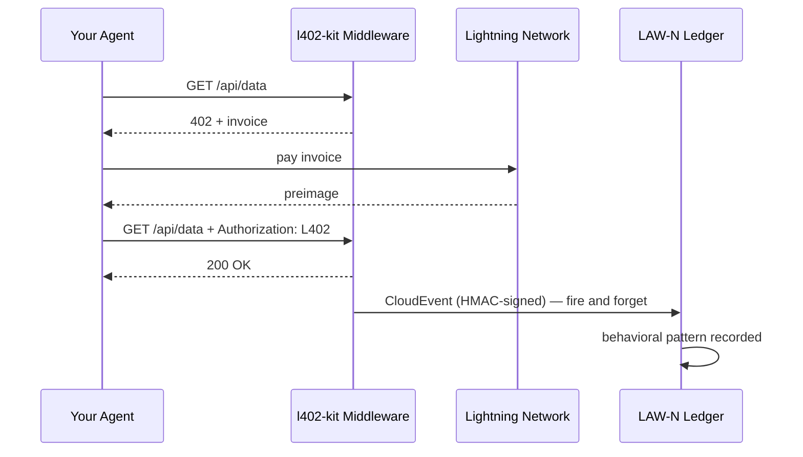

# LAW-N Behavioral Events

LAW-N (SAGEWORKS AI) is a behavioral ledger for autonomous agents. Every L402 payment your agent makes can emit a signed CloudEvent — building a cryptographic audit trail that becomes an agent reputation score over time.

**No authority grants the reputation. The transactions are the proof.**

---

## How it works



The event is emitted after every successful payment. It never blocks the response — if LAW-N is unavailable, your agent still gets the data.

---

## Enable on the client side

```typescript
import { L402Client } from "l402-kit/agent";
import { BlinkWallet } from "l402-kit/wallets";
import { createLawNAdapter } from "l402-kit/agent";

const lawN = createLawNAdapter({
  ingestUrl: "https://l402kit.com/api/lawn-events",
  hmacSecret: process.env.LAWN_HMAC_SECRET!,
  network: "mainnet",
});

const client = new L402Client({
  wallet: new BlinkWallet(process.env.BLINK_API_KEY!),
  agentId: "agent:myorg.myagent",
  budget: { maxSats: 1000 },
  onEvent: lawN,
});
```

---

## Event types

| Event | Emitted when |
|---|---|
| `l402.challenge.received` | Server returned HTTP 402 |
| `l402.payment.initiated` | Agent started paying the invoice |
| `l402.payment.settled` | Payment confirmed, preimage received |
| `l402.access.granted` | Server accepted the L402 token |
| `l402.budget.exhausted` | Agent hit its spending cap |
| `l402.token.reused` | Agent retried with existing proof |
| `l402.proof.reuse.attempt` | Attempted to reuse a spent preimage |

---

## CloudEvents 1.0 format

```json
{
  "specversion": "1.0",
  "type": "l402.payment.settled",
  "source": "l402-kit",
  "id": "req_a1b2c3d4",
  "time": "2026-05-10T14:32:00.000Z",
  "subject": "agent-payment-flow",
  "datacontenttype": "application/json",
  "data": {
    "agent_id": "agent:myorg.myagent",
    "session_id": "sess_8f3a1b2c",
    "request_id": "req_a1b2c3d4",
    "endpoint": "https://api.example.com/data",
    "event_type": "l402.payment.settled",
    "network": { "provider": "blink", "environment": "mainnet" },
    "payment": {
      "amount_sats": 100,
      "preimage_hash": "sha256:abc123...",
      "settled": true,
      "latency_ms": 487
    },
    "behavior": {
      "retry_count": 0,
      "proof_reuse_attempt": false,
      "budget_remaining": 900,
      "budget_exhausted": false
    }
  }
}
```

---

## What reputation looks like

Agents that consistently:
- Pay invoices on first attempt
- Respect budget constraints
- Do not attempt proof reuse
- Operate across diverse endpoints

...build reputation automatically. Agents that misbehave stop being able to access services.

No whitelist. No governance vote. No authority deciding who is trustworthy. The ledger is the proof.

---

## Activity dashboard

Public stats available at:

```bash
curl https://l402kit.com/api/activity
```

```json
{
  "total_events": 1420,
  "unique_agents": 12,
  "total_sats": 84200,
  "recent_events": [...],
  "top_agents": [
    { "agent_id": "agent:shinydapps.verity", "event_count": 847 }
  ]
}
```

Live dashboard: [l402kit.com/activity](https://l402kit.com/activity)
