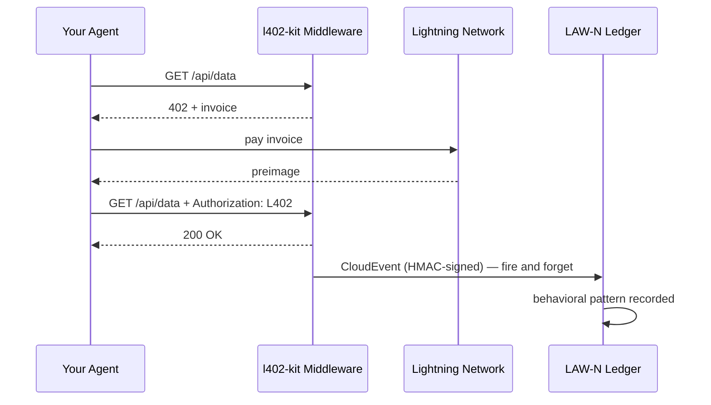

# أحداث سلوك LAW-N

LAW-N (SAGEWORKS AI) هو سجل سلوكي للوكلاء المستقلين. كل دفعة L402 يُجريها وكيلك يمكنها إصدار CloudEvent موقّع — مما يبني مساراً تدقيقياً تشفيرياً يتحول مع الوقت إلى درجة سمعة للوكيل.

**لا توجد جهة سلطة تمنح السمعة. المعاملات هي الدليل.**

---

## كيف يعمل



يُصدَر الحدث بعد كل دفعة ناجحة. ولا يعيق الاستجابة أبداً — فإن كان LAW-N غير متاح، يحصل وكيلك على البيانات على أي حال.

---

## التفعيل على جانب العميل

```typescript
import { L402Client } from "l402-kit/agent";
import { BlinkWallet } from "l402-kit/wallets";
import { createLawNAdapter } from "l402-kit/agent";

const lawN = createLawNAdapter({
  ingestUrl: "https://l402kit.com/api/lawn-events",
  hmacSecret: process.env.LAWN_HMAC_SECRET!,
  network: "mainnet",
});

const client = new L402Client({
  wallet: new BlinkWallet(process.env.BLINK_API_KEY!),
  agentId: "agent:myorg.myagent",
  budget: { maxSats: 1000 },
  onEvent: lawN,
});
```

---

## أنواع الأحداث

| الحدث | يُصدَر عند |
|---|---|
| `l402.challenge.received` | إرجاع الخادم HTTP 402 |
| `l402.payment.initiated` | بدء الوكيل في دفع الفاتورة |
| `l402.payment.settled` | تأكيد الدفع واستلام preimage |
| `l402.access.granted` | قبول الخادم لرمز L402 |
| `l402.budget.exhausted` | وصول الوكيل إلى حد الإنفاق |
| `l402.token.reused` | إعادة محاولة الوكيل باستخدام إثبات موجود |
| `l402.proof.reuse.attempt` | محاولة إعادة استخدام preimage منتهي الصلاحية |

---

## تنسيق CloudEvents 1.0

```json
{
  "specversion": "1.0",
  "type": "l402.payment.settled",
  "source": "l402-kit",
  "id": "req_a1b2c3d4",
  "time": "2026-05-10T14:32:00.000Z",
  "subject": "agent-payment-flow",
  "datacontenttype": "application/json",
  "data": {
    "agent_id": "agent:myorg.myagent",
    "session_id": "sess_8f3a1b2c",
    "request_id": "req_a1b2c3d4",
    "endpoint": "https://api.example.com/data",
    "event_type": "l402.payment.settled",
    "network": { "provider": "blink", "environment": "mainnet" },
    "payment": {
      "amount_sats": 100,
      "preimage_hash": "sha256:abc123...",
      "settled": true,
      "latency_ms": 487
    },
    "behavior": {
      "retry_count": 0,
      "proof_reuse_attempt": false,
      "budget_remaining": 900,
      "budget_exhausted": false
    }
  }
}
```

---

## كيف تبدو السمعة

الوكلاء الذين يقومون باستمرار بما يلي:
- دفع الفواتير من المحاولة الأولى
- احترام قيود الميزانية
- عدم محاولة إعادة استخدام الإثبات
- العمل عبر نقاط نهاية متنوعة

...يبنون سمعتهم تلقائياً. أما الوكلاء الذين يتصرفون بشكل سيء فيتوقفون عن القدرة على الوصول إلى الخدمات.

لا قائمة بيضاء. لا تصويت على الحوكمة. لا سلطة تقرر من هو جدير بالثقة. السجل هو الدليل.

---

## لوحة تحكم النشاط

إحصائيات عامة متاحة على:

```bash
curl https://l402kit.com/api/activity
```

```json
{
  "total_events": 1420,
  "unique_agents": 12,
  "total_sats": 84200,
  "recent_events": [...],
  "top_agents": [
    { "agent_id": "agent:shinydapps.verity", "event_count": 847 }
  ]
}
```

لوحة التحكم المباشرة: [l402kit.com/activity](https://l402kit.com/activity)