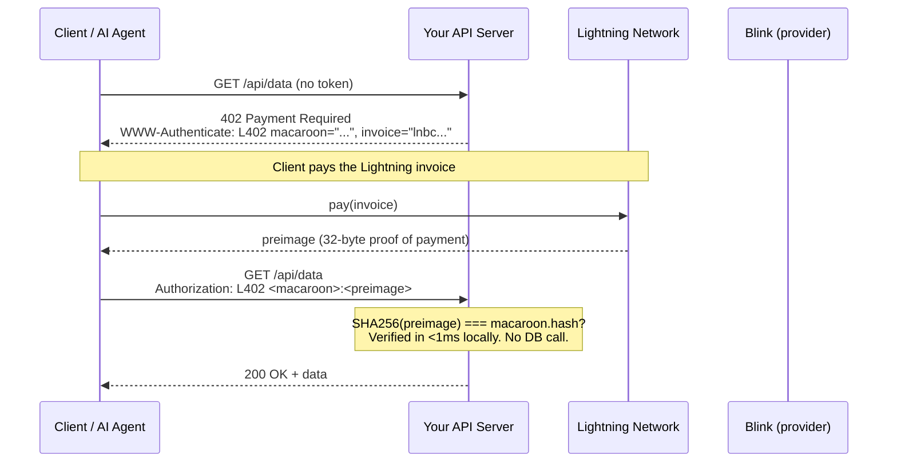
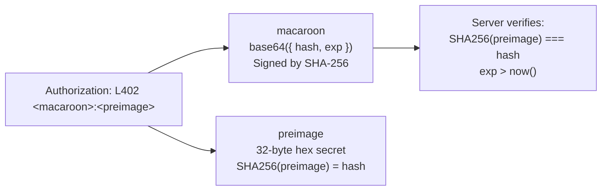
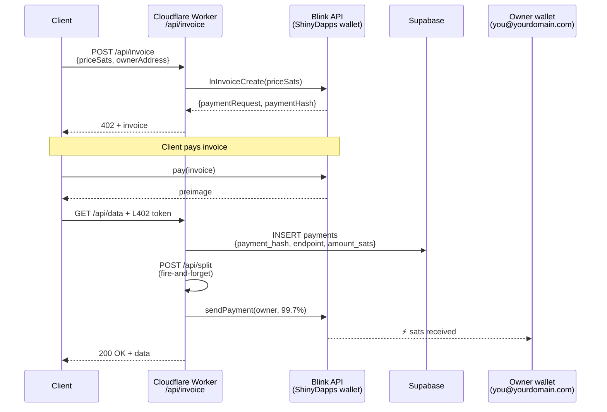
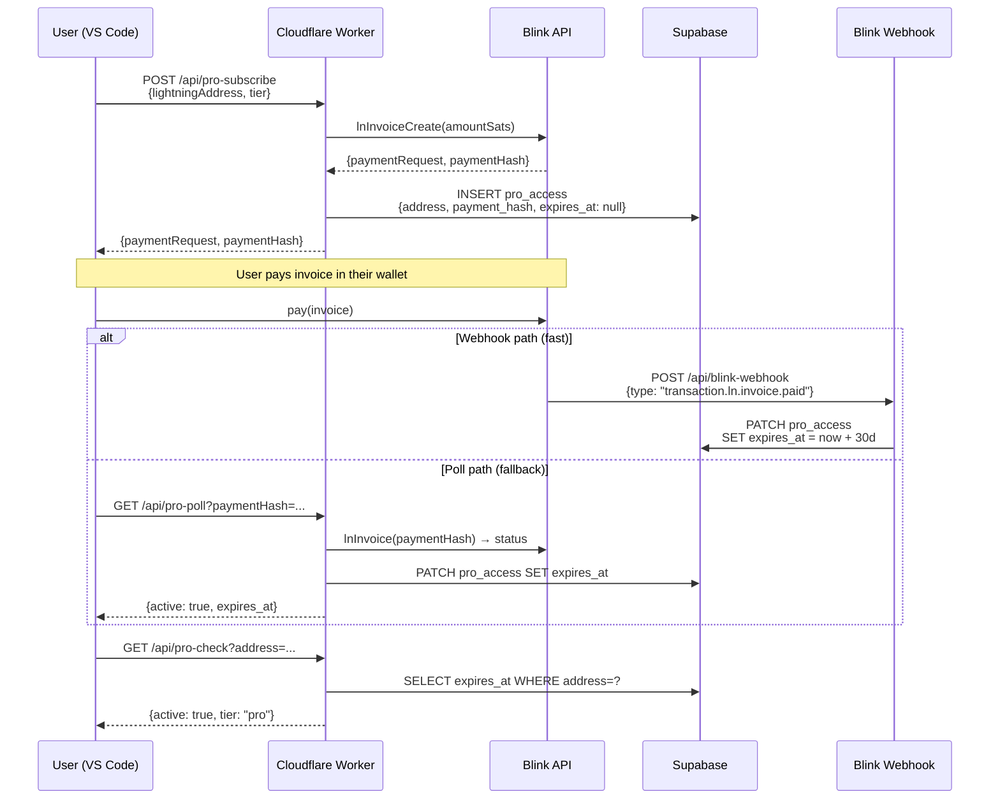
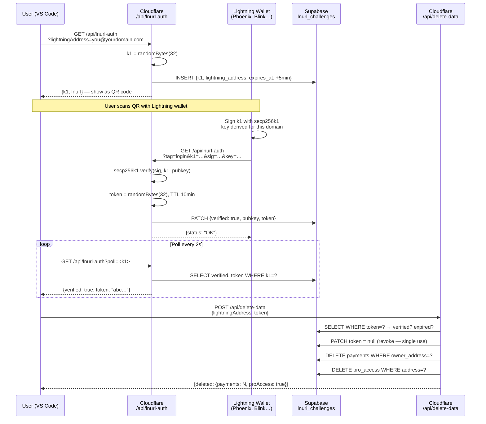
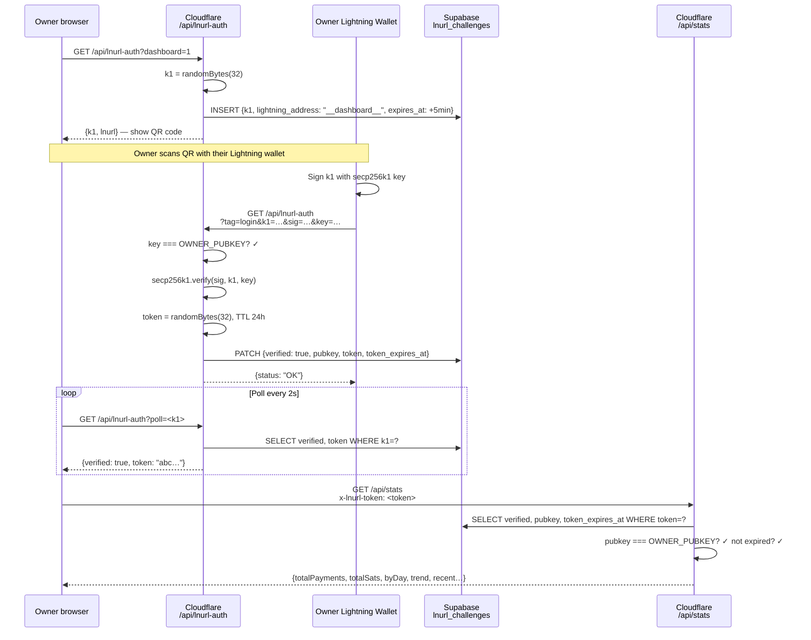
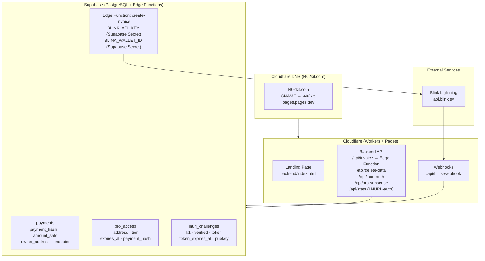
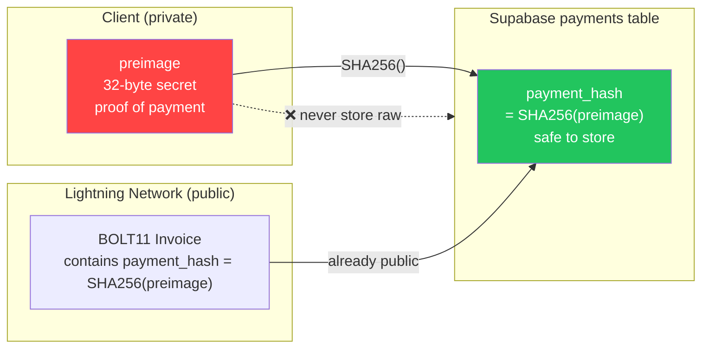

توثّق هذه الصفحة كل تدفق رئيسي في منصة l402-kit على شكل مخططات تسلسلية ومخططات انسيابية. يقترن كل قسم بمرئي وشرح موجز لما يحدث ولماذا يعمل بهذه الطريقة. ابدأ بالتدفق 1 (L402 الأساسي) لفهم الأساس التشفيري، ثم اقرأ التدفقات ذات الصلة بتكاملك.

---

## 1. تدفق دفع L402 الأساسي

دورة الطلب الجوهرية. لا حسابات، لا كلمات مرور — مجرد إيصال تشفيري.

عندما يصل عميل لأول مرة إلى نقطة نهاية محمية، يتلقى استجابة HTTP 402 تحتوي على شيئين: فاتورة BOLT11 عبر Lightning Network وmacaroon. يدفع العميل الفاتورة عبر Lightning Network (عادةً في أقل من ثانية)، ويتلقى preimage بحجم 32 بايت كدليل، ثم يُعيد الطلب مع `Authorization: L402 <macaroon>:<preimage>`. يتحقق الخادم من الرمز محلياً باستخدام `SHA256(preimage) === macaroon.hash` — لا استدعاء لقاعدة البيانات، لا رحلة ذهاب وعودة عبر الشبكة، زمن استجابة أقل من ميلي ثانية. بمجرد التحقق، يكون الرمز صالحاً حتى انتهاء صلاحيته. تُعيد الطلبات اللاحقة استخدام نفس الترويسة.

**الخصائص الرئيسية:**
- التحقق محلي بالكامل — لا استدعاء شبكي، لا بحث في قاعدة البيانات
- `preimage` = دليل تشفيري على الدفع (إيصال Lightning)
- `macaroon` = JSON بترميز base64 `{hash, exp}` موقّع بـ SHA-256

---

## 2. تشريح الرمز

تحمل ترويسة `Authorization` مكوّنَين مفصولَين بنقطتين. **macaroon** هو كائن JSON مُشفَّر بـ base64 `{hash, exp}` — يُخبر الخادم بهاش الدفع المتوقع ووقت انتهاء صلاحية الرمز. أما **preimage** فهو السر بحجم 32 بايت الذي أعادته Lightning Network إلى الدافع. معاً يُشكّلان بيانات اعتماد غير قابلة للتزوير ومكتفية بذاتها يمكن لأي خادم التحقق منها دون اتصال.

---

## 3. الوضع المُدار — تدفق تقسيم الرسوم

عند استخدام `ManagedProvider`، تُنشئ l402kit.com الفاتورة، وتستقبل الدفع، وتُحوّل 99.7% إلى عنوان Lightning الخاص بك تلقائياً. تغطي رسوم المنصة البالغة 0.3% توجيه Lightning وبنية تحتية API. لا تلمس محفظتك Cloudflare Worker أبداً — فالتقسيم عبارة عن دفع Lightning من جانب الخادم يُطلَق بعد التحقق من طلب العميل، باستخدام عنوان Lightning الخاص بك لإنشاء فاتورة BOLT11 جديدة في الوقت الفعلي.

---

## 4. تدفق اشتراك Pro

تتبع اشتراكات Pro نمطاً مشابهاً لـ L402 لكنها تُضيف حالة دائمة. يدفع العميل فاتورة لمرة واحدة ويحصل على سجل اشتراك مدته 30 يوماً في Supabase. يصل تأكيد الدفع إما عبر Blink webhook (المسار السريع، ~ثانيتان) أو عبر الاستطلاع (بديل للمحافظ التي لا تُطلق webhooks). تتحقق استدعاءات `/api/pro-check` اللاحقة من طابع `expires_at` الزمني دون دفع آخر.

---

## 5. LNURL-auth — إثبات ملكية المحفظة (حذف البيانات)

يُثبت أنك تمتلك محفظة Lightning دون كلمة مرور. مطلوب قبل حذف بيانات الحساب.

---

## 6. تدفق تسجيل الدخول إلى لوحة التحكم عبر LNURL-auth

مصادقة لوحة التحكم مقتصرة على المالك — DASHBOARD_SECRET مخزّن في أسرار Cloudflare Workers.

---

## 7. نظرة عامة على البنية التحتية

---

## 8. أمان SHA-256 Preimage

لماذا نخزّن `SHA256(preimage)` بدلاً من preimage الخام:

**لماذا هو آمن:** `payment_hash` مُضمَّن بالفعل في كل فاتورة BOLT11 — فهو عام بطبيعته. فقط `preimage` هو السر. يمنحك تخزين الهاش حماية من إعادة التشغيل دون أي تعرض إضافي.