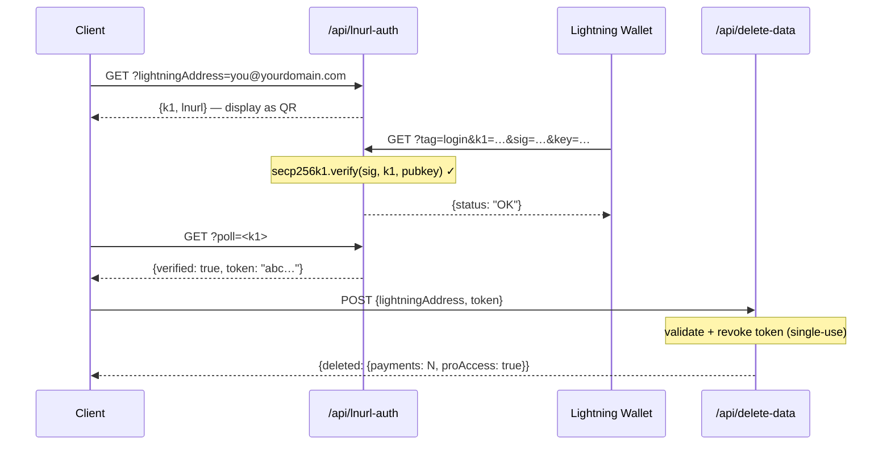

## نموذج أمان الرمز

تتكون رموز L402 من جزأين مرتبطين بـ `:`:

```
<macaroon>:<preimage>
```

- **Macaroon** — JSON مُرمَّز بـ base64 يحتوي على `{hash, exp}`. موقَّع بـ SHA-256. لا يمكن تزويره دون معرفة الـ preimage.
- **Preimage** — السر المكوَّن من 32 بايت الذي يجب، عند تجزئته بـ SHA-256، أن يطابق الـ hash المُضمَّن في الـ macaroon.

**التحقق يتم محليًا بالكامل** — لا بحث في قاعدة البيانات، ولا استدعاء شبكي. يتحقق SDK من العلاقة التجزيئية تشفيريًا في ميكروثانية.

---

## الحماية من إعادة التشغيل

يتضمن l402-kit **حماية مدمجة من إعادة التشغيل**. يمكن استخدام كل preimage مرة واحدة فقط:

```typescript
// ✅ مدمج — مفعَّل بشكل افتراضي
app.get("/api", l402({ priceSats: 10, lightning: blink }), handler);
```

أول استخدام للرمز يُعلِّم الـ preimage على أنه مُستهلَك. أي طلب لاحق بنفس الـ preimage يُعيد `401 Token already used`.

**المخزن الافتراضي**: `Set` في الذاكرة. هذا يعني:
- إعادة التشغيل تمسح مخزن إعادة التشغيل (تصبح الرموز قابلة لإعادة الاستخدام عبر عمليات إعادة التشغيل)
- النسخ المتعددة لا تتشارك الحالة

**للإنتاج** مع نسخ متعددة، نفِّذ مخزن إعادة تشغيل دائمًا:

```typescript
import { checkAndMarkPreimage } from "l402-kit";

// مثال: مخزن إعادة تشغيل مدعوم بـ Redis
async function redisCheckAndMark(preimage: string): Promise<boolean> {
  const key = `l402:used:${preimage}`;
  const set = await redis.set(key, "1", "NX", "EX", 86400); // TTL لمدة 24 ساعة
  return set === "OK"; // true = أول استخدام، false = إعادة تشغيل
}
```

---

## انتهاء صلاحية الرمز

تحمل الرموز حقل `exp` (طابع زمني Unix بالميلي ثانية). يرفض SDK الرموز منتهية الصلاحية تلقائيًا.

مدة الصلاحية الافتراضية: **ساعة واحدة** (تُحدَّد من موفر Lightning عند إنشاء الفاتورة).

```typescript
// الرموز صالحة لمدة ساعة واحدة بعد إنشاء الفاتورة.
// بعد انتهاء الصلاحية، يجب على العميل الدفع مرة أخرى للحصول على رمز جديد.
```

---

## HTTPS مطلوب

**لا تستخدم L402 عبر HTTP العادي في الإنتاج أبدًا.** يتم نقل الـ macaroon والـ preimage في رأس `Authorization`. عبر HTTP، يكونان مكشوفَين لمهاجمي الشبكة.

```nginx
# nginx — إعادة توجيه HTTP إلى HTTPS
server {
    listen 80;
    return 301 https://$host$request_uri;
}
```

---

## تحديد معدل الطلبات

يتحقق L402 من الرموز تشفيريًا، لا من خلال البحث في قاعدة بيانات — لذا فهو رخيص التكلفة. لكن إنشاء فاتورة Lightning (استجابة 402) يستدعي واجهة برمجة موفر Lightning الخاص بك.

احمِ إنشاء الفاتورة بمُحدِّد معدل لمنع هجمات DoS:

```typescript
import rateLimit from "express-rate-limit";

const invoiceLimiter = rateLimit({
  windowMs: 60_000,
  max: 20, // 20 طلبًا غير مدفوع في الدقيقة لكل IP
  skip: (req) => req.headers.authorization?.startsWith("L402 ") ?? false,
});

app.use("/api", invoiceLimiter);
app.get("/api/data", l402({ priceSats: 10, lightning: blink }), handler);
```

---

## إدارة الأسرار

لا تُضمِّن مفاتيح API في الكود مطلقًا. استخدم متغيرات البيئة:

```typescript
// ✅ صحيح
const blink = new BlinkProvider(
  process.env.BLINK_API_KEY!,
  process.env.BLINK_WALLET_ID!,
);

// ❌ لا تفعل هذا أبدًا
const blink = new BlinkProvider("blink_abc123...", "wallet-id-here");
```

استخدم مدير أسرار في الإنتاج: AWS Secrets Manager أو Doppler أو Vault أو `.env` + dotenv (لا يُودَع في git أبدًا).

---

## مصادقة نقاط النهاية الإدارية

إذا كنت تكشف عن نقاط نهاية إدارية أو إحصائية، **لا تقبل الأسرار أبدًا عبر معاملات استعلام URL**. تُسجَّل عناوين URL كاملةً من قِبَل الوكلاء العكسيين وشبكات توصيل المحتوى ومزودي الخدمات السحابية — بما في ذلك سلسلة الاستعلام.

```typescript
// ❌ لا تفعل هذا — السر مرئي في سجلات Cloudflare Workers
GET /api/stats?secret=my-secret

// ✅ صحيح — الرأس لا يُسجَّل افتراضيًا
GET /api/stats
x-dashboard-secret: my-secret
```

```typescript
// فرض استخدام الرأس فقط في معالجك
const token = req.headers["x-dashboard-secret"];
if (!SECRET || token !== SECRET) return res.status(401).json({ error: "Unauthorized" });
```

---

## نظافة مفاتيح Supabase

استخدم `SUPABASE_SERVICE_KEY` (من جانب الخادم فقط) مقابل `SUPABASE_ANON_KEY` (آمن للكشف للعملاء) بشكل صحيح:

| المفتاح | الاستخدام | يتجاوز RLS؟ |
|---|---|---|
| `anon` | امتداد VS Code، عملاء المتصفح | لا |
| `service_role` | وظائف API من جانب الخادم | نعم |

يجب على Cloudflare Workers من جانب الخادم التي تقرأ جداول حساسة (مثل `pro_access`) استخدام مفتاح الخدمة — وليس مفتاح anon أبدًا. لا ينبغي أن تمنح سياسات RLS على الجداول الحساسة وصول anon.

```typescript
// ✅ نقطة نهاية من جانب الخادم
const SUPABASE_KEY = process.env.SUPABASE_SERVICE_KEY ?? process.env.SUPABASE_ANON_KEY ?? "";
```

---

## سياسة أمان المحتوى

إذا كنت تقدم واجهة أمامية جنبًا إلى جنب مع واجهة برمجة التطبيقات، تأكد من أن CSP لا تحجب تدفق L402:

```http
Content-Security-Policy: connect-src 'self' https://api.blink.sv
```

---

## إدارة البيانات — حذف بيانات المستخدم

يمكن للمستخدمين حذف جميع سجلات المدفوعات واشتراك Pro الخاص بهم من داخل امتداد VS Code في أي وقت (**الإعدادات ← منطقة الخطر**). يستدعي الامتداد:

```http
POST /api/delete-data
Content-Type: application/json

{ "lightningAddress": "user@blink.sv" }
```

الاستجابة:

```json
{ "deleted": { "payments": 42, "proAccess": true } }
```

تستخدم نقطة النهاية هذه **مفتاح دور الخدمة** في Supabase من جانب الخادم لتجاوز RLS وحذف ما يلي بشكل دائم:

- جميع الصفوف في `payments` حيث `owner_address = ?`
- جميع الصفوف في `pro_access` حيث `address = ?`

<Note>
يطلب الامتداد من المستخدم كتابة عنوان Lightning الخاص به حرفيًا قبل تفعيل زر الحذف — تأكيد على غرار GitHub للإجراءات التدميرية.
</Note>

إذا كنت تبني لوحة تحكم خاصة بك على l402-kit، اكشف عن نقطة نهاية مماثلة لمستخدميك. لا تسمح بالحذف عبر مفتاح anon — مرِّر الطلب دائمًا عبر وظيفة من جانب الخادم باستخدام مفتاح الخدمة.

---

## الخصوصية وتقليل البيانات

تم تصميم l402-kit لجمع الحد الأدنى من البيانات اللازمة للتشغيل. فيما يلي ما يتم تخزينه، وسبب التخزين، وكيفية تعزيز كل حقل.

### ما يتم تخزينه

| الجدول | الحقل | السبب | الحساسية |
|---|---|---|---|
| `payments` | `preimage` | الحماية من إعادة التشغيل + إثبات الدفع | ⚠️ متوسط — جزِّئه بدلًا من ذلك (انظر أدناه) |
| `payments` | `owner_address` | نسب الإيرادات إلى عنوان Lightning | منخفض — عناوين Lightning عامة |
| `payments` | `amount_sats` | إحصائيات لوحة التحكم | منخفض |
| `payments` | `endpoint` | تحليلات لكل نقطة نهاية | منخفض–متوسط |
| `pro_access` | `address` | التحقق من اشتراك Pro | منخفض — عام |
| `waitlist` | `email` | إرسال رسائل الترحيب والإصدار | ⚠️ مرتفع — بيانات PII حقيقية، قم بتشفيرها أو حذفها |
| `waitlist` | `lightning_address` | إشارة هوية اختيارية | منخفض |

### تجزئة الـ preimages بدلًا من تخزينها خامًا

الـ preimage هو السر المكوَّن من 32 بايت الذي يُثبت إجراء دفع Lightning. تخزينه خامًا يعني أن خرق قاعدة البيانات يكشف كل إثبات. خزِّن تجزئة SHA-256 بدلًا من ذلك — فهي موجودة بالفعل بشكل علني (مُضمَّنة في فاتورة BOLT11) وكافية للحماية من إعادة التشغيل:

```typescript
import { createHash } from 'crypto';

// بدلًا من تخزين الـ preimage مباشرةً:
const paymentHash = createHash('sha256').update(Buffer.from(preimage, 'hex')).digest('hex');

await supabase.from('payments').insert({
  payment_hash: paymentHash,   // ✅ آمن للتخزين
  // preimage: preimage        // ❌ تجنب
  owner_address,
  amount_sats,
  endpoint,
});

// فحص إعادة التشغيل: جزِّئ الـ preimage الوارد، وابحث عن التجزئة
const incomingHash = createHash('sha256').update(Buffer.from(incoming, 'hex')).digest('hex');
const { data } = await supabase.from('payments').select('id').eq('payment_hash', incomingHash);
const alreadyUsed = data && data.length > 0;
```

### حماية رسائل البريد الإلكتروني في قائمة الانتظار

عناوين البريد الإلكتروني هي بيانات PII الحقيقية الوحيدة في النظام. الخيارات مرتبة تصاعديًا حسب مستوى الحماية:

```typescript
// الخيار أ — التشفير قبل الإدراج (AES-256-GCM، مفتاح مخزَّن خارج Supabase)
import { createCipheriv, randomBytes } from 'crypto';
const key = Buffer.from(process.env.EMAIL_ENCRYPTION_KEY!, 'hex'); // 32 بايت
const iv  = randomBytes(12);
const cipher = createCipheriv('aes-256-gcm', key, iv);
const encrypted = Buffer.concat([cipher.update(email), cipher.final()]);
const tag = cipher.getAuthTag();
const stored = iv.toString('hex') + ':' + tag.toString('hex') + ':' + encrypted.toString('hex');

// الخيار ب — تخزين تجزئة SHA-256 فقط (لا رجعة فيه — لا يمكن إرسال المزيد من الرسائل)
const emailHash = createHash('sha256').update(email.toLowerCase()).digest('hex');

// الخيار ج — عدم تخزين البريد الإلكتروني على الإطلاق (إرسال رسالة الترحيب والتخلص منها)
```

### إثبات ملكية المحفظة قبل حذف البيانات (LNURL-auth)

يجب أن تقبل نقطة النهاية `/api/delete-data` الطلبات من المالك الفعلي لعنوان Lightning فقط. استخدم **LNURL-auth** لإثبات الملكية تشفيريًا — يوقِّع المستخدم تحديًا من الخادم بمفتاح المحفظة الخاص بـ Lightning، دون الحاجة إلى كلمة مرور أو حساب:



راجع [مخطط التدفق الكامل](/guides/flows#5-lnurl-auth--wallet-ownership-proof-delete-data) للتسلسل الكامل مع حالة Supabase.

هذا يضمن أنه لا يمكن لأحد حذف سجلات مستخدم آخر، حتى لو كان يعرف عنوان Lightning.

---

## قائمة التحقق

<AccordionGroup>
  <Accordion title="قبل الإطلاق">
    - [ ] HTTPS مفروض على جميع نقاط النهاية
    - [ ] مفاتيح API في متغيرات البيئة، وليس في الكود المصدري
    - [ ] نقاط النهاية الإدارية/الإحصائية تستخدم مصادقة الرأس، وليس معاملات URL `?secret=`
    - [ ] مفتاح `service_role` في Supabase مستخدَم من جانب الخادم؛ مفتاح `anon` فقط على العملاء
    - [ ] جداول Supabase الحساسة لا تحتوي على سياسة SELECT لـ `anon`
    - [ ] نقطة نهاية حذف البيانات (`/api/delete-data`) تستخدم مفتاح الخدمة، وليس anon أبدًا
    - [ ] مُحدِّد معدل على إنشاء الفاتورة
    - [ ] الحماية من إعادة التشغيل مُختبَرة (جرِّب إعادة استخدام preimage → توقع 401)
    - [ ] انتهاء صلاحية الرمز مُختبَر (اضبط مدة صلاحية قصيرة في التطوير، وتأكد من 401 بعد الانتهاء)
    - [ ] الـ preimages مخزَّنة كتجزئات SHA-256، وليس أسرارًا خامة
    - [ ] رسائل البريد الإلكتروني في قائمة الانتظار مُشفَّرة في حالة الراحة أو مُتخلَّص منها بعد الإرسال
    - [ ] `/api/delete-data` يتطلب إثبات LNURL-auth لملكية المحفظة
  </Accordion>
  <Accordion title="لواجهات برمجة التطبيقات ذات الحركة العالية">
    - [ ] مخزن إعادة تشغيل مدعوم بـ Redis (مشترك عبر النسخ)
    - [ ] مراقبة معدلات استجابة 402 (الارتفاع المفاجئ = هجوم DoS محتمل)
    - [ ] تجاوز فشل موفر Lightning (BlinkProvider → LNbitsProvider كبديل)
    - [ ] مراقبة صفحة الحالة لموفر Lightning الخاص بك (مثل status.blink.sv)
  </Accordion>
</AccordionGroup>