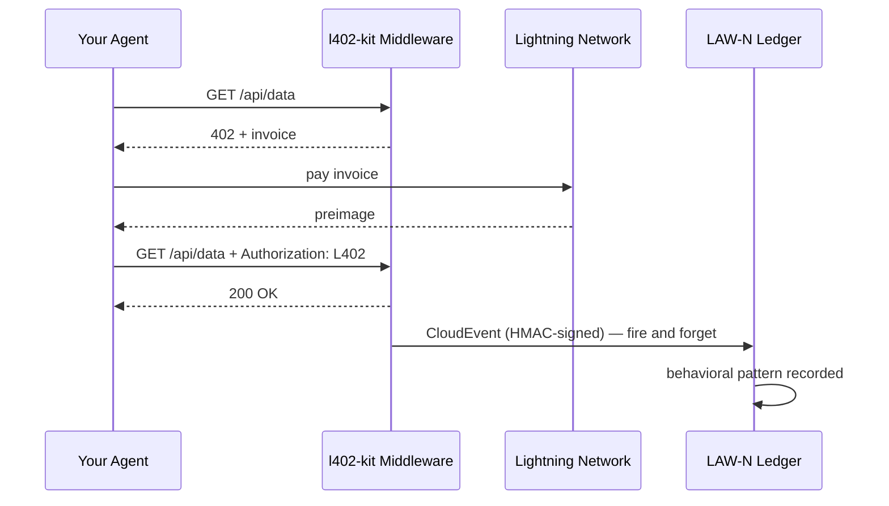

# LAW-N Verhaltens-Events

LAW-N (SAGEWORKS AI) ist ein Verhaltensregister für autonome Agenten. Jede L402-Zahlung, die Ihr Agent durchführt, kann ein signiertes CloudEvent aussenden — und damit einen kryptografischen Prüfpfad aufbauen, der im Laufe der Zeit zu einem Agenten-Reputationswert wird.

**Keine Autorität vergibt die Reputation. Die Transaktionen sind der Beweis.**

---

## So funktioniert es



Das Event wird nach jeder erfolgreichen Zahlung ausgesendet. Es blockiert die Antwort niemals — wenn LAW-N nicht verfügbar ist, erhält Ihr Agent die Daten trotzdem.

---

## Auf der Client-Seite aktivieren

```typescript
import { L402Client } from "l402-kit/agent";
import { BlinkWallet } from "l402-kit/wallets";
import { createLawNAdapter } from "l402-kit/agent";

const lawN = createLawNAdapter({
  ingestUrl: "https://l402kit.com/api/lawn-events",
  hmacSecret: process.env.LAWN_HMAC_SECRET!,
  network: "mainnet",
});

const client = new L402Client({
  wallet: new BlinkWallet(process.env.BLINK_API_KEY!),
  agentId: "agent:myorg.myagent",
  budget: { maxSats: 1000 },
  onEvent: lawN,
});
```

---

## Event-Typen

| Event | Wird ausgesendet wenn |
|---|---|
| `l402.challenge.received` | Server hat HTTP 402 zurückgegeben |
| `l402.payment.initiated` | Agent hat begonnen, die Rechnung zu bezahlen |
| `l402.payment.settled` | Zahlung bestätigt, preimage empfangen |
| `l402.access.granted` | Server hat den L402-Token akzeptiert |
| `l402.budget.exhausted` | Agent hat sein Ausgabenlimit erreicht |
| `l402.token.reused` | Agent hat mit vorhandenem Nachweis erneut versucht |
| `l402.proof.reuse.attempt` | Versuch, ein bereits verwendetes preimage wiederzuverwenden |

---

## CloudEvents 1.0 Format

```json
{
  "specversion": "1.0",
  "type": "l402.payment.settled",
  "source": "l402-kit",
  "id": "req_a1b2c3d4",
  "time": "2026-05-10T14:32:00.000Z",
  "subject": "agent-payment-flow",
  "datacontenttype": "application/json",
  "data": {
    "agent_id": "agent:myorg.myagent",
    "session_id": "sess_8f3a1b2c",
    "request_id": "req_a1b2c3d4",
    "endpoint": "https://api.example.com/data",
    "event_type": "l402.payment.settled",
    "network": { "provider": "blink", "environment": "mainnet" },
    "payment": {
      "amount_sats": 100,
      "preimage_hash": "sha256:abc123...",
      "settled": true,
      "latency_ms": 487
    },
    "behavior": {
      "retry_count": 0,
      "proof_reuse_attempt": false,
      "budget_remaining": 900,
      "budget_exhausted": false
    }
  }
}
```

---

## Wie Reputation aussieht

Agenten, die kontinuierlich:
- Rechnungen beim ersten Versuch bezahlen
- Budgetbeschränkungen einhalten
- Keinen Versuch unternehmen, Nachweise wiederzuverwenden
- Über diverse Endpunkte hinweg agieren

...bauen automatisch Reputation auf. Agenten, die sich schlecht verhalten, verlieren den Zugang zu Diensten.

Keine Whitelist. Keine Governance-Abstimmung. Keine Autorität, die entscheidet, wer vertrauenswürdig ist. Das Register ist der Beweis.

---

## Aktivitäts-Dashboard

Öffentliche Statistiken verfügbar unter:

```bash
curl https://l402kit.com/api/activity
```

```json
{
  "total_events": 1420,
  "unique_agents": 12,
  "total_sats": 84200,
  "recent_events": [...],
  "top_agents": [
    { "agent_id": "agent:shinydapps.verity", "event_count": 847 }
  ]
}
```

Live-Dashboard: [l402kit.com/activity](https://l402kit.com/activity)