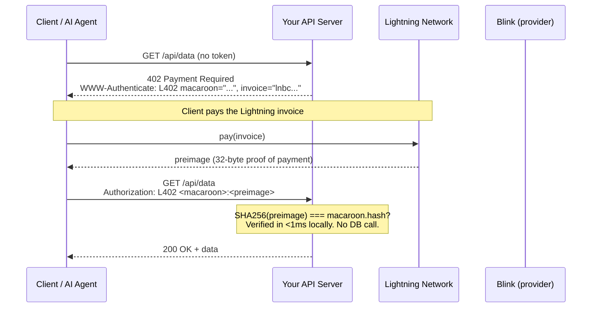
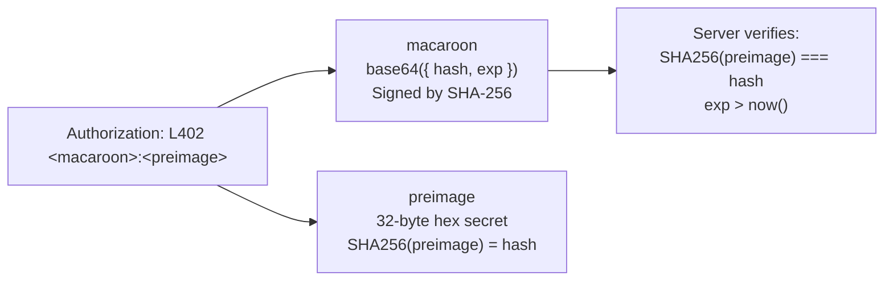
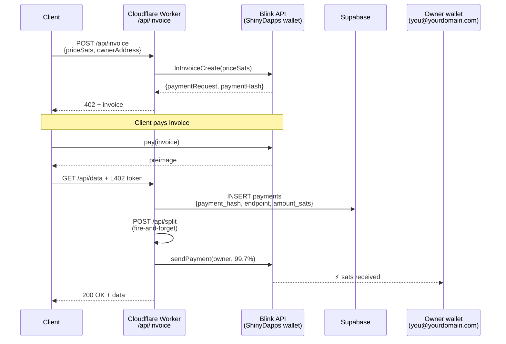
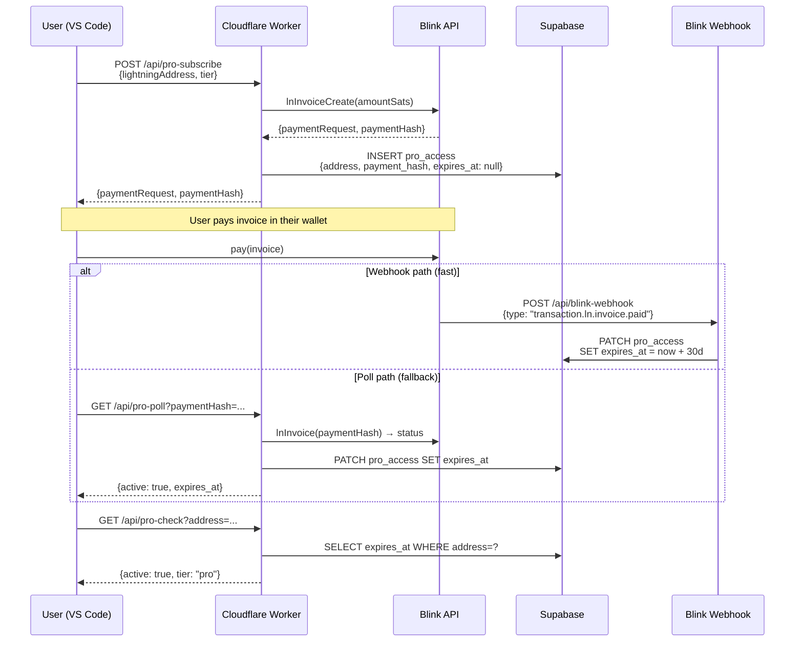
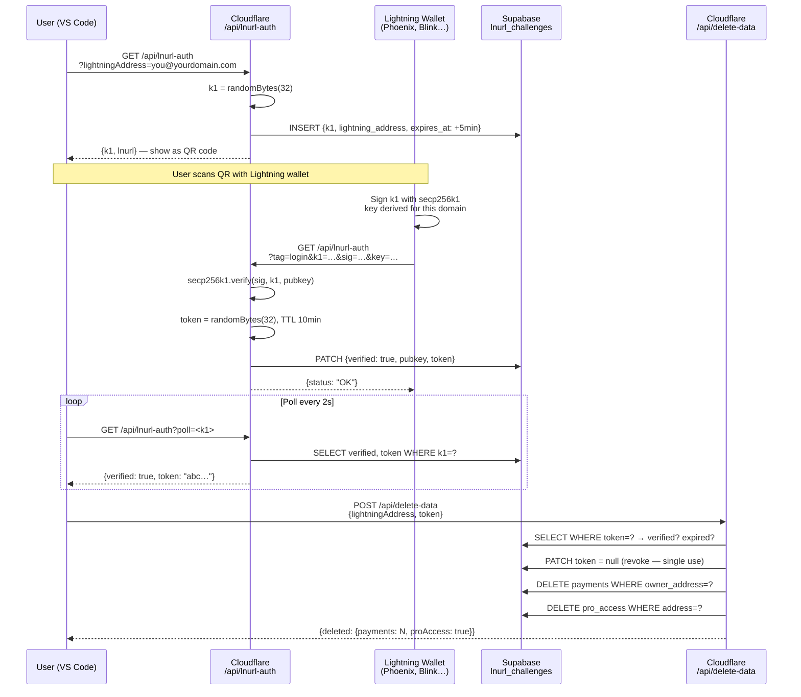
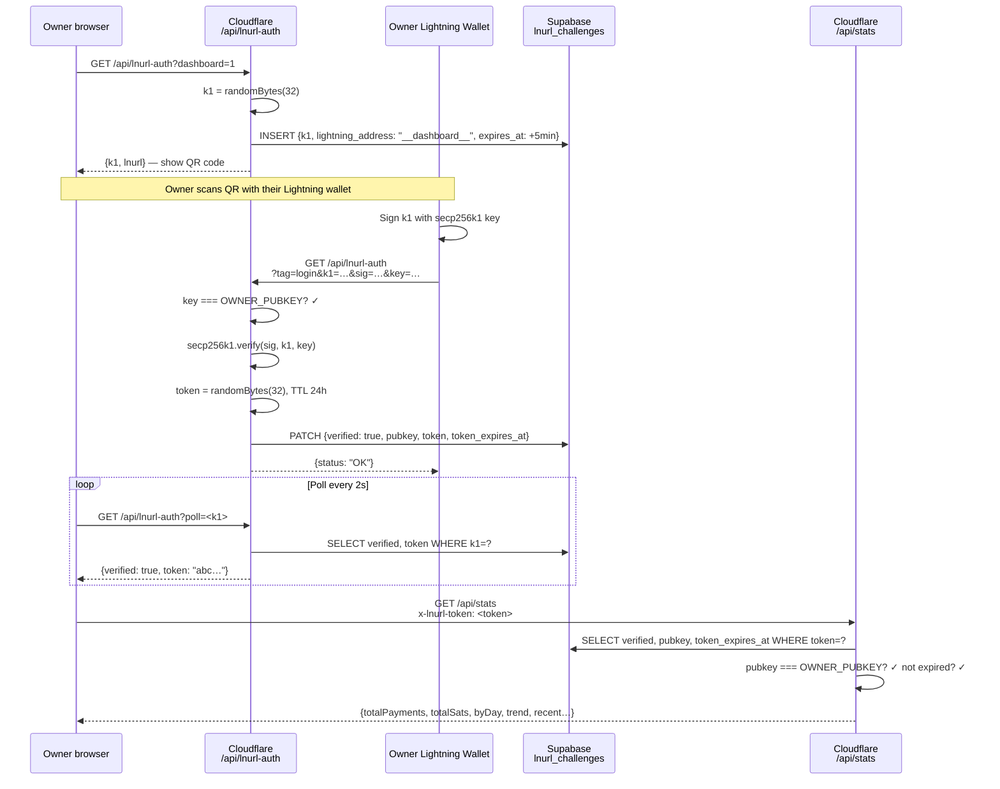
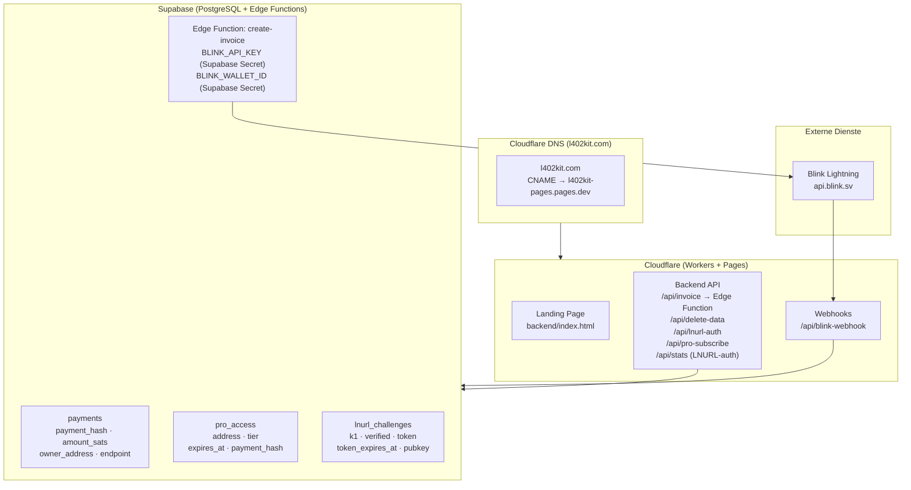
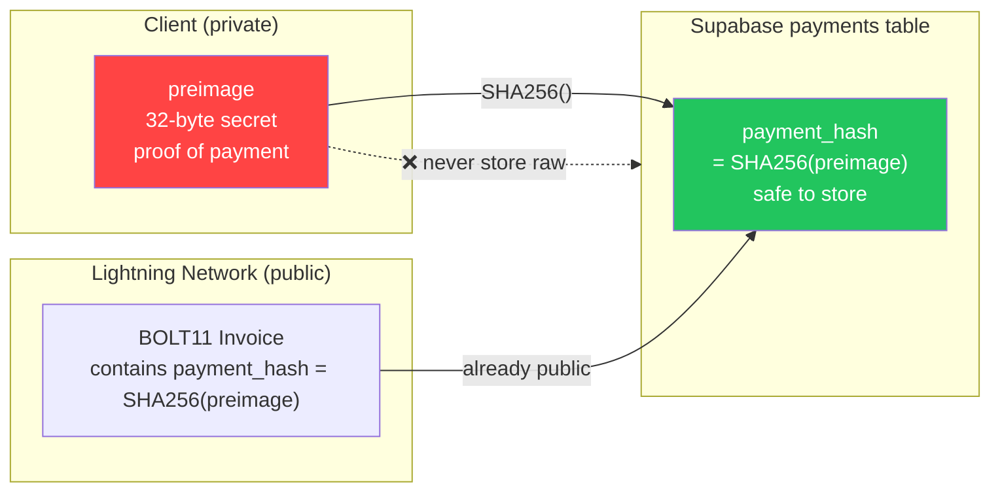

Diese Seite dokumentiert jeden wichtigen Ablauf in der l402-kit-Plattform als Sequenz- und Flussdiagramme. Jeder Abschnitt kombiniert eine visuelle Darstellung mit einer prägnanten Erklärung, was passiert und warum es so funktioniert. Beginnen Sie mit Ablauf 1 (Kern-L402), um die kryptografische Grundlage zu verstehen, und lesen Sie dann die für Ihre Integration relevanten Abläufe.

---

## 1. Kern-L402-Zahlungsablauf

Der grundlegende Anfragezyklus. Keine Konten, keine Passwörter — nur eine kryptografische Quittung.

Wenn ein Client zum ersten Mal einen geschützten Endpunkt aufruft, erhält er eine HTTP 402-Antwort mit zwei Elementen: einer BOLT11-Lightning-Rechnung und einem macaroon. Der Client bezahlt die Rechnung über das Lightning Network (typischerweise in unter einer Sekunde), erhält ein 32-Byte preimage als Nachweis und wiederholt die Anfrage mit `Authorization: L402 <macaroon>:<preimage>`. Der Server verifiziert das Token lokal mit `SHA256(preimage) === macaroon.hash` — kein Datenbankaufruf, kein Netzwerk-Round-Trip, Latenz unter einer Millisekunde. Nach der Verifizierung ist das Token bis zu seinem Ablauf gültig. Nachfolgende Anfragen verwenden denselben Header wieder.

**Wesentliche Eigenschaften:**
- Die Verifizierung erfolgt vollständig lokal — kein Netzwerkaufruf, kein Datenbankzugriff
- `preimage` = kryptografischer Zahlungsnachweis (Lightning-Quittung)
- `macaroon` = base64 JSON `{hash, exp}` signiert mit SHA-256

---

## 2. Token-Anatomie

Der `Authorization`-Header enthält zwei durch einen Doppelpunkt getrennte Komponenten. Der **macaroon** ist ein base64-kodiertes JSON-Objekt `{hash, exp}` — er teilt dem Server mit, welchen Zahlungs-Hash er erwarten soll und wann das Token abläuft. Das **preimage** ist das 32-Byte-Geheimnis, das das Lightning Network an den Zahler zurückgegeben hat. Zusammen bilden sie eine unfälschbare, in sich abgeschlossene Berechtigung, die jeder Server offline verifizieren kann.

---

## 3. Managed-Modus — Gebührenteilungsablauf

Wenn Sie `ManagedProvider` verwenden, erstellt l402kit.com die Rechnung, empfängt die Zahlung und leitet automatisch 99,7 % an Ihre Lightning-Adresse weiter. Die Plattformgebühr von 0,3 % deckt Lightning-Routing und API-Infrastruktur ab. Ihr Wallet berührt den Cloudflare Worker nie — die Aufteilung ist eine serverseitige Lightning-Zahlung, die nach der Verifizierung der Client-Anfrage ausgelöst wird. Dabei wird Ihre Lightning-Adresse verwendet, um spontan eine neue BOLT11-Rechnung zu erstellen.

---

## 4. Pro-Abonnement-Ablauf

Pro-Abonnements folgen einem ähnlichen L402-Muster, fügen jedoch persistenten Zustand hinzu. Der Client bezahlt eine einmalige Rechnung und erhält einen 30-tägigen Abonnementdatensatz in Supabase. Die Zahlungsbestätigung erfolgt entweder über einen Blink-Webhook (schneller Pfad, ~2 Sekunden) oder über Polling (Fallback für Wallets, die keine Webhooks auslösen). Nachfolgende `/api/pro-check`-Aufrufe prüfen den `expires_at`-Zeitstempel ohne erneute Zahlung.

---

## 5. LNURL-auth — Wallet-Eigentümerschaftsnachweis (Daten löschen)

Beweist, dass Sie ein Lightning-Wallet besitzen, ohne ein Passwort. Erforderlich vor dem Löschen von Kontodaten.

---

## 6. Dashboard-LNURL-auth-Anmeldeablauf

Nur-Eigentümer-Dashboard-Authentifizierung — DASHBOARD_SECRET wird in Cloudflare Workers-Secrets gespeichert.

---

## 7. Infrastrukturübersicht

---

## 8. SHA-256-Preimage-Sicherheit

Warum wir `SHA256(preimage)` anstelle des rohen preimage speichern:

**Warum es sicher ist:** Der `payment_hash` ist bereits in jeder BOLT11-Rechnung eingebettet — er ist von Natur aus öffentlich. Nur das `preimage` ist geheim. Das Speichern des Hashes bietet Ihnen Schutz vor Wiederholungsangriffen ohne zusätzliche Exposition.