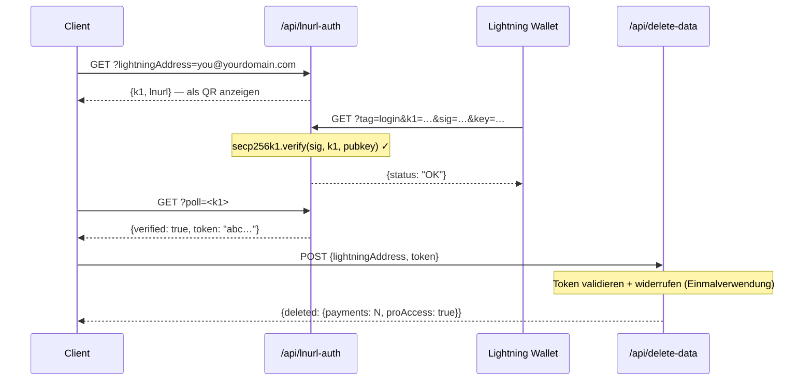

## Token-Sicherheitsmodell

L402-Tokens bestehen aus zwei Teilen, die durch `:` verbunden sind:

```
<macaroon>:<preimage>
```

- **Macaroon** — base64-kodiertes JSON mit `{hash, exp}`. Signiert mit SHA-256. Kann ohne Kenntnis des preimage nicht gefälscht werden.
- **Preimage** — das 32-Byte-Geheimnis, das nach dem Hashing mit SHA-256 mit dem im macaroon eingebetteten Hash übereinstimmen muss.

**Die Verifizierung erfolgt vollständig lokal** — kein Datenbankaufruf, kein Netzwerkaufruf. Das SDK prüft die Hash-Beziehung kryptografisch in Mikrosekunden.

---

## Replay-Schutz

l402-kit enthält **integrierten Replay-Schutz**. Jeder preimage kann nur einmal verwendet werden:

```typescript
// ✅ Integriert — standardmäßig aktiviert
app.get("/api", l402({ priceSats: 10, lightning: blink }), handler);
```

Bei der ersten Verwendung eines Tokens wird der preimage als verbraucht markiert. Jede nachfolgende Anfrage mit demselben preimage gibt `401 Token already used` zurück.

**Standardspeicher**: In-Memory-`Set`. Das bedeutet:
- Neustarts leeren den Replay-Speicher (Tokens werden nach Neustarts wiederverwendbar)
- Mehrere Instanzen teilen keinen gemeinsamen Zustand

**Für den Produktionsbetrieb** mit mehreren Instanzen sollten Sie einen persistenten Replay-Speicher implementieren:

```typescript
import { checkAndMarkPreimage } from "l402-kit";

// Beispiel: Redis-basierter Replay-Speicher
async function redisCheckAndMark(preimage: string): Promise<boolean> {
  const key = `l402:used:${preimage}`;
  const set = await redis.set(key, "1", "NX", "EX", 86400); // 24h TTL
  return set === "OK"; // true = erste Verwendung, false = Replay
}
```

---

## Token-Ablauf

Tokens enthalten ein `exp`-Feld (Unix-Zeitstempel in ms). Das SDK lehnt abgelaufene Tokens automatisch ab.

Standard-TTL: **1 Stunde** (festgelegt vom Lightning-Provider beim Erstellen der Rechnung).

```typescript
// Tokens sind 1 Stunde nach der Rechnungserstellung gültig.
// Nach Ablauf muss der Client erneut bezahlen, um ein neues Token zu erhalten.
```

---

## HTTPS ist erforderlich

**Verwenden Sie L402 niemals über einfaches HTTP in der Produktion.** Der macaroon und der preimage werden im `Authorization`-Header übertragen. Über HTTP sind sie für Netzwerkangreifer sichtbar.

```nginx
# nginx — HTTP zu HTTPS umleiten
server {
    listen 80;
    return 301 https://$host$request_uri;
}
```

---

## Ratenbegrenzung

L402 verifiziert Tokens kryptografisch, ohne eine Datenbank abzufragen — das ist kostengünstig. Die Erstellung von Lightning-Rechnungen (die 402-Antwort) ruft jedoch die API Ihres Lightning-Providers auf.

Schützen Sie die Rechnungserstellung mit einem Rate-Limiter, um DoS zu verhindern:

```typescript
import rateLimit from "express-rate-limit";

const invoiceLimiter = rateLimit({
  windowMs: 60_000,
  max: 20, // 20 unbezahlte Anfragen pro Minute pro IP
  skip: (req) => req.headers.authorization?.startsWith("L402 ") ?? false,
});

app.use("/api", invoiceLimiter);
app.get("/api/data", l402({ priceSats: 10, lightning: blink }), handler);
```

---

## Verwaltung von Geheimnissen

Kodieren Sie niemals API-Schlüssel fest. Verwenden Sie Umgebungsvariablen:

```typescript
// ✅ Korrekt
const blink = new BlinkProvider(
  process.env.BLINK_API_KEY!,
  process.env.BLINK_WALLET_ID!,
);

// ❌ Niemals so vorgehen
const blink = new BlinkProvider("blink_abc123...", "wallet-id-here");
```

Verwenden Sie in der Produktion einen Secrets-Manager: AWS Secrets Manager, Doppler, Vault oder `.env` + dotenv (niemals in Git committen).

---

## Authentifizierung von Admin-Endpunkten

Wenn Sie Admin- oder Statistik-Endpunkte bereitstellen, **akzeptieren Sie niemals Geheimnisse über URL-Abfrageparameter**. URLs werden von Reverse-Proxys, CDNs und Cloud-Anbietern vollständig protokolliert — einschließlich der Abfragezeichenfolge.

```typescript
// ❌ Niemals — Geheimnis in Cloudflare Workers-Protokollen sichtbar
GET /api/stats?secret=my-secret

// ✅ Korrekt — Header wird standardmäßig nicht protokolliert
GET /api/stats
x-dashboard-secret: my-secret
```

```typescript
// Nur Header in Ihrem Handler erzwingen
const token = req.headers["x-dashboard-secret"];
if (!SECRET || token !== SECRET) return res.status(401).json({ error: "Unauthorized" });
```

---

## Supabase-Schlüsselhygiene

Verwenden Sie `SUPABASE_SERVICE_KEY` (nur serverseitig) und `SUPABASE_ANON_KEY` (sicher für Clients freigegeben) korrekt:

| Schlüssel | Verwendung | Umgeht RLS? |
|---|---|---|
| `anon` | VS Code-Erweiterung, Browser-Clients | Nein |
| `service_role` | Serverseitige API-Funktionen | Ja |

Serverseitige Cloudflare Workers, die sensible Tabellen lesen (z. B. `pro_access`), müssen den Service-Schlüssel verwenden — niemals den anon-Schlüssel. RLS-Richtlinien für sensible Tabellen sollten keinen anon-Zugriff gewähren.

```typescript
// ✅ Serverseitiger Endpunkt
const SUPABASE_KEY = process.env.SUPABASE_SERVICE_KEY ?? process.env.SUPABASE_ANON_KEY ?? "";
```

---

## Content Security Policy

Wenn Sie ein Frontend zusammen mit Ihrer API bereitstellen, stellen Sie sicher, dass Ihre CSP den L402-Ablauf nicht blockiert:

```http
Content-Security-Policy: connect-src 'self' https://api.blink.sv
```

---

## Datenverwaltung — Benutzerdatenlöschung

Benutzer können ihre gesamte Zahlungshistorie und ihr Pro-Abonnement jederzeit über die VS Code-Erweiterung löschen (**Einstellungen → Gefahrenbereich**). Die Erweiterung ruft auf:

```http
POST /api/delete-data
Content-Type: application/json

{ "lightningAddress": "user@blink.sv" }
```

Antwort:

```json
{ "deleted": { "payments": 42, "proAccess": true } }
```

Dieser Endpunkt verwendet den Supabase **Service-Role-Schlüssel** serverseitig, um RLS zu umgehen und dauerhaft zu löschen:

- Alle Zeilen in `payments`, bei denen `owner_address = ?`
- Alle Zeilen in `pro_access`, bei denen `address = ?`

<Note>
Die Erweiterung erfordert, dass der Benutzer seine Lightning-Adresse wortwörtlich eingibt, bevor die Schaltfläche zum Löschen aktiviert wird — eine GitHub-artige Bestätigung für destruktive Aktionen.
</Note>

Wenn Sie ein eigenes Dashboard auf Basis von l402-kit erstellen, stellen Sie einen ähnlichen Endpunkt für Ihre Benutzer bereit. Erlauben Sie niemals das Löschen über den anon-Schlüssel — leiten Sie stets über eine serverseitige Funktion mit dem Service-Schlüssel weiter.

---

## Datenschutz & Datensparsamkeit

l402-kit ist darauf ausgelegt, die minimal notwendigen Daten für den Betrieb zu erfassen. Nachfolgend finden Sie, was gespeichert wird, warum und wie Sie jedes Feld absichern können.

### Was gespeichert wird

| Tabelle | Feld | Warum | Sensitivität |
|---|---|---|---|
| `payments` | `preimage` | Replay-Schutz + Zahlungsnachweis | ⚠️ Mittel — stattdessen hashen (siehe unten) |
| `payments` | `owner_address` | Umsatz einer Lightning-Adresse zuordnen | Niedrig — Lightning-Adressen sind öffentlich |
| `payments` | `amount_sats` | Dashboard-Statistiken | Niedrig |
| `payments` | `endpoint` | Endpunkt-spezifische Analysen | Niedrig–Mittel |
| `pro_access` | `address` | Pro-Abonnement verifizieren | Niedrig — öffentlich |
| `waitlist` | `email` | Willkommens- und Release-E-Mails versenden | ⚠️ Hoch — echte personenbezogene Daten, verschlüsseln oder weglassen |
| `waitlist` | `lightning_address` | Optionales Identitätssignal | Niedrig |

### Preimages hashen statt roh speichern

Der preimage ist das 32-Byte-Geheimnis, das beweist, dass eine Lightning-Zahlung erfolgt ist. Wird er roh gespeichert, werden bei einem Datenbankverstoß alle Nachweise offengelegt. Speichern Sie stattdessen den SHA-256-Hash — er ist bereits öffentlich (im BOLT11-Invoice eingebettet) und für den Replay-Schutz ausreichend:

```typescript
import { createHash } from 'crypto';

// Anstatt preimage direkt zu speichern:
const paymentHash = createHash('sha256').update(Buffer.from(preimage, 'hex')).digest('hex');

await supabase.from('payments').insert({
  payment_hash: paymentHash,   // ✅ sicher zu speichern
  // preimage: preimage        // ❌ vermeiden
  owner_address,
  amount_sats,
  endpoint,
});

// Replay-Prüfung: eingehenden preimage hashen, Hash nachschlagen
const incomingHash = createHash('sha256').update(Buffer.from(incoming, 'hex')).digest('hex');
const { data } = await supabase.from('payments').select('id').eq('payment_hash', incomingHash);
const alreadyUsed = data && data.length > 0;
```

### Wartelisten-E-Mails schützen

E-Mail-Adressen sind die einzigen echten personenbezogenen Daten im System. Optionen in aufsteigender Schutzstärke:

```typescript
// Option A — vor dem Einfügen verschlüsseln (AES-256-GCM, Schlüssel außerhalb von Supabase gespeichert)
import { createCipheriv, randomBytes } from 'crypto';
const key = Buffer.from(process.env.EMAIL_ENCRYPTION_KEY!, 'hex'); // 32 Bytes
const iv  = randomBytes(12);
const cipher = createCipheriv('aes-256-gcm', key, iv);
const encrypted = Buffer.concat([cipher.update(email), cipher.final()]);
const tag = cipher.getAuthTag();
const stored = iv.toString('hex') + ':' + tag.toString('hex') + ':' + encrypted.toString('hex');

// Option B — nur SHA-256-Hash speichern (irreversibel — keine weiteren E-Mails möglich)
const emailHash = createHash('sha256').update(email.toLowerCase()).digest('hex');

// Option C — E-Mail gar nicht speichern (Willkommens-E-Mail senden und verwerfen)
```

### Wallet-Eigentümerschaft vor dem Löschen von Daten nachweisen (LNURL-auth)

Der `/api/delete-data`-Endpunkt sollte nur Anfragen vom tatsächlichen Eigentümer der Lightning-Adresse akzeptieren. Verwenden Sie **LNURL-auth**, um die Eigentümerschaft kryptografisch nachzuweisen — der Benutzer signiert eine Server-Challenge mit dem privaten Schlüssel seines Lightning Wallets, ohne Passwort oder Konto:



Sehen Sie sich das [vollständige Ablaufdiagramm](/guides/flows#5-lnurl-auth--wallet-ownership-proof-delete-data) für die vollständige Sequenz mit dem Supabase-Zustand an.

Dadurch wird sichergestellt, dass niemand die Datensätze eines anderen Benutzers löschen kann, selbst wenn er die Lightning-Adresse kennt.

---

## Checkliste

<AccordionGroup>
  <Accordion title="Vor dem Go-Live">
    - [ ] HTTPS auf allen Endpunkten erzwungen
    - [ ] API-Schlüssel in Umgebungsvariablen, nicht im Quellcode
    - [ ] Admin-/Statistik-Endpunkte verwenden Header-Auth, keine `?secret=`-URL-Parameter
    - [ ] Supabase `service_role`-Schlüssel serverseitig verwendet; `anon`-Schlüssel nur auf Clients
    - [ ] Sensible Supabase-Tabellen haben keine `anon`-SELECT-Richtlinie
    - [ ] Datenlöschungs-Endpunkt (`/api/delete-data`) verwendet Service-Schlüssel, niemals anon
    - [ ] Rate-Limiter für die Rechnungserstellung
    - [ ] Replay-Schutz getestet (preimage wiederverwenden versuchen → 401 erwarten)
    - [ ] Token-Ablauf getestet (kurze TTL in der Entwicklung setzen, 401 nach Ablauf bestätigen)
    - [ ] Preimages als SHA-256-Hashes gespeichert, nicht als rohe Geheimnisse
    - [ ] Wartelisten-E-Mails im Ruhezustand verschlüsselt oder nach dem Versenden verworfen
    - [ ] `/api/delete-data` erfordert LNURL-auth-Nachweis der Wallet-Eigentümerschaft
  </Accordion>
  <Accordion title="Für APIs mit hohem Datenverkehr">
    - [ ] Redis-basierter Replay-Speicher (instanzübergreifend geteilt)
    - [ ] Überwachung der 402-Antwortrate (Anstieg = möglicher DoS)
    - [ ] Lightning-Provider-Failover (BlinkProvider → LNbitsProvider-Fallback)
    - [ ] Statusseiten-Überwachung für Ihren Lightning-Provider (z. B. status.blink.sv)
  </Accordion>
</AccordionGroup>