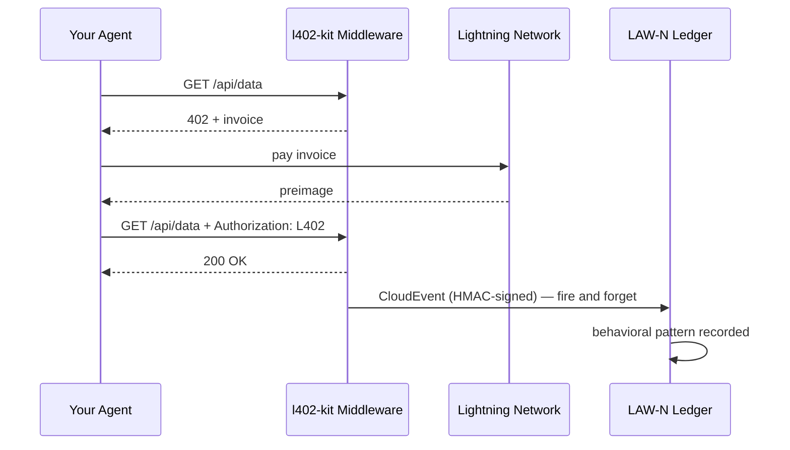

# Eventos de Comportamiento LAW-N

LAW-N (SAGEWORKS AI) es un libro de registro de comportamiento para agentes autónomos. Cada pago L402 que realiza tu agente puede emitir un CloudEvent firmado — construyendo un rastro de auditoría criptográfico que se convierte en una puntuación de reputación del agente con el tiempo.

**Ninguna autoridad otorga la reputación. Las transacciones son la prueba.**

---

## Cómo funciona



El evento se emite después de cada pago exitoso. Nunca bloquea la respuesta — si LAW-N no está disponible, tu agente igualmente obtiene los datos.

---

## Habilitar en el lado del cliente

```typescript
import { L402Client } from "l402-kit/agent";
import { BlinkWallet } from "l402-kit/wallets";
import { createLawNAdapter } from "l402-kit/agent";

const lawN = createLawNAdapter({
  ingestUrl: "https://l402kit.com/api/lawn-events",
  hmacSecret: process.env.LAWN_HMAC_SECRET!,
  network: "mainnet",
});

const client = new L402Client({
  wallet: new BlinkWallet(process.env.BLINK_API_KEY!),
  agentId: "agent:myorg.myagent",
  budget: { maxSats: 1000 },
  onEvent: lawN,
});
```

---

## Tipos de eventos

| Evento | Emitido cuando |
|---|---|
| `l402.challenge.received` | El servidor devolvió HTTP 402 |
| `l402.payment.initiated` | El agente comenzó a pagar la factura |
| `l402.payment.settled` | Pago confirmado, preimage recibido |
| `l402.access.granted` | El servidor aceptó el token L402 |
| `l402.budget.exhausted` | El agente alcanzó su límite de gasto |
| `l402.token.reused` | El agente reintentó con una prueba existente |
| `l402.proof.reuse.attempt` | Se intentó reutilizar un preimage gastado |

---

## Formato CloudEvents 1.0

```json
{
  "specversion": "1.0",
  "type": "l402.payment.settled",
  "source": "l402-kit",
  "id": "req_a1b2c3d4",
  "time": "2026-05-10T14:32:00.000Z",
  "subject": "agent-payment-flow",
  "datacontenttype": "application/json",
  "data": {
    "agent_id": "agent:myorg.myagent",
    "session_id": "sess_8f3a1b2c",
    "request_id": "req_a1b2c3d4",
    "endpoint": "https://api.example.com/data",
    "event_type": "l402.payment.settled",
    "network": { "provider": "blink", "environment": "mainnet" },
    "payment": {
      "amount_sats": 100,
      "preimage_hash": "sha256:abc123...",
      "settled": true,
      "latency_ms": 487
    },
    "behavior": {
      "retry_count": 0,
      "proof_reuse_attempt": false,
      "budget_remaining": 900,
      "budget_exhausted": false
    }
  }
}
```

---

## Cómo se ve la reputación

Los agentes que de forma consistente:
- Pagan facturas en el primer intento
- Respetan las restricciones de presupuesto
- No intentan reutilizar pruebas
- Operan en endpoints diversos

...construyen reputación automáticamente. Los agentes que se comportan mal dejan de poder acceder a los servicios.

Sin lista blanca. Sin votación de gobernanza. Sin autoridad que decida quién es confiable. El libro de registro es la prueba.

---

## Panel de actividad

Estadísticas públicas disponibles en:

```bash
curl https://l402kit.com/api/activity
```

```json
{
  "total_events": 1420,
  "unique_agents": 12,
  "total_sats": 84200,
  "recent_events": [...],
  "top_agents": [
    { "agent_id": "agent:shinydapps.verity", "event_count": 847 }
  ]
}
```

Panel en vivo: [l402kit.com/activity](https://l402kit.com/activity)