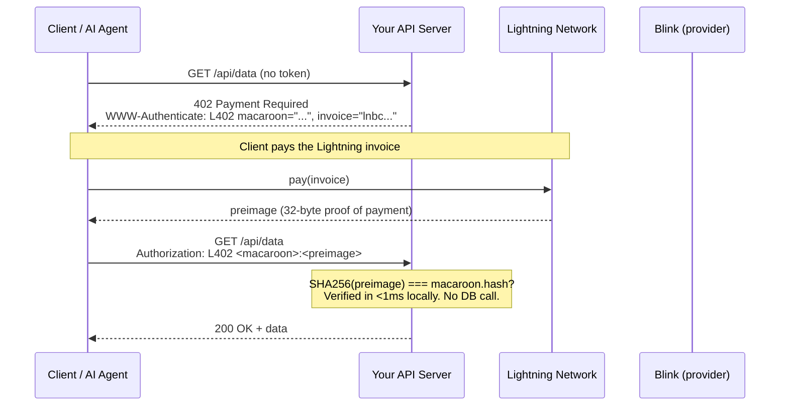
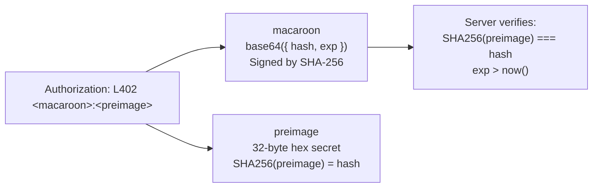
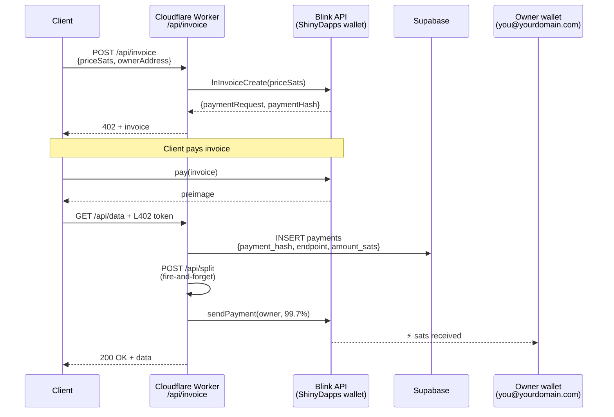
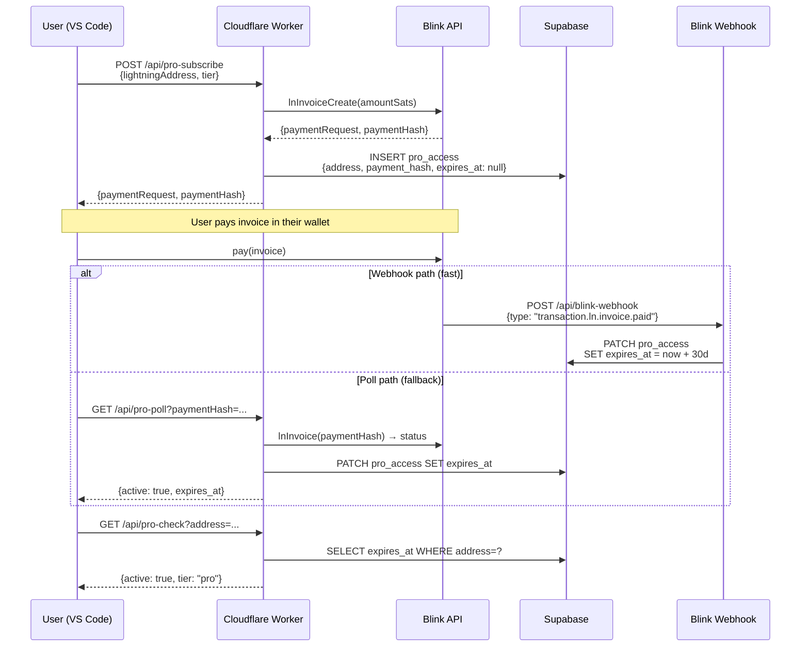
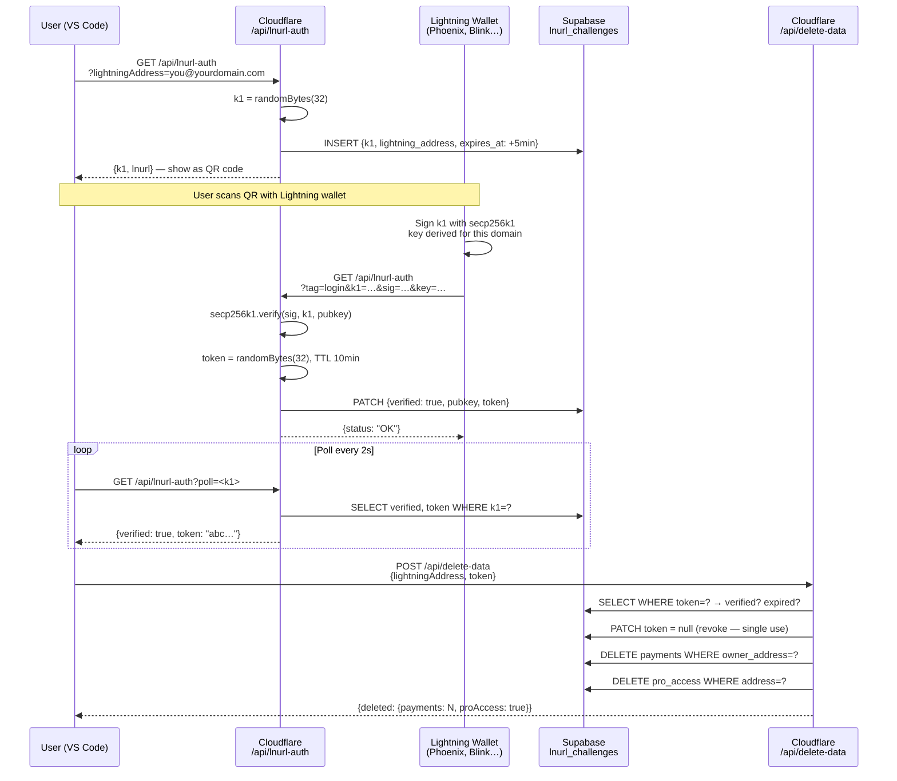
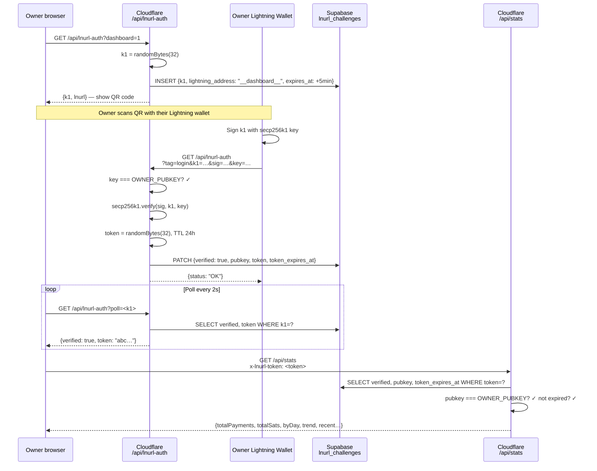
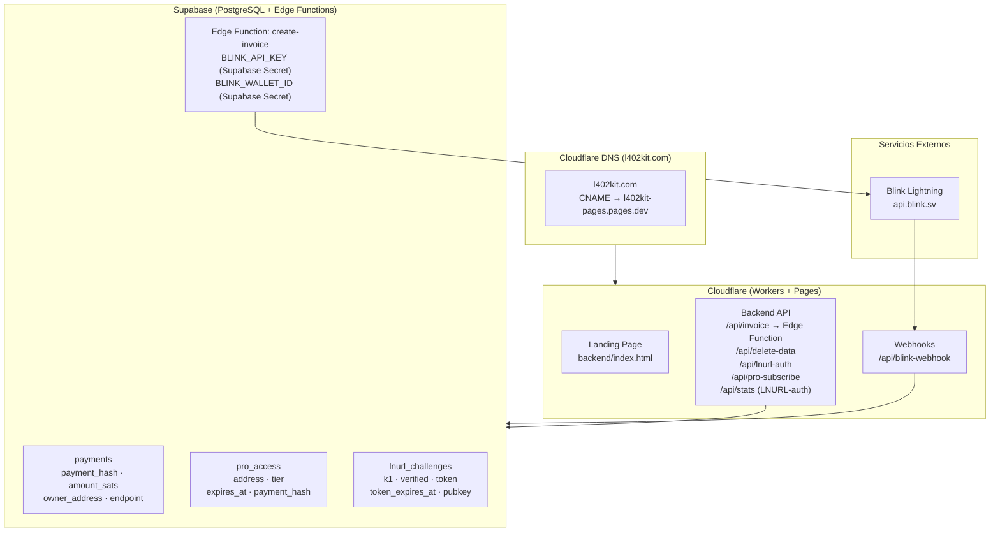
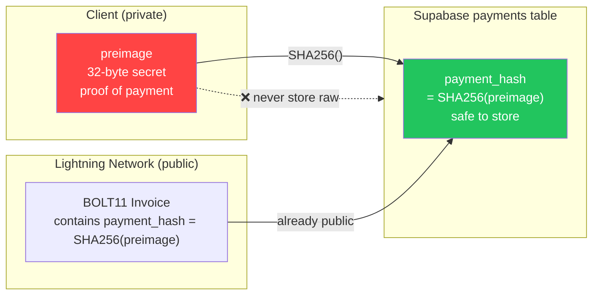

Esta página documenta cada flujo principal de la plataforma l402-kit como diagramas de secuencia y diagramas de flujo. Cada sección combina un visual con una explicación concisa de lo que sucede y por qué funciona de esa manera. Comienza con el Flujo 1 (núcleo L402) para entender la base criptográfica, luego lee los flujos que sean relevantes para tu integración.

---

## 1. Flujo de Pago L402 Principal

El ciclo de solicitud fundamental. Sin cuentas, sin contraseñas — solo un recibo criptográfico.

Cuando un cliente accede por primera vez a un endpoint protegido, recibe una respuesta HTTP 402 que contiene dos cosas: una factura BOLT11 de Lightning y un macaroon. El cliente paga la factura a través de Lightning Network (típicamente en menos de un segundo), recibe un preimage de 32 bytes como prueba, y reintenta la solicitud con `Authorization: L402 <macaroon>:<preimage>`. El servidor verifica el token localmente usando `SHA256(preimage) === macaroon.hash` — sin llamada a base de datos, sin ida y vuelta de red, latencia de submilisegundos. Una vez verificado, el token es válido hasta su vencimiento. Las solicitudes posteriores reutilizan el mismo encabezado.

**Propiedades clave:**
- La verificación es completamente local — sin llamada de red, sin consulta a base de datos
- `preimage` = prueba criptográfica de pago (recibo de Lightning)
- `macaroon` = JSON base64 `{hash, exp}` firmado con SHA-256

---

## 2. Anatomía del Token

El encabezado `Authorization` lleva dos componentes separados por dos puntos. El **macaroon** es un objeto JSON codificado en base64 `{hash, exp}` — le indica al servidor qué hash de pago esperar y cuándo vence el token. El **preimage** es el secreto de 32 bytes que Lightning Network devolvió al pagador. Juntos forman una credencial infalsificable y autónoma que cualquier servidor puede verificar sin conexión.

---

## 3. Modo Administrado — Flujo de División de Comisiones

Cuando usas `ManagedProvider`, l402kit.com crea la factura, recibe el pago y reenvía el 99.7% a tu Lightning Address automáticamente. La comisión de plataforma del 0.3% cubre el enrutamiento de Lightning y la infraestructura de la API. Tu billetera nunca interactúa con el Cloudflare Worker — la división es un pago Lightning del lado del servidor que se ejecuta después de que la solicitud del cliente es verificada, usando tu Lightning Address para generar una nueva factura BOLT11 al momento.

---

## 4. Flujo de Suscripción Pro

Las suscripciones Pro siguen un patrón L402 similar pero añaden estado persistente. El cliente paga una factura única y recibe un registro de suscripción de 30 días en Supabase. La confirmación de pago llega ya sea mediante webhook de Blink (ruta rápida, ~2 segundos) o mediante sondeo (alternativa para billeteras que no activan webhooks). Las llamadas posteriores a `/api/pro-check` verifican el timestamp `expires_at` sin necesidad de otro pago.

---

## 5. LNURL-auth — Prueba de Propiedad de Billetera (Eliminar Datos)

Demuestra que posees una billetera Lightning sin contraseña. Requerido antes de eliminar datos de la cuenta.

---

## 6. Flujo de Inicio de Sesión LNURL-auth del Panel de Control

Autenticación del panel de control exclusiva para el propietario — DASHBOARD_SECRET almacenado en los secretos de Cloudflare Workers.

---

## 7. Descripción General de la Infraestructura

---

## 8. Seguridad del Preimage con SHA-256

Por qué almacenamos `SHA256(preimage)` en lugar del preimage sin procesar:

**Por qué es seguro:** El `payment_hash` ya está incorporado en cada factura BOLT11 — es público por diseño. Solo el `preimage` es secreto. Almacenar el hash te proporciona protección contra repetición sin exposición adicional alguna.