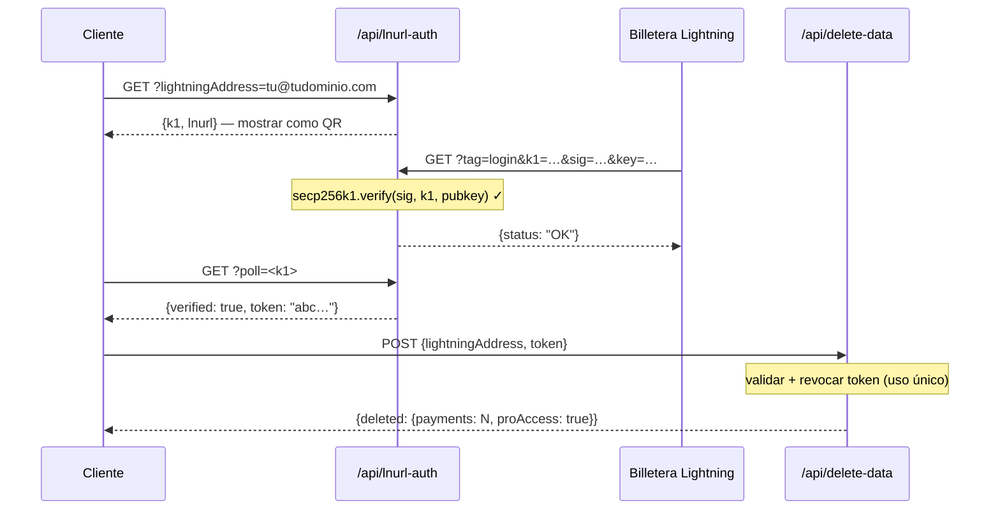

## Modelo de seguridad de tokens

Los tokens L402 consisten en dos partes unidas por `:`:

```
<macaroon>:<preimage>
```

- **Macaroon** — JSON codificado en base64 que contiene `{hash, exp}`. Firmado con SHA-256. No puede ser falsificado sin conocer el preimage.
- **Preimage** — el secreto de 32 bytes que, al ser hasheado con SHA-256, debe coincidir con el hash embebido en el macaroon.

**La verificación es completamente local** — sin consultas a base de datos, sin llamadas de red. El SDK verifica la relación del hash criptográficamente en microsegundos.

---

## Protección contra repetición

l402-kit incluye **protección contra repetición integrada**. Cada preimage solo puede usarse una vez:

```typescript
// ✅ Integrado — habilitado por defecto
app.get("/api", l402({ priceSats: 10, lightning: blink }), handler);
```

El primer uso de un token marca el preimage como utilizado. Cualquier solicitud posterior con el mismo preimage devuelve `401 Token already used`.

**Almacén por defecto**: `Set` en memoria. Esto significa:
- Los reinicios limpian el almacén de repetición (los tokens se vuelven reutilizables entre reinicios)
- Múltiples instancias no comparten estado

**Para producción** con múltiples instancias, implementa un almacén de repetición persistente:

```typescript
import { checkAndMarkPreimage } from "l402-kit";

// Ejemplo: almacén de repetición respaldado por Redis
async function redisCheckAndMark(preimage: string): Promise<boolean> {
  const key = `l402:used:${preimage}`;
  const set = await redis.set(key, "1", "NX", "EX", 86400); // TTL de 24h
  return set === "OK"; // true = primer uso, false = repetición
}
```

---

## Expiración de tokens

Los tokens llevan un campo `exp` (marca de tiempo Unix en ms). El SDK rechaza automáticamente los tokens expirados.

TTL por defecto: **1 hora** (establecido por el proveedor Lightning al crear la factura).

```typescript
// Los tokens son válidos por 1 hora después de la creación de la factura.
// Tras la expiración, el cliente debe pagar nuevamente para obtener un nuevo token.
```

---

## HTTPS es obligatorio

**Nunca uses L402 sobre HTTP plano en producción.** El macaroon y el preimage se transmiten en el encabezado `Authorization`. Sobre HTTP, quedan expuestos a atacantes de red.

```nginx
# nginx — redirigir HTTP a HTTPS
server {
    listen 80;
    return 301 https://$host$request_uri;
}
```

---

## Limitación de velocidad

L402 verifica los tokens criptográficamente, sin consultar una base de datos — por lo que es económico. Pero la creación de facturas Lightning (la respuesta 402) llama a la API de tu proveedor Lightning.

Protege la creación de facturas con un limitador de velocidad para prevenir DoS:

```typescript
import rateLimit from "express-rate-limit";

const invoiceLimiter = rateLimit({
  windowMs: 60_000,
  max: 20, // 20 solicitudes no pagadas por minuto por IP
  skip: (req) => req.headers.authorization?.startsWith("L402 ") ?? false,
});

app.use("/api", invoiceLimiter);
app.get("/api/data", l402({ priceSats: 10, lightning: blink }), handler);
```

---

## Gestión de secretos

Nunca escribas claves API directamente en el código. Usa variables de entorno:

```typescript
// ✅ Correcto
const blink = new BlinkProvider(
  process.env.BLINK_API_KEY!,
  process.env.BLINK_WALLET_ID!,
);

// ❌ Nunca hagas esto
const blink = new BlinkProvider("blink_abc123...", "wallet-id-here");
```

Usa un gestor de secretos en producción: AWS Secrets Manager, Doppler, Vault, o `.env` + dotenv (nunca confirmado en git).

---

## Autenticación de endpoints de administración

Si expones endpoints de administración o estadísticas, **nunca aceptes secretos mediante parámetros de consulta en la URL**. Las URLs son registradas en su totalidad por proxies inversos, CDNs y proveedores de nube — incluyendo la cadena de consulta.

```typescript
// ❌ Nunca — secreto visible en los registros de Cloudflare Workers
GET /api/stats?secret=my-secret

// ✅ Correcto — el encabezado no se registra por defecto
GET /api/stats
x-dashboard-secret: my-secret
```

```typescript
// Forzar solo encabezados en tu manejador
const token = req.headers["x-dashboard-secret"];
if (!SECRET || token !== SECRET) return res.status(401).json({ error: "Unauthorized" });
```

---

## Higiene de claves de Supabase

Usa `SUPABASE_SERVICE_KEY` (solo del lado del servidor) frente a `SUPABASE_ANON_KEY` (seguro para exponer a clientes) correctamente:

| Clave | Uso | ¿Omite RLS? |
|---|---|---|
| `anon` | Extensión de VS Code, clientes de navegador | No |
| `service_role` | Funciones API del lado del servidor | Sí |

Los Cloudflare Workers del lado del servidor que leen tablas sensibles (p. ej. `pro_access`) deben usar la clave de servicio — nunca la clave anon. Las políticas RLS en tablas sensibles no deben otorgar acceso anon.

```typescript
// ✅ Endpoint del lado del servidor
const SUPABASE_KEY = process.env.SUPABASE_SERVICE_KEY ?? process.env.SUPABASE_ANON_KEY ?? "";
```

---

## Política de Seguridad de Contenido

Si sirves un frontend junto a tu API, asegúrate de que tu CSP no bloquee el flujo L402:

```http
Content-Security-Policy: connect-src 'self' https://api.blink.sv
```

---

## Gestión de datos — eliminación de datos de usuario

Los usuarios pueden eliminar todo su historial de pagos y suscripción Pro desde la extensión de VS Code en cualquier momento (**Ajustes → Zona de Peligro**). La extensión llama a:

```http
POST /api/delete-data
Content-Type: application/json

{ "lightningAddress": "user@blink.sv" }
```

Respuesta:

```json
{ "deleted": { "payments": 42, "proAccess": true } }
```

Este endpoint usa la **clave de rol de servicio** de Supabase del lado del servidor para omitir RLS y eliminar permanentemente:

- Todas las filas en `payments` donde `owner_address = ?`
- Todas las filas en `pro_access` donde `address = ?`

<Note>
La extensión requiere que el usuario escriba su dirección Lightning tal cual antes de que el botón de eliminar se habilite — confirmación al estilo GitHub para acciones destructivas.
</Note>

Si estás construyendo tu propio panel sobre l402-kit, expón un endpoint similar para tus usuarios. Nunca permitas la eliminación mediante la clave anon — siempre usa un proxy a través de una función del lado del servidor con la clave de servicio.

---

## Privacidad y minimización de datos

l402-kit está diseñado para recopilar el mínimo de datos necesarios para operar. A continuación se detalla qué se almacena, por qué y cómo reforzar cada campo.

### Qué se almacena

| Tabla | Campo | Por qué | Sensibilidad |
|---|---|---|---|
| `payments` | `preimage` | Protección contra repetición + prueba de pago | ⚠️ Media — hashéalo en su lugar (ver abajo) |
| `payments` | `owner_address` | Atribuir ingresos a la dirección Lightning | Baja — las direcciones Lightning son públicas |
| `payments` | `amount_sats` | Estadísticas del panel | Baja |
| `payments` | `endpoint` | Análisis por endpoint | Baja–media |
| `pro_access` | `address` | Verificar suscripción Pro | Baja — pública |
| `waitlist` | `email` | Enviar correos de bienvenida y lanzamiento | ⚠️ Alta — PII real, cifrar u omitir |
| `waitlist` | `lightning_address` | Señal de identidad opcional | Baja |

### Hashear preimages en lugar de almacenarlos en crudo

El preimage es el secreto de 32 bytes que demuestra que se realizó un pago Lightning. Almacenarlo en crudo significa que una brecha de base de datos expone cada prueba. Almacena el hash SHA-256 en su lugar — ya es público (embebido en la factura BOLT11) y suficiente para la protección contra repetición:

```typescript
import { createHash } from 'crypto';

// En lugar de almacenar el preimage directamente:
const paymentHash = createHash('sha256').update(Buffer.from(preimage, 'hex')).digest('hex');

await supabase.from('payments').insert({
  payment_hash: paymentHash,   // ✅ seguro para almacenar
  // preimage: preimage        // ❌ evitar
  owner_address,
  amount_sats,
  endpoint,
});

// Verificación de repetición: hashea el preimage entrante, busca el hash
const incomingHash = createHash('sha256').update(Buffer.from(incoming, 'hex')).digest('hex');
const { data } = await supabase.from('payments').select('id').eq('payment_hash', incomingHash);
const alreadyUsed = data && data.length > 0;
```

### Proteger correos electrónicos de la lista de espera

Las direcciones de correo electrónico son la única PII verdadera en el sistema. Opciones en orden de protección creciente:

```typescript
// Opción A — cifrar antes de insertar (AES-256-GCM, clave almacenada fuera de Supabase)
import { createCipheriv, randomBytes } from 'crypto';
const key = Buffer.from(process.env.EMAIL_ENCRYPTION_KEY!, 'hex'); // 32 bytes
const iv  = randomBytes(12);
const cipher = createCipheriv('aes-256-gcm', key, iv);
const encrypted = Buffer.concat([cipher.update(email), cipher.final()]);
const tag = cipher.getAuthTag();
const stored = iv.toString('hex') + ':' + tag.toString('hex') + ':' + encrypted.toString('hex');

// Opción B — almacenar solo un hash SHA-256 (irreversible — no se pueden enviar más correos)
const emailHash = createHash('sha256').update(email.toLowerCase()).digest('hex');

// Opción C — no almacenar el correo en absoluto (enviar el correo de bienvenida y descartar)
```

### Demostrar la propiedad de la billetera antes de eliminar datos (LNURL-auth)

El endpoint `/api/delete-data` solo debe aceptar solicitudes del propietario real de la dirección Lightning. Usa **LNURL-auth** para demostrar la propiedad criptográficamente — el usuario firma un desafío del servidor con la clave privada de su billetera Lightning, sin contraseña ni cuenta requerida:



Consulta el [diagrama de flujo completo](/guides/flows#5-lnurl-auth--wallet-ownership-proof-delete-data) para la secuencia completa con el estado de Supabase.

Esto garantiza que nadie pueda eliminar los registros de otro usuario, incluso si conoce la dirección Lightning.

---

## Lista de verificación

<AccordionGroup>
  <Accordion title="Antes de salir en producción">
    - [ ] HTTPS aplicado en todos los endpoints
    - [ ] Claves API en variables de entorno, no en el código fuente
    - [ ] Endpoints de administración/estadísticas usan autenticación por encabezado, no parámetros `?secret=` en la URL
    - [ ] Clave `service_role` de Supabase usada del lado del servidor; clave `anon` solo en clientes
    - [ ] Las tablas sensibles de Supabase no tienen política SELECT para `anon`
    - [ ] El endpoint de eliminación de datos (`/api/delete-data`) usa la clave de servicio, nunca la anon
    - [ ] Limitador de velocidad en la creación de facturas
    - [ ] Protección contra repetición probada (intentar reutilizar un preimage → esperar 401)
    - [ ] Expiración de tokens probada (establecer TTL corto en desarrollo, confirmar 401 tras la expiración)
    - [ ] Preimages almacenados como hashes SHA-256, no como secretos en crudo
    - [ ] Correos electrónicos de la lista de espera cifrados en reposo o descartados tras el envío
    - [ ] `/api/delete-data` requiere prueba LNURL-auth de propiedad de la billetera
  </Accordion>
  <Accordion title="Para APIs de alto tráfico">
    - [ ] Almacén de repetición respaldado por Redis (compartido entre instancias)
    - [ ] Monitoreo de tasas de respuesta 402 (un pico = posible DoS)
    - [ ] Conmutación por error del proveedor Lightning (BlinkProvider → respaldo con LNbitsProvider)
    - [ ] Monitoreo de la página de estado de tu proveedor Lightning (p. ej. status.blink.sv)
  </Accordion>
</AccordionGroup>