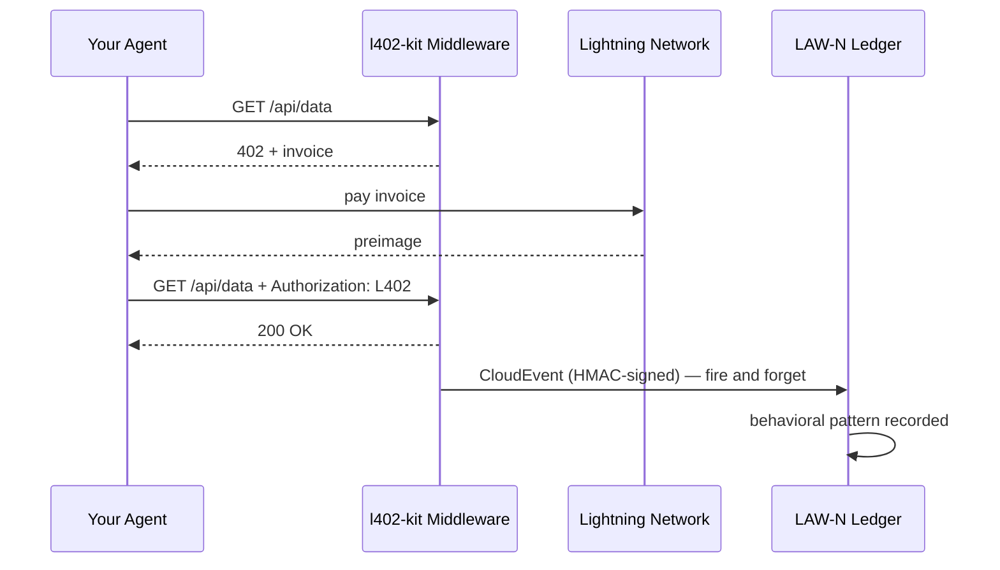

# Événements Comportementaux LAW-N

LAW-N (SAGEWORKS AI) est un registre comportemental pour agents autonomes. Chaque paiement L402 effectué par votre agent peut émettre un CloudEvent signé — construisant une piste d'audit cryptographique qui devient un score de réputation pour l'agent au fil du temps.

**Aucune autorité n'accorde la réputation. Les transactions sont la preuve.**

---

## Comment ça fonctionne



L'événement est émis après chaque paiement réussi. Il ne bloque jamais la réponse — si LAW-N est indisponible, votre agent reçoit tout de même les données.

---

## Activer côté client

```typescript
import { L402Client } from "l402-kit/agent";
import { BlinkWallet } from "l402-kit/wallets";
import { createLawNAdapter } from "l402-kit/agent";

const lawN = createLawNAdapter({
  ingestUrl: "https://l402kit.com/api/lawn-events",
  hmacSecret: process.env.LAWN_HMAC_SECRET!,
  network: "mainnet",
});

const client = new L402Client({
  wallet: new BlinkWallet(process.env.BLINK_API_KEY!),
  agentId: "agent:myorg.myagent",
  budget: { maxSats: 1000 },
  onEvent: lawN,
});
```

---

## Types d'événements

| Événement | Émis quand |
|---|---|
| `l402.challenge.received` | Le serveur a retourné HTTP 402 |
| `l402.payment.initiated` | L'agent a commencé à payer la facture |
| `l402.payment.settled` | Paiement confirmé, preimage reçu |
| `l402.access.granted` | Le serveur a accepté le jeton L402 |
| `l402.budget.exhausted` | L'agent a atteint son plafond de dépenses |
| `l402.token.reused` | L'agent a réessayé avec une preuve existante |
| `l402.proof.reuse.attempt` | Tentative de réutilisation d'un preimage déjà dépensé |

---

## Format CloudEvents 1.0

```json
{
  "specversion": "1.0",
  "type": "l402.payment.settled",
  "source": "l402-kit",
  "id": "req_a1b2c3d4",
  "time": "2026-05-10T14:32:00.000Z",
  "subject": "agent-payment-flow",
  "datacontenttype": "application/json",
  "data": {
    "agent_id": "agent:myorg.myagent",
    "session_id": "sess_8f3a1b2c",
    "request_id": "req_a1b2c3d4",
    "endpoint": "https://api.example.com/data",
    "event_type": "l402.payment.settled",
    "network": { "provider": "blink", "environment": "mainnet" },
    "payment": {
      "amount_sats": 100,
      "preimage_hash": "sha256:abc123...",
      "settled": true,
      "latency_ms": 487
    },
    "behavior": {
      "retry_count": 0,
      "proof_reuse_attempt": false,
      "budget_remaining": 900,
      "budget_exhausted": false
    }
  }
}
```

---

## À quoi ressemble la réputation

Les agents qui systématiquement :
- Paient les factures dès la première tentative
- Respectent les contraintes budgétaires
- Ne tentent pas de réutiliser les preuves
- Opèrent sur des points d'accès variés

...construisent leur réputation automatiquement. Les agents qui se comportent mal cessent de pouvoir accéder aux services.

Pas de liste blanche. Pas de vote de gouvernance. Aucune autorité ne décide qui est digne de confiance. Le registre est la preuve.

---

## Tableau de bord d'activité

Statistiques publiques disponibles à :

```bash
curl https://l402kit.com/api/activity
```

```json
{
  "total_events": 1420,
  "unique_agents": 12,
  "total_sats": 84200,
  "recent_events": [...],
  "top_agents": [
    { "agent_id": "agent:shinydapps.verity", "event_count": 847 }
  ]
}
```

Tableau de bord en direct : [l402kit.com/activity](https://l402kit.com/activity)