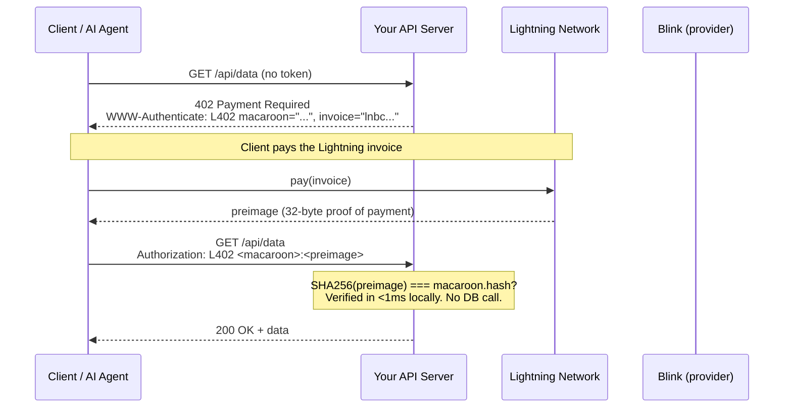
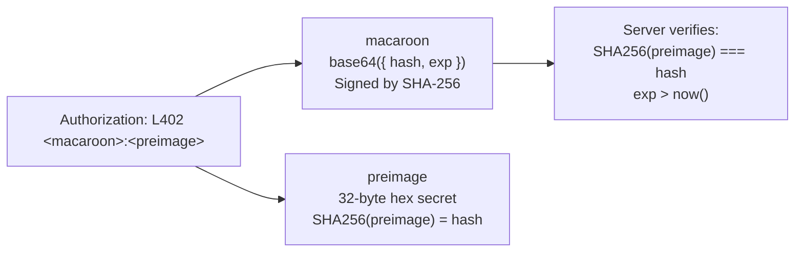
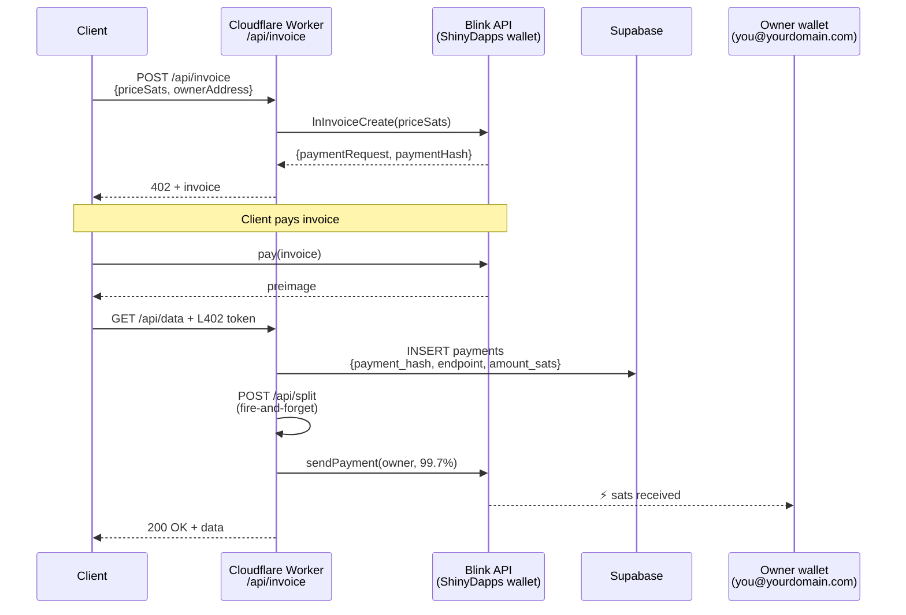
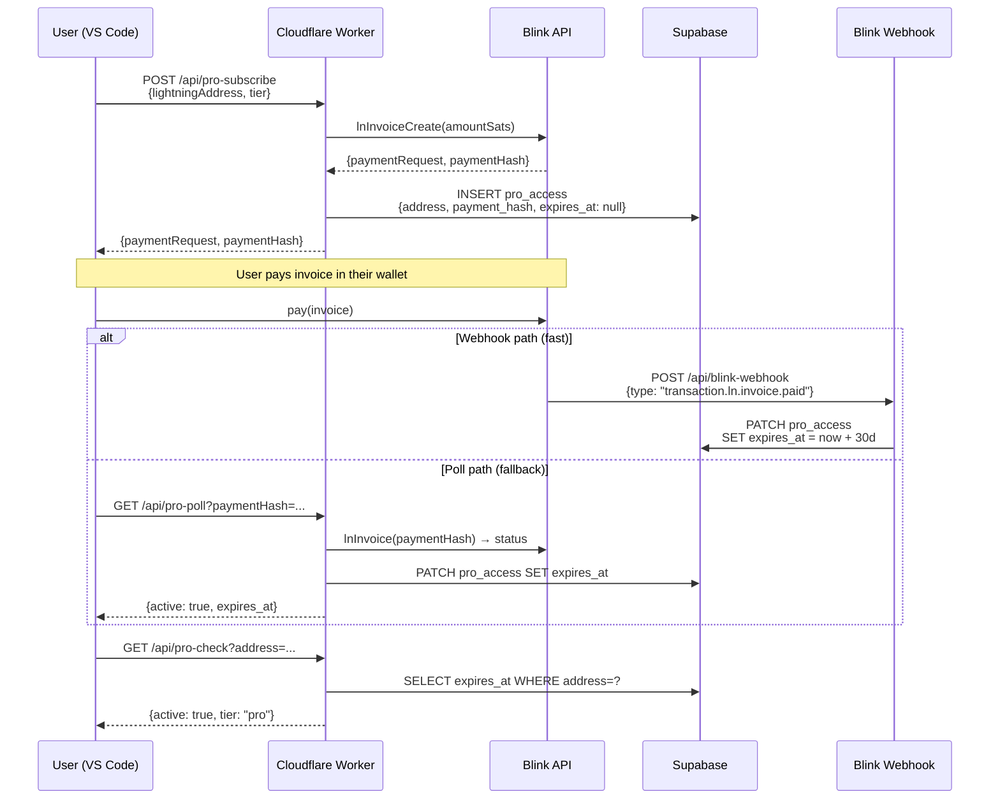
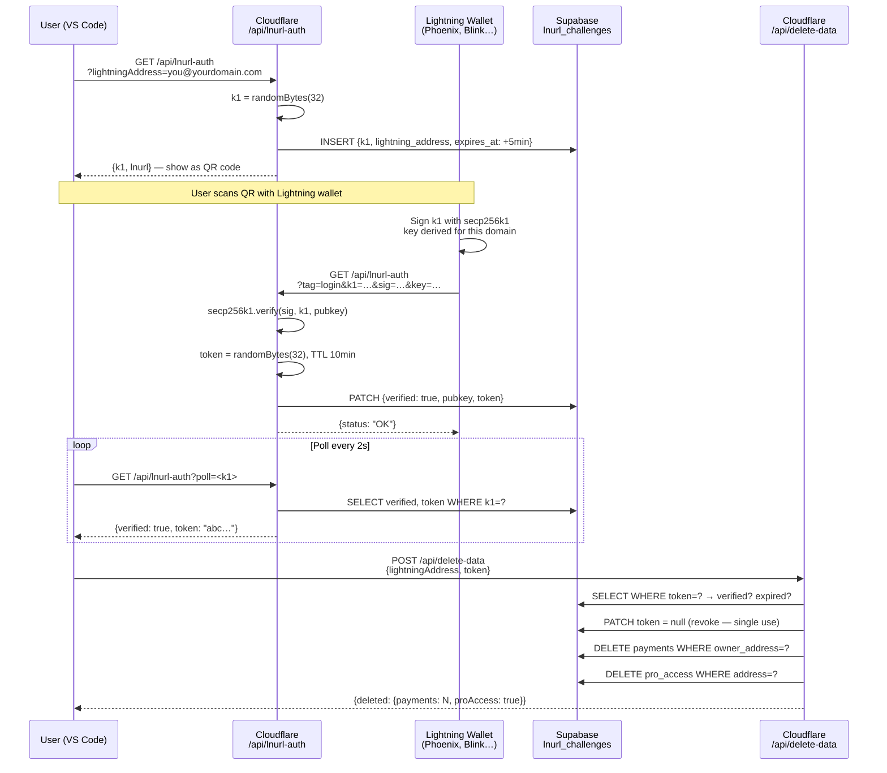
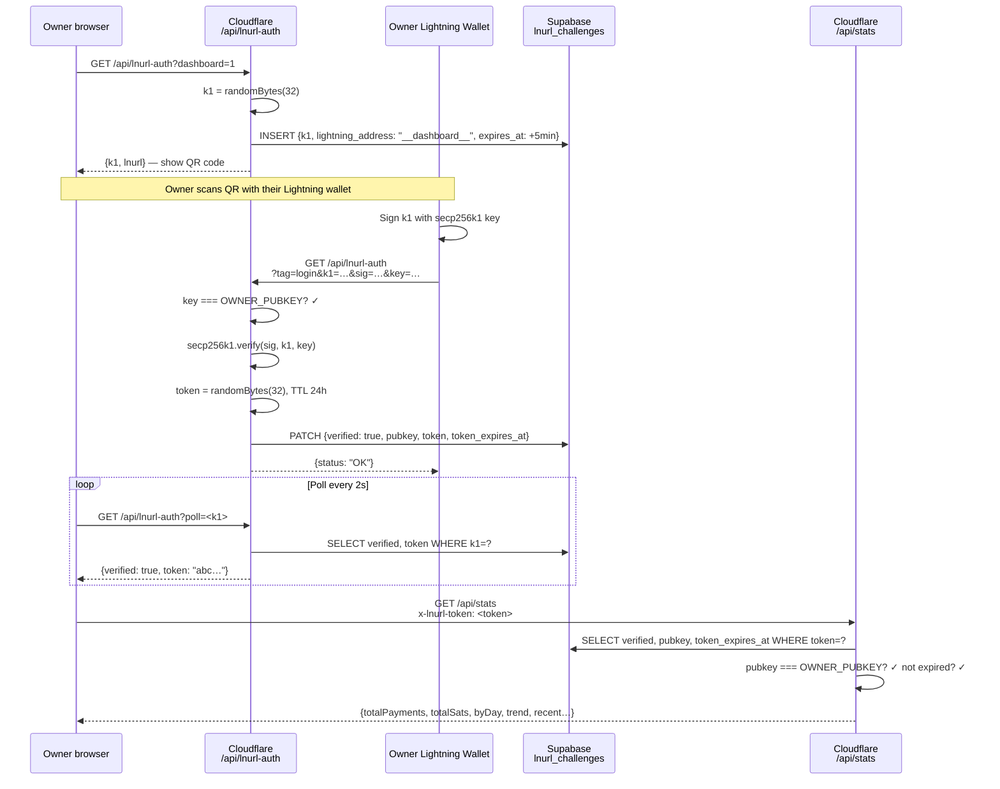
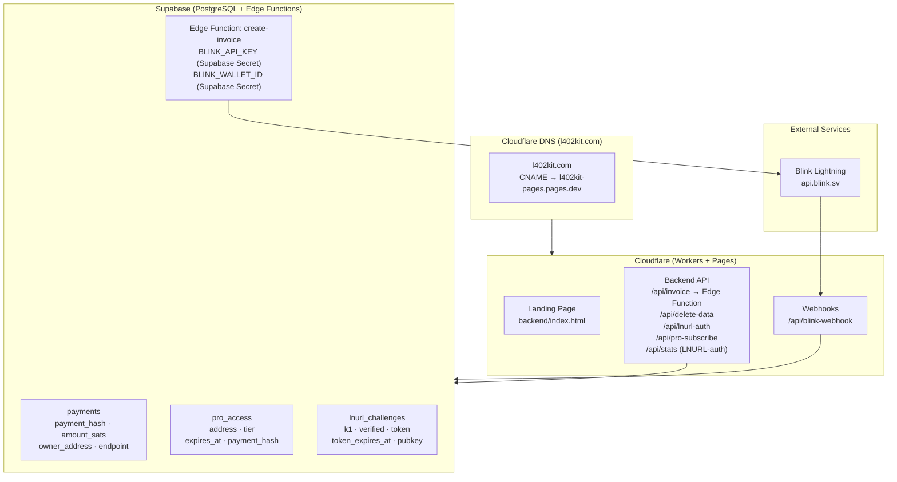
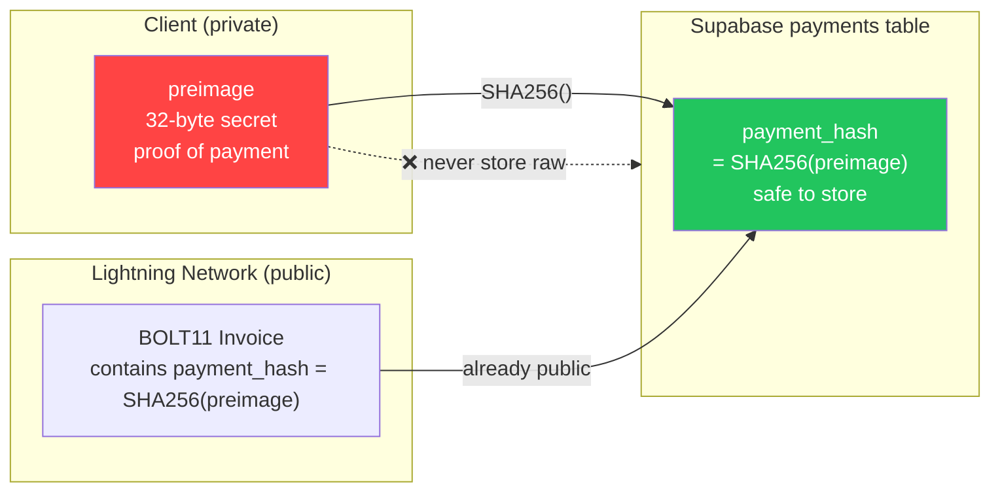

Cette page documente chaque flux majeur de la plateforme l402-kit sous forme de diagrammes de séquence et d'organigrammes. Chaque section associe un visuel à une explication concise de ce qui se passe et pourquoi cela fonctionne ainsi. Commencez par le Flux 1 (cœur L402) pour comprendre le fondement cryptographique, puis lisez les flux pertinents pour votre intégration.

---

## 1. Flux de Paiement L402 Principal

Le cycle de requête fondamental. Pas de comptes, pas de mots de passe — juste un reçu cryptographique.

Lorsqu'un client accède pour la première fois à un endpoint protégé, il reçoit une réponse HTTP 402 contenant deux éléments : une facture BOLT11 Lightning et un macaroon. Le client paie la facture via le Lightning Network (généralement en moins d'une seconde), reçoit un preimage de 32 octets comme preuve, et réessaie la requête avec `Authorization: L402 <macaroon>:<preimage>`. Le serveur vérifie le jeton localement en utilisant `SHA256(preimage) === macaroon.hash` — pas d'appel à la base de données, pas d'aller-retour réseau, latence inférieure à la milliseconde. Une fois vérifié, le jeton est valide jusqu'à son expiration. Les requêtes suivantes réutilisent le même en-tête.

**Propriétés clés :**
- La vérification est entièrement locale — pas d'appel réseau, pas de consultation de base de données
- `preimage` = preuve cryptographique de paiement (reçu Lightning)
- `macaroon` = JSON base64 `{hash, exp}` signé avec SHA-256

---

## 2. Anatomie du Jeton

L'en-tête `Authorization` contient deux composants séparés par un deux-points. Le **macaroon** est un objet JSON encodé en base64 `{hash, exp}` — il indique au serveur quel hash de paiement attendre et quand le jeton expire. Le **preimage** est le secret de 32 octets que le Lightning Network a retourné au payeur. Ensemble, ils forment un identifiant infalsifiable et autonome que tout serveur peut vérifier hors ligne.

---

## 3. Mode Géré — Flux de Partage des Frais

Lorsque vous utilisez `ManagedProvider`, l402kit.com crée la facture, reçoit le paiement et transfère automatiquement 99,7 % vers votre Lightning Address. Les 0,3 % de frais de plateforme couvrent le routage Lightning et l'infrastructure API. Votre portefeuille ne touche jamais au Cloudflare Worker — le partage est un paiement Lightning côté serveur déclenché après la vérification de la requête du client, utilisant votre Lightning Address pour générer une nouvelle facture BOLT11 à la volée.

---

## 4. Flux d'Abonnement Pro

Les abonnements Pro suivent un schéma L402 similaire mais ajoutent un état persistant. Le client paie une facture unique et reçoit un enregistrement d'abonnement de 30 jours dans Supabase. La confirmation de paiement arrive soit via un webhook Blink (chemin rapide, ~2 secondes) soit via un polling (solution de repli pour les portefeuilles qui ne déclenchent pas de webhooks). Les appels `/api/pro-check` suivants vérifient l'horodatage `expires_at` sans nouveau paiement.

---

## 5. LNURL-auth — Preuve de Propriété du Portefeuille (Suppression de Données)

Prouve que vous possédez un portefeuille Lightning sans mot de passe. Requis avant la suppression des données du compte.

---

## 6. Flux de Connexion LNURL-auth au Tableau de Bord

Authentification du tableau de bord réservée au propriétaire — DASHBOARD_SECRET stocké dans les secrets Cloudflare Workers.

---

## 7. Vue d'Ensemble de l'Infrastructure

---

## 8. Sécurité du Preimage SHA-256

Pourquoi nous stockons `SHA256(preimage)` plutôt que le preimage brut :

**Pourquoi c'est sécurisé :** Le `payment_hash` est déjà intégré dans chaque facture BOLT11 — il est public par conception. Seul le `preimage` est secret. Stocker le hash vous offre une protection contre la réutilisation sans exposition supplémentaire.