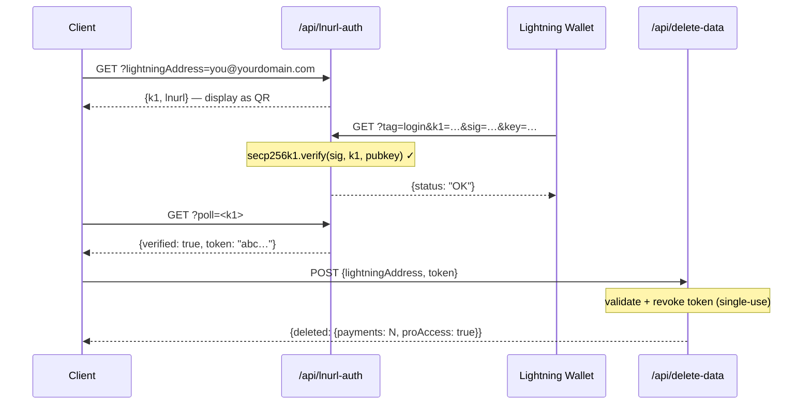

## Modèle de sécurité des tokens

Les tokens L402 sont composés de deux parties jointes par `:` :

```
<macaroon>:<preimage>
```

- **Macaroon** — JSON encodé en base64 contenant `{hash, exp}`. Signé par SHA-256. Ne peut pas être falsifié sans connaître le preimage.
- **Preimage** — le secret de 32 octets qui, une fois haché avec SHA-256, doit correspondre au hash intégré dans le macaroon.

**La vérification est entièrement locale** — aucune recherche en base de données, aucun appel réseau. Le SDK vérifie la relation de hachage de manière cryptographique en quelques microsecondes.

---

## Protection contre la réutilisation

l402-kit inclut une **protection intégrée contre la réutilisation**. Chaque preimage ne peut être utilisé qu'une seule fois :

```typescript
// ✅ Intégré — activé par défaut
app.get("/api", l402({ priceSats: 10, lightning: blink }), handler);
```

La première utilisation d'un token marque le preimage comme utilisé. Toute requête ultérieure avec le même preimage retourne `401 Token already used`.

**Store par défaut** : `Set` en mémoire. Cela signifie :
- Les redémarrages vident le store de réutilisation (les tokens deviennent réutilisables après redémarrage)
- Les instances multiples ne partagent pas l'état

**En production** avec plusieurs instances, implémentez un store de réutilisation persistant :

```typescript
import { checkAndMarkPreimage } from "l402-kit";

// Exemple : store de réutilisation basé sur Redis
async function redisCheckAndMark(preimage: string): Promise<boolean> {
  const key = `l402:used:${preimage}`;
  const set = await redis.set(key, "1", "NX", "EX", 86400); // TTL 24h
  return set === "OK"; // true = première utilisation, false = réutilisation
}
```

---

## Expiration des tokens

Les tokens contiennent un champ `exp` (horodatage Unix en ms). Le SDK rejette automatiquement les tokens expirés.

TTL par défaut : **1 heure** (défini par le fournisseur Lightning lors de la création de la facture).

```typescript
// Les tokens sont valides pendant 1 heure après la création de la facture.
// Après expiration, le client doit payer à nouveau pour obtenir un nouveau token.
```

---

## HTTPS est obligatoire

**N'utilisez jamais L402 sur du HTTP simple en production.** Le macaroon et le preimage sont transmis dans l'en-tête `Authorization`. En HTTP, ils sont exposés aux attaquants réseau.

```nginx
# nginx — rediriger HTTP vers HTTPS
server {
    listen 80;
    return 301 https://$host$request_uri;
}
```

---

## Limitation du débit

L402 vérifie les tokens de manière cryptographique, sans consulter de base de données — c'est donc peu coûteux. Mais la création de factures Lightning (la réponse 402) appelle l'API de votre fournisseur Lightning.

Protégez la création de factures avec un limiteur de débit pour prévenir les attaques DoS :

```typescript
import rateLimit from "express-rate-limit";

const invoiceLimiter = rateLimit({
  windowMs: 60_000,
  max: 20, // 20 requêtes non payées par minute par IP
  skip: (req) => req.headers.authorization?.startsWith("L402 ") ?? false,
});

app.use("/api", invoiceLimiter);
app.get("/api/data", l402({ priceSats: 10, lightning: blink }), handler);
```

---

## Gestion des secrets

Ne codez jamais les clés API en dur. Utilisez des variables d'environnement :

```typescript
// ✅ Correct
const blink = new BlinkProvider(
  process.env.BLINK_API_KEY!,
  process.env.BLINK_WALLET_ID!,
);

// ❌ Ne faites jamais ça
const blink = new BlinkProvider("blink_abc123...", "wallet-id-here");
```

Utilisez un gestionnaire de secrets en production : AWS Secrets Manager, Doppler, Vault, ou `.env` + dotenv (ne jamais commiter dans git).

---

## Authentification des endpoints d'administration

Si vous exposez des endpoints d'administration ou de statistiques, **n'acceptez jamais les secrets via les paramètres de requête URL**. Les URLs sont entièrement journalisées par les reverse proxies, les CDN et les fournisseurs cloud — y compris la chaîne de requête.

```typescript
// ❌ Jamais — secret visible dans les journaux Cloudflare Workers
GET /api/stats?secret=my-secret

// ✅ Correct — l'en-tête n'est pas journalisé par défaut
GET /api/stats
x-dashboard-secret: my-secret
```

```typescript
// Imposer l'utilisation de l'en-tête uniquement dans votre handler
const token = req.headers["x-dashboard-secret"];
if (!SECRET || token !== SECRET) return res.status(401).json({ error: "Unauthorized" });
```

---

## Hygiène des clés Supabase

Utilisez correctement `SUPABASE_SERVICE_KEY` (côté serveur uniquement) et `SUPABASE_ANON_KEY` (sûr à exposer aux clients) :

| Clé | Utilisation | Contourne RLS ? |
|---|---|---|
| `anon` | Extension VS Code, clients navigateur | Non |
| `service_role` | Fonctions API côté serveur | Oui |

Les Cloudflare Workers côté serveur qui lisent des tables sensibles (ex. `pro_access`) doivent utiliser la clé de service — jamais la clé anon. Les politiques RLS sur les tables sensibles ne doivent pas accorder d'accès anon.

```typescript
// ✅ Endpoint côté serveur
const SUPABASE_KEY = process.env.SUPABASE_SERVICE_KEY ?? process.env.SUPABASE_ANON_KEY ?? "";
```

---

## Politique de sécurité du contenu

Si vous servez un frontend avec votre API, assurez-vous que votre CSP ne bloque pas le flux L402 :

```http
Content-Security-Policy: connect-src 'self' https://api.blink.sv
```

---

## Gestion des données — suppression des données utilisateur

Les utilisateurs peuvent supprimer tout leur historique de paiements et leur abonnement Pro depuis l'extension VS Code à tout moment (**Paramètres → Zone de danger**). L'extension appelle :

```http
POST /api/delete-data
Content-Type: application/json

{ "lightningAddress": "user@blink.sv" }
```

Réponse :

```json
{ "deleted": { "payments": 42, "proAccess": true } }
```

Cet endpoint utilise la **clé service role** de Supabase côté serveur pour contourner RLS et supprimer définitivement :

- Toutes les lignes dans `payments` où `owner_address = ?`
- Toutes les lignes dans `pro_access` où `address = ?`

<Note>
L'extension exige que l'utilisateur tape son adresse Lightning mot pour mot avant que le bouton de suppression soit activé — confirmation de style GitHub pour les actions destructives.
</Note>

Si vous construisez votre propre tableau de bord sur l402-kit, exposez un endpoint similaire pour vos utilisateurs. N'autorisez jamais la suppression via la clé anon — passez toujours par une fonction côté serveur avec la clé de service.

---

## Confidentialité et minimisation des données

l402-kit est conçu pour collecter le minimum de données nécessaires à son fonctionnement. Voici ce qui est stocké, pourquoi, et comment renforcer chaque champ.

### Ce qui est stocké

| Table | Champ | Pourquoi | Sensibilité |
|---|---|---|---|
| `payments` | `preimage` | Protection contre la réutilisation + preuve de paiement | ⚠️ Moyenne — hachez-le à la place (voir ci-dessous) |
| `payments` | `owner_address` | Attribuer les revenus à l'adresse Lightning | Faible — les adresses Lightning sont publiques |
| `payments` | `amount_sats` | Statistiques du tableau de bord | Faible |
| `payments` | `endpoint` | Analyses par endpoint | Faible–moyenne |
| `pro_access` | `address` | Vérifier l'abonnement Pro | Faible — public |
| `waitlist` | `email` | Envoyer les e-mails de bienvenue et de sortie | ⚠️ Élevée — vraie PII, chiffrez ou omettez |
| `waitlist` | `lightning_address` | Signal d'identité optionnel | Faible |

### Hachez les preimages plutôt que de les stocker bruts

Le preimage est le secret de 32 octets qui prouve qu'un paiement Lightning a été effectué. Le stocker brut signifie qu'une fuite de base de données expose chaque preuve. Stockez le hachage SHA-256 à la place — il est déjà public (intégré dans la facture BOLT11) et suffisant pour la protection contre la réutilisation :

```typescript
import { createHash } from 'crypto';

// Au lieu de stocker le preimage directement :
const paymentHash = createHash('sha256').update(Buffer.from(preimage, 'hex')).digest('hex');

await supabase.from('payments').insert({
  payment_hash: paymentHash,   // ✅ sûr à stocker
  // preimage: preimage        // ❌ à éviter
  owner_address,
  amount_sats,
  endpoint,
});

// Vérification de réutilisation : hacher le preimage entrant, rechercher le hash
const incomingHash = createHash('sha256').update(Buffer.from(incoming, 'hex')).digest('hex');
const { data } = await supabase.from('payments').select('id').eq('payment_hash', incomingHash);
const alreadyUsed = data && data.length > 0;
```

### Protéger les e-mails de la liste d'attente

Les adresses e-mail sont les seules vraies PII du système. Options par ordre de protection croissante :

```typescript
// Option A — chiffrer avant l'insertion (AES-256-GCM, clé stockée en dehors de Supabase)
import { createCipheriv, randomBytes } from 'crypto';
const key = Buffer.from(process.env.EMAIL_ENCRYPTION_KEY!, 'hex'); // 32 octets
const iv  = randomBytes(12);
const cipher = createCipheriv('aes-256-gcm', key, iv);
const encrypted = Buffer.concat([cipher.update(email), cipher.final()]);
const tag = cipher.getAuthTag();
const stored = iv.toString('hex') + ':' + tag.toString('hex') + ':' + encrypted.toString('hex');

// Option B — stocker uniquement un hachage SHA-256 (irréversible — impossible d'envoyer d'autres e-mails)
const emailHash = createHash('sha256').update(email.toLowerCase()).digest('hex');

// Option C — ne pas stocker l'e-mail du tout (envoyer l'e-mail de bienvenue et le supprimer)
```

### Prouver la propriété du portefeuille avant de supprimer des données (LNURL-auth)

L'endpoint `/api/delete-data` ne devrait accepter que les requêtes du véritable propriétaire de l'adresse Lightning. Utilisez **LNURL-auth** pour prouver la propriété de manière cryptographique — l'utilisateur signe un défi serveur avec la clé privée de son portefeuille Lightning, sans mot de passe ni compte requis :



Consultez le [diagramme de flux complet](/guides/flows#5-lnurl-auth--wallet-ownership-proof-delete-data) pour la séquence complète avec l'état Supabase.

Cela garantit qu'aucune personne ne peut supprimer les enregistrements d'un autre utilisateur, même en connaissant son adresse Lightning.

---

## Liste de contrôle

<AccordionGroup>
  <Accordion title="Avant la mise en production">
    - [ ] HTTPS appliqué sur tous les endpoints
    - [ ] Clés API dans des variables d'environnement, pas dans le code source
    - [ ] Les endpoints d'administration/statistiques utilisent l'authentification par en-tête, pas les paramètres URL `?secret=`
    - [ ] La clé `service_role` de Supabase utilisée côté serveur ; la clé `anon` uniquement sur les clients
    - [ ] Les tables Supabase sensibles n'ont pas de politique SELECT `anon`
    - [ ] L'endpoint de suppression de données (`/api/delete-data`) utilise la clé de service, jamais anon
    - [ ] Limiteur de débit sur la création de factures
    - [ ] Protection contre la réutilisation testée (essayez de réutiliser un preimage → attendez-vous à un 401)
    - [ ] Expiration des tokens testée (définir un TTL court en développement, confirmer le 401 après expiration)
    - [ ] Les preimages stockés sous forme de hachages SHA-256, pas de secrets bruts
    - [ ] Les e-mails de la liste d'attente chiffrés au repos ou supprimés après envoi
    - [ ] `/api/delete-data` nécessite une preuve LNURL-auth de propriété du portefeuille
  </Accordion>
  <Accordion title="Pour les APIs à fort trafic">
    - [ ] Store de réutilisation basé sur Redis (partagé entre les instances)
    - [ ] Surveillance des taux de réponse 402 (pic = DoS potentiel)
    - [ ] Basculement du fournisseur Lightning (BlinkProvider → repli sur LNbitsProvider)
    - [ ] Surveillance de la page de statut de votre fournisseur Lightning (ex. status.blink.sv)
  </Accordion>
</AccordionGroup>