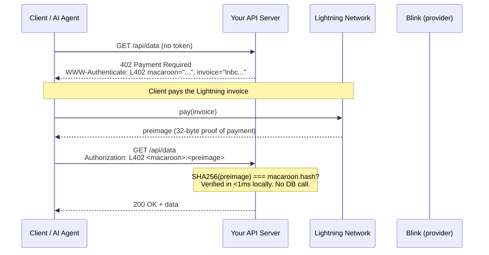
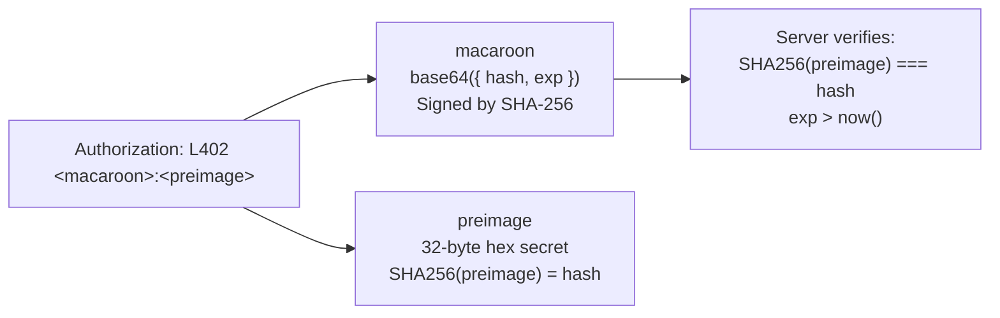
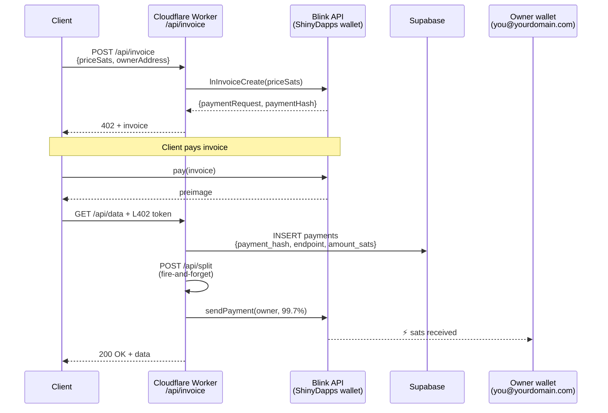
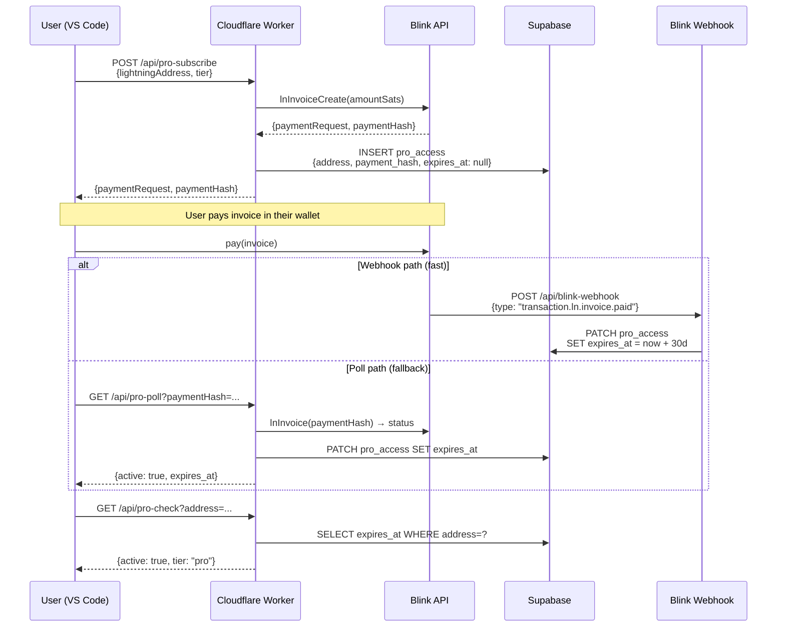
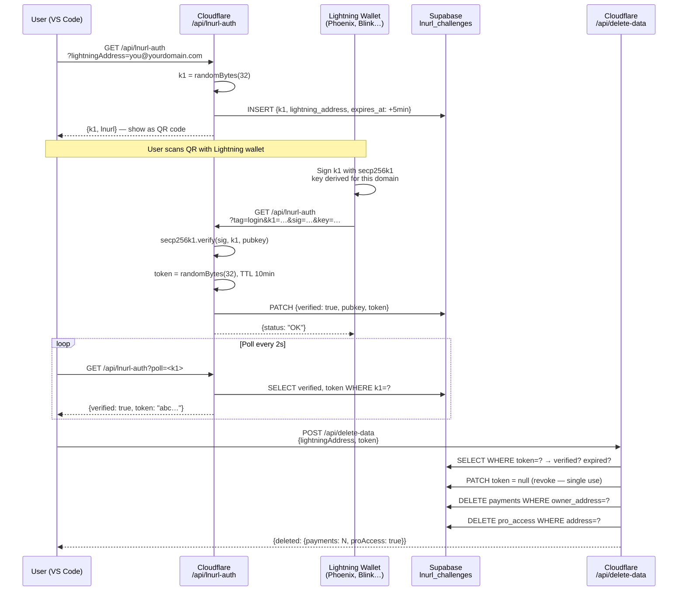
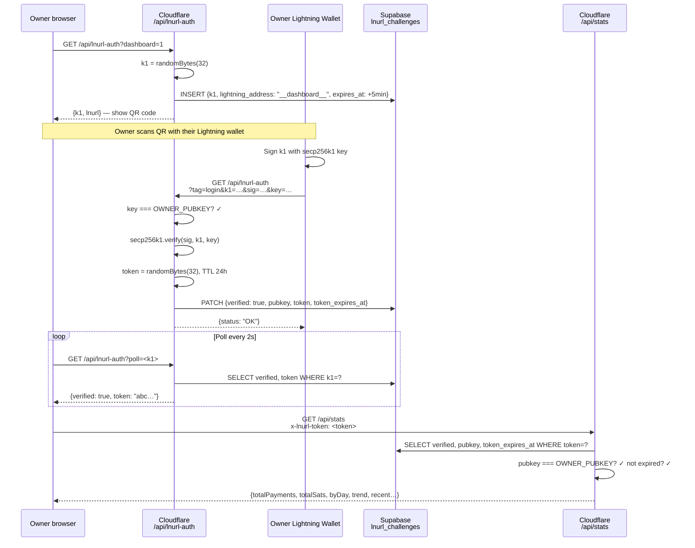
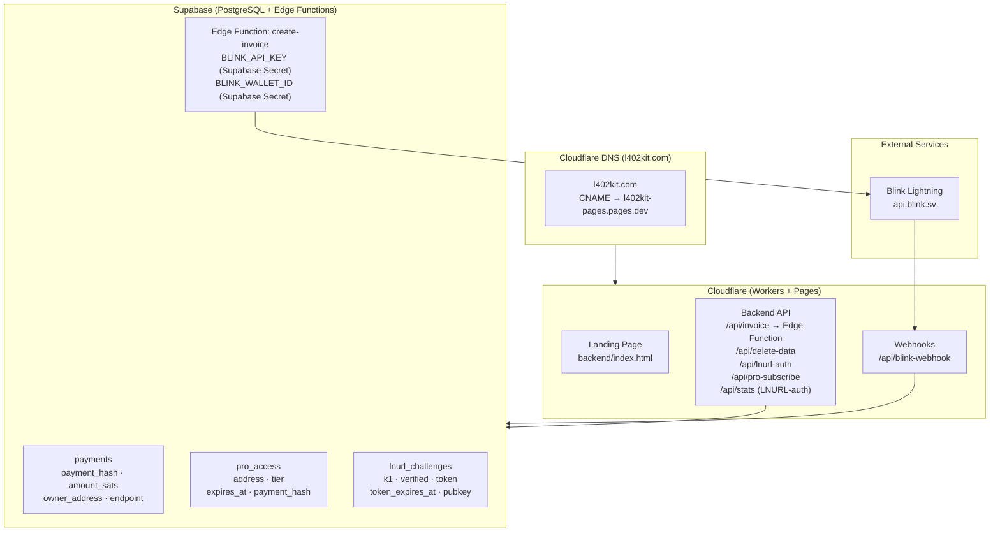
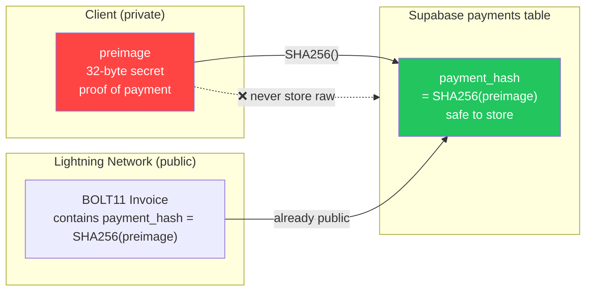

## 1. Core L402 Payment Flow

The fundamental request cycle. No accounts, no passwords — just a cryptographic receipt.

**Key properties:**
- Verification is fully local — no network call, no database lookup
- `preimage` = cryptographic proof of payment (Lightning receipt)
- `macaroon` = base64 JSON `{hash, exp}` signed with SHA-256

---

## 2. Token Anatomy

---

## 3. Managed Mode — Fee Split Flow

When you set `ownerLightningAddress`, ShinyDapps creates the invoice, receives the payment, and forwards 99.7% to you automatically.

---

## 4. Pro Subscription Flow

---

## 5. LNURL-auth — Wallet Ownership Proof (Delete Data)

Proves you own a Lightning wallet without a password. Required before deleting account data.

---

## 6. Dashboard LNURL-auth Login Flow

Owner-only dashboard authentication — DASHBOARD_SECRET stored in Cloudflare Workers secrets.

---

## 7. Infrastructure Overview

---

## 8. SHA-256 Preimage Security

Why we store `SHA256(preimage)` instead of the raw preimage:

**Why it's safe:** The `payment_hash` is already embedded in every BOLT11 invoice — it's public by design. Only the `preimage` is secret. Storing the hash gives you replay protection with zero additional exposure.
