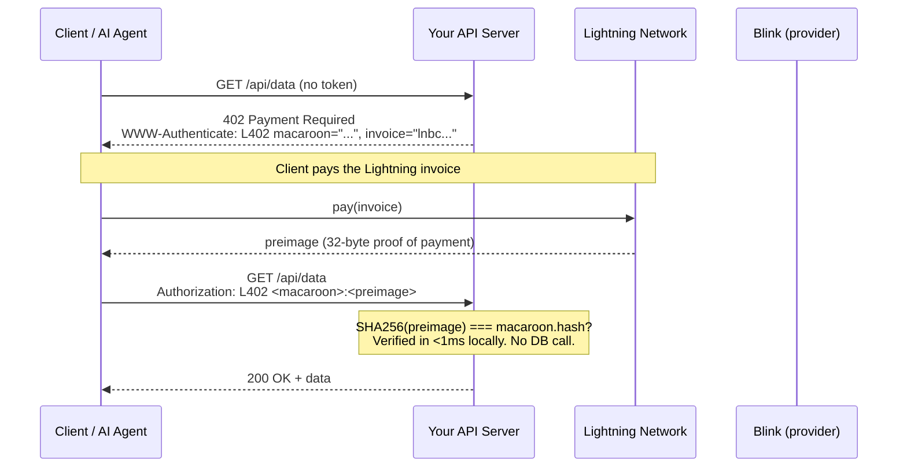
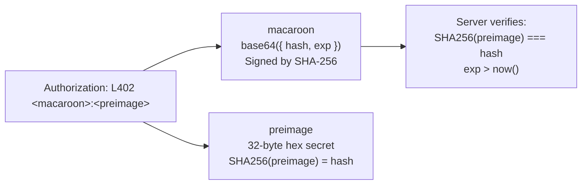
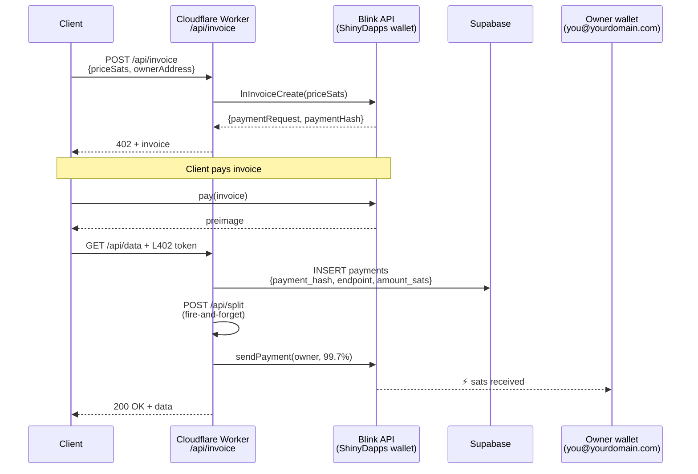
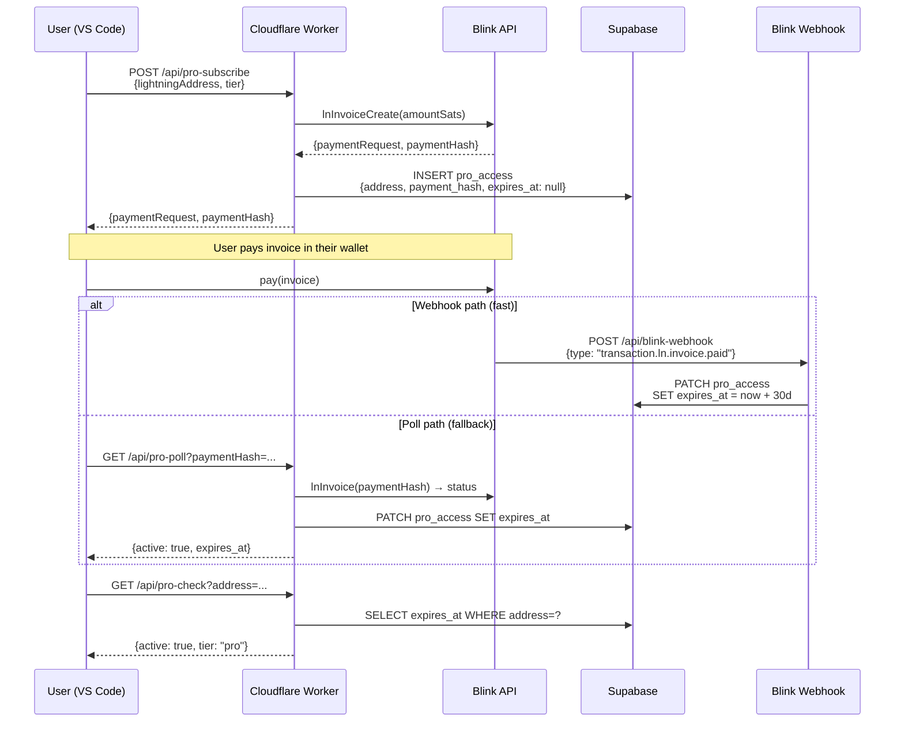
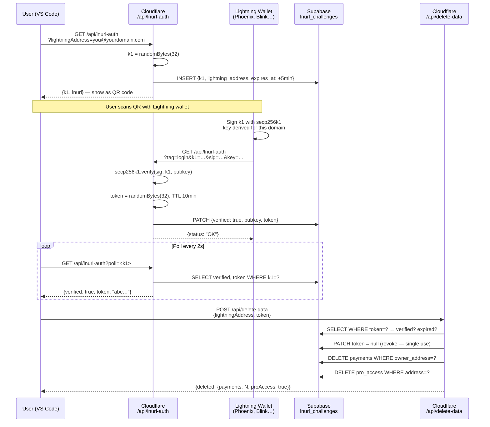
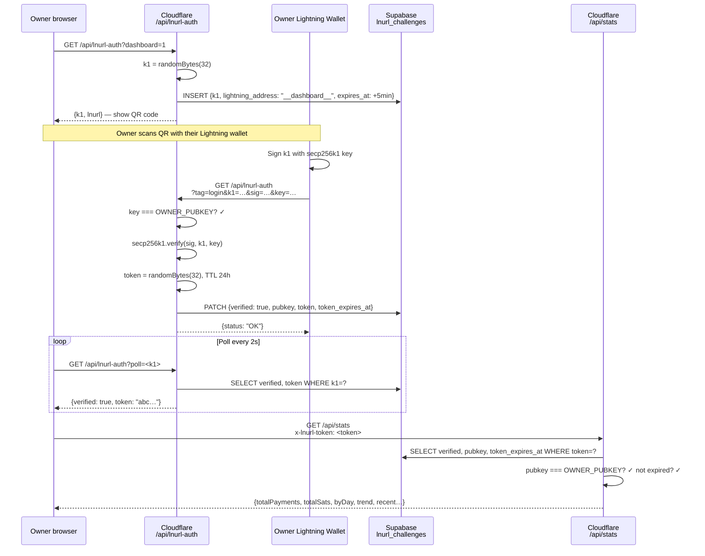
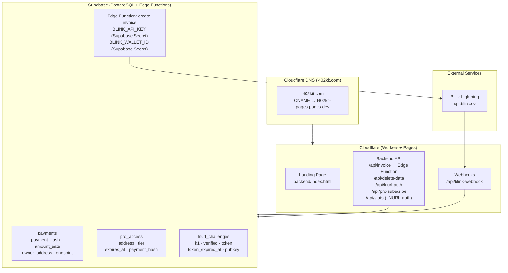
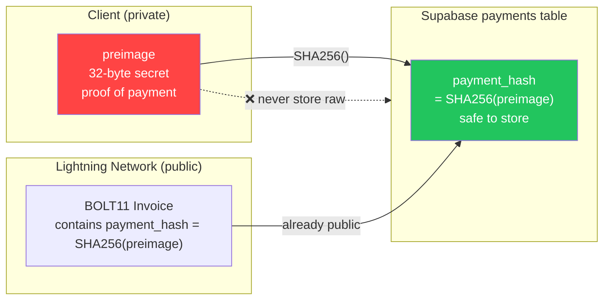

This page documents every major flow in the l402-kit platform as sequence and flowchart diagrams. Each section pairs a visual with a concise explanation of what happens and why it works that way. Start with Flow 1 (core L402) to understand the cryptographic foundation, then read whichever flows are relevant to your integration.

---

## 1. Core L402 Payment Flow

The fundamental request cycle. No accounts, no passwords — just a cryptographic receipt.

When a client first hits a protected endpoint it receives an HTTP 402 response containing two things: a BOLT11 Lightning invoice and a macaroon. The client pays the invoice through the Lightning Network (typically in under a second), receives a 32-byte preimage as proof, and retries the request with `Authorization: L402 <macaroon>:<preimage>`. The server verifies the token locally using `SHA256(preimage) === macaroon.hash` — no database call, no network round trip, sub-millisecond latency. Once verified, the token is valid until its expiry. Subsequent requests reuse the same header.

```mermaid
sequenceDiagram
    participant C as Client / AI Agent
    participant S as Your API Server
    participant L as Lightning Network
    participant B as Blink (provider)

    C->>S: GET /api/data (no token)
    S-->>C: 402 Payment Required<br/>WWW-Authenticate: L402 macaroon="...", invoice="lnbc..."

    Note over C,L: Client pays the Lightning invoice
    C->>L: pay(invoice)
    L-->>C: preimage (32-byte proof of payment)

    C->>S: GET /api/data<br/>Authorization: L402 <macaroon>:<preimage>
    Note over S: SHA256(preimage) === macaroon.hash?<br/>Verified in <1ms locally. No DB call.
    S-->>C: 200 OK + data
```

**Key properties:**
- Verification is fully local — no network call, no database lookup
- `preimage` = cryptographic proof of payment (Lightning receipt)
- `macaroon` = base64 JSON `{hash, exp}` signed with SHA-256

---

## 2. Token Anatomy

The `Authorization` header carries two components separated by a colon. The **macaroon** is a base64-encoded JSON object `{hash, exp}` — it tells the server what payment hash to expect and when the token expires. The **preimage** is the 32-byte secret the Lightning Network returned to the payer. Together they form an unforgeable, self-contained credential that any server can verify offline.

```mermaid
flowchart LR
    T["Authorization: L402 &lt;macaroon&gt;:&lt;preimage&gt;"]
    T --> M["macaroon\nbase64({ hash, exp })\nSigned by SHA-256"]
    T --> P["preimage\n32-byte hex secret\nSHA256(preimage) = hash"]
    M --> V["Server verifies:\nSHA256(preimage) === hash\nexp > now()"]
```

---

## 3. Managed Mode — Fee Split Flow

When you use `ManagedProvider`, l402kit.com creates the invoice, receives the payment, and forwards 99.7% to your Lightning Address automatically. The 0.3% platform fee covers Lightning routing and API infrastructure. Your wallet never touches the Cloudflare Worker — the split is a server-side Lightning payment fired after the client's request is verified, using your Lightning Address to generate a fresh BOLT11 invoice on the fly.

```mermaid
sequenceDiagram
    participant C as Client
    participant V as Cloudflare Worker<br/>/api/invoice
    participant B as Blink API<br/>(ShinyDapps wallet)
    participant S as Supabase
    participant O as Owner wallet<br/>(you@yourdomain.com)

    C->>V: POST /api/invoice<br/>{priceSats, ownerAddress}
    V->>B: lnInvoiceCreate(priceSats)
    B-->>V: {paymentRequest, paymentHash}
    V-->>C: 402 + invoice

    Note over C,B: Client pays invoice
    C->>B: pay(invoice)
    B-->>C: preimage

    C->>V: GET /api/data + L402 token
    V->>S: INSERT payments<br/>{payment_hash, endpoint, amount_sats}
    V->>V: POST /api/split<br/>(fire-and-forget)
    V->>B: sendPayment(owner, 99.7%)
    B-->>O: ⚡ sats received
    V-->>C: 200 OK + data
```

---

## 4. Pro Subscription Flow

Pro subscriptions follow a similar L402 pattern but add persistent state. The client pays a one-time invoice and receives a 30-day subscription record in Supabase. Payment confirmation arrives either via Blink webhook (fast path, ~2 seconds) or via polling (fallback for wallets that don't trigger webhooks). Subsequent `/api/pro-check` calls verify the `expires_at` timestamp without another payment.

```mermaid
sequenceDiagram
    participant U as User (VS Code)
    participant V as Cloudflare Worker
    participant B as Blink API
    participant S as Supabase
    participant W as Blink Webhook

    U->>V: POST /api/pro-subscribe<br/>{lightningAddress, tier}
    V->>B: lnInvoiceCreate(amountSats)
    B-->>V: {paymentRequest, paymentHash}
    V->>S: INSERT pro_access<br/>{address, payment_hash, expires_at: null}
    V-->>U: {paymentRequest, paymentHash}

    Note over U,B: User pays invoice in their wallet
    U->>B: pay(invoice)

    alt Webhook path (fast)
        B->>W: POST /api/blink-webhook<br/>{type: "transaction.ln.invoice.paid"}
        W->>S: PATCH pro_access<br/>SET expires_at = now + 30d
    else Poll path (fallback)
        U->>V: GET /api/pro-poll?paymentHash=...
        V->>B: lnInvoice(paymentHash) → status
        V->>S: PATCH pro_access SET expires_at
        V-->>U: {active: true, expires_at}
    end

    U->>V: GET /api/pro-check?address=...
    V->>S: SELECT expires_at WHERE address=?
    V-->>U: {active: true, tier: "pro"}
```

---

## 5. LNURL-auth — Wallet Ownership Proof (Delete Data)

Proves you own a Lightning wallet without a password. Required before deleting account data.

```mermaid
sequenceDiagram
    participant U as User (VS Code)
    participant V as Cloudflare<br/>/api/lnurl-auth
    participant W as Lightning Wallet<br/>(Phoenix, Blink…)
    participant S as Supabase<br/>lnurl_challenges
    participant D as Cloudflare<br/>/api/delete-data

    U->>V: GET /api/lnurl-auth<br/>?lightningAddress=you@yourdomain.com
    V->>V: k1 = randomBytes(32)
    V->>S: INSERT {k1, lightning_address, expires_at: +5min}
    V-->>U: {k1, lnurl} — show as QR code

    Note over U,W: User scans QR with Lightning wallet
    W->>W: Sign k1 with secp256k1<br/>key derived for this domain
    W->>V: GET /api/lnurl-auth<br/>?tag=login&k1=…&sig=…&key=…
    V->>V: secp256k1.verify(sig, k1, pubkey)
    V->>V: token = randomBytes(32), TTL 10min
    V->>S: PATCH {verified: true, pubkey, token}
    V-->>W: {status: "OK"}

    loop Poll every 2s
        U->>V: GET /api/lnurl-auth?poll=<k1>
        V->>S: SELECT verified, token WHERE k1=?
        V-->>U: {verified: true, token: "abc…"}
    end

    U->>D: POST /api/delete-data<br/>{lightningAddress, token}
    D->>S: SELECT WHERE token=? → verified? expired?
    D->>S: PATCH token = null (revoke — single use)
    D->>S: DELETE payments WHERE owner_address=?
    D->>S: DELETE pro_access WHERE address=?
    D-->>U: {deleted: {payments: N, proAccess: true}}
```

---

## 6. Dashboard LNURL-auth Login Flow

Owner-only dashboard authentication — DASHBOARD_SECRET stored in Cloudflare Workers secrets.

```mermaid
sequenceDiagram
    participant O as Owner browser
    participant V as Cloudflare<br/>/api/lnurl-auth
    participant W as Owner Lightning Wallet
    participant S as Supabase<br/>lnurl_challenges
    participant D as Cloudflare<br/>/api/stats

    O->>V: GET /api/lnurl-auth?dashboard=1
    V->>V: k1 = randomBytes(32)
    V->>S: INSERT {k1, lightning_address: "__dashboard__", expires_at: +5min}
    V-->>O: {k1, lnurl} — show QR code

    Note over O,W: Owner scans QR with their Lightning wallet
    W->>W: Sign k1 with secp256k1 key
    W->>V: GET /api/lnurl-auth<br/>?tag=login&k1=…&sig=…&key=…
    V->>V: key === OWNER_PUBKEY? ✓
    V->>V: secp256k1.verify(sig, k1, key)
    V->>V: token = randomBytes(32), TTL 24h
    V->>S: PATCH {verified: true, pubkey, token, token_expires_at}
    V-->>W: {status: "OK"}

    loop Poll every 2s
        O->>V: GET /api/lnurl-auth?poll=<k1>
        V->>S: SELECT verified, token WHERE k1=?
        V-->>O: {verified: true, token: "abc…"}
    end

    O->>D: GET /api/stats<br/>x-lnurl-token: <token>
    D->>S: SELECT verified, pubkey, token_expires_at WHERE token=?
    D->>D: pubkey === OWNER_PUBKEY? ✓ not expired? ✓
    D-->>O: {totalPayments, totalSats, byDay, trend, recent…}
```

---

## 7. Infrastructure Overview

```mermaid
flowchart TB
    subgraph CF["Cloudflare DNS (l402kit.com)"]
        DNS["l402kit.com\nCNAME → l402kit-pages.pages.dev"]
    end

    subgraph VCL["Cloudflare (Workers + Pages)"]
        LAND["Landing Page\nbackend/index.html"]
        API["Backend API\n/api/invoice → Edge Function\n/api/delete-data\n/api/lnurl-auth\n/api/pro-subscribe\n/api/stats (LNURL-auth)"]
        HOOK["Webhooks\n/api/blink-webhook"]
    end

    subgraph SB["Supabase (PostgreSQL + Edge Functions)"]
        PAY["payments\npayment_hash · amount_sats\nowner_address · endpoint"]
        PRO["pro_access\naddress · tier\nexpires_at · payment_hash"]
        LNURL["lnurl_challenges\nk1 · verified · token\ntoken_expires_at · pubkey"]
        EF["Edge Function: create-invoice\nBLINK_API_KEY (Supabase Secret)\nBLINK_WALLET_ID (Supabase Secret)"]
    end

    subgraph EXT["External Services"]
        BLINK["Blink Lightning\napi.blink.sv"]
    end

    CF --> VCL
    API --> SB
    HOOK --> SB
    EF --> BLINK
    BLINK --> HOOK
```

---

## 8. SHA-256 Preimage Security

Why we store `SHA256(preimage)` instead of the raw preimage:

```mermaid
flowchart LR
    subgraph Lightning["Lightning Network (public)"]
        INV["BOLT11 Invoice\ncontains payment_hash = SHA256(preimage)"]
    end

    subgraph Client["Client (private)"]
        PRE["preimage\n32-byte secret\nproof of payment"]
    end

    subgraph DB["Supabase payments table"]
        STORED["payment_hash\n= SHA256(preimage)\nsafe to store"]
    end

    PRE -->|"SHA256()"| STORED
    INV -->|"already public"| STORED
    PRE -.->|"❌ never store raw"| DB

    style PRE fill:#ff4444,color:#fff
    style STORED fill:#22c55e,color:#fff
```

**Why it's safe:** The `payment_hash` is already embedded in every BOLT11 invoice — it's public by design. Only the `preimage` is secret. Storing the hash gives you replay protection with zero additional exposure.
