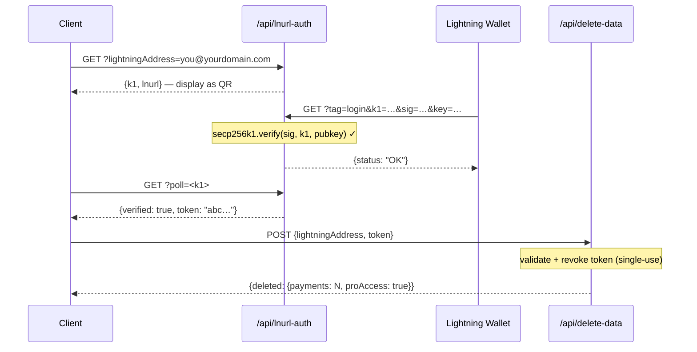

## Token security model

L402 tokens consist of two parts joined by `:`:

```
<macaroon>:<preimage>
```

- **Macaroon** — base64-encoded JSON containing `{hash, exp}`. Signed by SHA-256. Cannot be forged without knowing the preimage.
- **Preimage** — the 32-byte secret that, when hashed with SHA-256, must match the hash embedded in the macaroon.

**Verification is fully local** — no database lookup, no network call. The SDK verifies the hash relationship cryptographically in microseconds.

---

## Replay protection

l402-kit includes **built-in replay protection**. Each preimage can only be used once:

```typescript
// ✅ Built-in — enabled by default
app.get("/api", l402({ priceSats: 10, lightning: blink }), handler);
```

The first use of a token marks the preimage as spent. Any subsequent request with the same preimage returns `401 Token already used`.

**Default store**: in-memory `Set`. This means:
- Restarts clear the replay store (tokens become reusable across restarts)
- Multiple instances don't share state

**For production** with multiple instances, implement a persistent replay store:

```typescript
import { checkAndMarkPreimage } from "l402-kit";

// Example: Redis-backed replay store
async function redisCheckAndMark(preimage: string): Promise<boolean> {
  const key = `l402:used:${preimage}`;
  const set = await redis.set(key, "1", "NX", "EX", 86400); // 24h TTL
  return set === "OK"; // true = first use, false = replay
}
```

---

## Token expiry

Tokens carry an `exp` field (Unix timestamp in ms). The SDK rejects expired tokens automatically.

Default TTL: **1 hour** (set by the Lightning provider when creating the invoice).

```typescript
// Tokens are valid for 1 hour after invoice creation.
// After expiry, the client must pay again to get a new token.
```

---

## HTTPS is required

**Never use L402 over plain HTTP in production.** The macaroon and preimage are transmitted in the `Authorization` header. Over HTTP, they are exposed to network attackers.

```nginx
# nginx — redirect HTTP to HTTPS
server {
    listen 80;
    return 301 https://$host$request_uri;
}
```

---

## Rate limiting

L402 verifies tokens cryptographically, not by looking up a database — so it's cheap. But Lightning invoice creation (the 402 response) calls your Lightning provider's API.

Protect invoice creation with a rate limiter to prevent DoS:

```typescript
import rateLimit from "express-rate-limit";

const invoiceLimiter = rateLimit({
  windowMs: 60_000,
  max: 20, // 20 unpaid requests per minute per IP
  skip: (req) => req.headers.authorization?.startsWith("L402 ") ?? false,
});

app.use("/api", invoiceLimiter);
app.get("/api/data", l402({ priceSats: 10, lightning: blink }), handler);
```

---

## Secrets management

Never hardcode API keys. Use environment variables:

```typescript
// ✅ Correct
const blink = new BlinkProvider(
  process.env.BLINK_API_KEY!,
  process.env.BLINK_WALLET_ID!,
);

// ❌ Never do this
const blink = new BlinkProvider("blink_abc123...", "wallet-id-here");
```

Use a secrets manager in production: AWS Secrets Manager, Doppler, Vault, or `.env` + dotenv (never committed to git).

---

## Admin endpoint authentication

If you expose admin or stats endpoints, **never accept secrets via URL query parameters**. URLs are logged in full by reverse proxies, CDNs, and cloud providers — including the query string.

```typescript
// ❌ Never — secret visible in Cloudflare Workers logs
GET /api/stats?secret=my-secret

// ✅ Correct — header is not logged by default
GET /api/stats
x-dashboard-secret: my-secret
```

```typescript
// Enforce header-only in your handler
const token = req.headers["x-dashboard-secret"];
if (!SECRET || token !== SECRET) return res.status(401).json({ error: "Unauthorized" });
```

---

## Supabase key hygiene

Use `SUPABASE_SERVICE_KEY` (server-side only) vs `SUPABASE_ANON_KEY` (safe to expose to clients) correctly:

| Key | Use | Bypasses RLS? |
|---|---|---|
| `anon` | VS Code extension, browser clients | No |
| `service_role` | Server-side API functions | Yes |

Server-side Cloudflare Workers that read sensitive tables (e.g. `pro_access`) must use the service key — never the anon key. RLS policies on sensitive tables should not grant anon access.

```typescript
// ✅ Server-side endpoint
const SUPABASE_KEY = process.env.SUPABASE_SERVICE_KEY ?? process.env.SUPABASE_ANON_KEY ?? "";
```

---

## Content Security Policy

If you serve a frontend alongside your API, ensure your CSP doesn't block the L402 flow:

```http
Content-Security-Policy: connect-src 'self' https://api.blink.sv
```

---

## Data management — user data deletion

Users can delete all their payment history and Pro subscription from within the VS Code extension at any time (**Settings → Danger Zone**). The extension calls:

```http
POST /api/delete-data
Content-Type: application/json

{ "lightningAddress": "user@blink.sv" }
```

Response:

```json
{ "deleted": { "payments": 42, "proAccess": true } }
```

This endpoint uses the Supabase **service role key** server-side to bypass RLS and permanently delete:

- All rows in `payments` where `owner_address = ?`
- All rows in `pro_access` where `address = ?`

<Note>
The extension requires the user to type their Lightning address verbatim before the delete button is enabled — GitHub-style confirmation for destructive actions.
</Note>

If you're building your own dashboard on top of l402-kit, expose a similar endpoint for your users. Never allow deletion via the anon key — always proxy through a server-side function with the service key.

---

## Privacy & data minimization

l402-kit is designed to collect the minimum data needed to operate. Here is what is stored, why, and how to harden each field.

### What gets stored

| Table | Field | Why | Sensitivity |
|---|---|---|---|
| `payments` | `preimage` | Replay protection + proof of payment | ⚠️ Medium — hash it instead (see below) |
| `payments` | `owner_address` | Attribute revenue to Lightning address | Low — Lightning addresses are public |
| `payments` | `amount_sats` | Dashboard stats | Low |
| `payments` | `endpoint` | Per-endpoint analytics | Low–medium |
| `pro_access` | `address` | Verify Pro subscription | Low — public |
| `waitlist` | `email` | Send welcome + release emails | ⚠️ High — real PII, encrypt or omit |
| `waitlist` | `lightning_address` | Optional identity signal | Low |

### Hash preimages instead of storing them raw

The preimage is the 32-byte secret that proves a Lightning payment was made. Storing it raw means a database breach exposes every proof. Store the SHA-256 hash instead — it is already public (embedded in the BOLT11 invoice) and sufficient for replay protection:

```typescript
import { createHash } from 'crypto';

// Instead of storing preimage directly:
const paymentHash = createHash('sha256').update(Buffer.from(preimage, 'hex')).digest('hex');

await supabase.from('payments').insert({
  payment_hash: paymentHash,   // ✅ safe to store
  // preimage: preimage        // ❌ avoid
  owner_address,
  amount_sats,
  endpoint,
});

// Replay check: hash the incoming preimage, look up the hash
const incomingHash = createHash('sha256').update(Buffer.from(incoming, 'hex')).digest('hex');
const { data } = await supabase.from('payments').select('id').eq('payment_hash', incomingHash);
const alreadyUsed = data && data.length > 0;
```

### Protect waitlist emails

Email addresses are the only true PII in the system. Options in order of increasing protection:

```typescript
// Option A — encrypt before insert (AES-256-GCM, key stored outside Supabase)
import { createCipheriv, randomBytes } from 'crypto';
const key = Buffer.from(process.env.EMAIL_ENCRYPTION_KEY!, 'hex'); // 32 bytes
const iv  = randomBytes(12);
const cipher = createCipheriv('aes-256-gcm', key, iv);
const encrypted = Buffer.concat([cipher.update(email), cipher.final()]);
const tag = cipher.getAuthTag();
const stored = iv.toString('hex') + ':' + tag.toString('hex') + ':' + encrypted.toString('hex');

// Option B — store only a SHA-256 hash (irreversible — cannot send more emails)
const emailHash = createHash('sha256').update(email.toLowerCase()).digest('hex');

// Option C — do not store the email at all (send the welcome email and discard)
```

### Prove wallet ownership before deleting data (LNURL-auth)

The `/api/delete-data` endpoint should only accept requests from the actual owner of the Lightning address. Use **LNURL-auth** to prove ownership cryptographically — the user signs a server challenge with their Lightning wallet private key, with no password or account required:



See the [complete flow diagram](/guides/flows#5-lnurl-auth--wallet-ownership-proof-delete-data) for the full sequence with Supabase state.

This ensures no one can delete another user's records, even if they know the Lightning address.

---

## Checklist

<AccordionGroup>
  <Accordion title="Before going live">
    - [ ] HTTPS enforced on all endpoints
    - [ ] API keys in environment variables, not source code
    - [ ] Admin/stats endpoints use header auth, not `?secret=` URL params
    - [ ] Supabase `service_role` key used server-side; `anon` key only on clients
    - [ ] Sensitive Supabase tables have no `anon` SELECT policy
    - [ ] Data deletion endpoint (`/api/delete-data`) uses service key, never anon
    - [ ] Rate limiter on invoice creation
    - [ ] Replay protection tested (try reusing a preimage → expect 401)
    - [ ] Token expiry tested (set short TTL in dev, confirm 401 after expiry)
    - [ ] Preimages stored as SHA-256 hashes, not raw secrets
    - [ ] Waitlist emails encrypted at rest or discarded after sending
    - [ ] `/api/delete-data` requires LNURL-auth proof of wallet ownership
  </Accordion>
  <Accordion title="For high-traffic APIs">
    - [ ] Redis-backed replay store (shared across instances)
    - [ ] Monitoring on 402 response rates (spike = potential DoS)
    - [ ] Lightning provider failover (BlinkProvider → LNbitsProvider fallback)
    - [ ] Status page monitoring for your Lightning provider (e.g. status.blink.sv)
  </Accordion>
</AccordionGroup>
