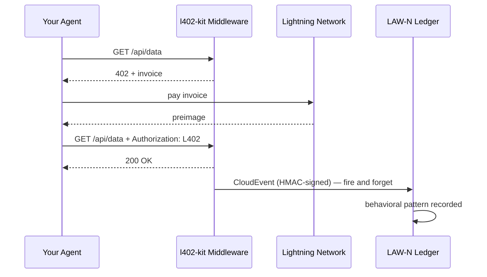

# LAW-N Behavioral Events

LAW-N (SAGEWORKS AI) स्वायत्त एजेंटों के लिए एक व्यवहार संबंधी बहीखाता है। आपका एजेंट जो भी L402 भुगतान करता है, वह एक हस्ताक्षरित CloudEvent उत्सर्जित कर सकता है — एक क्रिप्टोग्राफ़िक ऑडिट ट्रेल बनाता है जो समय के साथ एजेंट की प्रतिष्ठा स्कोर बन जाती है।

**कोई अधिकारी प्रतिष्ठा प्रदान नहीं करता। लेन-देन ही प्रमाण है।**

---

## यह कैसे काम करता है



हर सफल भुगतान के बाद इवेंट उत्सर्जित होता है। यह कभी भी रिस्पॉन्स को ब्लॉक नहीं करता — यदि LAW-N अनुपलब्ध है, तो आपके एजेंट को फिर भी डेटा मिलता है।

---

## क्लाइंट साइड पर सक्षम करें

```typescript
import { L402Client } from "l402-kit/agent";
import { BlinkWallet } from "l402-kit/wallets";
import { createLawNAdapter } from "l402-kit/agent";

const lawN = createLawNAdapter({
  ingestUrl: "https://l402kit.com/api/lawn-events",
  hmacSecret: process.env.LAWN_HMAC_SECRET!,
  network: "mainnet",
});

const client = new L402Client({
  wallet: new BlinkWallet(process.env.BLINK_API_KEY!),
  agentId: "agent:myorg.myagent",
  budget: { maxSats: 1000 },
  onEvent: lawN,
});
```

---

## इवेंट प्रकार

| इवेंट | कब उत्सर्जित होता है |
|---|---|
| `l402.challenge.received` | सर्वर ने HTTP 402 लौटाया |
| `l402.payment.initiated` | एजेंट ने इनवॉइस का भुगतान शुरू किया |
| `l402.payment.settled` | भुगतान की पुष्टि हुई, preimage प्राप्त हुआ |
| `l402.access.granted` | सर्वर ने L402 टोकन स्वीकार किया |
| `l402.budget.exhausted` | एजेंट अपनी खर्च सीमा पर पहुंच गया |
| `l402.token.reused` | एजेंट ने मौजूदा प्रमाण के साथ पुनः प्रयास किया |
| `l402.proof.reuse.attempt` | एक खर्च किए गए preimage को पुनः उपयोग करने का प्रयास किया |

---

## CloudEvents 1.0 फ़ॉर्मेट

```json
{
  "specversion": "1.0",
  "type": "l402.payment.settled",
  "source": "l402-kit",
  "id": "req_a1b2c3d4",
  "time": "2026-05-10T14:32:00.000Z",
  "subject": "agent-payment-flow",
  "datacontenttype": "application/json",
  "data": {
    "agent_id": "agent:myorg.myagent",
    "session_id": "sess_8f3a1b2c",
    "request_id": "req_a1b2c3d4",
    "endpoint": "https://api.example.com/data",
    "event_type": "l402.payment.settled",
    "network": { "provider": "blink", "environment": "mainnet" },
    "payment": {
      "amount_sats": 100,
      "preimage_hash": "sha256:abc123...",
      "settled": true,
      "latency_ms": 487
    },
    "behavior": {
      "retry_count": 0,
      "proof_reuse_attempt": false,
      "budget_remaining": 900,
      "budget_exhausted": false
    }
  }
}
```

---

## प्रतिष्ठा कैसी दिखती है

जो एजेंट लगातार:
- पहले प्रयास में इनवॉइस का भुगतान करते हैं
- बजट की सीमाओं का सम्मान करते हैं
- proof reuse का प्रयास नहीं करते
- विविध endpoints पर काम करते हैं

...वे स्वचालित रूप से प्रतिष्ठा बनाते हैं। जो एजेंट गलत व्यवहार करते हैं वे सेवाओं तक पहुंचने में असमर्थ हो जाते हैं।

कोई whitelist नहीं। कोई governance vote नहीं। कोई अधिकारी यह तय नहीं करता कि कौन भरोसेमंद है। बहीखाता ही प्रमाण है।

---

## गतिविधि डैशबोर्ड

सार्वजनिक आँकड़े यहाँ उपलब्ध हैं:

```bash
curl https://l402kit.com/api/activity
```

```json
{
  "total_events": 1420,
  "unique_agents": 12,
  "total_sats": 84200,
  "recent_events": [...],
  "top_agents": [
    { "agent_id": "agent:shinydapps.verity", "event_count": 847 }
  ]
}
```

लाइव डैशबोर्ड: [l402kit.com/activity](https://l402kit.com/activity)