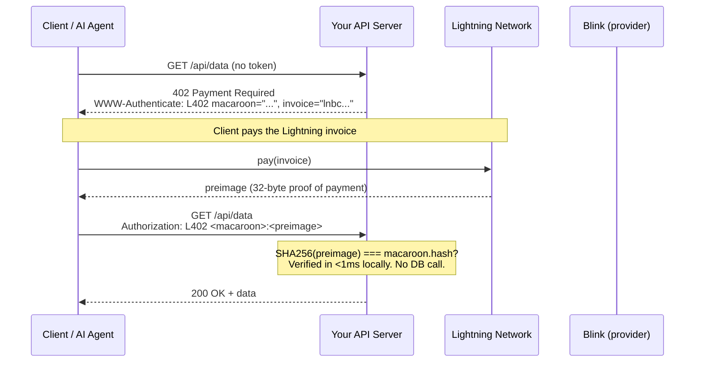
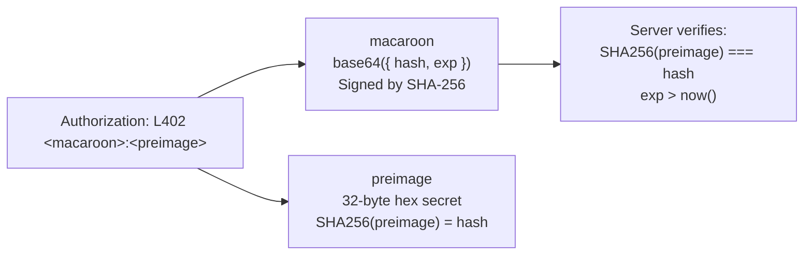
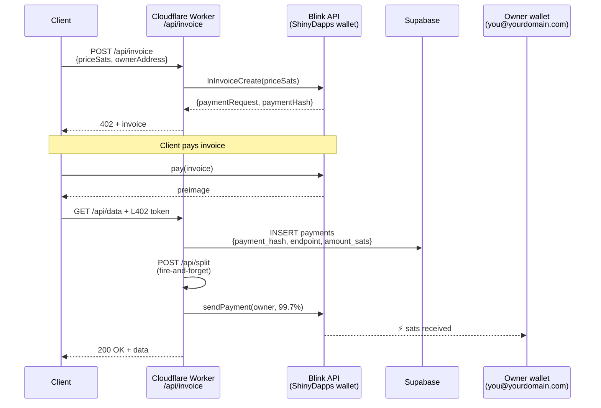
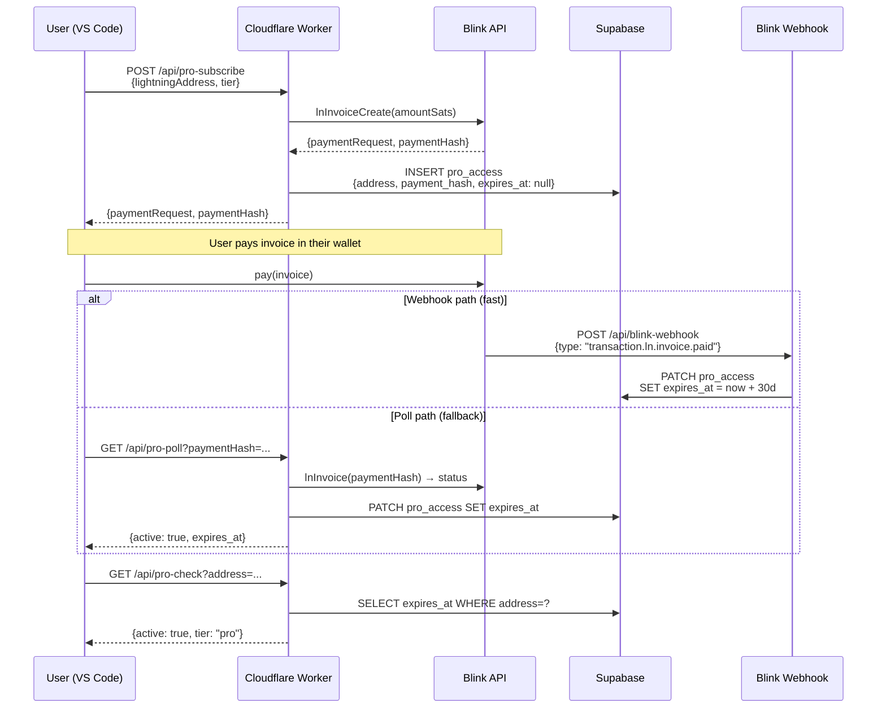
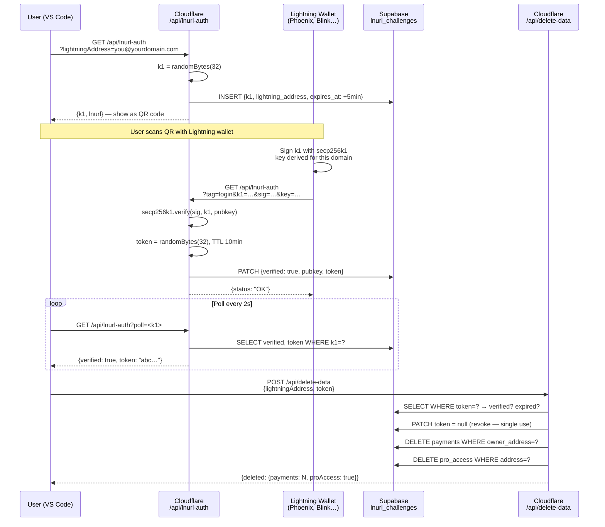
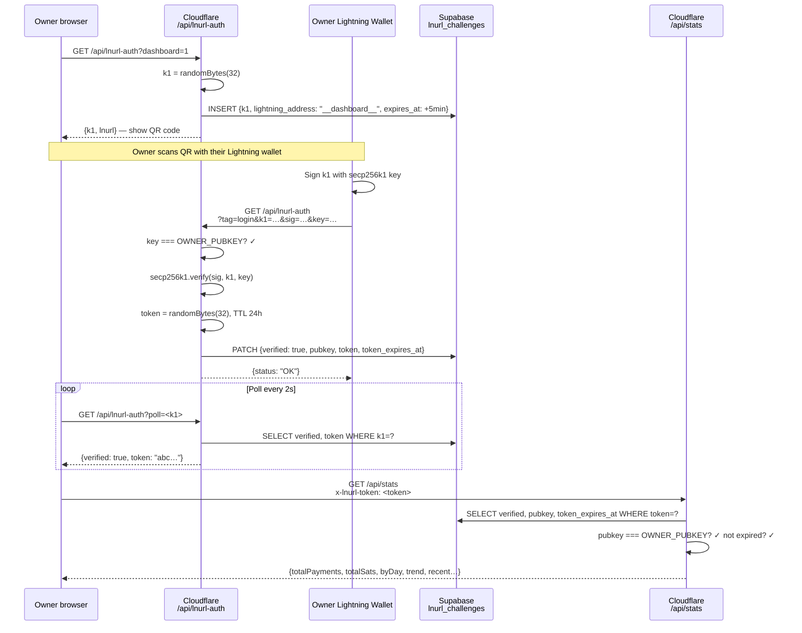
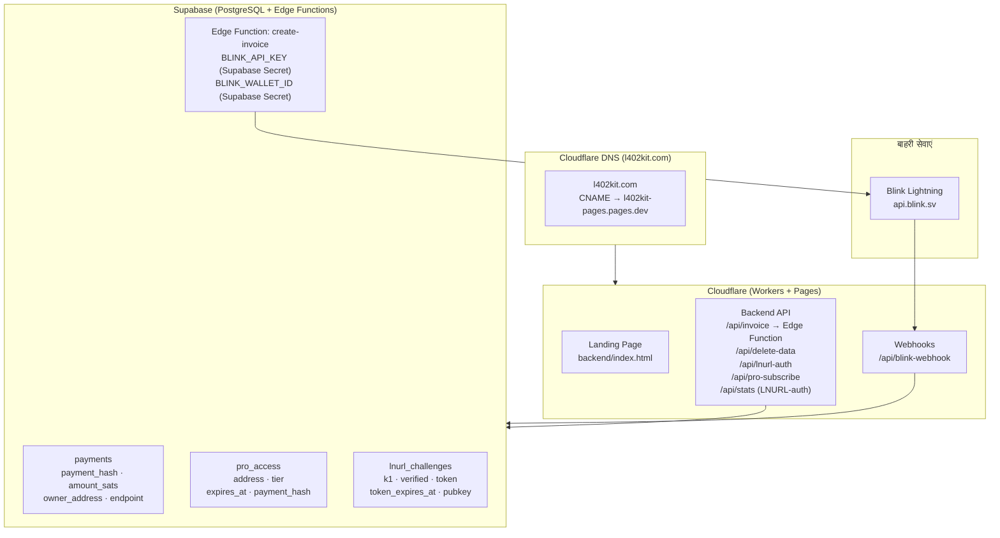
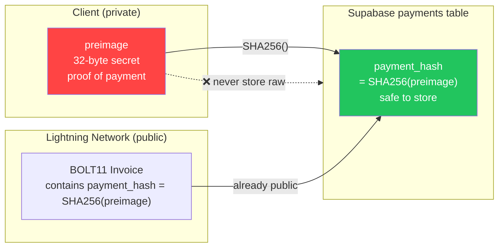

यह पेज l402-kit प्लेटफ़ॉर्म के हर प्रमुख flow को sequence और flowchart डायग्राम के रूप में दस्तावेज़ करता है। प्रत्येक section एक visual के साथ एक संक्षिप्त व्याख्या देता है कि क्या होता है और यह उस तरह क्यों काम करता है। क्रिप्टोग्राफ़िक नींव समझने के लिए Flow 1 (core L402) से शुरू करें, फिर अपने integration से संबंधित flows पढ़ें।

---

## 1. Core L402 Payment Flow

मूलभूत request cycle। कोई account नहीं, कोई password नहीं — बस एक cryptographic receipt।

जब कोई client पहली बार किसी protected endpoint को hit करता है, तो उसे एक HTTP 402 response मिलता है जिसमें दो चीज़ें होती हैं: एक BOLT11 Lightning invoice और एक macaroon। client Lightning Network के ज़रिए invoice का भुगतान करता है (आमतौर पर एक सेकंड से भी कम में), proof के रूप में एक 32-byte preimage प्राप्त करता है, और `Authorization: L402 <macaroon>:<preimage>` के साथ request को दोबारा भेजता है। server `SHA256(preimage) === macaroon.hash` का उपयोग करके locally token को verify करता है — कोई database call नहीं, कोई network round trip नहीं, sub-millisecond latency। एक बार verify हो जाने के बाद, token अपनी expiry तक valid रहता है। बाद की requests उसी header को reuse करती हैं।

**मुख्य गुण:**
- Verification पूरी तरह local है — कोई network call नहीं, कोई database lookup नहीं
- `preimage` = payment का cryptographic proof (Lightning receipt)
- `macaroon` = base64 JSON `{hash, exp}` जो SHA-256 से signed है

---

## 2. Token Anatomy

`Authorization` header में colon से अलग किए गए दो components होते हैं। **macaroon** एक base64-encoded JSON object `{hash, exp}` है — यह server को बताता है कि किस payment hash की उम्मीद करनी है और token कब expire होता है। **preimage** वह 32-byte secret है जो Lightning Network ने payer को वापस किया। साथ मिलकर वे एक ऐसा unforgeable, self-contained credential बनाते हैं जिसे कोई भी server offline verify कर सकता है।

---

## 3. Managed Mode — Fee Split Flow

जब आप `ManagedProvider` का उपयोग करते हैं, तो l402kit.com invoice बनाता है, payment प्राप्त करता है, और स्वचालित रूप से 99.7% आपके Lightning Address पर forward करता है। 0.3% platform fee Lightning routing और API infrastructure को cover करती है। आपका wallet कभी Cloudflare Worker को नहीं छूता — split एक server-side Lightning payment है जो client की request verify होने के बाद fire होती है, और आपके Lightning Address का उपयोग करके on the fly एक fresh BOLT11 invoice generate करती है।

---

## 4. Pro Subscription Flow

Pro subscriptions एक समान L402 pattern का पालन करती हैं लेकिन persistent state जोड़ती हैं। client एक one-time invoice का भुगतान करता है और Supabase में एक 30-day subscription record प्राप्त करता है। Payment confirmation या तो Blink webhook (fast path, ~2 seconds) के ज़रिए या polling (उन wallets के लिए fallback जो webhooks trigger नहीं करते) के ज़रिए आती है। बाद के `/api/pro-check` calls किसी अन्य payment के बिना `expires_at` timestamp verify करते हैं।

---

## 5. LNURL-auth — Wallet Ownership Proof (Delete Data)

बिना password के यह साबित करता है कि आपके पास Lightning wallet है। account data delete करने से पहले आवश्यक।

---

## 6. Dashboard LNURL-auth Login Flow

Owner-only dashboard authentication — DASHBOARD_SECRET Cloudflare Workers secrets में stored है।

---

## 7. Infrastructure Overview

---

## 8. SHA-256 Preimage Security

हम raw preimage की जगह `SHA256(preimage)` क्यों store करते हैं:

**यह क्यों safe है:** `payment_hash` पहले से ही हर BOLT11 invoice में embedded होता है — यह design से public है। केवल `preimage` secret है। hash store करने से आपको zero additional exposure के साथ replay protection मिलती है।