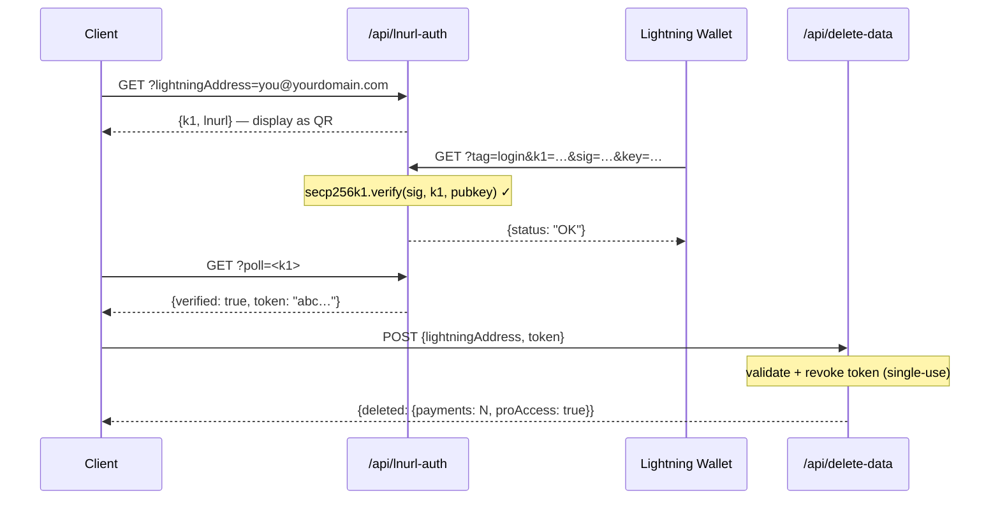

## टोकन सुरक्षा मॉडल

L402 टोकन दो भागों से मिलकर बने होते हैं जो `:` से जुड़े होते हैं:

```
<macaroon>:<preimage>
```

- **Macaroon** — base64-एन्कोडेड JSON जिसमें `{hash, exp}` है। SHA-256 से हस्ताक्षरित। preimage जाने बिना इसे जाली नहीं बनाया जा सकता।
- **Preimage** — 32-बाइट का रहस्य जो, SHA-256 से हैश होने पर, macaroon में एम्बेड किए गए हैश से मेल खाना चाहिए।

**सत्यापन पूरी तरह स्थानीय है** — कोई डेटाबेस लुकअप नहीं, कोई नेटवर्क कॉल नहीं। SDK माइक्रोसेकंड में क्रिप्टोग्राफिक रूप से हैश संबंध को सत्यापित करता है।

---

## रीप्ले सुरक्षा

l402-kit में **बिल्ट-इन रीप्ले सुरक्षा** शामिल है। प्रत्येक preimage का उपयोग केवल एक बार किया जा सकता है:

```typescript
// ✅ बिल्ट-इन — डिफ़ॉल्ट रूप से सक्षम
app.get("/api", l402({ priceSats: 10, lightning: blink }), handler);
```

टोकन के पहले उपयोग पर preimage को खर्च के रूप में चिह्नित किया जाता है। उसी preimage के साथ कोई भी बाद का अनुरोध `401 Token already used` लौटाता है।

**डिफ़ॉल्ट स्टोर**: इन-मेमोरी `Set`। इसका अर्थ है:
- रीस्टार्ट रीप्ले स्टोर को साफ़ कर देता है (टोकन रीस्टार्ट के बाद पुनः उपयोग योग्य हो जाते हैं)
- एकाधिक इंस्टेंस स्टेट साझा नहीं करते

एकाधिक इंस्टेंस के साथ **प्रोडक्शन के लिए**, एक स्थायी रीप्ले स्टोर लागू करें:

```typescript
import { checkAndMarkPreimage } from "l402-kit";

// उदाहरण: Redis-backed रीप्ले स्टोर
async function redisCheckAndMark(preimage: string): Promise<boolean> {
  const key = `l402:used:${preimage}`;
  const set = await redis.set(key, "1", "NX", "EX", 86400); // 24h TTL
  return set === "OK"; // true = पहला उपयोग, false = रीप्ले
}
```

---

## टोकन एक्सपायरी

टोकन में एक `exp` फ़ील्ड होती है (Unix timestamp ms में)। SDK स्वचालित रूप से एक्सपायर हुए टोकन को अस्वीकार करता है।

डिफ़ॉल्ट TTL: **1 घंटा** (इनवॉइस बनाते समय Lightning provider द्वारा सेट किया जाता है)।

```typescript
// टोकन इनवॉइस बनाने के 1 घंटे बाद तक वैध हैं।
// एक्सपायरी के बाद, क्लाइंट को नया टोकन पाने के लिए फिर से भुगतान करना होगा।
```

---

## HTTPS आवश्यक है

**प्रोडक्शन में कभी भी L402 को सादे HTTP पर उपयोग न करें।** macaroon और preimage `Authorization` हेडर में ट्रांसमिट होते हैं। HTTP पर, वे नेटवर्क हमलावरों के सामने उजागर हो जाते हैं।

```nginx
# nginx — HTTP को HTTPS पर रीडायरेक्ट करें
server {
    listen 80;
    return 301 https://$host$request_uri;
}
```

---

## रेट लिमिटिंग

L402 टोकन को क्रिप्टोग्राफिक रूप से सत्यापित करता है, डेटाबेस लुकअप से नहीं — इसलिए यह सस्ता है। लेकिन Lightning इनवॉइस बनाना (402 रिस्पॉन्स) आपके Lightning provider के API को कॉल करता है।

DoS से बचाने के लिए इनवॉइस बनाने को रेट लिमिटर से सुरक्षित करें:

```typescript
import rateLimit from "express-rate-limit";

const invoiceLimiter = rateLimit({
  windowMs: 60_000,
  max: 20, // प्रति IP प्रति मिनट 20 अवैतनिक अनुरोध
  skip: (req) => req.headers.authorization?.startsWith("L402 ") ?? false,
});

app.use("/api", invoiceLimiter);
app.get("/api/data", l402({ priceSats: 10, lightning: blink }), handler);
```

---

## सीक्रेट्स प्रबंधन

API कुंजियों को कभी भी हार्डकोड न करें। एनवायरनमेंट वेरिएबल्स का उपयोग करें:

```typescript
// ✅ सही
const blink = new BlinkProvider(
  process.env.BLINK_API_KEY!,
  process.env.BLINK_WALLET_ID!,
);

// ❌ ऐसा कभी न करें
const blink = new BlinkProvider("blink_abc123...", "wallet-id-here");
```

प्रोडक्शन में एक सीक्रेट्स मैनेजर का उपयोग करें: AWS Secrets Manager, Doppler, Vault, या `.env` + dotenv (कभी git में कमिट न करें)।

---

## एडमिन एंडपॉइंट प्रमाणीकरण

यदि आप एडमिन या स्टैट्स एंडपॉइंट एक्सपोज़ करते हैं, तो **URL क्वेरी पैरामीटर के माध्यम से कभी भी सीक्रेट्स स्वीकार न करें**। URL रिवर्स प्रॉक्सी, CDN और क्लाउड प्रदाताओं द्वारा क्वेरी स्ट्रिंग सहित पूरी तरह लॉग किए जाते हैं।

```typescript
// ❌ कभी नहीं — Cloudflare Workers लॉग्स में सीक्रेट दिखाई देता है
GET /api/stats?secret=my-secret

// ✅ सही — हेडर डिफ़ॉल्ट रूप से लॉग नहीं होता
GET /api/stats
x-dashboard-secret: my-secret
```

```typescript
// अपने हैंडलर में केवल-हेडर को लागू करें
const token = req.headers["x-dashboard-secret"];
if (!SECRET || token !== SECRET) return res.status(401).json({ error: "Unauthorized" });
```

---

## Supabase कुंजी स्वच्छता

`SUPABASE_SERVICE_KEY` (केवल सर्वर-साइड) बनाम `SUPABASE_ANON_KEY` (क्लाइंट को एक्सपोज़ करने के लिए सुरक्षित) का सही तरीके से उपयोग करें:

| कुंजी | उपयोग | RLS को बायपास करती है? |
|---|---|---|
| `anon` | VS Code एक्सटेंशन, ब्राउज़र क्लाइंट | नहीं |
| `service_role` | सर्वर-साइड API फ़ंक्शन | हाँ |

सर्वर-साइड Cloudflare Workers जो संवेदनशील टेबल (जैसे `pro_access`) पढ़ते हैं, उन्हें सर्विस कुंजी का उपयोग करना चाहिए — कभी भी anon कुंजी का नहीं। संवेदनशील टेबल पर RLS नीतियां anon एक्सेस प्रदान नहीं करनी चाहिए।

```typescript
// ✅ सर्वर-साइड एंडपॉइंट
const SUPABASE_KEY = process.env.SUPABASE_SERVICE_KEY ?? process.env.SUPABASE_ANON_KEY ?? "";
```

---

## कंटेंट सिक्योरिटी पॉलिसी

यदि आप अपने API के साथ एक फ्रंटएंड भी सर्व करते हैं, तो सुनिश्चित करें कि आपकी CSP L402 फ्लो को ब्लॉक न करे:

```http
Content-Security-Policy: connect-src 'self' https://api.blink.sv
```

---

## डेटा प्रबंधन — उपयोगकर्ता डेटा हटाना

उपयोगकर्ता किसी भी समय VS Code एक्सटेंशन से अपना सारा पेमेंट इतिहास और Pro सदस्यता हटा सकते हैं (**Settings → Danger Zone**)। एक्सटेंशन यह कॉल करता है:

```http
POST /api/delete-data
Content-Type: application/json

{ "lightningAddress": "user@blink.sv" }
```

रिस्पॉन्स:

```json
{ "deleted": { "payments": 42, "proAccess": true } }
```

यह एंडपॉइंट RLS को बायपास करने और स्थायी रूप से हटाने के लिए Supabase **service role key** का सर्वर-साइड उपयोग करता है:

- `payments` में वे सभी पंक्तियाँ जहाँ `owner_address = ?`
- `pro_access` में वे सभी पंक्तियाँ जहाँ `address = ?`

<Note>
एक्सटेंशन के लिए आवश्यक है कि उपयोगकर्ता डिलीट बटन सक्षम होने से पहले अपना Lightning address शब्दशः टाइप करे — विनाशकारी कार्यों के लिए GitHub-शैली की पुष्टि।
</Note>

यदि आप l402-kit के ऊपर अपना डैशबोर्ड बना रहे हैं, तो अपने उपयोगकर्ताओं के लिए एक समान एंडपॉइंट एक्सपोज़ करें। anon कुंजी के माध्यम से कभी भी डिलीशन की अनुमति न दें — हमेशा सर्विस कुंजी के साथ सर्वर-साइड फ़ंक्शन के माध्यम से प्रॉक्सी करें।

---

## गोपनीयता और डेटा न्यूनीकरण

l402-kit को संचालन के लिए आवश्यक न्यूनतम डेटा एकत्र करने के लिए डिज़ाइन किया गया है। यहाँ बताया गया है कि क्या संग्रहीत किया जाता है, क्यों, और प्रत्येक फ़ील्ड को कैसे सख्त किया जाए।

### क्या संग्रहीत होता है

| टेबल | फ़ील्ड | क्यों | संवेदनशीलता |
|---|---|---|---|
| `payments` | `preimage` | रीप्ले सुरक्षा + भुगतान का प्रमाण | ⚠️ मध्यम — इसके बजाय हैश करें (नीचे देखें) |
| `payments` | `owner_address` | Lightning address को राजस्व का श्रेय दें | कम — Lightning addresses सार्वजनिक हैं |
| `payments` | `amount_sats` | डैशबोर्ड स्टैट्स | कम |
| `payments` | `endpoint` | प्रति-एंडपॉइंट एनालिटिक्स | कम–मध्यम |
| `pro_access` | `address` | Pro सदस्यता सत्यापित करें | कम — सार्वजनिक |
| `waitlist` | `email` | स्वागत + रिलीज़ ईमेल भेजें | ⚠️ उच्च — वास्तविक PII, एन्क्रिप्ट करें या छोड़ें |
| `waitlist` | `lightning_address` | वैकल्पिक पहचान संकेत | कम |

### raw संग्रहीत करने के बजाय preimage को हैश करें

preimage 32-बाइट का रहस्य है जो साबित करता है कि Lightning payment किया गया था। इसे raw संग्रहीत करने का अर्थ है कि डेटाबेस उल्लंघन से हर प्रमाण उजागर हो जाता है। इसके बजाय SHA-256 हैश संग्रहीत करें — यह पहले से ही सार्वजनिक है (BOLT11 इनवॉइस में एम्बेडेड) और रीप्ले सुरक्षा के लिए पर्याप्त है:

```typescript
import { createHash } from 'crypto';

// preimage को सीधे संग्रहीत करने के बजाय:
const paymentHash = createHash('sha256').update(Buffer.from(preimage, 'hex')).digest('hex');

await supabase.from('payments').insert({
  payment_hash: paymentHash,   // ✅ संग्रहीत करने के लिए सुरक्षित
  // preimage: preimage        // ❌ से बचें
  owner_address,
  amount_sats,
  endpoint,
});

// रीप्ले जाँच: आने वाले preimage को हैश करें, हैश देखें
const incomingHash = createHash('sha256').update(Buffer.from(incoming, 'hex')).digest('hex');
const { data } = await supabase.from('payments').select('id').eq('payment_hash', incomingHash);
const alreadyUsed = data && data.length > 0;
```

### waitlist ईमेल की सुरक्षा करें

ईमेल पते सिस्टम में एकमात्र वास्तविक PII हैं। बढ़ती सुरक्षा के क्रम में विकल्प:

```typescript
// विकल्प A — इन्सर्ट से पहले एन्क्रिप्ट करें (AES-256-GCM, कुंजी Supabase के बाहर संग्रहीत)
import { createCipheriv, randomBytes } from 'crypto';
const key = Buffer.from(process.env.EMAIL_ENCRYPTION_KEY!, 'hex'); // 32 बाइट
const iv  = randomBytes(12);
const cipher = createCipheriv('aes-256-gcm', key, iv);
const encrypted = Buffer.concat([cipher.update(email), cipher.final()]);
const tag = cipher.getAuthTag();
const stored = iv.toString('hex') + ':' + tag.toString('hex') + ':' + encrypted.toString('hex');

// विकल्प B — केवल SHA-256 हैश संग्रहीत करें (अपरिवर्तनीय — और ईमेल नहीं भेज सकते)
const emailHash = createHash('sha256').update(email.toLowerCase()).digest('hex');

// विकल्प C — ईमेल बिल्कुल संग्रहीत न करें (स्वागत ईमेल भेजें और हटा दें)
```

### डेटा हटाने से पहले वॉलेट स्वामित्व साबित करें (LNURL-auth)

`/api/delete-data` एंडपॉइंट को केवल Lightning address के वास्तविक मालिक से अनुरोध स्वीकार करने चाहिए। स्वामित्व को क्रिप्टोग्राफिक रूप से साबित करने के लिए **LNURL-auth** का उपयोग करें — उपयोगकर्ता अपनी Lightning wallet private key से सर्वर चैलेंज पर हस्ताक्षर करता है, बिना किसी पासवर्ड या अकाउंट की आवश्यकता के:



Supabase स्टेट के साथ पूर्ण अनुक्रम के लिए [पूर्ण फ्लो डायग्राम](/guides/flows#5-lnurl-auth--wallet-ownership-proof-delete-data) देखें।

यह सुनिश्चित करता है कि कोई भी किसी अन्य उपयोगकर्ता के रिकॉर्ड नहीं हटा सकता, भले ही वे Lightning address जानते हों।

---

## चेकलिस्ट

<AccordionGroup>
  <Accordion title="लाइव जाने से पहले">
    - [ ] सभी एंडपॉइंट पर HTTPS लागू
    - [ ] API कुंजियाँ एनवायरनमेंट वेरिएबल्स में, सोर्स कोड में नहीं
    - [ ] एडमिन/स्टैट्स एंडपॉइंट हेडर ऑथ का उपयोग करते हैं, `?secret=` URL params का नहीं
    - [ ] Supabase `service_role` कुंजी सर्वर-साइड उपयोग की जाती है; `anon` कुंजी केवल क्लाइंट पर
    - [ ] संवेदनशील Supabase टेबल में कोई `anon` SELECT नीति नहीं
    - [ ] डेटा डिलीशन एंडपॉइंट (`/api/delete-data`) सर्विस कुंजी का उपयोग करता है, कभी anon का नहीं
    - [ ] इनवॉइस बनाने पर रेट लिमिटर
    - [ ] रीप्ले सुरक्षा परीक्षण किया गया (preimage का पुनः उपयोग करने का प्रयास करें → 401 की अपेक्षा करें)
    - [ ] टोकन एक्सपायरी परीक्षण किया गया (dev में छोटा TTL सेट करें, एक्सपायरी के बाद 401 की पुष्टि करें)
    - [ ] Preimage SHA-256 हैश के रूप में संग्रहीत, raw सीक्रेट के रूप में नहीं
    - [ ] Waitlist ईमेल rest में एन्क्रिप्टेड या भेजने के बाद हटाए गए
    - [ ] `/api/delete-data` के लिए वॉलेट स्वामित्व का LNURL-auth प्रमाण आवश्यक
  </Accordion>
  <Accordion title="उच्च-ट्रैफ़िक API के लिए">
    - [ ] Redis-backed रीप्ले स्टोर (इंस्टेंस के बीच साझा)
    - [ ] 402 रिस्पॉन्स दरों पर मॉनिटरिंग (स्पाइक = संभावित DoS)
    - [ ] Lightning provider फेलओवर (BlinkProvider → LNbitsProvider फॉलबैक)
    - [ ] आपके Lightning provider के लिए स्टेटस पेज मॉनिटरिंग (जैसे status.blink.sv)
  </Accordion>
</AccordionGroup>