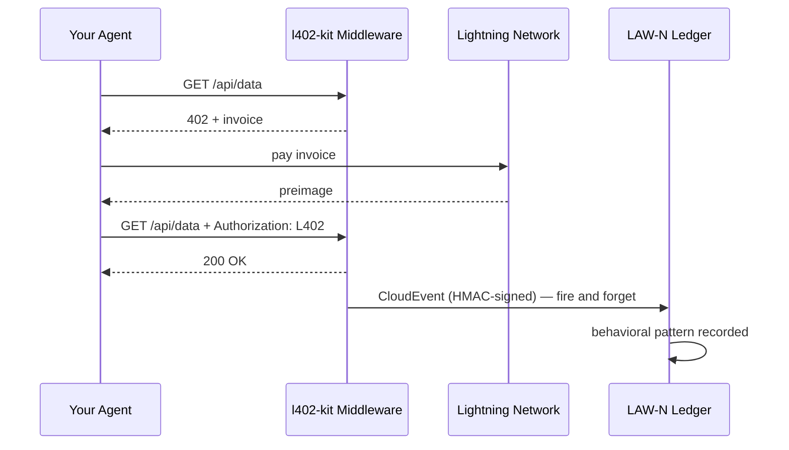

# LAW-N Behavioral Events

LAW-N (SAGEWORKS AI) è un registro comportamentale per agenti autonomi. Ogni pagamento L402 effettuato dal tuo agente può emettere un CloudEvent firmato — costruendo un audit trail crittografico che nel tempo diventa un punteggio di reputazione per l'agente.

**Nessuna autorità assegna la reputazione. Le transazioni sono la prova.**

---

## Come funziona



L'evento viene emesso dopo ogni pagamento andato a buon fine. Non blocca mai la risposta — se LAW-N non è disponibile, il tuo agente riceve comunque i dati.

---

## Abilitare lato client

```typescript
import { L402Client } from "l402-kit/agent";
import { BlinkWallet } from "l402-kit/wallets";
import { createLawNAdapter } from "l402-kit/agent";

const lawN = createLawNAdapter({
  ingestUrl: "https://l402kit.com/api/lawn-events",
  hmacSecret: process.env.LAWN_HMAC_SECRET!,
  network: "mainnet",
});

const client = new L402Client({
  wallet: new BlinkWallet(process.env.BLINK_API_KEY!),
  agentId: "agent:myorg.myagent",
  budget: { maxSats: 1000 },
  onEvent: lawN,
});
```

---

## Tipi di evento

| Evento | Emesso quando |
|---|---|
| `l402.challenge.received` | Il server ha restituito HTTP 402 |
| `l402.payment.initiated` | L'agente ha avviato il pagamento della fattura |
| `l402.payment.settled` | Pagamento confermato, preimage ricevuto |
| `l402.access.granted` | Il server ha accettato il token L402 |
| `l402.budget.exhausted` | L'agente ha raggiunto il limite di spesa |
| `l402.token.reused` | L'agente ha riprovato con una prova esistente |
| `l402.proof.reuse.attempt` | Tentativo di riutilizzo di un preimage già speso |

---

## Formato CloudEvents 1.0

```json
{
  "specversion": "1.0",
  "type": "l402.payment.settled",
  "source": "l402-kit",
  "id": "req_a1b2c3d4",
  "time": "2026-05-10T14:32:00.000Z",
  "subject": "agent-payment-flow",
  "datacontenttype": "application/json",
  "data": {
    "agent_id": "agent:myorg.myagent",
    "session_id": "sess_8f3a1b2c",
    "request_id": "req_a1b2c3d4",
    "endpoint": "https://api.example.com/data",
    "event_type": "l402.payment.settled",
    "network": { "provider": "blink", "environment": "mainnet" },
    "payment": {
      "amount_sats": 100,
      "preimage_hash": "sha256:abc123...",
      "settled": true,
      "latency_ms": 487
    },
    "behavior": {
      "retry_count": 0,
      "proof_reuse_attempt": false,
      "budget_remaining": 900,
      "budget_exhausted": false
    }
  }
}
```

---

## Come si presenta la reputazione

Gli agenti che in modo costante:
- Pagano le fatture al primo tentativo
- Rispettano i vincoli di budget
- Non tentano il riutilizzo della prova
- Operano su endpoint diversificati

...costruiscono reputazione automaticamente. Gli agenti che si comportano scorrettamente smettono di poter accedere ai servizi.

Nessuna whitelist. Nessun voto di governance. Nessuna autorità che decide chi è affidabile. Il registro è la prova.

---

## Dashboard delle attività

Statistiche pubbliche disponibili su:

```bash
curl https://l402kit.com/api/activity
```

```json
{
  "total_events": 1420,
  "unique_agents": 12,
  "total_sats": 84200,
  "recent_events": [...],
  "top_agents": [
    { "agent_id": "agent:shinydapps.verity", "event_count": 847 }
  ]
}
```

Dashboard in tempo reale: [l402kit.com/activity](https://l402kit.com/activity)