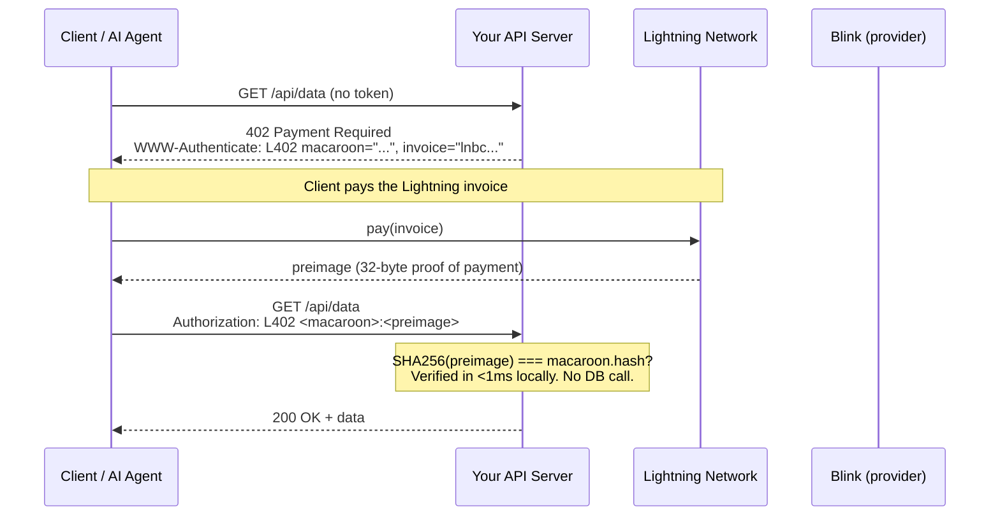
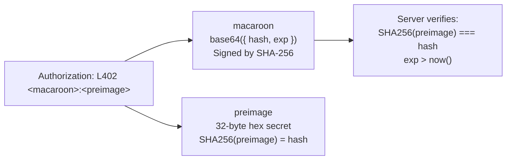
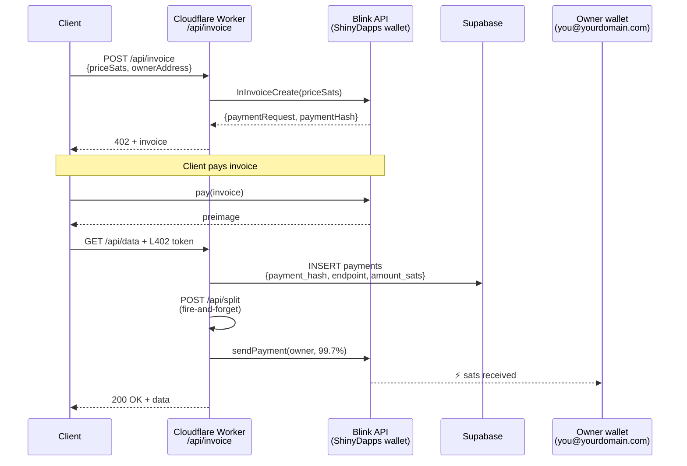
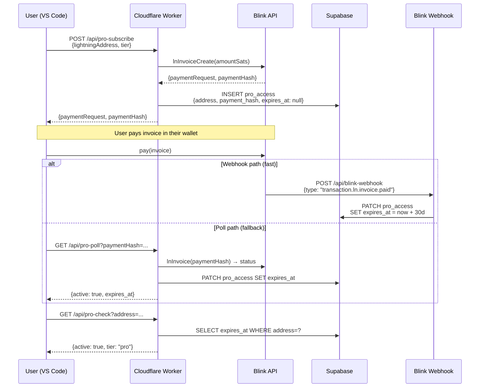
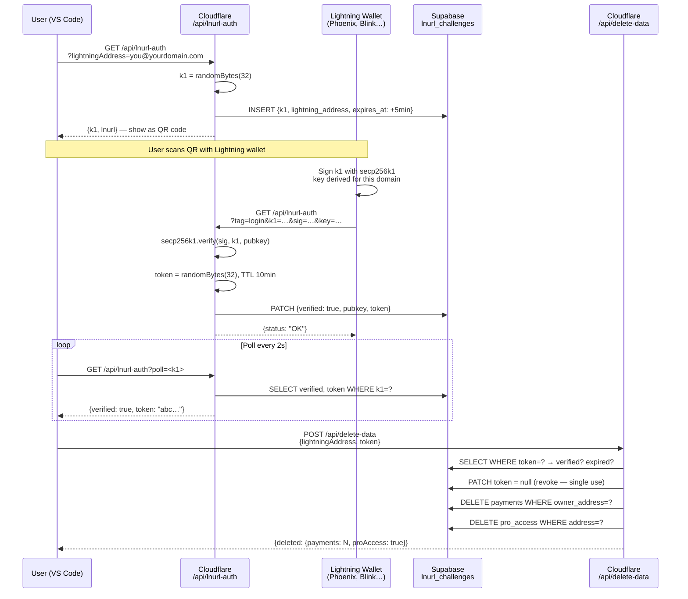
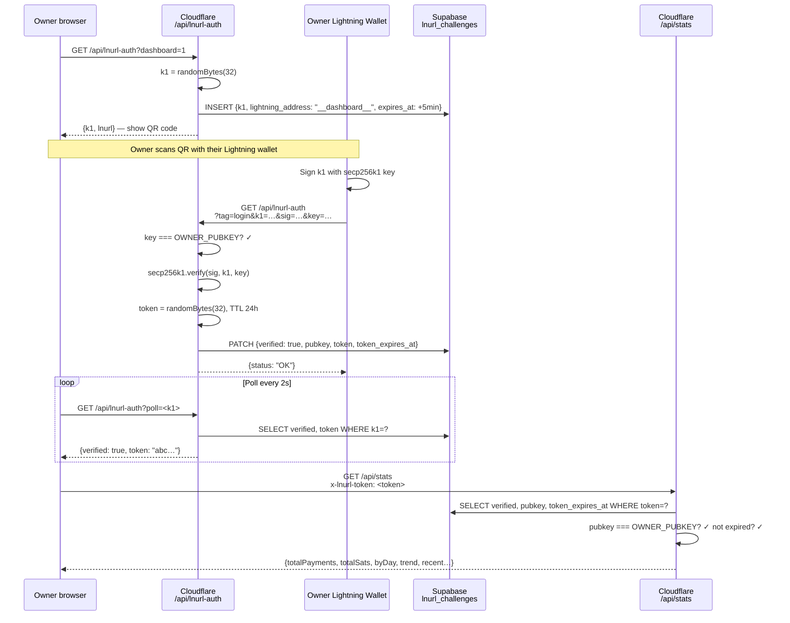
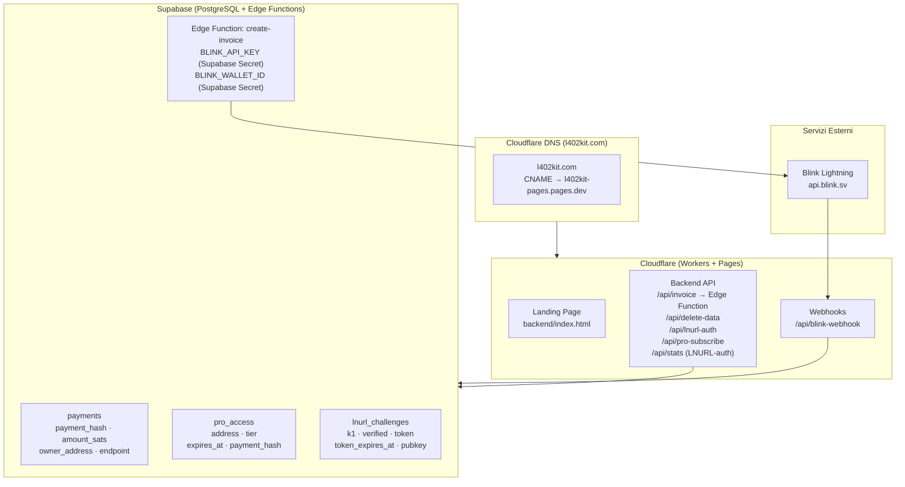
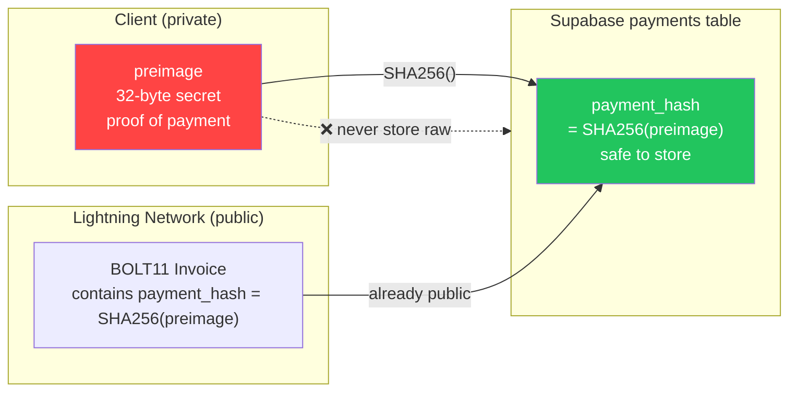

Questa pagina documenta ogni flusso principale nella piattaforma l402-kit come diagrammi di sequenza e diagrammi di flusso. Ogni sezione abbina un elemento visivo a una spiegazione concisa di cosa accade e perché funziona in quel modo. Inizia con il Flusso 1 (L402 di base) per comprendere i fondamenti crittografici, poi leggi i flussi rilevanti per la tua integrazione.

---

## 1. Flusso di Pagamento L402 di Base

Il ciclo di richiesta fondamentale. Nessun account, nessuna password — solo una ricevuta crittografica.

Quando un client raggiunge per la prima volta un endpoint protetto, riceve una risposta HTTP 402 contenente due elementi: una fattura BOLT11 Lightning e un macaroon. Il client paga la fattura attraverso la Lightning Network (tipicamente in meno di un secondo), riceve un preimage di 32 byte come prova, e riprova la richiesta con `Authorization: L402 <macaroon>:<preimage>`. Il server verifica il token localmente usando `SHA256(preimage) === macaroon.hash` — nessuna chiamata al database, nessun round trip di rete, latenza inferiore al millisecondo. Una volta verificato, il token è valido fino alla sua scadenza. Le richieste successive riutilizzano lo stesso header.

**Proprietà chiave:**
- La verifica è completamente locale — nessuna chiamata di rete, nessuna consultazione del database
- `preimage` = prova crittografica del pagamento (ricevuta Lightning)
- `macaroon` = JSON base64 `{hash, exp}` firmato con SHA-256

---

## 2. Anatomia del Token

L'header `Authorization` contiene due componenti separati da due punti. Il **macaroon** è un oggetto JSON codificato in base64 `{hash, exp}` — indica al server quale hash di pagamento aspettarsi e quando scade il token. Il **preimage** è il segreto di 32 byte restituito dalla Lightning Network al pagante. Insieme formano una credenziale non falsificabile e autonoma che qualsiasi server può verificare offline.

---

## 3. Modalità Gestita — Flusso di Divisione delle Commissioni

Quando usi `ManagedProvider`, l402kit.com crea la fattura, riceve il pagamento e inoltra il 99,7% al tuo Lightning Address automaticamente. La commissione di piattaforma dello 0,3% copre il routing Lightning e l'infrastruttura API. Il tuo wallet non tocca mai il Cloudflare Worker — la divisione è un pagamento Lightning lato server eseguito dopo che la richiesta del client è verificata, utilizzando il tuo Lightning Address per generare una nuova fattura BOLT11 al volo.

---

## 4. Flusso di Abbonamento Pro

Gli abbonamenti Pro seguono un pattern L402 simile ma aggiungono uno stato persistente. Il client paga una fattura una tantum e riceve un record di abbonamento di 30 giorni in Supabase. La conferma del pagamento arriva tramite webhook Blink (percorso veloce, ~2 secondi) o tramite polling (fallback per i wallet che non attivano webhook). Le successive chiamate a `/api/pro-check` verificano il timestamp `expires_at` senza un altro pagamento.

---

## 5. LNURL-auth — Prova di Proprietà del Wallet (Eliminazione Dati)

Dimostra che possiedi un Lightning wallet senza una password. Richiesto prima di eliminare i dati dell'account.

---

## 6. Flusso di Login Dashboard LNURL-auth

Autenticazione dashboard solo per il proprietario — DASHBOARD_SECRET memorizzato nei segreti di Cloudflare Workers.

---

## 7. Panoramica dell'Infrastruttura

---

## 8. Sicurezza del Preimage SHA-256

Perché memorizziamo `SHA256(preimage)` invece del preimage grezzo:

**Perché è sicuro:** Il `payment_hash` è già incorporato in ogni fattura BOLT11 — è pubblico per design. Solo il `preimage` è segreto. Memorizzare l'hash fornisce protezione contro i replay senza alcuna esposizione aggiuntiva.