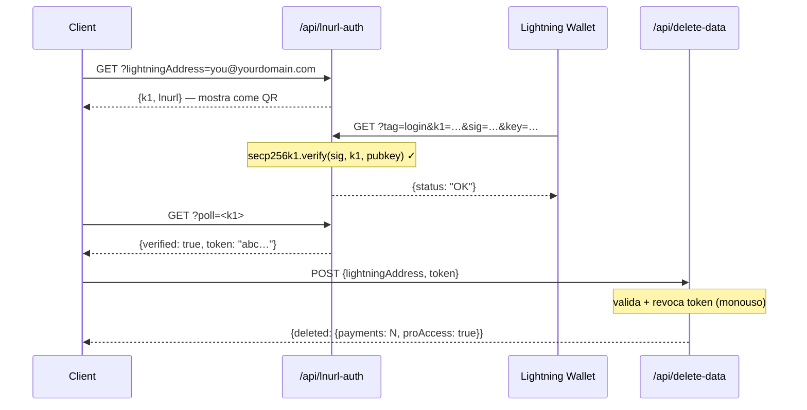

## Modello di sicurezza dei token

I token L402 sono composti da due parti unite da `:`:

```
<macaroon>:<preimage>
```

- **Macaroon** — JSON codificato in base64 contenente `{hash, exp}`. Firmato tramite SHA-256. Non può essere falsificato senza conoscere il preimage.
- **Preimage** — il segreto a 32 byte che, quando viene sottoposto a hashing con SHA-256, deve corrispondere all'hash incorporato nel macaroon.

**La verifica è completamente locale** — nessuna ricerca nel database, nessuna chiamata di rete. L'SDK verifica la relazione di hash crittograficamente in microsecondi.

---

## Protezione dal replay

l402-kit include una **protezione integrata dal replay**. Ogni preimage può essere utilizzato una sola volta:

```typescript
// ✅ Integrata — abilitata per impostazione predefinita
app.get("/api", l402({ priceSats: 10, lightning: blink }), handler);
```

Il primo utilizzo di un token contrassegna il preimage come speso. Qualsiasi richiesta successiva con lo stesso preimage restituisce `401 Token already used`.

**Store predefinito**: `Set` in memoria. Ciò significa:
- I riavvii azzerano lo store di replay (i token diventano riutilizzabili dopo i riavvii)
- Più istanze non condividono lo stato

**Per la produzione** con più istanze, implementa uno store di replay persistente:

```typescript
import { checkAndMarkPreimage } from "l402-kit";

// Esempio: store di replay basato su Redis
async function redisCheckAndMark(preimage: string): Promise<boolean> {
  const key = `l402:used:${preimage}`;
  const set = await redis.set(key, "1", "NX", "EX", 86400); // TTL 24h
  return set === "OK"; // true = primo utilizzo, false = replay
}
```

---

## Scadenza dei token

I token contengono un campo `exp` (timestamp Unix in ms). L'SDK rifiuta automaticamente i token scaduti.

TTL predefinito: **1 ora** (impostato dal provider Lightning durante la creazione della fattura).

```typescript
// I token sono validi per 1 ora dopo la creazione della fattura.
// Dopo la scadenza, il client deve pagare nuovamente per ottenere un nuovo token.
```

---

## HTTPS è obbligatorio

**Non utilizzare mai L402 su HTTP semplice in produzione.** Il macaroon e il preimage vengono trasmessi nell'header `Authorization`. Tramite HTTP, sono esposti agli attaccanti di rete.

```nginx
# nginx — reindirizza HTTP a HTTPS
server {
    listen 80;
    return 301 https://$host$request_uri;
}
```

---

## Rate limiting

L402 verifica i token crittograficamente, senza consultare un database — quindi è economico. Ma la creazione di fatture Lightning (la risposta 402) chiama l'API del tuo provider Lightning.

Proteggi la creazione delle fatture con un rate limiter per prevenire attacchi DoS:

```typescript
import rateLimit from "express-rate-limit";

const invoiceLimiter = rateLimit({
  windowMs: 60_000,
  max: 20, // 20 richieste non pagate al minuto per IP
  skip: (req) => req.headers.authorization?.startsWith("L402 ") ?? false,
});

app.use("/api", invoiceLimiter);
app.get("/api/data", l402({ priceSats: 10, lightning: blink }), handler);
```

---

## Gestione dei segreti

Non inserire mai le chiavi API nel codice sorgente. Usa le variabili d'ambiente:

```typescript
// ✅ Corretto
const blink = new BlinkProvider(
  process.env.BLINK_API_KEY!,
  process.env.BLINK_WALLET_ID!,
);

// ❌ Non farlo mai
const blink = new BlinkProvider("blink_abc123...", "wallet-id-here");
```

Usa un gestore di segreti in produzione: AWS Secrets Manager, Doppler, Vault, oppure `.env` + dotenv (mai committato su git).

---

## Autenticazione degli endpoint amministrativi

Se esponi endpoint di amministrazione o statistiche, **non accettare mai segreti tramite parametri di query nell'URL**. Gli URL vengono registrati integralmente da reverse proxy, CDN e provider cloud — inclusa la query string.

```typescript
// ❌ Mai — il segreto è visibile nei log di Cloudflare Workers
GET /api/stats?secret=my-secret

// ✅ Corretto — l'header non viene registrato per impostazione predefinita
GET /api/stats
x-dashboard-secret: my-secret
```

```typescript
// Imponi l'uso esclusivo dell'header nel tuo handler
const token = req.headers["x-dashboard-secret"];
if (!SECRET || token !== SECRET) return res.status(401).json({ error: "Unauthorized" });
```

---

## Igiene delle chiavi Supabase

Usa correttamente `SUPABASE_SERVICE_KEY` (solo lato server) rispetto a `SUPABASE_ANON_KEY` (sicuro da esporre ai client):

| Chiave | Utilizzo | Bypassa RLS? |
|---|---|---|
| `anon` | Estensione VS Code, client browser | No |
| `service_role` | Funzioni API lato server | Sì |

I Cloudflare Workers lato server che leggono tabelle sensibili (es. `pro_access`) devono usare la service key — mai la anon key. Le policy RLS sulle tabelle sensibili non devono concedere accesso alla chiave anon.

```typescript
// ✅ Endpoint lato server
const SUPABASE_KEY = process.env.SUPABASE_SERVICE_KEY ?? process.env.SUPABASE_ANON_KEY ?? "";
```

---

## Content Security Policy

Se servi un frontend insieme alla tua API, assicurati che la tua CSP non blocchi il flusso L402:

```http
Content-Security-Policy: connect-src 'self' https://api.blink.sv
```

---

## Gestione dei dati — eliminazione dei dati utente

Gli utenti possono eliminare tutta la loro cronologia dei pagamenti e l'abbonamento Pro direttamente dall'estensione VS Code in qualsiasi momento (**Impostazioni → Zona pericolosa**). L'estensione chiama:

```http
POST /api/delete-data
Content-Type: application/json

{ "lightningAddress": "user@blink.sv" }
```

Risposta:

```json
{ "deleted": { "payments": 42, "proAccess": true } }
```

Questo endpoint utilizza la **service role key** di Supabase lato server per bypassare RLS ed eliminare permanentemente:

- Tutte le righe in `payments` dove `owner_address = ?`
- Tutte le righe in `pro_access` dove `address = ?`

<Note>
L'estensione richiede all'utente di digitare il proprio indirizzo Lightning esattamente prima che il pulsante di eliminazione venga abilitato — una conferma in stile GitHub per le azioni distruttive.
</Note>

Se stai costruendo la tua dashboard sopra l402-kit, esponi un endpoint simile per i tuoi utenti. Non consentire mai l'eliminazione tramite la anon key — fai sempre passare attraverso una funzione lato server con la service key.

---

## Privacy e minimizzazione dei dati

l402-kit è progettato per raccogliere il minimo di dati necessari per funzionare. Ecco cosa viene memorizzato, perché e come rendere più sicuro ogni campo.

### Cosa viene memorizzato

| Tabella | Campo | Perché | Sensibilità |
|---|---|---|---|
| `payments` | `preimage` | Protezione dal replay + prova di pagamento | ⚠️ Media — usa l'hash al suo posto (vedi sotto) |
| `payments` | `owner_address` | Attribuire i ricavi all'indirizzo Lightning | Bassa — gli indirizzi Lightning sono pubblici |
| `payments` | `amount_sats` | Statistiche della dashboard | Bassa |
| `payments` | `endpoint` | Analitiche per endpoint | Bassa–media |
| `pro_access` | `address` | Verificare l'abbonamento Pro | Bassa — pubblico |
| `waitlist` | `email` | Inviare email di benvenuto e di rilascio | ⚠️ Alta — PII reale, cifrare o omettere |
| `waitlist` | `lightning_address` | Segnale opzionale di identità | Bassa |

### Memorizza gli hash dei preimage invece di archiviarli in chiaro

Il preimage è il segreto a 32 byte che prova che un pagamento Lightning è stato effettuato. Memorizzarlo in chiaro significa che una violazione del database espone ogni prova. Memorizza invece l'hash SHA-256 — è già pubblico (incorporato nella fattura BOLT11) e sufficiente per la protezione dal replay:

```typescript
import { createHash } from 'crypto';

// Invece di memorizzare direttamente il preimage:
const paymentHash = createHash('sha256').update(Buffer.from(preimage, 'hex')).digest('hex');

await supabase.from('payments').insert({
  payment_hash: paymentHash,   // ✅ sicuro da memorizzare
  // preimage: preimage        // ❌ da evitare
  owner_address,
  amount_sats,
  endpoint,
});

// Verifica replay: calcola l'hash del preimage in ingresso, cerca l'hash
const incomingHash = createHash('sha256').update(Buffer.from(incoming, 'hex')).digest('hex');
const { data } = await supabase.from('payments').select('id').eq('payment_hash', incomingHash);
const alreadyUsed = data && data.length > 0;
```

### Proteggi le email della waitlist

Gli indirizzi email sono le uniche vere PII nel sistema. Opzioni in ordine di protezione crescente:

```typescript
// Opzione A — cifra prima dell'inserimento (AES-256-GCM, chiave memorizzata fuori da Supabase)
import { createCipheriv, randomBytes } from 'crypto';
const key = Buffer.from(process.env.EMAIL_ENCRYPTION_KEY!, 'hex'); // 32 byte
const iv  = randomBytes(12);
const cipher = createCipheriv('aes-256-gcm', key, iv);
const encrypted = Buffer.concat([cipher.update(email), cipher.final()]);
const tag = cipher.getAuthTag();
const stored = iv.toString('hex') + ':' + tag.toString('hex') + ':' + encrypted.toString('hex');

// Opzione B — memorizza solo un hash SHA-256 (irreversibile — impossibile inviare altre email)
const emailHash = createHash('sha256').update(email.toLowerCase()).digest('hex');

// Opzione C — non memorizzare l'email (invia l'email di benvenuto e scartala)
```

### Dimostra la proprietà del wallet prima di eliminare i dati (LNURL-auth)

L'endpoint `/api/delete-data` dovrebbe accettare richieste solo dal reale proprietario dell'indirizzo Lightning. Usa **LNURL-auth** per dimostrare la proprietà crittograficamente — l'utente firma una sfida del server con la chiave privata del proprio Lightning wallet, senza necessità di password o account:



Consulta il [diagramma di flusso completo](/guides/flows#5-lnurl-auth--wallet-ownership-proof-delete-data) per la sequenza completa con lo stato di Supabase.

Questo garantisce che nessuno possa eliminare i record di un altro utente, anche conoscendo l'indirizzo Lightning.

---

## Checklist

<AccordionGroup>
  <Accordion title="Prima di andare in produzione">
    - [ ] HTTPS applicato su tutti gli endpoint
    - [ ] Chiavi API nelle variabili d'ambiente, non nel codice sorgente
    - [ ] Gli endpoint di amministrazione/statistiche usano l'autenticazione tramite header, non parametri URL `?secret=`
    - [ ] La chiave `service_role` di Supabase è usata lato server; la chiave `anon` solo sui client
    - [ ] Le tabelle Supabase sensibili non hanno policy SELECT per `anon`
    - [ ] L'endpoint di eliminazione dati (`/api/delete-data`) usa la service key, mai la anon
    - [ ] Rate limiter sulla creazione delle fatture
    - [ ] Protezione dal replay testata (prova a riutilizzare un preimage → atteso 401)
    - [ ] Scadenza del token testata (imposta un TTL breve in sviluppo, conferma 401 dopo la scadenza)
    - [ ] Preimage memorizzati come hash SHA-256, non come segreti in chiaro
    - [ ] Email della waitlist cifrate a riposo o scartate dopo l'invio
    - [ ] `/api/delete-data` richiede la prova LNURL-auth della proprietà del wallet
  </Accordion>
  <Accordion title="Per API ad alto traffico">
    - [ ] Store di replay basato su Redis (condiviso tra le istanze)
    - [ ] Monitoraggio dei tassi di risposta 402 (picco = potenziale DoS)
    - [ ] Failover del provider Lightning (fallback BlinkProvider → LNbitsProvider)
    - [ ] Monitoraggio della pagina di stato del tuo provider Lightning (es. status.blink.sv)
  </Accordion>
</AccordionGroup>