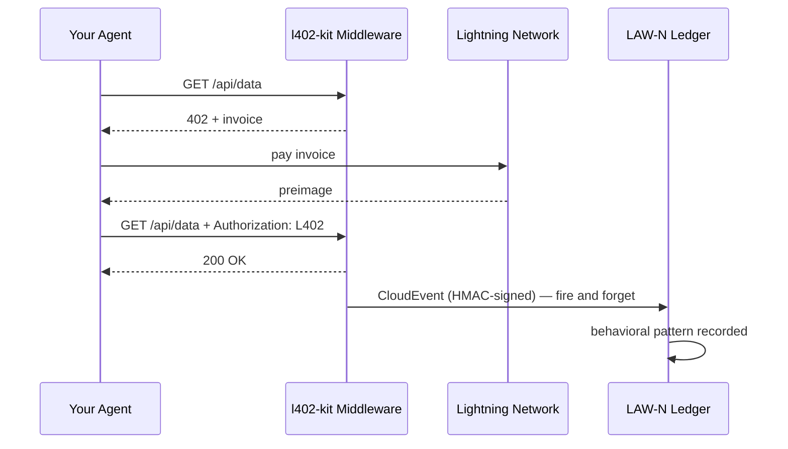

# LAW-N 行動イベント

LAW-N（SAGEWORKS AI）は自律エージェントのための行動台帳です。エージェントが行うすべてのL402支払いは、署名済みCloudEventを発行できます。これにより暗号学的な監査証跡が構築され、時間の経過とともにエージェントのレピュテーションスコアへと変わっていきます。

**レピュテーションを付与する権威は存在しません。トランザクションそのものが証明です。**

---

## 仕組み



イベントは支払いが成功するたびに発行されます。レスポンスをブロックすることはありません。LAW-Nが利用できない場合でも、エージェントはデータを取得できます。

---

## クライアント側での有効化

```typescript
import { L402Client } from "l402-kit/agent";
import { BlinkWallet } from "l402-kit/wallets";
import { createLawNAdapter } from "l402-kit/agent";

const lawN = createLawNAdapter({
  ingestUrl: "https://l402kit.com/api/lawn-events",
  hmacSecret: process.env.LAWN_HMAC_SECRET!,
  network: "mainnet",
});

const client = new L402Client({
  wallet: new BlinkWallet(process.env.BLINK_API_KEY!),
  agentId: "agent:myorg.myagent",
  budget: { maxSats: 1000 },
  onEvent: lawN,
});
```

---

## イベントの種類

| イベント | 発行タイミング |
|---|---|
| `l402.challenge.received` | サーバーがHTTP 402を返したとき |
| `l402.payment.initiated` | エージェントがインボイスの支払いを開始したとき |
| `l402.payment.settled` | 支払いが確認され、preimageを受信したとき |
| `l402.access.granted` | サーバーがL402トークンを受理したとき |
| `l402.budget.exhausted` | エージェントが支出上限に達したとき |
| `l402.token.reused` | エージェントが既存の証明で再試行したとき |
| `l402.proof.reuse.attempt` | 使用済みのpreimageを再利用しようとしたとき |

---

## CloudEvents 1.0 フォーマット

```json
{
  "specversion": "1.0",
  "type": "l402.payment.settled",
  "source": "l402-kit",
  "id": "req_a1b2c3d4",
  "time": "2026-05-10T14:32:00.000Z",
  "subject": "agent-payment-flow",
  "datacontenttype": "application/json",
  "data": {
    "agent_id": "agent:myorg.myagent",
    "session_id": "sess_8f3a1b2c",
    "request_id": "req_a1b2c3d4",
    "endpoint": "https://api.example.com/data",
    "event_type": "l402.payment.settled",
    "network": { "provider": "blink", "environment": "mainnet" },
    "payment": {
      "amount_sats": 100,
      "preimage_hash": "sha256:abc123...",
      "settled": true,
      "latency_ms": 487
    },
    "behavior": {
      "retry_count": 0,
      "proof_reuse_attempt": false,
      "budget_remaining": 900,
      "budget_exhausted": false
    }
  }
}
```

---

## レピュテーションの実態

以下を一貫して行うエージェントは：
- 初回の試行でインボイスを支払う
- 予算の制約を尊重する
- proofの再利用を試みない
- 多様なエンドポイントをまたいで動作する

...自動的にレピュテーションを築きます。不正な動作をするエージェントはサービスへのアクセスができなくなります。

ホワイトリストなし。ガバナンス投票なし。誰が信頼できるかを決める権威なし。台帳そのものが証明です。

---

## アクティビティダッシュボード

公開統計情報は以下で確認できます：

```bash
curl https://l402kit.com/api/activity
```

```json
{
  "total_events": 1420,
  "unique_agents": 12,
  "total_sats": 84200,
  "recent_events": [...],
  "top_agents": [
    { "agent_id": "agent:shinydapps.verity", "event_count": 847 }
  ]
}
```

ライブダッシュボード: [l402kit.com/activity](https://l402kit.com/activity)