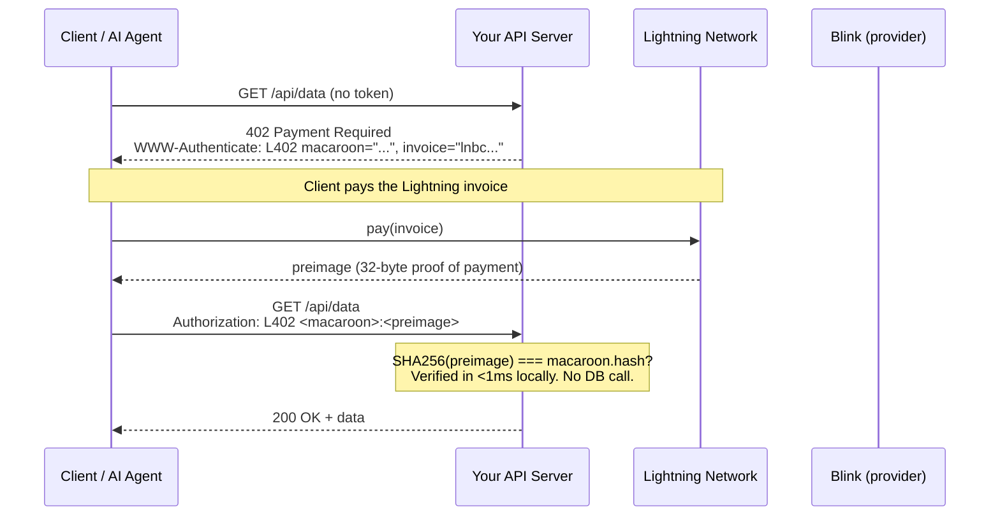
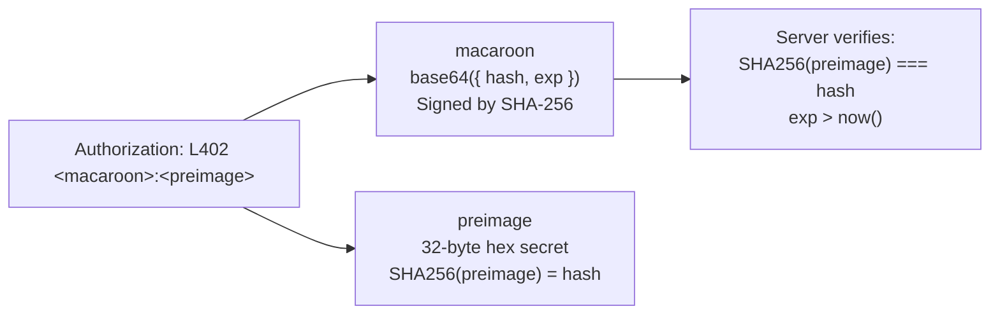
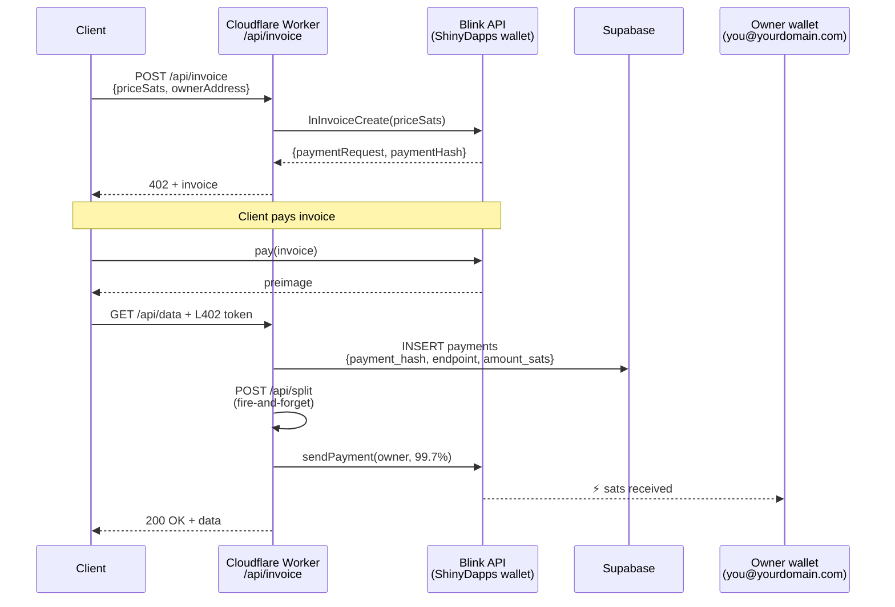
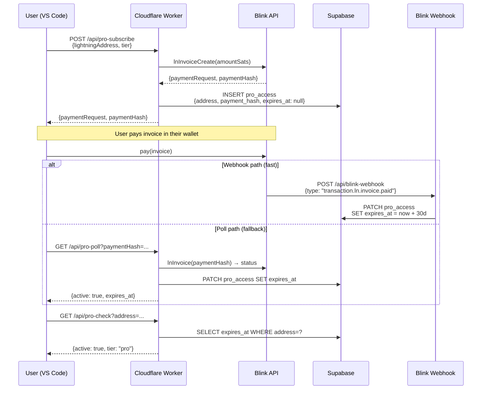
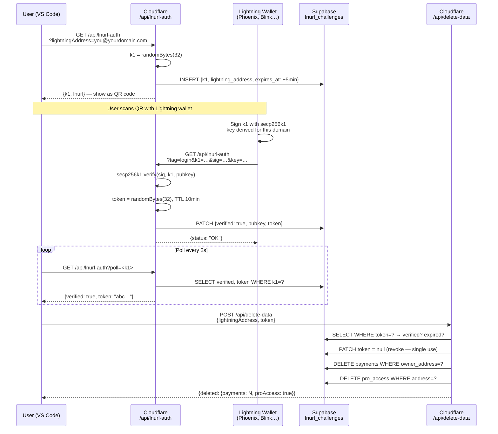
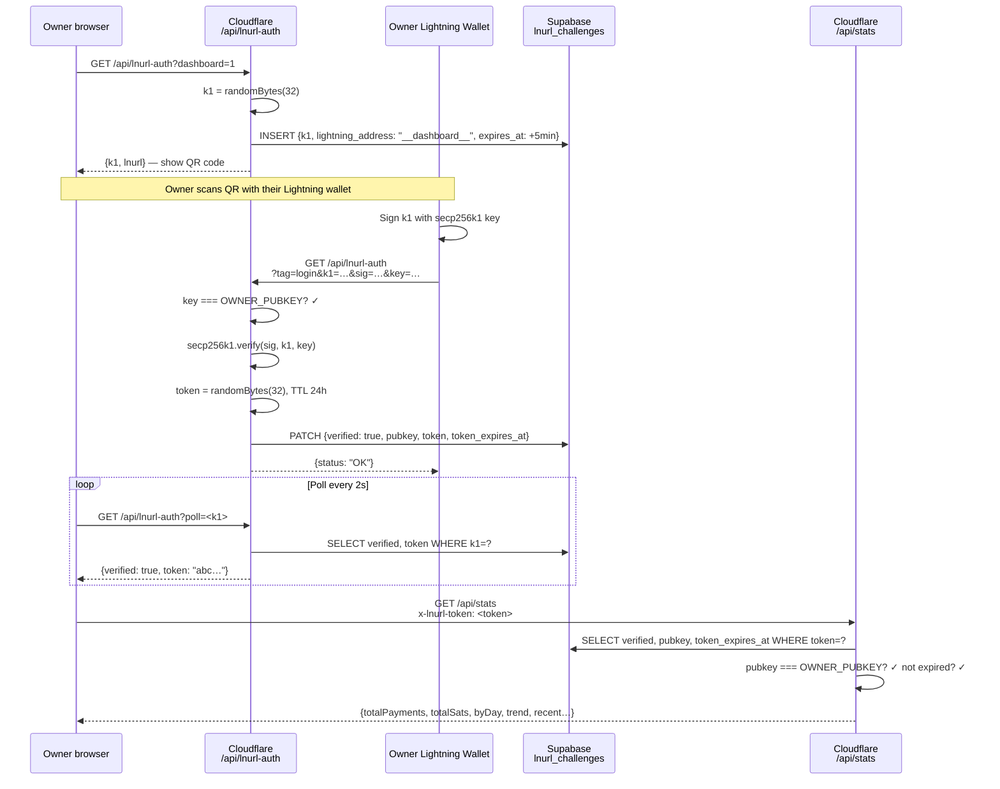
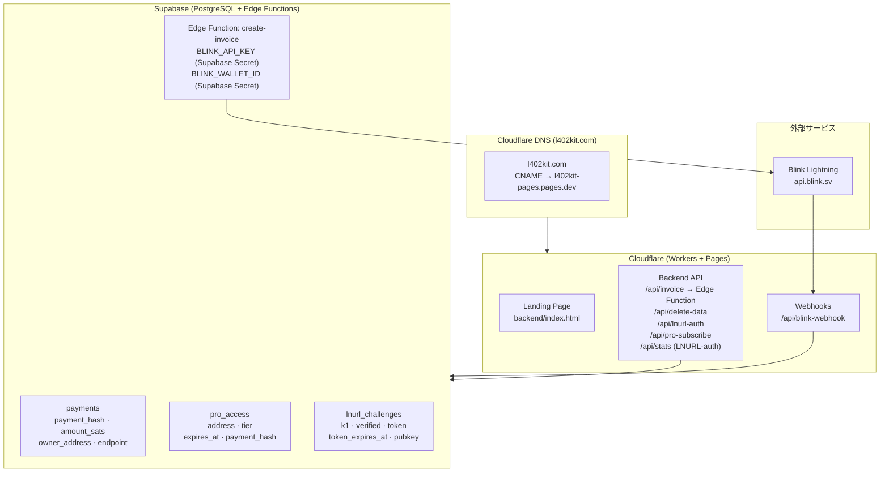
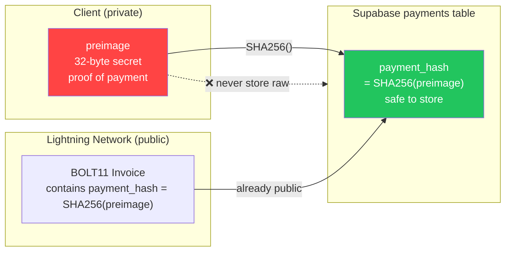

このページでは、l402-kit プラットフォームにおけるすべての主要なフローをシーケンス図およびフローチャート図として記録しています。各セクションでは、ビジュアルと、何が起きているか・なぜそのような設計なのかについての簡潔な説明をペアで提示しています。まずフロー 1（コア L402）から始めて暗号化の基盤を理解し、その後ご自身のインテグレーションに関連するフローをお読みください。

---

## 1. コア L402 支払いフロー

基本的なリクエストサイクルです。アカウントもパスワードも不要 — 暗号化されたレシートだけです。

クライアントが保護されたエンドポイントに初めてアクセスすると、HTTP 402 レスポンスが返されます。このレスポンスには BOLT11 Lightning インボイスと macaroon の 2 つが含まれています。クライアントは Lightning Network を通じてインボイスを支払い（通常 1 秒未満）、支払い証明として 32 バイトの preimage を受け取り、`Authorization: L402 <macaroon>:<preimage>` を付けてリクエストを再試行します。サーバーは `SHA256(preimage) === macaroon.hash` を使ってローカルでトークンを検証します — データベース呼び出しも、ネットワークのラウンドトリップも不要で、1 ミリ秒未満のレイテンシです。検証されると、トークンは有効期限まで有効です。以降のリクエストでは同じヘッダーが再利用されます。

**主な特性:**
- 検証は完全にローカルで行われます — ネットワーク呼び出しもデータベース参照も不要
- `preimage` = 支払いの暗号化証明（Lightning のレシート）
- `macaroon` = SHA-256 で署名された base64 JSON `{hash, exp}`

---

## 2. トークンの構造

`Authorization` ヘッダーはコロンで区切られた 2 つのコンポーネントを持ちます。**macaroon** は base64 エンコードされた JSON オブジェクト `{hash, exp}` です — サーバーに対して、どの支払いハッシュを期待するか、そしてトークンの有効期限を伝えます。**preimage** は Lightning Network が支払者に返した 32 バイトのシークレットです。この 2 つが組み合わさることで、どのサーバーもオフラインで検証できる、偽造不可能な自己完結型の認証情報を形成します。

---

## 3. マネージドモード — 手数料分配フロー

`ManagedProvider` を使用すると、l402kit.com がインボイスを作成し、支払いを受け取り、99.7% をあなたの Lightning Address に自動的に転送します。0.3% のプラットフォーム手数料は Lightning ルーティングと API インフラストラクチャをカバーします。あなたのウォレットは Cloudflare Worker に直接触れることはありません — 分配はクライアントのリクエストが検証された後にサーバー側で発火する Lightning 支払いであり、あなたの Lightning Address を使ってオンザフライで新しい BOLT11 インボイスを生成します。

---

## 4. Pro サブスクリプションフロー

Pro サブスクリプションは同様の L402 パターンに従いますが、永続的な状態を追加します。クライアントは一度限りのインボイスを支払い、Supabase に 30 日間のサブスクリプションレコードを受け取ります。支払いの確認は Blink ウェブフック（高速パス、約 2 秒）またはポーリング（ウェブフックをトリガーしないウォレットのフォールバック）のいずれかで届きます。以降の `/api/pro-check` 呼び出しは、追加の支払いなしに `expires_at` タイムスタンプを検証します。

---

## 5. LNURL-auth — ウォレット所有権の証明（データ削除）

パスワードなしで Lightning ウォレットの所有権を証明します。アカウントデータを削除する前に必要です。

---

## 6. ダッシュボード LNURL-auth ログインフロー

オーナー専用ダッシュボード認証 — DASHBOARD_SECRET は Cloudflare Workers シークレットに保存されます。

---

## 7. インフラストラクチャの概要

---

## 8. SHA-256 Preimage のセキュリティ

生の preimage ではなく `SHA256(preimage)` を保存する理由:

**なぜ安全なのか:** `payment_hash` はすべての BOLT11 インボイスにすでに埋め込まれています — 設計上、公開情報です。シークレットは `preimage` だけです。ハッシュを保存することで、追加のリスクなしにリプレイ保護が実現できます。