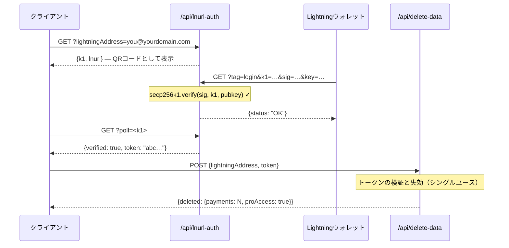

## トークンセキュリティモデル

L402トークンは、`:`で結合された2つの部分で構成されています：

```
<macaroon>:<preimage>
```

- **Macaroon** — `{hash, exp}`を含むbase64エンコードされたJSON。SHA-256で署名されています。preimageを知らずに偽造することはできません。
- **Preimage** — SHA-256でハッシュ化したときに、macaroonに埋め込まれたハッシュと一致しなければならない32バイトのシークレット。

**検証は完全にローカルで行われます** — データベースの参照もネットワーク呼び出しも必要ありません。SDKはマイクロ秒単位で暗号学的にハッシュ関係を検証します。

---

## リプレイ保護

l402-kitには**組み込みのリプレイ保護**が含まれています。各preimageは一度しか使用できません：

```typescript
// ✅ 組み込み — デフォルトで有効
app.get("/api", l402({ priceSats: 10, lightning: blink }), handler);
```

トークンの初回使用時に、preimageは使用済みとしてマークされます。同じpreimageを使用した後続のリクエストは`401 Token already used`を返します。

**デフォルトストア**：インメモリの`Set`。これは以下を意味します：
- 再起動するとリプレイストアがクリアされる（再起動をまたいでトークンが再利用可能になる）
- 複数のインスタンス間で状態が共有されない

複数インスタンスを使用する**本番環境**では、永続的なリプレイストアを実装してください：

```typescript
import { checkAndMarkPreimage } from "l402-kit";

// 例：Redisをバックエンドとしたリプレイストア
async function redisCheckAndMark(preimage: string): Promise<boolean> {
  const key = `l402:used:${preimage}`;
  const set = await redis.set(key, "1", "NX", "EX", 86400); // 24h TTL
  return set === "OK"; // true = 初回使用、false = リプレイ
}
```

---

## トークンの有効期限

トークンには`exp`フィールド（ミリ秒単位のUnixタイムスタンプ）が含まれています。SDKは期限切れのトークンを自動的に拒否します。

デフォルトのTTL：**1時間**（インボイス作成時にLightningプロバイダーによって設定されます）。

```typescript
// トークンはインボイス作成後1時間有効です。
// 有効期限が切れた後、クライアントは新しいトークンを取得するために再度支払いが必要です。
```

---

## HTTPSは必須

**本番環境でL402を平文のHTTPで使用しないでください。** macaroonとpreimageは`Authorization`ヘッダーで送信されます。HTTPでは、ネットワーク攻撃者にさらされてしまいます。

```nginx
# nginx — HTTPをHTTPSにリダイレクト
server {
    listen 80;
    return 301 https://$host$request_uri;
}
```

---

## レート制限

L402はデータベースを参照するのではなく、暗号学的にトークンを検証するため、コストが低くなっています。しかし、Lightningインボイスの作成（402レスポンス）はLightningプロバイダーのAPIを呼び出します。

DoSを防ぐために、インボイス作成をレートリミッターで保護してください：

```typescript
import rateLimit from "express-rate-limit";

const invoiceLimiter = rateLimit({
  windowMs: 60_000,
  max: 20, // IP毎に1分あたり20件の未払いリクエスト
  skip: (req) => req.headers.authorization?.startsWith("L402 ") ?? false,
});

app.use("/api", invoiceLimiter);
app.get("/api/data", l402({ priceSats: 10, lightning: blink }), handler);
```

---

## シークレット管理

APIキーをハードコードしないでください。環境変数を使用してください：

```typescript
// ✅ 正しい方法
const blink = new BlinkProvider(
  process.env.BLINK_API_KEY!,
  process.env.BLINK_WALLET_ID!,
);

// ❌ これは絶対にしないでください
const blink = new BlinkProvider("blink_abc123...", "wallet-id-here");
```

本番環境ではシークレットマネージャーを使用してください：AWS Secrets Manager、Doppler、Vault、または`.env` + dotenv（絶対にgitにコミットしないでください）。

---

## 管理エンドポイントの認証

管理エンドポイントや統計エンドポイントを公開する場合、**URLクエリパラメーターでシークレットを受け取ることは絶対に避けてください**。URLはリバースプロキシ、CDN、クラウドプロバイダーによってクエリ文字列を含む完全な形でログに記録されます。

```typescript
// ❌ 絶対にNG — Cloudflare Workersのログにシークレットが表示される
GET /api/stats?secret=my-secret

// ✅ 正しい方法 — ヘッダーはデフォルトでログに記録されない
GET /api/stats
x-dashboard-secret: my-secret
```

```typescript
// ハンドラーでヘッダーのみを強制する
const token = req.headers["x-dashboard-secret"];
if (!SECRET || token !== SECRET) return res.status(401).json({ error: "Unauthorized" });
```

---

## Supabaseキーの管理

`SUPABASE_SERVICE_KEY`（サーバーサイド専用）と`SUPABASE_ANON_KEY`（クライアントへの公開が安全）を正しく使い分けてください：

| キー | 用途 | RLSをバイパスするか？ |
|---|---|---|
| `anon` | VS Code拡張機能、ブラウザクライアント | いいえ |
| `service_role` | サーバーサイドのAPI関数 | はい |

機密テーブル（例：`pro_access`）を読み取るサーバーサイドのCloudflare Workersはサービスキーを使用しなければなりません — anonキーは絶対に使用しないでください。機密テーブルのRLSポリシーはanonアクセスを許可すべきではありません。

```typescript
// ✅ サーバーサイドエンドポイント
const SUPABASE_KEY = process.env.SUPABASE_SERVICE_KEY ?? process.env.SUPABASE_ANON_KEY ?? "";
```

---

## コンテンツセキュリティポリシー

APIとともにフロントエンドを提供する場合、CSPがL402フローをブロックしないようにしてください：

```http
Content-Security-Policy: connect-src 'self' https://api.blink.sv
```

---

## データ管理 — ユーザーデータの削除

ユーザーはVS Code拡張機能内からいつでもすべての支払い履歴とProサブスクリプションを削除できます（**設定 → 危険ゾーン**）。拡張機能は以下を呼び出します：

```http
POST /api/delete-data
Content-Type: application/json

{ "lightningAddress": "user@blink.sv" }
```

レスポンス：

```json
{ "deleted": { "payments": 42, "proAccess": true } }
```

このエンドポイントはSupabaseの**service role key**をサーバーサイドで使用してRLSをバイパスし、以下を永続的に削除します：

- `payments`テーブル内の`owner_address = ?`に一致するすべての行
- `pro_access`テーブル内の`address = ?`に一致するすべての行

<Note>
拡張機能では、削除ボタンが有効になる前にユーザーがLightningアドレスを正確に入力する必要があります — 破壊的な操作に対するGitHubスタイルの確認です。
</Note>

l402-kitの上に独自のダッシュボードを構築する場合は、ユーザー向けに同様のエンドポイントを公開してください。anonキーによる削除は絶対に許可しないでください — サービスキーを使用するサーバーサイド関数を通じて常にプロキシしてください。

---

## プライバシーとデータ最小化

l402-kitは動作に必要な最小限のデータを収集するよう設計されています。以下に、保存される内容、その理由、および各フィールドを強化する方法を示します。

### 保存される内容

| テーブル | フィールド | 理由 | 機密性 |
|---|---|---|---|
| `payments` | `preimage` | リプレイ保護 + 支払い証明 | ⚠️ 中 — 代わりにハッシュ化する（下記参照） |
| `payments` | `owner_address` | 収益をLightningアドレスに紐付ける | 低 — LightningアドレスはパブリックにPublic |
| `payments` | `amount_sats` | ダッシュボード統計 | 低 |
| `payments` | `endpoint` | エンドポイント毎の分析 | 低〜中 |
| `pro_access` | `address` | Proサブスクリプションの確認 | 低 — パブリック |
| `waitlist` | `email` | ウェルカムメールとリリースメールの送信 | ⚠️ 高 — 実際のPII、暗号化または省略 |
| `waitlist` | `lightning_address` | オプションのID信号 | 低 |

### preimageをそのまま保存せずハッシュ化する

preimageはLightning支払いが行われたことを証明する32バイトのシークレットです。そのまま保存すると、データベース侵害によってすべての証明が公開されてしまいます。代わりにSHA-256ハッシュを保存してください — これはすでに公開されており（BOLT11インボイスに埋め込まれています）、リプレイ保護には十分です：

```typescript
import { createHash } from 'crypto';

// preimageを直接保存する代わりに：
const paymentHash = createHash('sha256').update(Buffer.from(preimage, 'hex')).digest('hex');

await supabase.from('payments').insert({
  payment_hash: paymentHash,   // ✅ 安全に保存可能
  // preimage: preimage        // ❌ 避けること
  owner_address,
  amount_sats,
  endpoint,
});

// リプレイチェック：受信したpreimageをハッシュ化し、ハッシュを照合する
const incomingHash = createHash('sha256').update(Buffer.from(incoming, 'hex')).digest('hex');
const { data } = await supabase.from('payments').select('id').eq('payment_hash', incomingHash);
const alreadyUsed = data && data.length > 0;
```

### ウェイトリストのメールアドレスを保護する

メールアドレスはシステム内で唯一の真のPIIです。保護レベルの順に以下のオプションがあります：

```typescript
// オプション A — 挿入前に暗号化する（AES-256-GCM、キーはSupabase外に保存）
import { createCipheriv, randomBytes } from 'crypto';
const key = Buffer.from(process.env.EMAIL_ENCRYPTION_KEY!, 'hex'); // 32バイト
const iv  = randomBytes(12);
const cipher = createCipheriv('aes-256-gcm', key, iv);
const encrypted = Buffer.concat([cipher.update(email), cipher.final()]);
const tag = cipher.getAuthTag();
const stored = iv.toString('hex') + ':' + tag.toString('hex') + ':' + encrypted.toString('hex');

// オプション B — SHA-256ハッシュのみを保存する（不可逆 — それ以上のメール送信不可）
const emailHash = createHash('sha256').update(email.toLowerCase()).digest('hex');

// オプション C — メールアドレスをまったく保存しない（ウェルカムメールを送信後に破棄）
```

### データ削除前にウォレット所有権を証明する（LNURL-auth）

`/api/delete-data`エンドポイントは、Lightningアドレスの実際の所有者からのリクエストのみを受け付けるべきです。**LNURL-auth**を使用して所有権を暗号学的に証明してください — ユーザーはパスワードやアカウントなしで、LightningウォレットのPrivateKeyでサーバーチャレンジに署名します：



Supabaseの状態を含む完全なシーケンスについては、[完全なフロー図](/guides/flows#5-lnurl-auth--wallet-ownership-proof-delete-data)を参照してください。

これにより、Lightningアドレスを知っている場合でも、他のユーザーのレコードを削除することができなくなります。

---

## チェックリスト

<AccordionGroup>
  <Accordion title="本番稼働前">
    - [ ] すべてのエンドポイントでHTTPSが強制されている
    - [ ] APIキーがソースコードではなく環境変数に保存されている
    - [ ] 管理/統計エンドポイントがヘッダー認証を使用している（`?secret=` URLパラメーターではなく）
    - [ ] Supabaseの`service_role`キーがサーバーサイドで使用されている；`anon`キーはクライアントのみ
    - [ ] 機密Supabaseテーブルに`anon`のSELECTポリシーがない
    - [ ] データ削除エンドポイント（`/api/delete-data`）がサービスキーを使用し、anonキーを使用していない
    - [ ] インボイス作成にレートリミッターが設定されている
    - [ ] リプレイ保護がテストされている（preimageを再利用して401を確認）
    - [ ] トークンの有効期限がテストされている（開発環境で短いTTLを設定し、有効期限後の401を確認）
    - [ ] preimageがSHA-256ハッシュとして保存されており、生のシークレットではない
    - [ ] ウェイトリストのメールアドレスが保存時に暗号化されているか、送信後に破棄されている
    - [ ] `/api/delete-data`がウォレット所有権のLNURL-auth証明を要求している
  </Accordion>
  <Accordion title="高トラフィックAPIの場合">
    - [ ] Redisを使用したリプレイストア（インスタンス間で共有）
    - [ ] 402レスポンスレートの監視（スパイク = DoSの可能性）
    - [ ] Lightningプロバイダーのフェイルオーバー（BlinkProvider → LNbitsProviderへのフォールバック）
    - [ ] Lightningプロバイダーのステータスページ監視（例：status.blink.sv）
  </Accordion>
</AccordionGroup>