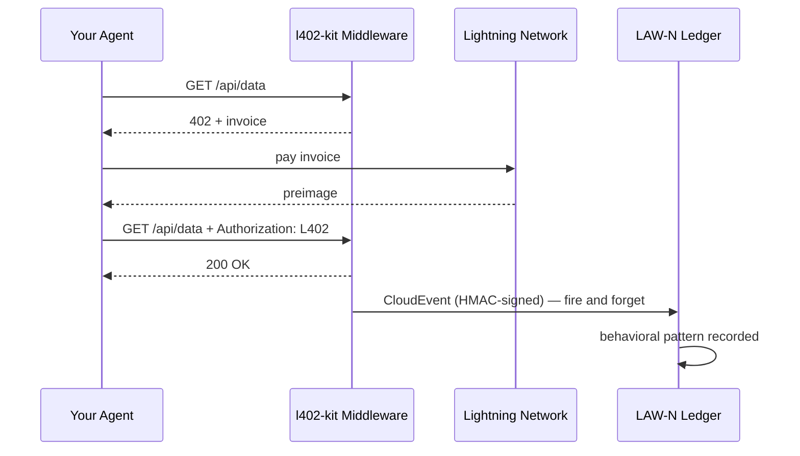

# Eventos Comportamentais LAW-N

LAW-N (SAGEWORKS AI) é um livro-razão comportamental para agentes autônomos. Cada pagamento L402 que seu agente realiza pode emitir um CloudEvent assinado — construindo uma trilha de auditoria criptográfica que se torna uma pontuação de reputação do agente ao longo do tempo.

**Nenhuma autoridade concede a reputação. As transações são a prova.**

---

## Como funciona



O evento é emitido após cada pagamento bem-sucedido. Ele nunca bloqueia a resposta — se o LAW-N estiver indisponível, seu agente ainda recebe os dados.

---

## Ativar no lado do cliente

```typescript
import { L402Client } from "l402-kit/agent";
import { BlinkWallet } from "l402-kit/wallets";
import { createLawNAdapter } from "l402-kit/agent";

const lawN = createLawNAdapter({
  ingestUrl: "https://l402kit.com/api/lawn-events",
  hmacSecret: process.env.LAWN_HMAC_SECRET!,
  network: "mainnet",
});

const client = new L402Client({
  wallet: new BlinkWallet(process.env.BLINK_API_KEY!),
  agentId: "agent:myorg.myagent",
  budget: { maxSats: 1000 },
  onEvent: lawN,
});
```

---

## Tipos de eventos

| Evento | Emitido quando |
|---|---|
| `l402.challenge.received` | O servidor retornou HTTP 402 |
| `l402.payment.initiated` | O agente iniciou o pagamento da fatura |
| `l402.payment.settled` | Pagamento confirmado, preimage recebido |
| `l402.access.granted` | O servidor aceitou o token L402 |
| `l402.budget.exhausted` | O agente atingiu seu limite de gastos |
| `l402.token.reused` | O agente tentou novamente com uma prova existente |
| `l402.proof.reuse.attempt` | Tentativa de reutilizar um preimage já utilizado |

---

## Formato CloudEvents 1.0

```json
{
  "specversion": "1.0",
  "type": "l402.payment.settled",
  "source": "l402-kit",
  "id": "req_a1b2c3d4",
  "time": "2026-05-10T14:32:00.000Z",
  "subject": "agent-payment-flow",
  "datacontenttype": "application/json",
  "data": {
    "agent_id": "agent:myorg.myagent",
    "session_id": "sess_8f3a1b2c",
    "request_id": "req_a1b2c3d4",
    "endpoint": "https://api.example.com/data",
    "event_type": "l402.payment.settled",
    "network": { "provider": "blink", "environment": "mainnet" },
    "payment": {
      "amount_sats": 100,
      "preimage_hash": "sha256:abc123...",
      "settled": true,
      "latency_ms": 487
    },
    "behavior": {
      "retry_count": 0,
      "proof_reuse_attempt": false,
      "budget_remaining": 900,
      "budget_exhausted": false
    }
  }
}
```

---

## Como é a reputação

Agentes que consistentemente:
- Pagam faturas na primeira tentativa
- Respeitam os limites de orçamento
- Não tentam reutilizar provas
- Operam em endpoints diversos

...constroem reputação automaticamente. Agentes que se comportam de forma inadequada deixam de conseguir acessar serviços.

Sem lista de permissões. Sem votação de governança. Sem autoridade decidindo quem é confiável. O livro-razão é a prova.

---

## Painel de atividades

Estatísticas públicas disponíveis em:

```bash
curl https://l402kit.com/api/activity
```

```json
{
  "total_events": 1420,
  "unique_agents": 12,
  "total_sats": 84200,
  "recent_events": [...],
  "top_agents": [
    { "agent_id": "agent:shinydapps.verity", "event_count": 847 }
  ]
}
```

Painel ao vivo: [l402kit.com/activity](https://l402kit.com/activity)