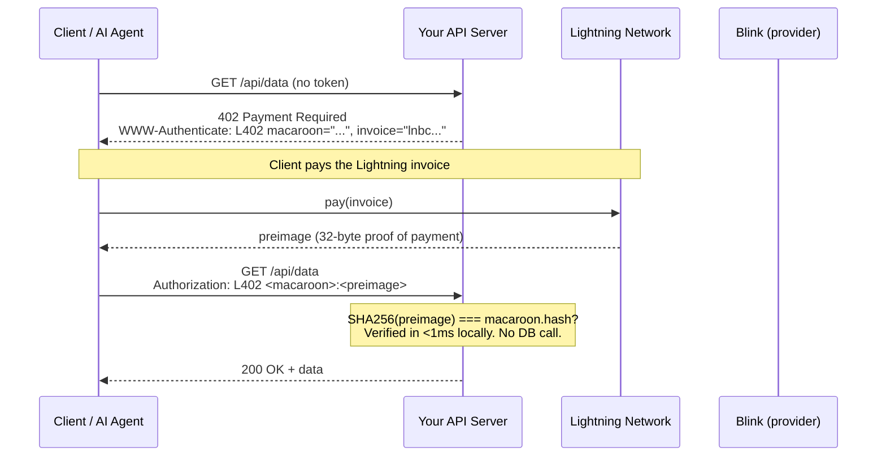
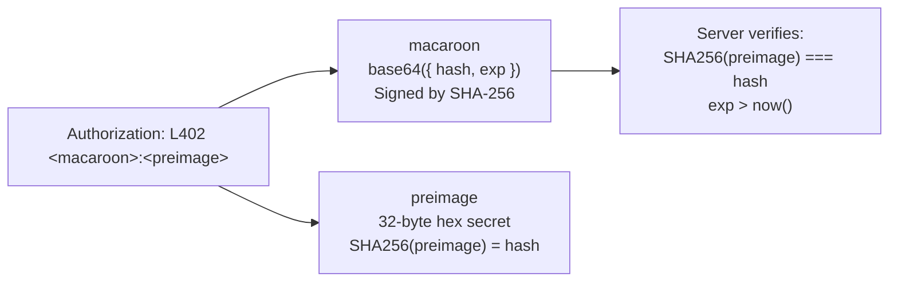
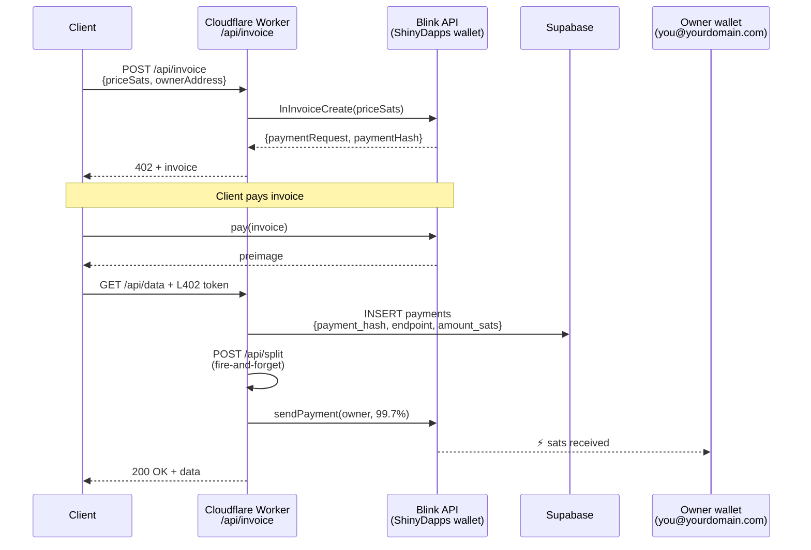
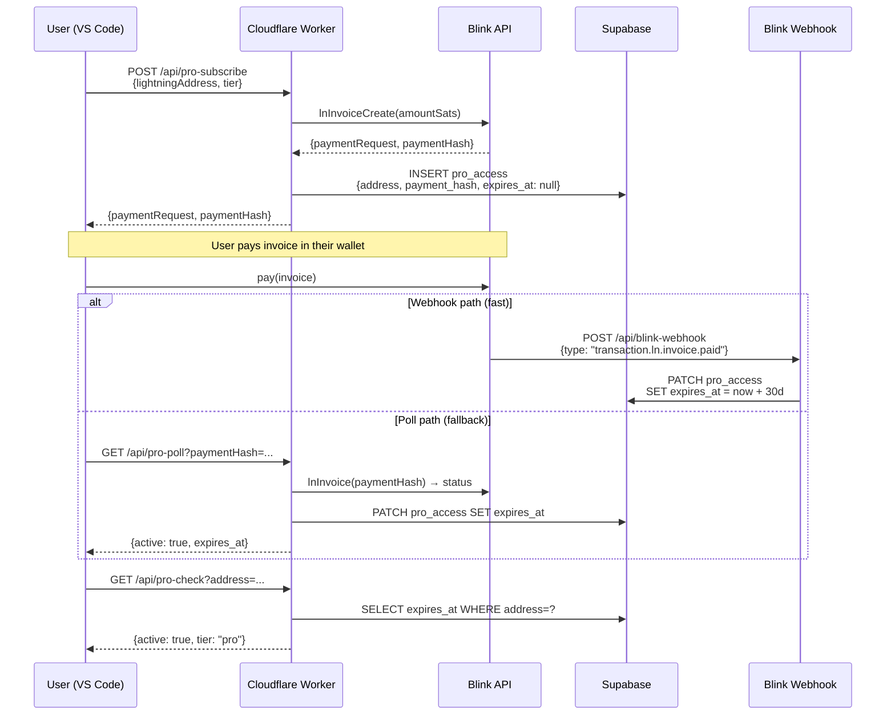
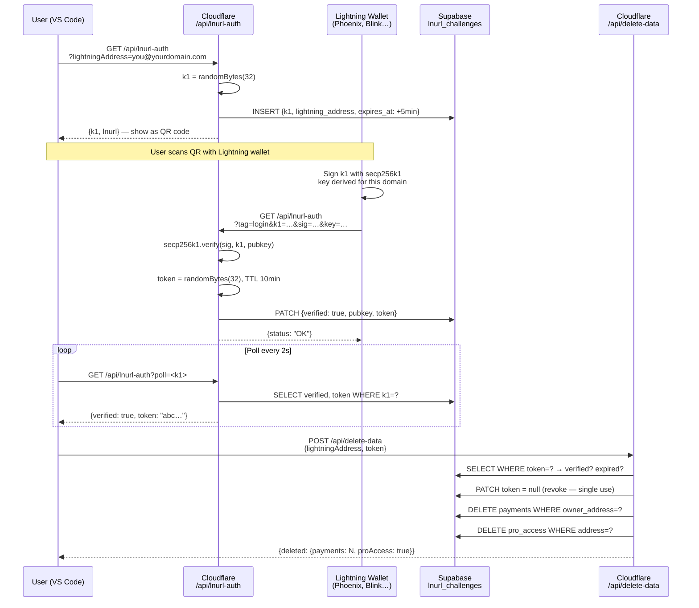
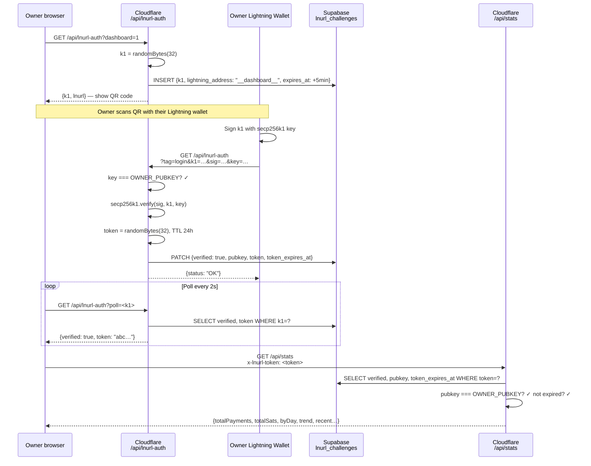
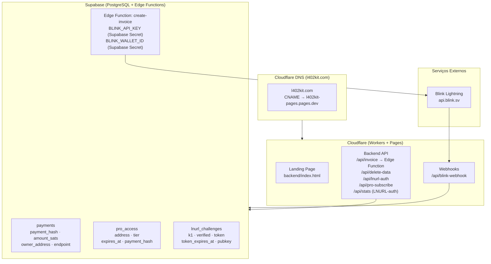
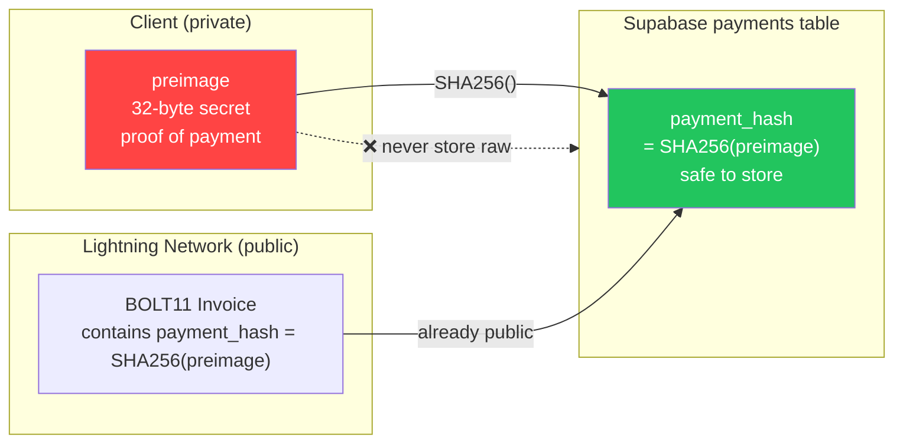

Esta página documenta todos os principais fluxos da plataforma l402-kit como diagramas de sequência e fluxograma. Cada seção combina um visual com uma explicação concisa do que acontece e por que funciona dessa forma. Comece pelo Fluxo 1 (L402 principal) para entender a base criptográfica e, em seguida, leia os fluxos relevantes para a sua integração.

---

## 1. Fluxo Principal de Pagamento L402

O ciclo fundamental de requisição. Sem contas, sem senhas — apenas um recibo criptográfico.

Quando um cliente acessa um endpoint protegido pela primeira vez, recebe uma resposta HTTP 402 contendo duas coisas: uma fatura BOLT11 da Lightning Network e um macaroon. O cliente paga a fatura pela Lightning Network (tipicamente em menos de um segundo), recebe um preimage de 32 bytes como prova e reenvia a requisição com `Authorization: L402 <macaroon>:<preimage>`. O servidor verifica o token localmente usando `SHA256(preimage) === macaroon.hash` — sem chamada ao banco de dados, sem ida e volta pela rede, latência abaixo de um milissegundo. Uma vez verificado, o token é válido até seu vencimento. Requisições subsequentes reutilizam o mesmo cabeçalho.

**Propriedades principais:**
- A verificação é totalmente local — sem chamada de rede, sem consulta ao banco de dados
- `preimage` = prova criptográfica de pagamento (recibo da Lightning Network)
- `macaroon` = JSON base64 `{hash, exp}` assinado com SHA-256

---

## 2. Anatomia do Token

O cabeçalho `Authorization` carrega dois componentes separados por dois pontos. O **macaroon** é um objeto JSON codificado em base64 `{hash, exp}` — ele informa ao servidor qual hash de pagamento esperar e quando o token expira. O **preimage** é o segredo de 32 bytes que a Lightning Network retornou ao pagador. Juntos, formam uma credencial infalsificável e autocontida que qualquer servidor pode verificar offline.

---

## 3. Modo Gerenciado — Fluxo de Divisão de Taxa

Quando você usa o `ManagedProvider`, o l402kit.com cria a fatura, recebe o pagamento e encaminha 99,7% para o seu Lightning Address automaticamente. A taxa de plataforma de 0,3% cobre o roteamento da Lightning Network e a infraestrutura de API. Sua carteira nunca toca no Cloudflare Worker — a divisão é um pagamento Lightning do lado do servidor disparado após a verificação da requisição do cliente, usando seu Lightning Address para gerar uma nova fatura BOLT11 em tempo real.

---

## 4. Fluxo de Assinatura Pro

As assinaturas Pro seguem um padrão L402 semelhante, mas adicionam estado persistente. O cliente paga uma fatura única e recebe um registro de assinatura de 30 dias no Supabase. A confirmação do pagamento chega via webhook do Blink (caminho rápido, ~2 segundos) ou via polling (alternativa para carteiras que não disparam webhooks). Chamadas subsequentes a `/api/pro-check` verificam o timestamp `expires_at` sem outro pagamento.

---

## 5. LNURL-auth — Prova de Posse de Carteira (Excluir Dados)

Prova que você possui uma carteira Lightning sem uma senha. Necessário antes de excluir dados da conta.

---

## 6. Fluxo de Login LNURL-auth do Dashboard

Autenticação do dashboard exclusiva para o proprietário — DASHBOARD_SECRET armazenado nos segredos do Cloudflare Workers.

---

## 7. Visão Geral da Infraestrutura

---

## 8. Segurança do Preimage com SHA-256

Por que armazenamos `SHA256(preimage)` em vez do preimage bruto:

**Por que é seguro:** O `payment_hash` já está incorporado em toda fatura BOLT11 — ele é público por design. Apenas o `preimage` é secreto. Armazenar o hash fornece proteção contra replay sem nenhuma exposição adicional.