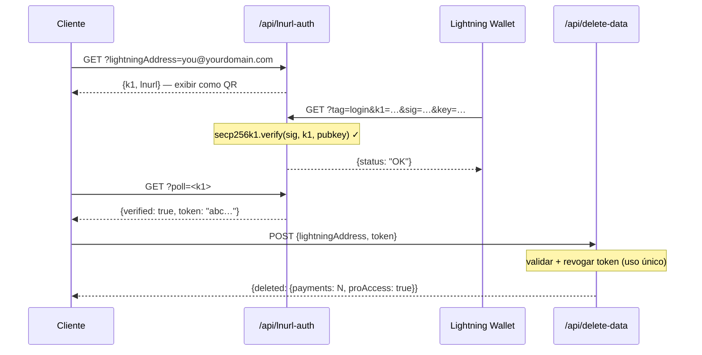

## Modelo de segurança do token

Os tokens L402 consistem em duas partes unidas por `:`:

```
<macaroon>:<preimage>
```

- **Macaroon** — JSON codificado em base64 contendo `{hash, exp}`. Assinado por SHA-256. Não pode ser forjado sem conhecer o preimage.
- **Preimage** — o segredo de 32 bytes que, quando processado com SHA-256, deve corresponder ao hash embutido no macaroon.

**A verificação é totalmente local** — sem consulta ao banco de dados, sem chamada de rede. O SDK verifica a relação de hash criptograficamente em microssegundos.

---

## Proteção contra replay

l402-kit inclui **proteção contra replay integrada**. Cada preimage só pode ser usado uma vez:

```typescript
// ✅ Integrado — habilitado por padrão
app.get("/api", l402({ priceSats: 10, lightning: blink }), handler);
```

O primeiro uso de um token marca o preimage como utilizado. Qualquer requisição subsequente com o mesmo preimage retorna `401 Token already used`.

**Store padrão**: `Set` em memória. Isso significa:
- Reinicializações limpam o store de replay (tokens se tornam reutilizáveis entre reinicializações)
- Múltiplas instâncias não compartilham estado

**Para produção** com múltiplas instâncias, implemente um store de replay persistente:

```typescript
import { checkAndMarkPreimage } from "l402-kit";

// Exemplo: store de replay com Redis
async function redisCheckAndMark(preimage: string): Promise<boolean> {
  const key = `l402:used:${preimage}`;
  const set = await redis.set(key, "1", "NX", "EX", 86400); // TTL de 24h
  return set === "OK"; // true = primeiro uso, false = replay
}
```

---

## Expiração do token

Os tokens carregam um campo `exp` (timestamp Unix em ms). O SDK rejeita tokens expirados automaticamente.

TTL padrão: **1 hora** (definido pelo provedor Lightning ao criar a invoice).

```typescript
// Os tokens são válidos por 1 hora após a criação da invoice.
// Após a expiração, o cliente deve pagar novamente para obter um novo token.
```

---

## HTTPS é obrigatório

**Nunca use L402 sobre HTTP simples em produção.** O macaroon e o preimage são transmitidos no cabeçalho `Authorization`. Sobre HTTP, eles ficam expostos a atacantes de rede.

```nginx
# nginx — redirecionar HTTP para HTTPS
server {
    listen 80;
    return 301 https://$host$request_uri;
}
```

---

## Limitação de taxa

O L402 verifica tokens criptograficamente, sem consultar banco de dados — portanto é barato. Mas a criação de invoices Lightning (a resposta 402) chama a API do seu provedor Lightning.

Proteja a criação de invoices com um limitador de taxa para evitar DoS:

```typescript
import rateLimit from "express-rate-limit";

const invoiceLimiter = rateLimit({
  windowMs: 60_000,
  max: 20, // 20 requisições não pagas por minuto por IP
  skip: (req) => req.headers.authorization?.startsWith("L402 ") ?? false,
});

app.use("/api", invoiceLimiter);
app.get("/api/data", l402({ priceSats: 10, lightning: blink }), handler);
```

---

## Gerenciamento de segredos

Nunca codifique chaves de API diretamente no código. Use variáveis de ambiente:

```typescript
// ✅ Correto
const blink = new BlinkProvider(
  process.env.BLINK_API_KEY!,
  process.env.BLINK_WALLET_ID!,
);

// ❌ Nunca faça isso
const blink = new BlinkProvider("blink_abc123...", "wallet-id-here");
```

Use um gerenciador de segredos em produção: AWS Secrets Manager, Doppler, Vault ou `.env` + dotenv (nunca commitado no git).

---

## Autenticação de endpoints administrativos

Se você expõe endpoints de administração ou estatísticas, **nunca aceite segredos via parâmetros de query na URL**. URLs são registradas por completo por proxies reversos, CDNs e provedores de nuvem — incluindo a query string.

```typescript
// ❌ Nunca — segredo visível nos logs do Cloudflare Workers
GET /api/stats?secret=my-secret

// ✅ Correto — cabeçalho não é registrado por padrão
GET /api/stats
x-dashboard-secret: my-secret
```

```typescript
// Exigir apenas cabeçalho no seu handler
const token = req.headers["x-dashboard-secret"];
if (!SECRET || token !== SECRET) return res.status(401).json({ error: "Unauthorized" });
```

---

## Higiene de chaves do Supabase

Use `SUPABASE_SERVICE_KEY` (somente no servidor) vs `SUPABASE_ANON_KEY` (seguro para expor aos clientes) corretamente:

| Chave | Uso | Ignora RLS? |
|---|---|---|
| `anon` | Extensão VS Code, clientes no navegador | Não |
| `service_role` | Funções de API no servidor | Sim |

Cloudflare Workers no lado do servidor que leem tabelas sensíveis (ex.: `pro_access`) devem usar a chave de serviço — nunca a chave anon. Políticas RLS em tabelas sensíveis não devem conceder acesso anon.

```typescript
// ✅ Endpoint no lado do servidor
const SUPABASE_KEY = process.env.SUPABASE_SERVICE_KEY ?? process.env.SUPABASE_ANON_KEY ?? "";
```

---

## Política de Segurança de Conteúdo

Se você serve um frontend junto com sua API, certifique-se de que seu CSP não bloqueie o fluxo L402:

```http
Content-Security-Policy: connect-src 'self' https://api.blink.sv
```

---

## Gerenciamento de dados — exclusão de dados do usuário

Os usuários podem excluir todo o histórico de pagamentos e a assinatura Pro de dentro da extensão VS Code a qualquer momento (**Configurações → Zona de Perigo**). A extensão chama:

```http
POST /api/delete-data
Content-Type: application/json

{ "lightningAddress": "user@blink.sv" }
```

Resposta:

```json
{ "deleted": { "payments": 42, "proAccess": true } }
```

Este endpoint usa a **chave de função de serviço** do Supabase no lado do servidor para contornar o RLS e excluir permanentemente:

- Todas as linhas em `payments` onde `owner_address = ?`
- Todas as linhas em `pro_access` onde `address = ?`

<Note>
A extensão exige que o usuário digite seu endereço Lightning exatamente antes de o botão de exclusão ser habilitado — confirmação no estilo GitHub para ações destrutivas.
</Note>

Se você estiver construindo seu próprio painel sobre o l402-kit, exponha um endpoint semelhante para seus usuários. Nunca permita exclusão via chave anon — sempre faça proxy através de uma função no lado do servidor com a chave de serviço.

---

## Privacidade e minimização de dados

l402-kit é projetado para coletar o mínimo de dados necessários para operar. Veja o que é armazenado, por quê e como proteger cada campo.

### O que é armazenado

| Tabela | Campo | Por quê | Sensibilidade |
|---|---|---|---|
| `payments` | `preimage` | Proteção contra replay + prova de pagamento | ⚠️ Média — faça hash em vez disso (veja abaixo) |
| `payments` | `owner_address` | Atribuir receita ao endereço Lightning | Baixa — endereços Lightning são públicos |
| `payments` | `amount_sats` | Estatísticas do painel | Baixa |
| `payments` | `endpoint` | Análises por endpoint | Baixa–média |
| `pro_access` | `address` | Verificar assinatura Pro | Baixa — público |
| `waitlist` | `email` | Enviar e-mails de boas-vindas e lançamento | ⚠️ Alta — PII real, criptografe ou omita |
| `waitlist` | `lightning_address` | Sinal de identidade opcional | Baixa |

### Faça hash dos preimages em vez de armazená-los brutos

O preimage é o segredo de 32 bytes que prova que um pagamento Lightning foi realizado. Armazená-lo bruto significa que uma violação de banco de dados expõe cada prova. Armazene o hash SHA-256 em vez disso — ele já é público (embutido na invoice BOLT11) e suficiente para proteção contra replay:

```typescript
import { createHash } from 'crypto';

// Em vez de armazenar o preimage diretamente:
const paymentHash = createHash('sha256').update(Buffer.from(preimage, 'hex')).digest('hex');

await supabase.from('payments').insert({
  payment_hash: paymentHash,   // ✅ seguro para armazenar
  // preimage: preimage        // ❌ evite
  owner_address,
  amount_sats,
  endpoint,
});

// Verificação de replay: faça hash do preimage recebido e consulte o hash
const incomingHash = createHash('sha256').update(Buffer.from(incoming, 'hex')).digest('hex');
const { data } = await supabase.from('payments').select('id').eq('payment_hash', incomingHash);
const alreadyUsed = data && data.length > 0;
```

### Proteja os e-mails da lista de espera

Endereços de e-mail são os únicos PII verdadeiros no sistema. Opções em ordem crescente de proteção:

```typescript
// Opção A — criptografar antes de inserir (AES-256-GCM, chave armazenada fora do Supabase)
import { createCipheriv, randomBytes } from 'crypto';
const key = Buffer.from(process.env.EMAIL_ENCRYPTION_KEY!, 'hex'); // 32 bytes
const iv  = randomBytes(12);
const cipher = createCipheriv('aes-256-gcm', key, iv);
const encrypted = Buffer.concat([cipher.update(email), cipher.final()]);
const tag = cipher.getAuthTag();
const stored = iv.toString('hex') + ':' + tag.toString('hex') + ':' + encrypted.toString('hex');

// Opção B — armazenar apenas um hash SHA-256 (irreversível — não é possível enviar mais e-mails)
const emailHash = createHash('sha256').update(email.toLowerCase()).digest('hex');

// Opção C — não armazenar o e-mail (enviar o e-mail de boas-vindas e descartá-lo)
```

### Prove a propriedade da carteira antes de excluir dados (LNURL-auth)

O endpoint `/api/delete-data` deve aceitar apenas requisições do proprietário real do endereço Lightning. Use **LNURL-auth** para provar a propriedade criptograficamente — o usuário assina um desafio do servidor com a chave privada de sua carteira Lightning, sem necessidade de senha ou conta:



Veja o [diagrama completo do fluxo](/guides/flows#5-lnurl-auth--wallet-ownership-proof-delete-data) para a sequência completa com o estado do Supabase.

Isso garante que ninguém possa excluir os registros de outro usuário, mesmo que conheça o endereço Lightning.

---

## Lista de verificação

<AccordionGroup>
  <Accordion title="Antes de entrar em produção">
    - [ ] HTTPS aplicado em todos os endpoints
    - [ ] Chaves de API em variáveis de ambiente, não no código-fonte
    - [ ] Endpoints de administração/estatísticas usam autenticação por cabeçalho, não parâmetros `?secret=` na URL
    - [ ] Chave `service_role` do Supabase usada no lado do servidor; chave `anon` apenas nos clientes
    - [ ] Tabelas sensíveis do Supabase não têm política SELECT para `anon`
    - [ ] Endpoint de exclusão de dados (`/api/delete-data`) usa chave de serviço, nunca anon
    - [ ] Limitador de taxa na criação de invoices
    - [ ] Proteção contra replay testada (tente reutilizar um preimage → espere 401)
    - [ ] Expiração de token testada (defina TTL curto em desenvolvimento, confirme 401 após expiração)
    - [ ] Preimages armazenados como hashes SHA-256, não como segredos brutos
    - [ ] E-mails da lista de espera criptografados em repouso ou descartados após o envio
    - [ ] `/api/delete-data` exige prova de propriedade da carteira via LNURL-auth
  </Accordion>
  <Accordion title="Para APIs de alto tráfego">
    - [ ] Store de replay com Redis (compartilhado entre instâncias)
    - [ ] Monitoramento das taxas de resposta 402 (pico = potencial DoS)
    - [ ] Failover do provedor Lightning (BlinkProvider → fallback para LNbitsProvider)
    - [ ] Monitoramento da página de status do seu provedor Lightning (ex.: status.blink.sv)
  </Accordion>
</AccordionGroup>