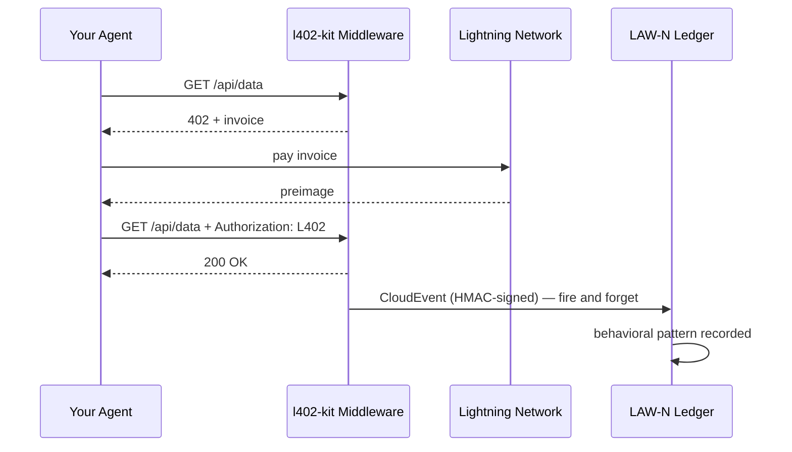

# LAW-N Поведенческие события

LAW-N (SAGEWORKS AI) — это поведенческий реестр для автономных агентов. Каждый L402-платёж, совершённый вашим агентом, может генерировать подписанное CloudEvent — формируя криптографический журнал аудита, который со временем становится оценкой репутации агента.

**Никакой орган не присваивает репутацию. Транзакции — это и есть доказательство.**

---

## Как это работает



Событие генерируется после каждого успешного платежа. Оно никогда не блокирует ответ — если LAW-N недоступен, ваш агент всё равно получает данные.

---

## Включение на стороне клиента

```typescript
import { L402Client } from "l402-kit/agent";
import { BlinkWallet } from "l402-kit/wallets";
import { createLawNAdapter } from "l402-kit/agent";

const lawN = createLawNAdapter({
  ingestUrl: "https://l402kit.com/api/lawn-events",
  hmacSecret: process.env.LAWN_HMAC_SECRET!,
  network: "mainnet",
});

const client = new L402Client({
  wallet: new BlinkWallet(process.env.BLINK_API_KEY!),
  agentId: "agent:myorg.myagent",
  budget: { maxSats: 1000 },
  onEvent: lawN,
});
```

---

## Типы событий

| Событие | Генерируется когда |
|---|---|
| `l402.challenge.received` | Сервер вернул HTTP 402 |
| `l402.payment.initiated` | Агент начал оплату счёта |
| `l402.payment.settled` | Платёж подтверждён, preimage получен |
| `l402.access.granted` | Сервер принял токен L402 |
| `l402.budget.exhausted` | Агент достиг лимита расходов |
| `l402.token.reused` | Агент повторно использовал существующее доказательство |
| `l402.proof.reuse.attempt` | Попытка повторного использования потраченного preimage |

---

## Формат CloudEvents 1.0

```json
{
  "specversion": "1.0",
  "type": "l402.payment.settled",
  "source": "l402-kit",
  "id": "req_a1b2c3d4",
  "time": "2026-05-10T14:32:00.000Z",
  "subject": "agent-payment-flow",
  "datacontenttype": "application/json",
  "data": {
    "agent_id": "agent:myorg.myagent",
    "session_id": "sess_8f3a1b2c",
    "request_id": "req_a1b2c3d4",
    "endpoint": "https://api.example.com/data",
    "event_type": "l402.payment.settled",
    "network": { "provider": "blink", "environment": "mainnet" },
    "payment": {
      "amount_sats": 100,
      "preimage_hash": "sha256:abc123...",
      "settled": true,
      "latency_ms": 487
    },
    "behavior": {
      "retry_count": 0,
      "proof_reuse_attempt": false,
      "budget_remaining": 900,
      "budget_exhausted": false
    }
  }
}
```

---

## Как выглядит репутация

Агенты, которые последовательно:
- Оплачивают счета с первой попытки
- Соблюдают бюджетные ограничения
- Не пытаются повторно использовать доказательства
- Работают с разнообразными эндпоинтами

...формируют репутацию автоматически. Агенты, ведущие себя недобросовестно, теряют доступ к сервисам.

Никаких белых списков. Никаких голосований по управлению. Никакого органа, решающего, кому доверять. Реестр — это и есть доказательство.

---

## Дашборд активности

Публичная статистика доступна по адресу:

```bash
curl https://l402kit.com/api/activity
```

```json
{
  "total_events": 1420,
  "unique_agents": 12,
  "total_sats": 84200,
  "recent_events": [...],
  "top_agents": [
    { "agent_id": "agent:shinydapps.verity", "event_count": 847 }
  ]
}
```

Дашборд в реальном времени: [l402kit.com/activity](https://l402kit.com/activity)