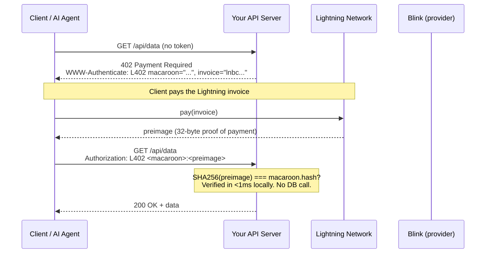
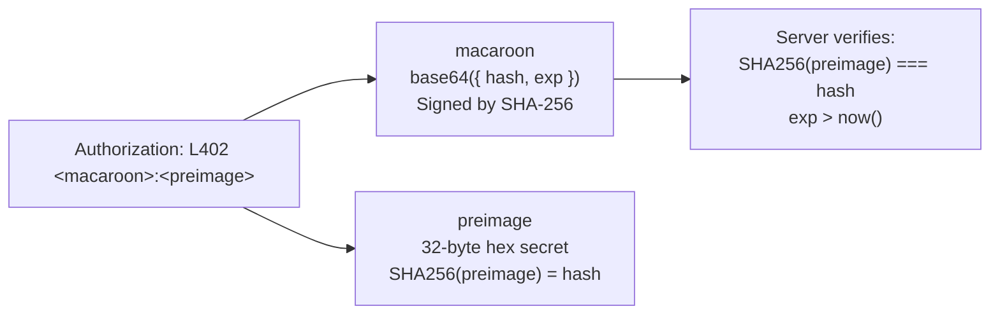
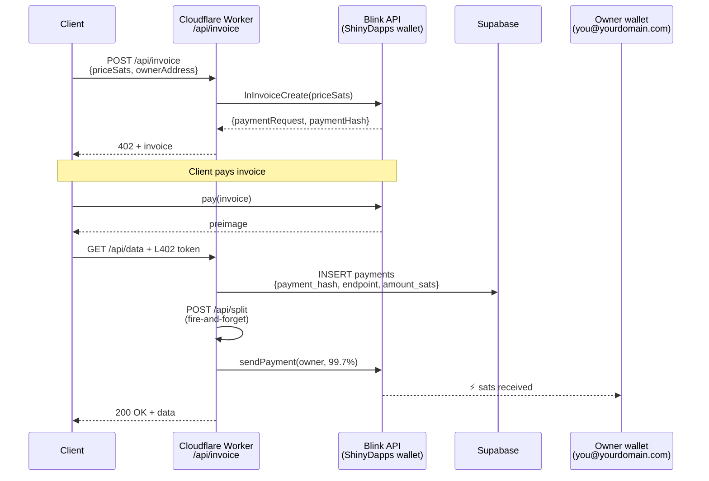
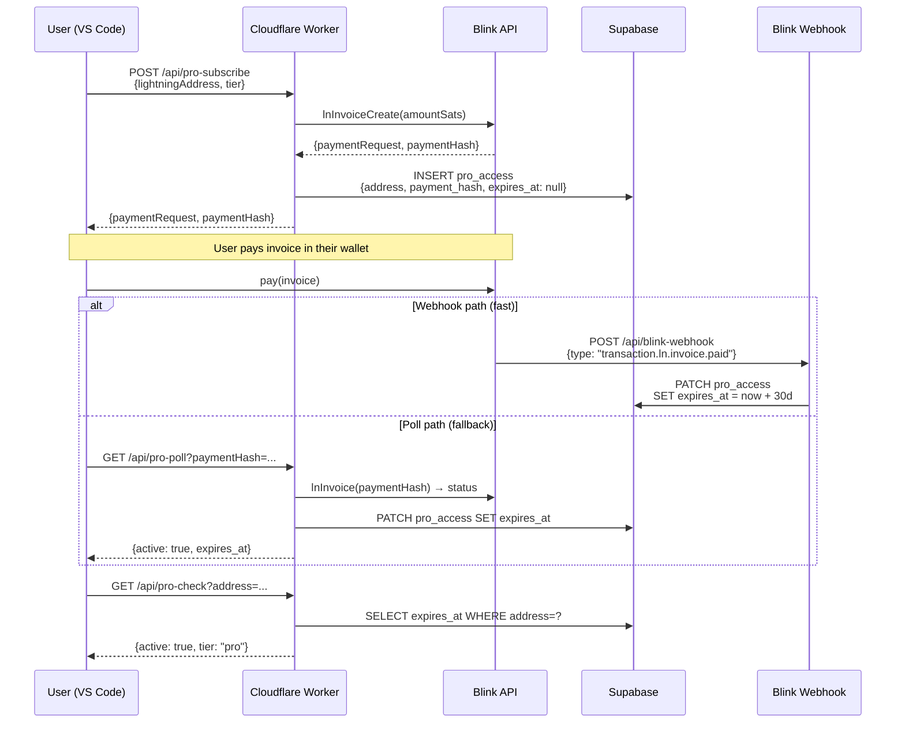
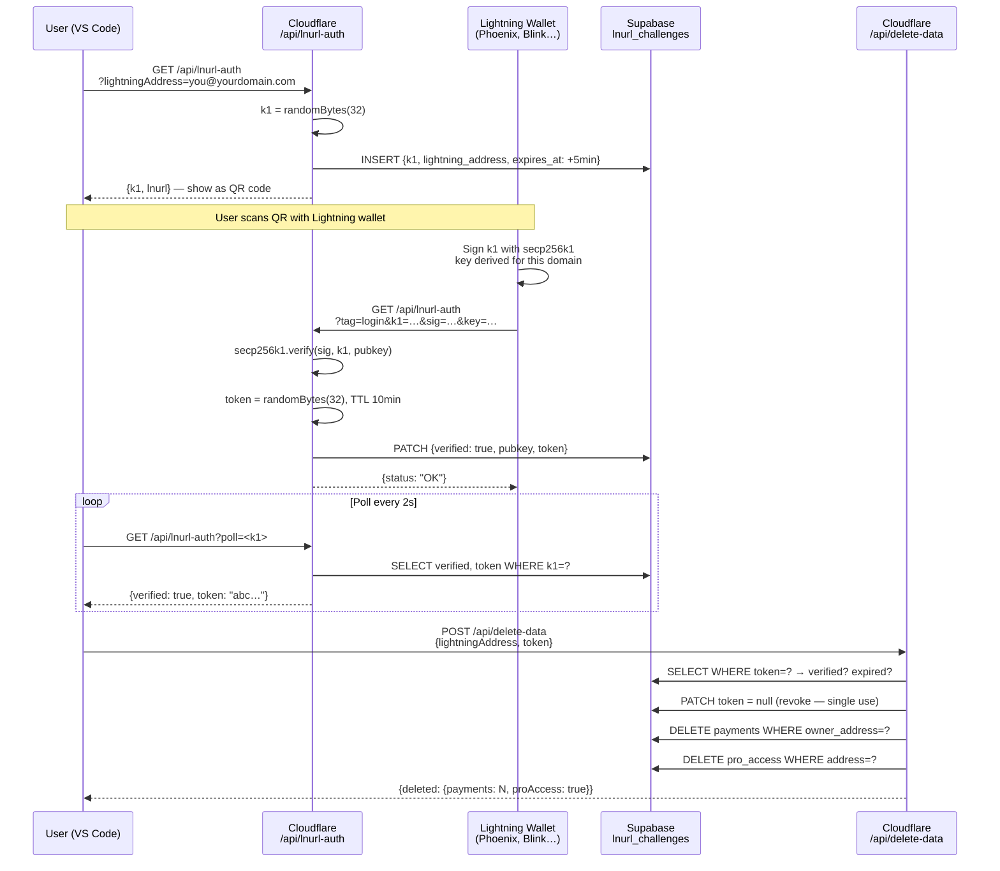
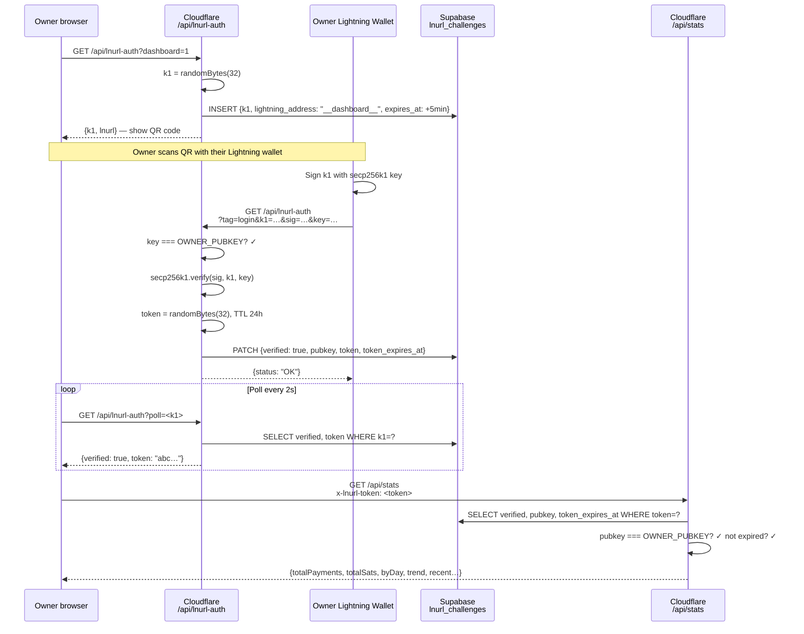
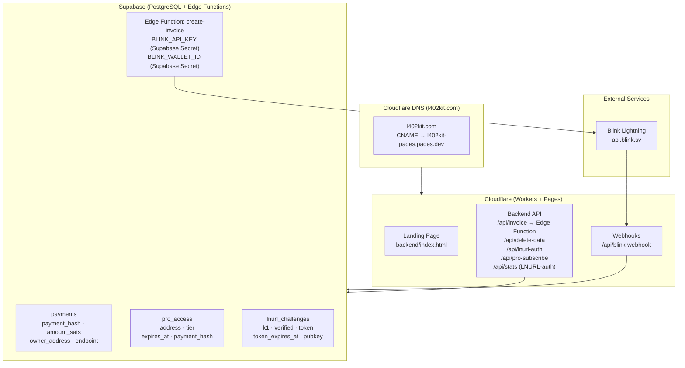
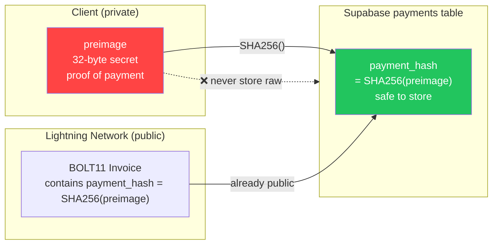

На этой странице задокументированы все основные потоки платформы l402-kit в виде диаграмм последовательностей и блок-схем. Каждый раздел содержит визуализацию и краткое объяснение того, что происходит и почему это работает именно так. Начните с Потока 1 (основной L402), чтобы понять криптографическую основу, затем изучите потоки, актуальные для вашей интеграции.

---

## 1. Основной поток платежей L402

Фундаментальный цикл запросов. Никаких аккаунтов, никаких паролей — только криптографическая квитанция.

Когда клиент впервые обращается к защищённому эндпоинту, он получает ответ HTTP 402, содержащий два элемента: BOLT11 Lightning-инвойс и macaroon. Клиент оплачивает инвойс через Lightning Network (как правило, менее чем за секунду), получает 32-байтовый preimage в качестве доказательства и повторяет запрос с заголовком `Authorization: L402 <macaroon>:<preimage>`. Сервер верифицирует токен локально, используя `SHA256(preimage) === macaroon.hash` — без обращения к базе данных, без сетевого запроса, с задержкой менее миллисекунды. После верификации токен действителен до истечения срока. Последующие запросы повторно используют тот же заголовок.

**Ключевые свойства:**
- Верификация полностью локальная — без сетевого запроса, без обращения к базе данных
- `preimage` = криптографическое доказательство оплаты (Lightning-квитанция)
- `macaroon` = base64 JSON `{hash, exp}`, подписанный с помощью SHA-256

---

## 2. Анатомия токена

Заголовок `Authorization` содержит два компонента, разделённых двоеточием. **Macaroon** — это JSON-объект в кодировке base64 `{hash, exp}` — он сообщает серверу, какой хеш платежа ожидать и когда истекает срок действия токена. **Preimage** — это 32-байтовый секрет, который Lightning Network вернула плательщику. Вместе они образуют неподдельный, самодостаточный токен, который любой сервер может верифицировать офлайн.

---

## 3. Управляемый режим — поток разделения комиссии

При использовании `ManagedProvider` сайт l402kit.com создаёт инвойс, получает оплату и автоматически перечисляет 99,7% на ваш Lightning-адрес. Комиссия платформы 0,3% покрывает маршрутизацию Lightning и инфраструктуру API. Ваш кошелёк никогда не взаимодействует с Cloudflare Worker напрямую — разделение представляет собой серверный Lightning-платёж, отправляемый после верификации запроса клиента, с использованием вашего Lightning-адреса для генерации нового BOLT11-инвойса на лету.

---

## 4. Поток Pro-подписки

Pro-подписки следуют аналогичной схеме L402, но добавляют постоянное состояние. Клиент оплачивает единовременный инвойс и получает 30-дневную запись о подписке в Supabase. Подтверждение платежа поступает либо через Blink-вебхук (быстрый путь, ~2 секунды), либо через опрос (резервный вариант для кошельков, которые не инициируют вебхуки). Последующие вызовы `/api/pro-check` проверяют временную метку `expires_at` без повторной оплаты.

---

## 5. LNURL-auth — Подтверждение владения кошельком (удаление данных)

Подтверждает, что вы являетесь владельцем Lightning-кошелька, без пароля. Требуется перед удалением данных аккаунта.

---

## 6. Поток входа в дашборд через LNURL-auth

Аутентификация в дашборде только для владельца — DASHBOARD_SECRET хранится в секретах Cloudflare Workers.

---

## 7. Обзор инфраструктуры

---

## 8. Безопасность preimage на основе SHA-256

Почему мы храним `SHA256(preimage)` вместо исходного preimage:

**Почему это безопасно:** `payment_hash` уже встроен в каждый BOLT11-инвойс — он публичен по своей природе. Секретным является только `preimage`. Хранение хеша обеспечивает защиту от повторных атак без какого-либо дополнительного раскрытия данных.