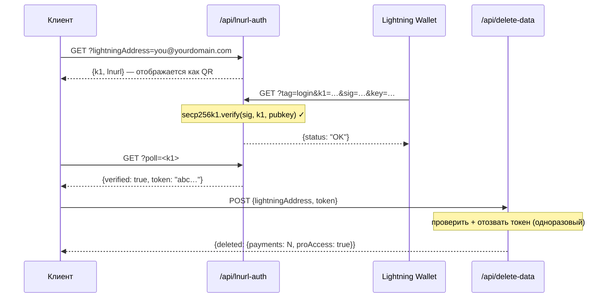

## Модель безопасности токенов

Токены L402 состоят из двух частей, соединённых символом `:`:

```
<macaroon>:<preimage>
```

- **Macaroon** — JSON в кодировке base64, содержащий `{hash, exp}`. Подписан с помощью SHA-256. Невозможно подделать без знания preimage.
- **Preimage** — 32-байтовый секрет, хэш которого через SHA-256 должен совпадать с хэшем, встроенным в macaroon.

**Верификация полностью локальная** — без обращения к базе данных и без сетевых вызовов. SDK проверяет хэш-связь криптографически за микросекунды.

---

## Защита от повторного использования

l402-kit включает **встроенную защиту от повторного использования**. Каждый preimage может быть использован только один раз:

```typescript
// ✅ Встроено — включено по умолчанию
app.get("/api", l402({ priceSats: 10, lightning: blink }), handler);
```

При первом использовании токена preimage помечается как использованный. Любой последующий запрос с тем же preimage возвращает `401 Token already used`.

**Хранилище по умолчанию**: `Set` в памяти. Это означает:
- Перезапуски очищают хранилище (токены становятся повторно используемыми после перезапуска)
- Несколько экземпляров не разделяют состояние

**Для продакшена** с несколькими экземплярами реализуйте персистентное хранилище:

```typescript
import { checkAndMarkPreimage } from "l402-kit";

// Пример: хранилище на основе Redis
async function redisCheckAndMark(preimage: string): Promise<boolean> {
  const key = `l402:used:${preimage}`;
  const set = await redis.set(key, "1", "NX", "EX", 86400); // TTL 24 часа
  return set === "OK"; // true = первое использование, false = повтор
}
```

---

## Срок действия токенов

Токены содержат поле `exp` (Unix-временная метка в мс). SDK автоматически отклоняет просроченные токены.

TTL по умолчанию: **1 час** (устанавливается провайдером Lightning при создании инвойса).

```typescript
// Токены действительны в течение 1 часа после создания инвойса.
// После истечения срока клиент должен снова оплатить для получения нового токена.
```

---

## HTTPS обязателен

**Никогда не используйте L402 через обычный HTTP в продакшене.** Macaroon и preimage передаются в заголовке `Authorization`. По HTTP они доступны сетевым злоумышленникам.

```nginx
# nginx — перенаправление HTTP на HTTPS
server {
    listen 80;
    return 301 https://$host$request_uri;
}
```

---

## Ограничение частоты запросов

L402 проверяет токены криптографически, без обращения к базе данных — это дёшево. Но создание Lightning-инвойса (ответ 402) обращается к API вашего Lightning-провайдера.

Защитите создание инвойсов с помощью ограничителя частоты запросов для предотвращения DoS:

```typescript
import rateLimit from "express-rate-limit";

const invoiceLimiter = rateLimit({
  windowMs: 60_000,
  max: 20, // 20 неоплаченных запросов в минуту с одного IP
  skip: (req) => req.headers.authorization?.startsWith("L402 ") ?? false,
});

app.use("/api", invoiceLimiter);
app.get("/api/data", l402({ priceSats: 10, lightning: blink }), handler);
```

---

## Управление секретами

Никогда не вшивайте API-ключи в код. Используйте переменные окружения:

```typescript
// ✅ Правильно
const blink = new BlinkProvider(
  process.env.BLINK_API_KEY!,
  process.env.BLINK_WALLET_ID!,
);

// ❌ Никогда не делайте так
const blink = new BlinkProvider("blink_abc123...", "wallet-id-here");
```

Используйте менеджер секретов в продакшене: AWS Secrets Manager, Doppler, Vault или `.env` + dotenv (никогда не коммитьте в git).

---

## Аутентификация административных эндпоинтов

Если вы открываете административные или статистические эндпоинты, **никогда не принимайте секреты через URL-параметры**. URL-адреса полностью логируются обратными прокси, CDN и облачными провайдерами — включая строку запроса.

```typescript
// ❌ Никогда — секрет виден в логах Cloudflare Workers
GET /api/stats?secret=my-secret

// ✅ Правильно — заголовок по умолчанию не логируется
GET /api/stats
x-dashboard-secret: my-secret
```

```typescript
// Используйте только заголовок в вашем обработчике
const token = req.headers["x-dashboard-secret"];
if (!SECRET || token !== SECRET) return res.status(401).json({ error: "Unauthorized" });
```

---

## Гигиена ключей Supabase

Используйте `SUPABASE_SERVICE_KEY` (только на сервере) и `SUPABASE_ANON_KEY` (безопасно передавать клиентам) правильно:

| Ключ | Использование | Обходит RLS? |
|---|---|---|
| `anon` | Расширение VS Code, браузерные клиенты | Нет |
| `service_role` | Серверные функции API | Да |

Серверные Cloudflare Workers, читающие чувствительные таблицы (например, `pro_access`), должны использовать сервисный ключ — никогда не anon-ключ. Политики RLS на чувствительных таблицах не должны предоставлять доступ anon.

```typescript
// ✅ Серверный эндпоинт
const SUPABASE_KEY = process.env.SUPABASE_SERVICE_KEY ?? process.env.SUPABASE_ANON_KEY ?? "";
```

---

## Политика безопасности контента

Если вы обслуживаете фронтенд вместе с API, убедитесь, что ваш CSP не блокирует поток L402:

```http
Content-Security-Policy: connect-src 'self' https://api.blink.sv
```

---

## Управление данными — удаление пользовательских данных

Пользователи могут удалить всю историю платежей и Pro-подписку из расширения VS Code в любое время (**Настройки → Опасная зона**). Расширение вызывает:

```http
POST /api/delete-data
Content-Type: application/json

{ "lightningAddress": "user@blink.sv" }
```

Ответ:

```json
{ "deleted": { "payments": 42, "proAccess": true } }
```

Этот эндпоинт использует **сервисный ключ** Supabase на стороне сервера для обхода RLS и безвозвратного удаления:

- Всех строк в `payments`, где `owner_address = ?`
- Всех строк в `pro_access`, где `address = ?`

<Note>
Расширение требует, чтобы пользователь точно ввёл свой Lightning-адрес перед активацией кнопки удаления — подтверждение в стиле GitHub для деструктивных действий.
</Note>

Если вы создаёте собственный дашборд поверх l402-kit, предоставьте аналогичный эндпоинт для ваших пользователей. Никогда не разрешайте удаление через anon-ключ — всегда проксируйте через серверную функцию с сервисным ключом.

---

## Конфиденциальность и минимизация данных

l402-kit разработан для сбора минимального количества данных, необходимых для работы. Ниже описано, что хранится, зачем и как защитить каждое поле.

### Что хранится

| Таблица | Поле | Зачем | Чувствительность |
|---|---|---|---|
| `payments` | `preimage` | Защита от повторного использования + доказательство оплаты | ⚠️ Средняя — лучше хэшировать (см. ниже) |
| `payments` | `owner_address` | Атрибуция дохода Lightning-адресу | Низкая — Lightning-адреса публичны |
| `payments` | `amount_sats` | Статистика дашборда | Низкая |
| `payments` | `endpoint` | Аналитика по эндпоинтам | Низкая–средняя |
| `pro_access` | `address` | Проверка Pro-подписки | Низкая — публичный |
| `waitlist` | `email` | Отправка приветственных писем и писем о релизе | ⚠️ Высокая — настоящие персональные данные, шифруйте или не храните |
| `waitlist` | `lightning_address` | Опциональный идентификатор | Низкая |

### Храните хэши preimage вместо сырых значений

Preimage — это 32-байтовый секрет, доказывающий, что Lightning-платёж был совершён. Хранение в сыром виде означает, что при утечке базы данных раскрываются все доказательства. Храните хэш SHA-256 — он уже публичен (встроен в BOLT11-инвойс) и достаточен для защиты от повторного использования:

```typescript
import { createHash } from 'crypto';

// Вместо прямого хранения preimage:
const paymentHash = createHash('sha256').update(Buffer.from(preimage, 'hex')).digest('hex');

await supabase.from('payments').insert({
  payment_hash: paymentHash,   // ✅ безопасно хранить
  // preimage: preimage        // ❌ избегайте
  owner_address,
  amount_sats,
  endpoint,
});

// Проверка повтора: хэшируйте входящий preimage, ищите хэш
const incomingHash = createHash('sha256').update(Buffer.from(incoming, 'hex')).digest('hex');
const { data } = await supabase.from('payments').select('id').eq('payment_hash', incomingHash);
const alreadyUsed = data && data.length > 0;
```

### Защита email-адресов списка ожидания

Email-адреса — единственные настоящие персональные данные в системе. Варианты в порядке возрастания защиты:

```typescript
// Вариант A — шифрование перед вставкой (AES-256-GCM, ключ хранится вне Supabase)
import { createCipheriv, randomBytes } from 'crypto';
const key = Buffer.from(process.env.EMAIL_ENCRYPTION_KEY!, 'hex'); // 32 байта
const iv  = randomBytes(12);
const cipher = createCipheriv('aes-256-gcm', key, iv);
const encrypted = Buffer.concat([cipher.update(email), cipher.final()]);
const tag = cipher.getAuthTag();
const stored = iv.toString('hex') + ':' + tag.toString('hex') + ':' + encrypted.toString('hex');

// Вариант B — хранить только хэш SHA-256 (необратимо — нельзя отправить ещё письма)
const emailHash = createHash('sha256').update(email.toLowerCase()).digest('hex');

// Вариант C — вообще не хранить email (отправить приветственное письмо и удалить)
```

### Подтверждение владения кошельком перед удалением данных (LNURL-auth)

Эндпоинт `/api/delete-data` должен принимать запросы только от реального владельца Lightning-адреса. Используйте **LNURL-auth** для криптографического подтверждения владения — пользователь подписывает серверный вызов приватным ключом своего Lightning-кошелька, без пароля и аккаунта:



См. [полную диаграмму потока](/guides/flows#5-lnurl-auth--wallet-ownership-proof-delete-data) для полной последовательности с состоянием Supabase.

Это гарантирует, что никто не сможет удалить записи другого пользователя, даже зная Lightning-адрес.

---

## Чек-лист

<AccordionGroup>
  <Accordion title="Перед запуском в продакшен">
    - [ ] HTTPS принудительно включён на всех эндпоинтах
    - [ ] API-ключи в переменных окружения, не в исходном коде
    - [ ] Административные/статистические эндпоинты используют аутентификацию через заголовок, не параметры URL `?secret=`
    - [ ] Ключ `service_role` Supabase используется на стороне сервера; ключ `anon` только на клиентах
    - [ ] Чувствительные таблицы Supabase не имеют политики SELECT для `anon`
    - [ ] Эндпоинт удаления данных (`/api/delete-data`) использует сервисный ключ, никогда не anon
    - [ ] Ограничитель частоты запросов на создание инвойсов
    - [ ] Защита от повторного использования протестирована (попробуйте повторно использовать preimage → ожидается 401)
    - [ ] Истечение срока токена протестировано (установите короткий TTL в разработке, подтвердите 401 после истечения)
    - [ ] Preimage хранятся как хэши SHA-256, не сырые секреты
    - [ ] Email-адреса списка ожидания зашифрованы в покое или удалены после отправки
    - [ ] `/api/delete-data` требует подтверждения владения кошельком через LNURL-auth
  </Accordion>
  <Accordion title="Для высоконагруженных API">
    - [ ] Хранилище защиты от повторного использования на основе Redis (общее для всех экземпляров)
    - [ ] Мониторинг частоты ответов 402 (всплеск = потенциальный DoS)
    - [ ] Резервный Lightning-провайдер (BlinkProvider → резервный LNbitsProvider)
    - [ ] Мониторинг страницы статуса вашего Lightning-провайдера (например, status.blink.sv)
  </Accordion>
</AccordionGroup>