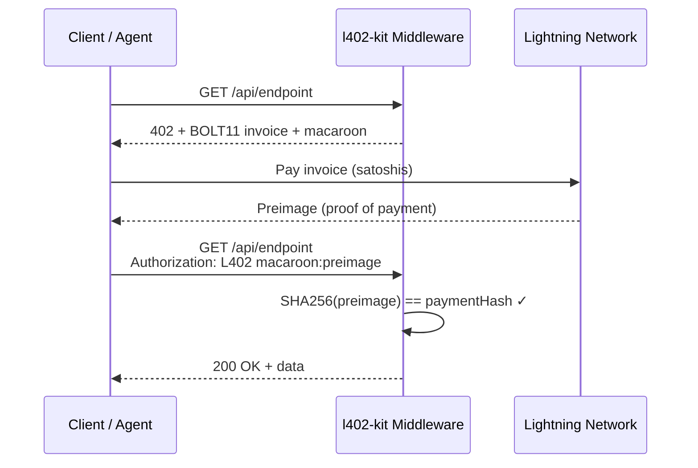
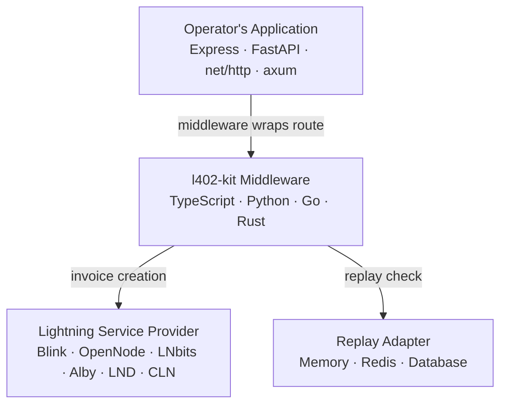

# l402-kit White Paper

**Version 1.1 — May 2026**

---

## Abstract

HTTP 402 was reserved in 1996 for a payment mechanism that was never built. For twenty-five years, developers built workarounds — account registration flows, credit card processors, API key provisioning — each designed for human actors who can open a browser and fill out a form. None of them work for machines.

l402-kit implements the L402 protocol: HTTP 402 Payment Required over the Bitcoin Lightning Network. An API caller, human or machine, pays a Lightning invoice and receives cryptographic proof of payment. The server verifies proof with a single hash comparison. No account. No API key. No human approval required.

**l402-kit is a family of L402 protocol implementations in TypeScript, Python, Go, and Rust. Open-source, custody-free, account-free. Each implementation does exactly what the protocol asks of it, and nothing more.**

---

## The Problem

HTTP was designed for human interactions: browsers, forms, sessions, accounts. API monetization inherited these assumptions and built workarounds around them. Stripe's minimum transaction is $0.50 after fees. PayPal requires accounts on both sides. Monthly subscriptions bundle demand that is not bundled in reality. API keys require human provisioning, rotation, and billing cycles that cannot be automated.

The gap became critical with the emergence of autonomous AI agents. An agent that discovers a new API at runtime cannot create an account, enter a card number, or navigate an OAuth flow. It can only make HTTP requests. If the API requires a pre-existing credential, the agent stops. The loop that was supposed to be autonomous is not.

What was missing for twenty-five years is now implementable: a payment mechanism native to HTTP, requiring no prior relationship between client and server, settling in under a second, and producing a self-contained cryptographic proof the server verifies without a network call.

---

## How l402-kit Works

The protocol is a standard HTTP exchange with one additional round trip:



1. **Request.** Client sends a normal HTTP request.
2. **Challenge.** Server responds with 402, a Lightning invoice, and a macaroon encoding the payment hash.
3. **Payment.** Client pays the invoice. The Lightning Network delivers the preimage as settlement proof in under one second.
4. **Access.** Client resends with `Authorization: L402 <macaroon>:<preimage>`. Server verifies `SHA256(preimage) == paymentHash`. No database lookup — pure cryptography.

The credential is stateless: it carries the payment hash and expiry inline and is verifiable by any instance of the middleware without coordination.

---

## Architecture

l402-kit operates across three tiers. The operator's application is unchanged; the middleware wraps routes. The Lightning provider is pluggable.



**Managed mode** — operator provides a Lightning Address. ShinyDapps backend handles invoice creation and settlement. Fee: 0.3%.

**Sovereign mode** — operator uses their own Lightning provider. Fee: 0%.

---

## Quickstart

<CodeGroup>

```typescript TypeScript
import { l402, ManagedProvider } from "l402-kit";

const lightning = ManagedProvider.fromAddress("you@blink.sv");
app.use("/api/data", l402({ priceSats: 10, lightning }));
```

```python Python
from l402kit import l402_required, ManagedProvider

lightning = ManagedProvider.from_address("you@blink.sv")

@app.get("/api/data")
@l402_required(price_sats=10, lightning=lightning)
async def data(): ...
```

```go Go
provider := l402kit.NewManagedProvider("you@blink.sv")
http.Handle("/api/data", l402kit.Middleware(l402kit.Options{
    PriceSats: 10, Lightning: provider,
}, handler))
```

```rust Rust
let provider = ManagedProvider::from_address("you@blink.sv");
let app = Router::new()
    .route("/api/data", get(data_handler))
    .layer(L402Layer::new(provider, 10));
```

</CodeGroup>

---

## The Seven Principles

These principles are constraints. A feature that violates them does not ship.

| # | Principle | In one line |
|---|---|---|
| 1 | **Minimal essence** | The middleware does the protocol, and nothing else. |
| 2 | **Auditability as a precondition for trust** | Closed-source financial middleware is a contradiction in terms. |
| 3 | **Operator sovereignty** | The operator holds the keys, chooses the provider, keeps the ledger. |
| 4 | **Truth as correspondence** | What the docs state and what the code does are the same. |
| 5 | **Stability at the foundation** | HTTP and Lightning are long-lived. The middleware connecting them is treated accordingly. |
| 6 | **Composition, not construction** | l402-kit composes existing primitives; it does not reinvent them. |
| 7 | **Adequacy to the nature of the problem** | Machine-to-machine payments require a solution built for machines. |

---

## Economic Model

The 0.3% fee is structurally aligned with developer success: when a developer earns nothing, the fee is zero.

| Tier | Cost | What You Get |
|---|---|---|
| **Free** | 0.3% of payments received | Unlimited calls, all SDKs, 7-day history |
| **Pro** | ~9,000 sats/month (~$9) | Full history, CSV export, priority support |
| **Founder** | ~1,000,000 sats one-time (~$999) | Lifetime Pro, direct maintainer access |

---

## Adoption

```bash
npm install l402-kit    # TypeScript
pip install l402kit     # Python
go get github.com/shinydapps/l402-kit/go@v1.8.2
cargo add l402kit       # Rust
```

<Note>
For the complete technical specification — founding principles in full, design decisions with tradeoffs, expanded threat model, architectural properties, L402 vs x402 comparison, and versioning commitments — the **Extended Edition** is available at [l402kit.com/whitepaper-extended](/whitepaper-extended) (100 sats, served by l402-kit itself).
</Note>

---

*l402-kit is released under the MIT License · ShinyDapps · thiagoyoshiaki@gmail.com*
