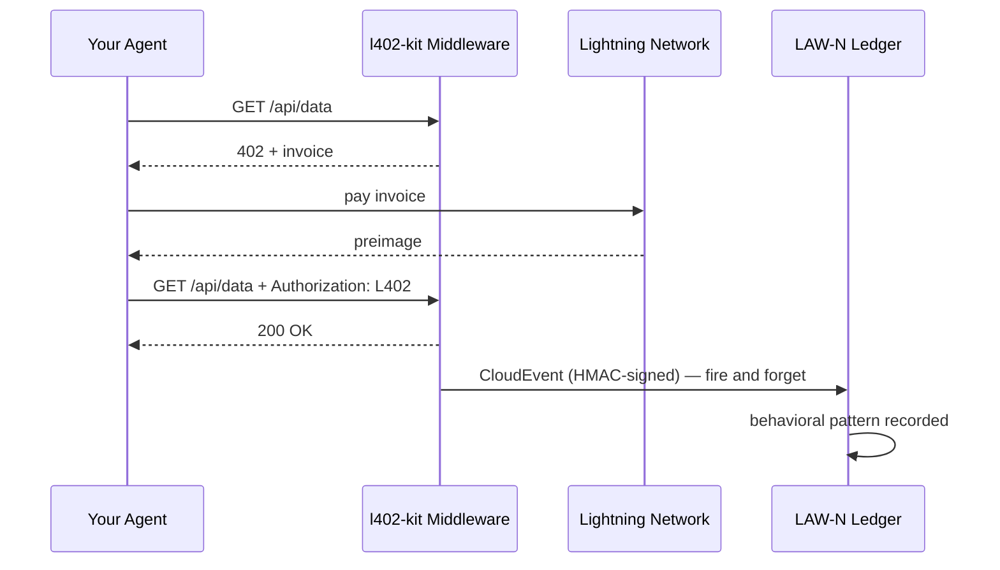

# LAW-N 行为事件

LAW-N（SAGEWORKS AI）是一个面向自主智能体的行为账本。您的智能体每次发起 L402 支付，都可以生成一个签名的 CloudEvent —— 随着时间推移，这些事件将构建出一条加密审计链，最终形成智能体的声誉评分。

**声誉无需任何权威机构授予。交易记录本身即是证明。**

---

## 工作原理



每次支付成功后都会发出事件。该过程从不阻塞响应 —— 即使 LAW-N 不可用，您的智能体仍然可以获取数据。

---

## 在客户端启用

```typescript
import { L402Client } from "l402-kit/agent";
import { BlinkWallet } from "l402-kit/wallets";
import { createLawNAdapter } from "l402-kit/agent";

const lawN = createLawNAdapter({
  ingestUrl: "https://l402kit.com/api/lawn-events",
  hmacSecret: process.env.LAWN_HMAC_SECRET!,
  network: "mainnet",
});

const client = new L402Client({
  wallet: new BlinkWallet(process.env.BLINK_API_KEY!),
  agentId: "agent:myorg.myagent",
  budget: { maxSats: 1000 },
  onEvent: lawN,
});
```

---

## 事件类型

| 事件 | 触发时机 |
|---|---|
| `l402.challenge.received` | 服务器返回 HTTP 402 |
| `l402.payment.initiated` | 智能体开始支付发票 |
| `l402.payment.settled` | 支付已确认，收到 preimage |
| `l402.access.granted` | 服务器接受 L402 令牌 |
| `l402.budget.exhausted` | 智能体达到支出上限 |
| `l402.token.reused` | 智能体使用现有证明重试 |
| `l402.proof.reuse.attempt` | 尝试重用已使用的 preimage |

---

## CloudEvents 1.0 格式

```json
{
  "specversion": "1.0",
  "type": "l402.payment.settled",
  "source": "l402-kit",
  "id": "req_a1b2c3d4",
  "time": "2026-05-10T14:32:00.000Z",
  "subject": "agent-payment-flow",
  "datacontenttype": "application/json",
  "data": {
    "agent_id": "agent:myorg.myagent",
    "session_id": "sess_8f3a1b2c",
    "request_id": "req_a1b2c3d4",
    "endpoint": "https://api.example.com/data",
    "event_type": "l402.payment.settled",
    "network": { "provider": "blink", "environment": "mainnet" },
    "payment": {
      "amount_sats": 100,
      "preimage_hash": "sha256:abc123...",
      "settled": true,
      "latency_ms": 487
    },
    "behavior": {
      "retry_count": 0,
      "proof_reuse_attempt": false,
      "budget_remaining": 900,
      "budget_exhausted": false
    }
  }
}
```

---

## 声誉的体现

持续做到以下几点的智能体：
- 首次尝试即完成发票支付
- 遵守预算限制
- 不尝试重用 preimage
- 跨多样化端点正常运行

……将自动积累声誉。行为异常的智能体将逐渐无法访问相关服务。

无白名单。无治理投票。无权威机构决定谁值得信任。账本即证明。

---

## 活动仪表板

公开统计数据访问地址：

```bash
curl https://l402kit.com/api/activity
```

```json
{
  "total_events": 1420,
  "unique_agents": 12,
  "total_sats": 84200,
  "recent_events": [...],
  "top_agents": [
    { "agent_id": "agent:shinydapps.verity", "event_count": 847 }
  ]
}
```

实时仪表板：[l402kit.com/activity](https://l402kit.com/activity)