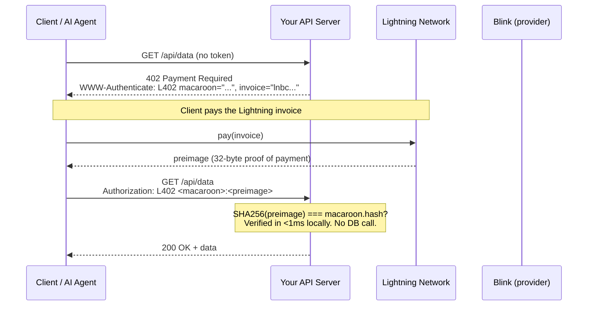
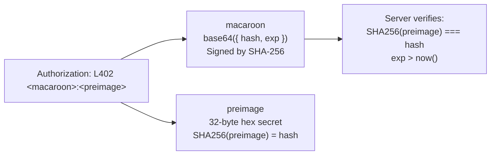
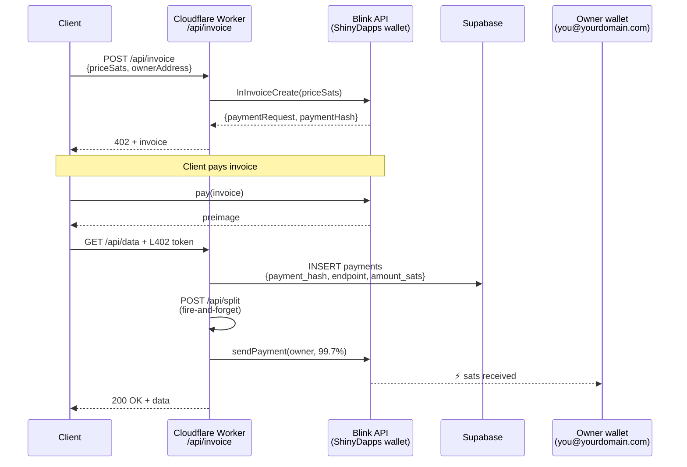
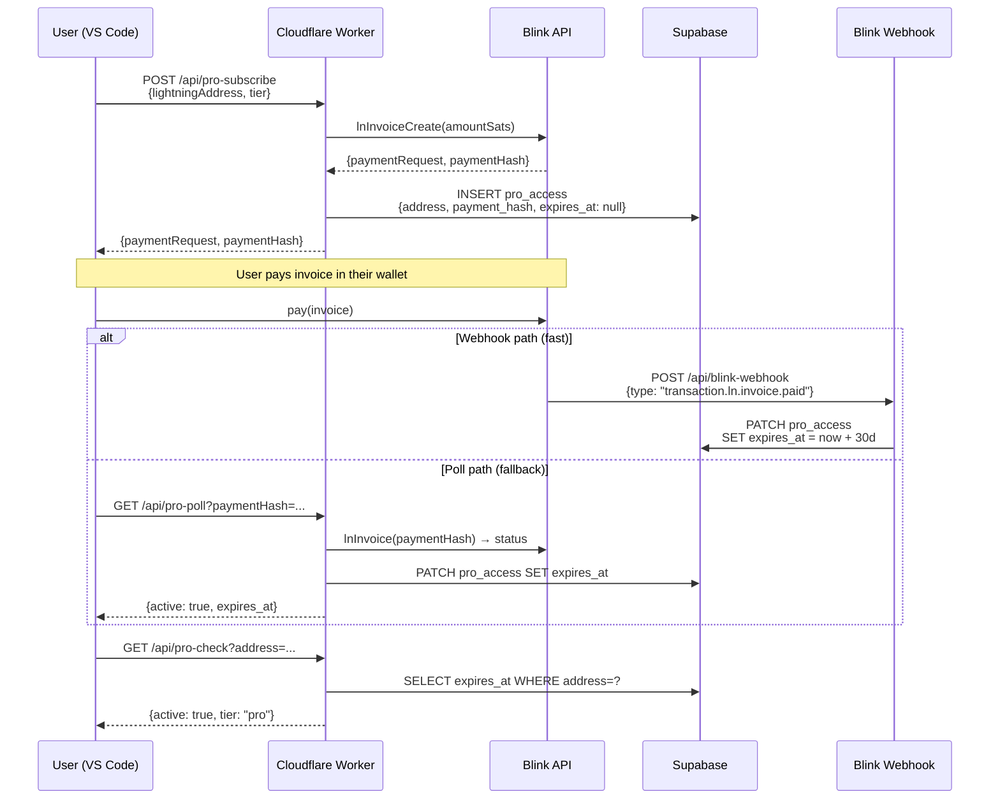
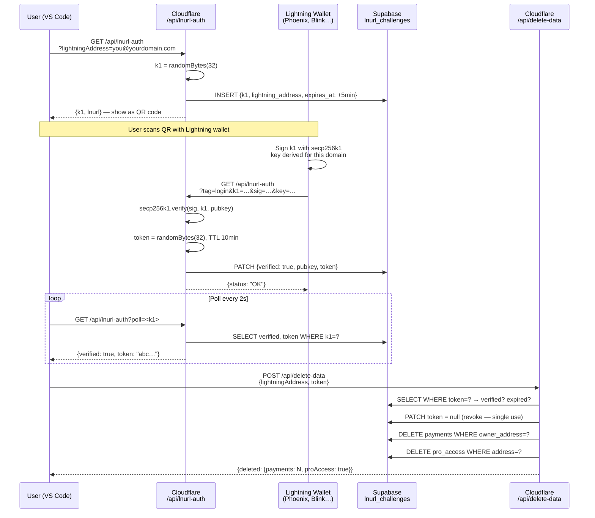
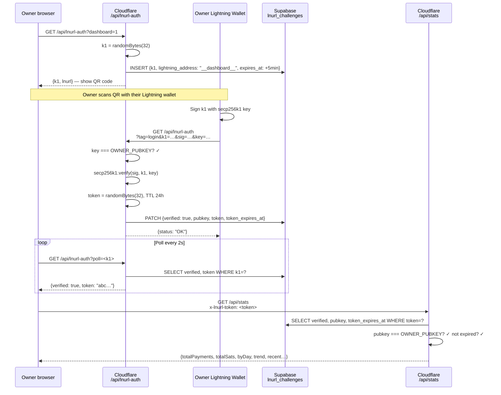
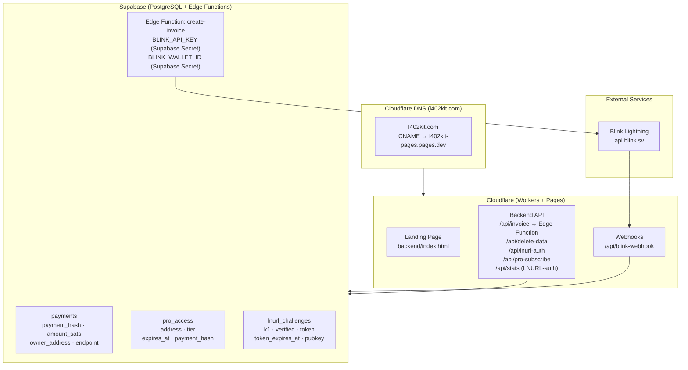
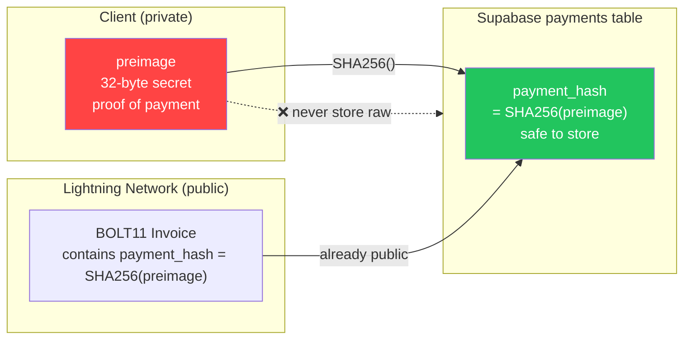

本页以时序图和流程图的形式记录了 l402-kit 平台中的所有主要流程。每个章节将可视化图示与简明说明配对，解释发生了什么以及为何如此设计。请从流程 1（核心 L402）开始，理解其密码学基础，然后阅读与您的集成相关的流程。

---

## 1. 核心 L402 支付流程

最基本的请求周期。无需账户，无需密码——只需一个密码学收据。

当客户端首次访问受保护的端点时，会收到一个 HTTP 402 响应，其中包含两样东西：一个 BOLT11 Lightning 发票和一个 macaroon。客户端通过 Lightning Network 支付发票（通常在一秒内完成），收到一个 32 字节的 preimage 作为证明，然后以 `Authorization: L402 <macaroon>:<preimage>` 重试请求。服务器使用 `SHA256(preimage) === macaroon.hash` 在本地验证令牌——无需数据库调用，无需网络往返，延迟低于一毫秒。验证通过后，令牌在过期前一直有效。后续请求复用相同的请求头。

**关键特性：**
- 验证完全在本地进行——无网络调用，无数据库查询
- `preimage` = 支付的密码学证明（Lightning 收据）
- `macaroon` = base64 JSON `{hash, exp}`，使用 SHA-256 签名

---

## 2. 令牌结构

`Authorization` 请求头包含以冒号分隔的两个组件。**macaroon** 是一个 base64 编码的 JSON 对象 `{hash, exp}`——它告诉服务器期望的支付哈希以及令牌的过期时间。**preimage** 是 Lightning Network 返回给付款方的 32 字节密钥。两者共同构成一个不可伪造的、自包含的凭证，任何服务器都可以离线验证。

---

## 3. 托管模式——费用分割流程

当您使用 `ManagedProvider` 时，l402kit.com 创建发票、接收支付，并自动将 99.7% 转发到您的 Lightning 地址。0.3% 的平台费用用于覆盖 Lightning 路由和 API 基础设施成本。您的钱包不直接接触 Cloudflare Worker——分割是在客户端请求验证后，通过服务端 Lightning 支付完成的，使用您的 Lightning 地址实时生成一个新的 BOLT11 发票。

---

## 4. Pro 订阅流程

Pro 订阅遵循类似的 L402 模式，但增加了持久状态。客户端支付一次性发票后，会在 Supabase 中生成一条 30 天的订阅记录。支付确认通过 Blink webhook（快速路径，约 2 秒）或轮询（针对不触发 webhook 的钱包的备用方案）到达。后续的 `/api/pro-check` 调用通过验证 `expires_at` 时间戳来确认订阅状态，无需再次支付。

---

## 5. LNURL-auth——钱包所有权证明（删除数据）

在不使用密码的情况下证明您拥有某个 Lightning 钱包。删除账户数据前必须完成此步骤。

---

## 6. 仪表板 LNURL-auth 登录流程

仅限所有者的仪表板认证——DASHBOARD_SECRET 存储在 Cloudflare Workers 密钥中。

---

## 7. 基础设施概览

---

## 8. SHA-256 Preimage 安全性

为什么我们存储 `SHA256(preimage)` 而不是原始 preimage：

**为何这样做是安全的：** `payment_hash` 已经嵌入在每个 BOLT11 发票中——它在设计上就是公开的。只有 `preimage` 是保密的。存储哈希值可以提供重放保护，同时不会带来任何额外的安全风险。