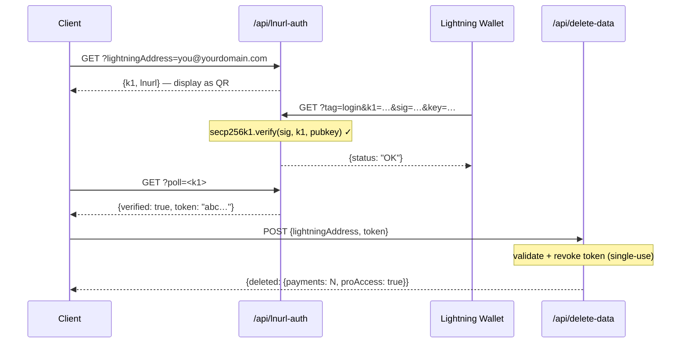

## Token 安全模型

L402 token 由两部分组成，以 `:` 连接：

```
<macaroon>:<preimage>
```

- **Macaroon** — base64 编码的 JSON，包含 `{hash, exp}`。由 SHA-256 签名。不知道 preimage 则无法伪造。
- **Preimage** — 32 字节的密钥，经 SHA-256 哈希后必须与 macaroon 中嵌入的哈希值匹配。

**验证完全在本地进行** — 无需数据库查询，无需网络请求。SDK 在微秒内通过密码学方式验证哈希关系。

---

## 重放保护

l402-kit 内置**重放保护**。每个 preimage 只能使用一次：

```typescript
// ✅ 内置功能 — 默认启用
app.get("/api", l402({ priceSats: 10, lightning: blink }), handler);
```

token 首次使用时，preimage 将被标记为已消费。后续使用相同 preimage 的请求将返回 `401 Token already used`。

**默认存储**：内存 `Set`。这意味着：
- 重启会清空重放存储（token 在重启后可重复使用）
- 多个实例不共享状态

**对于生产环境**中的多实例部署，请实现持久化重放存储：

```typescript
import { checkAndMarkPreimage } from "l402-kit";

// 示例：基于 Redis 的重放存储
async function redisCheckAndMark(preimage: string): Promise<boolean> {
  const key = `l402:used:${preimage}`;
  const set = await redis.set(key, "1", "NX", "EX", 86400); // 24h TTL
  return set === "OK"; // true = 首次使用，false = 重放
}
```

---

## Token 过期

Token 携带 `exp` 字段（Unix 时间戳，单位毫秒）。SDK 会自动拒绝已过期的 token。

默认 TTL：**1 小时**（由 Lightning 提供商在创建发票时设置）。

```typescript
// Token 在发票创建后 1 小时内有效。
// 过期后，客户端必须重新支付以获取新 token。
```

---

## 必须使用 HTTPS

**切勿在生产环境中通过纯 HTTP 使用 L402。** macaroon 和 preimage 通过 `Authorization` 请求头传输。在 HTTP 下，它们会暴露给网络攻击者。

```nginx
# nginx — 将 HTTP 重定向到 HTTPS
server {
    listen 80;
    return 301 https://$host$request_uri;
}
```

---

## 速率限制

L402 通过密码学方式验证 token，而非查询数据库 — 因此开销很小。但 Lightning 发票创建（即 402 响应）会调用您的 Lightning 提供商 API。

使用速率限制器保护发票创建，以防止 DoS 攻击：

```typescript
import rateLimit from "express-rate-limit";

const invoiceLimiter = rateLimit({
  windowMs: 60_000,
  max: 20, // 每个 IP 每分钟最多 20 次未支付请求
  skip: (req) => req.headers.authorization?.startsWith("L402 ") ?? false,
});

app.use("/api", invoiceLimiter);
app.get("/api/data", l402({ priceSats: 10, lightning: blink }), handler);
```

---

## 密钥管理

切勿硬编码 API 密钥。请使用环境变量：

```typescript
// ✅ 正确做法
const blink = new BlinkProvider(
  process.env.BLINK_API_KEY!,
  process.env.BLINK_WALLET_ID!,
);

// ❌ 切勿这样做
const blink = new BlinkProvider("blink_abc123...", "wallet-id-here");
```

在生产环境中使用密钥管理器：AWS Secrets Manager、Doppler、Vault，或 `.env` + dotenv（切勿提交到 git）。

---

## 管理端点认证

如果您暴露了管理或统计端点，**切勿通过 URL 查询参数传递密钥**。URL 会被反向代理、CDN 和云服务提供商完整记录 — 包括查询字符串。

```typescript
// ❌ 切勿这样做 — 密钥在 Cloudflare Workers 日志中可见
GET /api/stats?secret=my-secret

// ✅ 正确做法 — 请求头默认不被记录
GET /api/stats
x-dashboard-secret: my-secret
```

```typescript
// 在处理器中强制使用请求头
const token = req.headers["x-dashboard-secret"];
if (!SECRET || token !== SECRET) return res.status(401).json({ error: "Unauthorized" });
```

---

## Supabase 密钥使用规范

请正确区分使用 `SUPABASE_SERVICE_KEY`（仅限服务端）与 `SUPABASE_ANON_KEY`（可安全暴露给客户端）：

| 密钥 | 用途 | 绕过 RLS？ |
|---|---|---|
| `anon` | VS Code 扩展、浏览器客户端 | 否 |
| `service_role` | 服务端 API 函数 | 是 |

读取敏感数据表（如 `pro_access`）的服务端 Cloudflare Workers 必须使用 service key — 切勿使用 anon key。敏感表上的 RLS 策略不应授予 anon 访问权限。

```typescript
// ✅ 服务端端点
const SUPABASE_KEY = process.env.SUPABASE_SERVICE_KEY ?? process.env.SUPABASE_ANON_KEY ?? "";
```

---

## 内容安全策略

如果您在 API 旁边提供前端服务，请确保您的 CSP 不会阻断 L402 流程：

```http
Content-Security-Policy: connect-src 'self' https://api.blink.sv
```

---

## 数据管理 — 用户数据删除

用户可以随时在 VS Code 扩展中删除其所有支付历史记录和 Pro 订阅（**设置 → 危险区域**）。扩展会调用：

```http
POST /api/delete-data
Content-Type: application/json

{ "lightningAddress": "user@blink.sv" }
```

响应：

```json
{ "deleted": { "payments": 42, "proAccess": true } }
```

该端点在服务端使用 Supabase **service role key** 绕过 RLS，并永久删除：

- `payments` 表中所有 `owner_address = ?` 的行
- `pro_access` 表中所有 `address = ?` 的行

<Note>
扩展要求用户逐字输入其 Lightning 地址后，删除按钮才会启用 — 类似 GitHub 对破坏性操作的确认方式。
</Note>

如果您在 l402-kit 之上构建自己的控制台，请为您的用户提供类似的端点。切勿允许通过 anon key 进行删除 — 始终通过使用 service key 的服务端函数代理执行。

---

## 隐私与数据最小化

l402-kit 的设计原则是只收集运营所需的最少数据。以下是存储内容、原因及各字段的加固方式。

### 存储的内容

| 表 | 字段 | 原因 | 敏感度 |
|---|---|---|---|
| `payments` | `preimage` | 重放保护 + 支付证明 | ⚠️ 中等 — 建议改为存储哈希值（见下文） |
| `payments` | `owner_address` | 将收入归属到 Lightning 地址 | 低 — Lightning 地址是公开的 |
| `payments` | `amount_sats` | 控制台统计 | 低 |
| `payments` | `endpoint` | 按端点分析 | 低至中等 |
| `pro_access` | `address` | 验证 Pro 订阅 | 低 — 公开 |
| `waitlist` | `email` | 发送欢迎邮件和发布通知 | ⚠️ 高 — 真实 PII，请加密或省略 |
| `waitlist` | `lightning_address` | 可选身份信号 | 低 |

### 存储 preimage 的哈希值而非原始值

preimage 是证明 Lightning 支付已完成的 32 字节密钥。原始存储意味着数据库泄露会暴露所有支付证明。请改为存储 SHA-256 哈希值 — 它已经是公开信息（嵌入在 BOLT11 发票中），足以用于重放保护：

```typescript
import { createHash } from 'crypto';

// 不要直接存储 preimage，而是：
const paymentHash = createHash('sha256').update(Buffer.from(preimage, 'hex')).digest('hex');

await supabase.from('payments').insert({
  payment_hash: paymentHash,   // ✅ 安全存储
  // preimage: preimage        // ❌ 避免
  owner_address,
  amount_sats,
  endpoint,
});

// 重放检查：对传入的 preimage 进行哈希，然后查找哈希值
const incomingHash = createHash('sha256').update(Buffer.from(incoming, 'hex')).digest('hex');
const { data } = await supabase.from('payments').select('id').eq('payment_hash', incomingHash);
const alreadyUsed = data && data.length > 0;
```

### 保护候补名单邮件

电子邮件地址是系统中唯一的真实 PII。以下是按保护级别递增排列的方案：

```typescript
// 方案 A — 插入前加密（AES-256-GCM，密钥存储在 Supabase 之外）
import { createCipheriv, randomBytes } from 'crypto';
const key = Buffer.from(process.env.EMAIL_ENCRYPTION_KEY!, 'hex'); // 32 字节
const iv  = randomBytes(12);
const cipher = createCipheriv('aes-256-gcm', key, iv);
const encrypted = Buffer.concat([cipher.update(email), cipher.final()]);
const tag = cipher.getAuthTag();
const stored = iv.toString('hex') + ':' + tag.toString('hex') + ':' + encrypted.toString('hex');

// 方案 B — 只存储 SHA-256 哈希（不可逆 — 无法再发送邮件）
const emailHash = createHash('sha256').update(email.toLowerCase()).digest('hex');

// 方案 C — 完全不存储邮件（发送欢迎邮件后直接丢弃）
```

### 删除数据前通过 LNURL-auth 证明钱包所有权

`/api/delete-data` 端点应只接受来自 Lightning 地址实际所有者的请求。使用 **LNURL-auth** 以密码学方式证明所有权 — 用户使用其 Lightning 钱包私钥对服务器挑战进行签名，无需密码或账号：



完整的含 Supabase 状态的序列请参阅[完整流程图](/guides/flows#5-lnurl-auth--wallet-ownership-proof-delete-data)。

这确保了即使知道 Lightning 地址，也无法删除他人的记录。

---

## 检查清单

<AccordionGroup>
  <Accordion title="上线前">
    - [ ] 所有端点强制使用 HTTPS
    - [ ] API 密钥存储在环境变量中，而非源代码中
    - [ ] 管理/统计端点使用请求头认证，而非 `?secret=` URL 参数
    - [ ] Supabase `service_role` 密钥仅在服务端使用；`anon` 密钥仅用于客户端
    - [ ] 敏感 Supabase 数据表没有 `anon` SELECT 策略
    - [ ] 数据删除端点（`/api/delete-data`）使用 service key，而非 anon key
    - [ ] 发票创建已配置速率限制
    - [ ] 重放保护已测试（尝试重用 preimage → 预期返回 401）
    - [ ] Token 过期已测试（开发环境设置短 TTL，确认过期后返回 401）
    - [ ] preimage 以 SHA-256 哈希值存储，而非原始密钥
    - [ ] 候补名单邮件已加密存储或发送后丢弃
    - [ ] `/api/delete-data` 需要 LNURL-auth 钱包所有权证明
  </Accordion>
  <Accordion title="高流量 API">
    - [ ] 基于 Redis 的重放存储（跨实例共享）
    - [ ] 监控 402 响应频率（突增 = 潜在 DoS）
    - [ ] Lightning 提供商故障转移（BlinkProvider → LNbitsProvider 备用）
    - [ ] 监控您的 Lightning 提供商状态页面（例如 status.blink.sv）
  </Accordion>
</AccordionGroup>