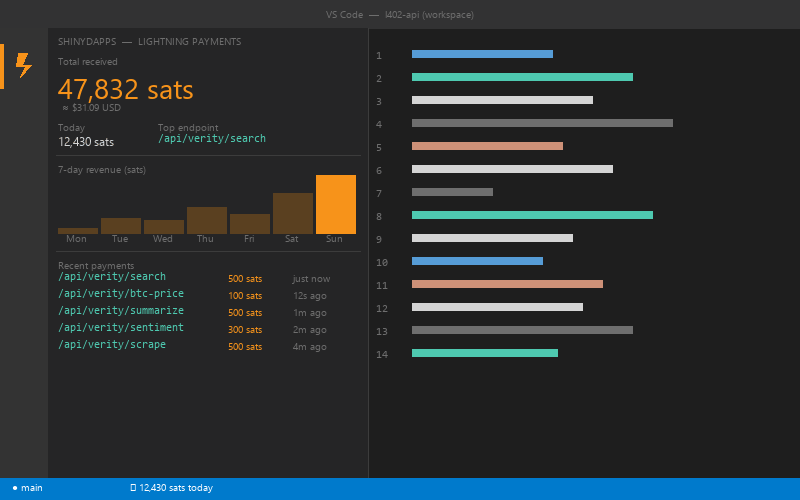

# ShinyDapps Lightning Payments

[](https://marketplace.visualstudio.com/items?itemName=ShinyDapps.shinydapps-l402)
[](https://marketplace.visualstudio.com/items?itemName=ShinyDapps.shinydapps-l402)
[](https://github.com/ShinyDapps/l402-kit/blob/main/LICENSE)

Real-time Bitcoin Lightning payment dashboard inside VS Code. Built on the [L402 protocol](https://github.com/ShinyDapps/l402-kit) (HTTP 402 + Lightning Network) — every payment your API receives appears instantly, no browser tab required.



---

## Features

- **Live sats counter** in the status bar, updated every 30 seconds
- **Bar chart** with 1D / 7D / 30D / 1Y / ALL time ranges
- **Payment feed** — endpoint, amount in sats, USD value, timestamp
- **11 languages** — EN PT ES ZH JA FR DE RU HI AR IT (switch inside the sidebar)
- **Light / Dark / Auto theme** — follows your VS Code theme
- **Zero config** — one Lightning address, that's it

---

## Quick Setup

Open Command Palette (`Ctrl+Shift+P` / `Cmd+Shift+P`) and run:

```
ShinyDapps: Configure Lightning Address
```

Enter the Lightning address tied to your l402-kit API (e.g. `you@blink.sv`). Done.

> No Lightning address? Get one free at [dashboard.blink.sv](https://dashboard.blink.sv).

---

## Integrate with l402-kit

Add a pay-per-call endpoint to any backend in 3 lines:

```typescript
import { l402, ManagedProvider } from "l402-kit";

const lightning = ManagedProvider.fromAddress("you@blink.sv");
app.get("/premium", l402({ priceSats: 100, lightning }), handler);
```

| SDK | Install |
|-----|---------|
| TypeScript / Node.js | `npm install l402-kit` |
| Python | `pip install l402kit` |
| Go | `go get github.com/shinydapps/l402-kit/go` |
| Rust | `cargo add l402kit` |

---

## AI Agents

l402-kit is registered in 5 MCP registries (Anthropic, Glama, Smithery, mcp.so, McpMux). AI agents can discover and pay L402 APIs autonomously — no human in the loop.

[VERITY](https://l402kit.com/api/verity) is a live autonomous agent with 9 services priced in sats, built entirely on l402-kit.

---

## Links

[Marketplace](https://marketplace.visualstudio.com/items?itemName=ShinyDapps.shinydapps-l402) · [Docs](https://docs.l402kit.com/guides/vscode) · [GitHub](https://github.com/ShinyDapps/l402-kit) · [npm](https://npmjs.com/package/l402-kit)

---

<div align="center">

Built with ⚡ by [ShinyDapps](https://github.com/ShinyDapps) · MIT License · **Bitcoin has no borders.**

</div>
